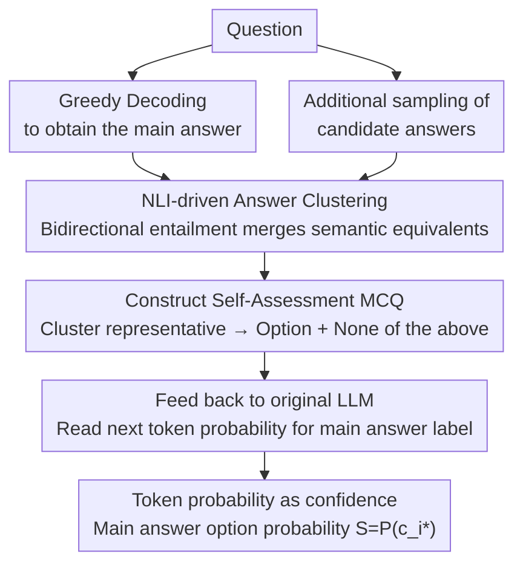

# Clustered Self-Assessment: A Simple yet Effective Method for Uncertainty Quantification in Large Language Models

**Conference**: ACL2026 Findings  
**arXiv**: [2606.03846](https://arxiv.org/abs/2606.03846)  
**Code**: https://github.com/ccqq77/clustered_self_assessment  
**Area**: LLM Uncertainty Estimation / NLP Understanding  
**Keywords**: LLM Calibration, Uncertainty Quantification, Semantic Clustering, Self-Assessment, Multiple Choice Question Reconstruction

## TL;DR
This paper proposes Clustered Self-Assessment: multiple sampled answers from an LLM are first clustered by semantic equivalence into mutually exclusive options. The same LLM then assigns confidence scores to the original answers through the probabilities of a reconstructed Multiple Choice Question (MCQ). This method achieves superior AUROC and Brier calibration performance compared to baselines like semantic entropy and P(True) on TQA, NQ, and XSum.

## Background & Motivation
**Background**: LLMs have demonstrated strong capabilities in question answering, summarization, and open-ended generation, yet they frequently generate fluent but incorrect answers. In practical deployment, users require not only the answers themselves but also an indication of how certain the model is. Consequently, uncertainty quantification (UQ) has become a fundamental component of reliable LLM systems.

**Limitations of Prior Work**: One category of methods prompts models to express "uncertainty" in natural language, but prior research has observed that LLMs tend to be overconfident. Another category calculates uncertainty based on the disagreement between multiple sampled answers, such as predictive entropy, semantic entropy, EigV, Deg, and SAR. While these methods capture output divergence, they often yield indirect scores that are difficult for users to interpret and fail to fully exploit the model's internal judgment regarding candidate answers.

**Key Challenge**: Sampling-based methods identify "what answers the model might say," while self-assessment methods identify "how the model compares candidates," but the two are usually employed separately. Directly using all sampled answers as MCQ options leads to redundant semantic equivalents splitting the probability mass. Conversely, skipping sampling to only ask P(True) limits the model to evaluating a single answer without competitive alternatives.

**Goal**: The authors aim to construct a training-free, interpretable, and sample-efficient uncertainty estimation method that preserves the candidate space provided by sampled answers, merges semantically identical answers into clear options, and utilizes the LLM's token probability for the chosen option directly as the confidence score.

**Key Insight**: Observations indicate that LLMs provide clearer relative preferences when faced with structured MCQs. If the options are derived from the model's own sampled answers and deduplicated through semantic clustering, the MCQ task becomes an explicit self-assessment of "which among the various answers I might produce is most likely correct."

**Core Idea**: Use NLI-based semantic clustering to transform sampled answers into mutually exclusive MCQ options, then use the original LLM's token probability $S=P(c_{i^*})$ for the target answer option as an interpretable confidence score.

## Method

### Overall Architecture
Clustered Self-Assessment is a two-stage process. Given a question, the model first generates a main answer via greedy decoding for evaluation, along with several additional sampled answers. The method then employs an NLI model to compare semantic relationships between these answers, merging mutually compatible or entailing answers into the same cluster. A representative answer from each cluster is transcribed into an MCQ option, including an additional "None of the above" option. Finally, the MCQ is fed back into the original LLM to read the next-token probability of the label corresponding to the main answer's cluster, serving as the confidence score.

The key to this process is not prompting the model to generate a natural language explanation, but rather transforming uncertainty estimation into a single-token probability retrieval task. Sampling exposes the potential answer space, clustering compresses semantic redundancy, and the MCQ format triggers the model's comparative self-assessment.

### Key Designs

**1. NLI-driven Answer Clustering: Merging semantic duplicates in sampled answers before forming options**

Directly inserting all sampled answers into an MCQ presents a pitfall: if the same meaning is expressed in different ways, the model's probability mass is split across these equivalent options, leading to an underestimated confidence score. Conversely, merging semantically conflicting answers would obscure true uncertainty. The authors use NLI relationships to define this boundary—for any answer pair $(a_i, a_j)$, an external NLI model determines if $a_i \rightarrow a_j$ and $a_j \rightarrow a_i$ represent entailment, neutral, or contradiction. Answers are processed sequentially; a new answer is merged into an existing cluster if there is no contradiction with the representative or if the bidirectional relationship satisfies sufficient entailment. Entailment is preferred over embedding similarity because it specifically addresses whether answers support each other, a task where NLI excels while vector distance often fails.

**2. MCQ Construction for Self-Assessment: Translating "Is the answer correct?" into "Which candidate is more credible?"**

LLMs tend to be overconfident when asked to verbalize confidence, and raw entropy scores are indirect values difficult for users to interpret. This step transforms open-ended evaluation into a structured comparison: each answer cluster corresponds to an MCQ option (including the main answer's cluster), plus a "None of the above" option for cases where all candidates are unreliable. The model does not need to generate long text; it only assigns probabilities to labels like A/B/C. This format naturally rephrases "How sure am I of the original answer?" into "Which of these sampled answers do I prefer?", which is more stable than verbalized confidence and easier to explain than an entropy value.

**3. Token Probability as Confidence: Directly reading the probability assigned to the correct option label**

With the MCQ format, confidence becomes a direct measure. Let the LLM output logits for the vocabulary be $\mathbf{z}$. The probability for an option label $c_i$ is

$$P(c_i)=\frac{\exp(z_{c_i})}{\sum_v \exp(z_v)},$$

where the probability $S=P(c_{i^*})$ of the option $c_{i^*}$ corresponding to the main answer serves as the confidence score. This score resides directly on the probability mass assigned to candidate answers, is naturally normalized, allows for cross-sample comparison, and can be used directly for calibration evaluation. It requires no additional calibrator training and is semantically closer to "to what extent the model believes in this answer" than indirect metrics like semantic entropy.

### Loss & Training
The primary method does not require training. In experiments, the authors evaluate inference on seven open-source models across the Qwen2.5, Qwen3, and Gemma-3 series. Sampling-based methods use 8 additional samples by default with a temperature of $\tau=0.5$. Answer clustering defaults to using `deberta-large-mnli`. Comparisons with larger DeBERTa NLI models and embedding-based clustering are provided in the appendix. The paper also treats this confidence score as a supervision signal to train probes: one binarized with a 0.5 threshold and another using soft labels. Results show that soft-label probes are more robust than baselines like SEP in out-of-distribution settings.

## Key Experimental Results

### Main Results
Evaluation was conducted on TriviaQA (TQA, 9,960 samples), Natural Questions (NQ, 3,610 samples), and XSum (11,334 test samples) using AUROC as the primary metric. The table below excerpts main results on Qwen2.5-32B and Gemma-3-27B.

| Dataset | Model | Ours AUROC | w/o clustering | w/o sampling |
|--------|------|-----------:|---------------:|-------------:|
| TQA | Qwen2.5-32B | 0.940 | 0.874 | 0.890 |
| NQ | Qwen2.5-32B | 0.850 | 0.741 | 0.785 |
| TQA | Gemma-3-27B | 0.924 | 0.895 | 0.789 |
| NQ | Gemma-3-27B | 0.821 | 0.766 | 0.659 |

### Calibration Experiments
Calibration is measured using the Brier score (lower is better). Ours outperforms P(True), raw generation probability, and normalized semantic entropy (NSE) across both QA datasets and various models.

| Dataset | Model | Ours | P(True) | Probability | NSE |
|--------|------|-----:|--------:|------------:|----:|
| TQA | Qwen2.5-32B | 0.0843 | 0.1172 | 0.2267 | 0.1200 |
| NQ | Qwen2.5-32B | 0.1597 | 0.1918 | 0.3155 | 0.1993 |
| TQA | Gemma-3-27B | 0.0721 | 0.1758 | 0.1975 | 0.0937 |
| NQ | Gemma-3-27B | 0.1736 | 0.2354 | 0.3503 | 0.2462 |

### Robustness & Sensitivity
| Analysis Item | Key Results | Description |
|--------|----------|------|
| Sample Efficiency | Competitive performance with 2 additional samples | While sampling is the main overhead, performance with few samples suggests MCQ self-assessment effectively utilizes candidate structure. |
| Answer Order | TQA/Qwen2.5-32B: Original 0.940, Reverse 0.938, Random 0.939 | The impact of option order is negligible. |
| NLI Model Size | TQA/Qwen2.5-32B: v1-large/v2-xlarge/v2-xxlarge all 0.940 | Larger NLI models did not significantly change results. |
| Sampling Temperature | TQA/Qwen2.5-32B: 0.934 at 0.25, 0.940 at 0.5, 0.938 at 0.75, 0.937 at 1.0 | Moderate temperatures are stable; too low reduces diversity. |

### Key Findings
- Both components are essential: removing clustering causes semantic equivalents to compete for probability mass; removing sampling reduces the method to an equivalent of P(True) with no candidate comparison.
- Calibration gains are significant: Improvements in Brier score indicate that the method excels not just at ranking correct/incorrect answers, but is also more suitable as a user-facing confidence measure.
- NLI clustering is more robust than embedding-based clustering; explicit entailment modeling outperformed thresholds or K-means clustering using OpenAI/MPNet/LLM hidden embeddings in most configurations.

## Highlights & Insights
- **Rephrasing Uncertainty Estimation as MCQ Self-Assessment**: This simple step effectively converts open-ended evaluation into a single-token probability read, avoiding the overconfidence inherent in long-form verbalized expressions.
- **Semantic Clustering as a Critical Pre-processing Step**: Rather than merely sampling more answers, the method eliminates semantic redundancy, ensuring probability mass reflects distinct "answer hypotheses."
- **User-Interpretable Results**: Unlike semantic entropy, graph eigenvalues, or hidden state probes, option probabilities are naturally interpretable as "the probability the model selects the original answer among these candidates."
- **Potential as a Probe Supervision Signal**: The authors demonstrate that this score can supervise hidden state probes, suggesting it may align closely with internal uncertainty representations.

## Limitations & Future Work
- The method requires access to output logits, rendering it inapplicable to closed-source APIs that only return text or mask token probabilities.
- Clustering relies on an external NLI model, introducing additional overhead and external distribution shifts; NLI errors in specialized domains, long answers, or those with subtle numerical differences could directly impact confidence scores.
- Currently validated primarily on QA and summarization; effectiveness for long-chain reasoning, code generation, multi-turn dialogues, or safety auditing remains to be explored.
- Future work could replace external NLI with LLM internal representations or implement candidate clustering, MCQ construction, and calibration as an end-to-end learnable module.

## Related Work & Insights
- **vs Semantic Entropy**: Semantic Entropy also measures generation divergence via semantic clusters but primarily outputs indirect entropy-style scores; Ours further converts clusters into MCQs for explicit comparison.
- **vs P(True)**: P(True) evaluates a single answer's truthfulness without reference to alternatives; Ours provides context for self-assessment via sampled candidates.
- **vs SAR / EigV / Deg**: These sampling baselines derive uncertainty from inter-sample relationships; Ours uses relationship modeling as pre-processing to construct candidates, while the final score stems from the LLM's probability over options.
- **Insight**: In RAG, medical QA, or automated evaluation requiring confidence, retrieved evidence or multi-agent answers can be clustered into mutually exclusive hypotheses before using structured MCQs for model self-calibration.

## Rating
- Novelty: ⭐⭐⭐⭐☆ Not an invention of sampling or self-assessment per se, but combines semantic clustering with MCQ token probability effectively.
- Experimental Thoroughness: ⭐⭐⭐⭐☆ Covers multiple models, QA/summarization tasks, calibration, and sensitivity; could be supplemented with more complex reasoning tasks.
- Writing Quality: ⭐⭐⭐⭐☆ Clear methodology, straightforward results, and sufficient technical details on clustering and sampling in the appendix.
- Value: ⭐⭐⭐⭐⭐ Highly practical for LLM systems requiring interpretable confidence, especially for open-source deployments with logit access.

<!-- RELATED:START -->

## Related Papers

- [\[ACL 2025\] Revisiting Uncertainty Quantification Evaluation in Language Models: Spurious Interactions with Response Length Bias Results](../../ACL2025/llm_nlp/revisiting_uncertainty_quantification_evaluation_in_language_models_spurious_int.md)
- [\[ACL 2025\] Uncertainty Unveiled: Can Exposure to More In-context Examples Mitigate Uncertainty for Large Language Models?](../../ACL2025/llm_nlp/uncertainty_unveiled_can_exposure_to_more_in-context_examples_mitigate_uncertain.md)
- [\[ACL 2025\] Towards Harmonized Uncertainty Estimation for Large Language Models](../../ACL2025/llm_nlp/towards_harmonized_uncertainty_estimation_for_large_language_models.md)
- [\[ACL 2025\] Theory of Mind in Large Language Models: Assessment and Enhancement](../../ACL2025/llm_nlp/theory_of_mind_llm.md)
- [\[ACL 2025\] SConU: Selective Conformal Uncertainty in Large Language Models](../../ACL2025/llm_nlp/sconu_selective_conformal_uncertainty_in_large_language_models.md)

<!-- RELATED:END -->
