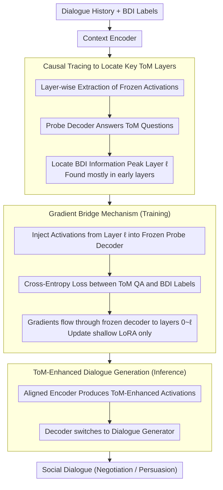

# CoSToM: Causal-oriented Steering for Intrinsic Theory-of-Mind Alignment in Large Language Models

**Conference**: ACL 2026  
**arXiv**: [2604.10031](https://arxiv.org/abs/2604.10031)  
**Code**: [GitHub](https://github.com/CGCL-codes/CoSToM)  
**Area**: LLM/NLP  
**Keywords**: Theory of Mind, Causal Tracing, Activation Steering, Dialogue Systems, Social Reasoning

## TL;DR
The authors propose the CoSToM framework, which first uses causal tracing to locate key layers encoding Theory of Mind (ToM) features within LLMs (finding they reside primarily in early layers), and then performs lightweight alignment via activation steering on these layers. This significantly improves the quality of social reasoning in negotiation and persuasion dialogues—shifting the model from "knowing but not applying" to "knowing and applying."

## Background & Motivation

**Background**: Theory of Mind (ToM)—the ability to understand others' beliefs, desires, and intentions—is a hallmark of human social intelligence. While LLMs perform well on standard ToM benchmarks, research indicates they struggle to generalize in task-specific scenarios, relying on carefully crafted prompts to simulate reasoning.

**Limitations of Prior Work**: A critical "internal knowledge-external behavior" misalignment exists: LLMs can correctly answer ToM questions (e.g., inferring a user wants firewood) but generate incoherent proposals in negotiations (e.g., offering water). Once explicit "infer and respond" instructions are removed, the model fails to translate internally encoded mental states into actions.

**Key Challenge**: The ToM capabilities exhibited by LLMs may not be stable intrinsic cognitions but rather temporary simulations triggered by instructions—internal knowledge exists but cannot be spontaneously externalized into behavior.

**Goal**: (1) Discover whether LLMs possess true internal representations related to ToM; (2) Identify the specific layers containing these representations; (3) Determine if intervening in these representations can improve downstream dialogue quality.

**Key Insight**: Starting from mechanistic interpretability, the authors use causal tracing to locate ToM features and then apply activation steering to intervene.

**Core Idea**: Use a frozen probe decoder as a differentiable verifier to backpropagate ToM alignment loss to the encoder's key ToM layers, updating only shallow LoRA adapters via a gradient bridge mechanism.

## Method

### Overall Architecture
CoSToM follows a "diagnose then treat" approach: to enable an LLM to spontaneously externalize its internal ToM knowledge into dialogue behavior, one must first identify where this knowledge is hidden and then intervene specifically at those layers. The framework consists of two phases: the interpretation phase uses causal tracing to scan layers and locate those encoding BDI (Belief-Desire-Intention) information (found to be mostly early layers); the steering phase installs LoRA adapters on these key layers, using a frozen probe decoder to backpropagate the ToM QA accuracy as a supervision signal to the encoder. During training, inputs consist of dialogue history and BDI labels, with the decoder acting as a ToM verifier. During inference, the same encoder produces ToM-enhanced activations while the decoder switches to a dialogue generator for negotiation or persuasion tasks.

### Key Designs

**1. Locating Key ToM Layers via Causal Tracing: Determining where BDI information exists**

To perform precise intervention, it is necessary to identify which layers contain ToM features. CoSToM instantiates two model copies: a context encoder that processes dialogue history normally, and a probe decoder that receives frozen activations only from a specific encoder layer $\ell$ to answer ToM questions. By scanning the accuracy of the decoder across different layers $\ell$, it is possible to identify which layers carry sufficient ToM information. This scan led to a counterintuitive conclusion: ToM features are concentrated in early layers rather than high-level semantic regions. This pattern was consistent across Llama-3-8B and Qwen2.5-7B, providing a basis for modifying only shallow layers.

**2. Gradient Bridge Mechanism: Flowing alignment loss back to shallow layers**

Fine-tuning the encoder directly on ToM QA tasks yields poor results because the objectives of "answering ToM questions" and "generating dialogue" are misaligned. The gradient bridge bypasses this mismatch: after the encoder processes dialogue history, activations are intercepted at key ToM layer $\ell$ and injected into the frozen probe decoder. The decoder answers ToM questions, calculating cross-entropy loss against BDI labels. Gradients then flow back through the frozen decoder and the activation interface into layers 0 to $\ell$ of the encoder, updating only the shallow LoRA adapters. Essentially, the training goal is not to teach the model "how to answer ToM questions" but to force it to "generate representations richer in ToM information," with significantly fewer parameters than full-layer fine-tuning.

**3. ToM-Enhanced Dialogue Generation: Plug-and-play module with decoupled training and inference**

CoSToM utilizes the decoder for two different roles during training and inference. During inference, the ToM-aligned encoder processes dialogue history, and the decoder no longer answers ToM questions but generates task-specific dialogue (negotiation, persuasion, etc.) conditioned on ToM-rich activations. Because the encoder focuses on "producing good representations" and the decoder focuses on "translating representations into dialogue," the decoupling allows CoSToM to be a plug-and-play module reusable across different social tasks without redesigning prompts for each.

### A Complete Example
In a negotiation scenario where "the user actually wants firewood": during the interpretation phase, causal tracing identifies early layer $\ell$ as the BDI information center. During training, the encoder reads the history, extracts activations at layer $\ell$ for the frozen probe decoder, which answers "What is the user's desire?" compared against the label "firewood." The gradient flows back via the gradient bridge to update the LoRA in layers $0–\ell$. In inference, the same encoder produces ToM-enhanced activations for new dialogues, and the decoder directly generates coherent proposals like "I can exchange firewood with you" without needing explicit "infer then respond" instructions—the model transitions from "knowing but not applying" to "knowing and applying."

## Key Experimental Results

### Main Results (Negotiation and Persuasion Dialogue Quality)

| Method | Dialogue Quality Gain | Description |
|------|------------|------|
| Standard prompt | Baseline | Using general instructions only |
| ToM-explicit prompt | + Significant | Requires carefully designed prompts |
| Full-layer LoRA | + Moderate | High parameter count but marginal improvement |
| **CoSToM** | **+ Largest** | Updates LoRA only in key ToM layers |

### Causal Tracing Findings

| Finding | Description |
|------|------|
| ToM features mainly encoded in **early layers** | Counterintuitive—high layers are typically thought to encode semantics |
| BDI elements peak at different layers | Encoding positions for Belief, Desire, and Intention do not fully overlap |
| Consistency across models | Both Llama-3-8B and Qwen2.5-7B exhibit similar patterns |

### Key Findings
- The discovery that **ToM features are mainly encoded in early layers** challenges the common assumption that "higher layers = higher-level semantics."
- **CoSToM generalizes across tasks as a plug-and-play module**, proving effective in both negotiation and persuasion tasks.
- The **gradient bridge is more effective than direct ToM QA fine-tuning**, as the latter has training objectives misaligned with dialogue generation.
- **Efficiency**: Updating only the LoRA adapters in key ToM layers involves far fewer parameters than full-layer fine-tuning.

## Highlights & Insights
- The **"from interpretation to intervention" methodology** is highly inspiring—using causal tracing to answer "where" and activation steering to answer "how," a two-step paradigm applicable to aligning any internal LLM capability.
- The design of a **frozen decoder as a differentiable verifier** elegantly solves the task misalignment between "ToM reasoning" and "dialogue generation."
- The diagnosis of the **"internal knowledge-external behavior" misalignment** serves as a cautionary insight for the broader field of LLM alignment.

## Limitations & Future Work
- Requires BDI annotated data, which is costly to obtain.
- The dual-model architecture requires $2N$ memory, placing demands on resources.
- The localization of key ToM layers may vary depending on task and data distribution.
- Validated only on negotiation and persuasion; further social scenarios (e.g., comfort, education) remain to be explored.
- The computational cost of causal tracing might be high for larger models.

## Related Work & Insights
- **vs Prompt-based ToM**: Prompting is an external scaffold; CoSToM is an internal alignment. The former requires manual prompt design every time, while the latter is a one-time training.
- **vs MindDial (Qiu et al., 2024)**: MindDial explicitly tracks belief text and appends it to input, which may propagate errors. CoSToM operates in the activation space, avoiding text-level error propagation.
- **vs Mechanistic Interpretability**: Most work stops at diagnosis; CoSToM moves from diagnosis to treatment.

## Rating
- Novelty: ⭐⭐⭐⭐⭐ The ToM alignment paradigm combining causal tracing and gradient bridge is highly novel.
- Experimental Thoroughness: ⭐⭐⭐⭐ Includes cross-model validation and ablation, but limited to two downstream tasks.
- Writing Quality: ⭐⭐⭐⭐⭐ Extremely clear structure driven by Research Questions (RQs), with excellent illustrations.
- Value: ⭐⭐⭐⭐⭐ Provides profound insights for research into LLM social intelligence and alignment.

<!-- RELATED:START -->

## Related Papers

- [\[ACL 2025\] Theory of Mind in Large Language Models: Assessment and Enhancement](../../ACL2025/llm_nlp/theory_of_mind_llm.md)
- [\[ACL 2026\] Mind the Gap: How Elicitation Protocols Shape the Stated-Revealed Preference Gap in Language Models](mind_the_gap_how_elicitation_protocols_shape_the_stated-revealed_preference_gap_.md)
- [\[ICLR 2026\] Fine-Grained Activation Steering: Steering Less, Achieving More](../../ICLR2026/llm_nlp/fine-grained_activation_steering_steering_less_achieving_more.md)
- [\[ACL 2026\] Repeated Sequences Reveal Gaps between Large Language Models and Natural Language](repeated_sequences_reveal_gaps_between_large_language_models_and_natural_languag.md)
- [\[ACL 2026\] Adam's Law: Textual Frequency Law on Large Language Models](adam39s_law_textual_frequency_law_on_large_language_models.md)

<!-- RELATED:END -->
