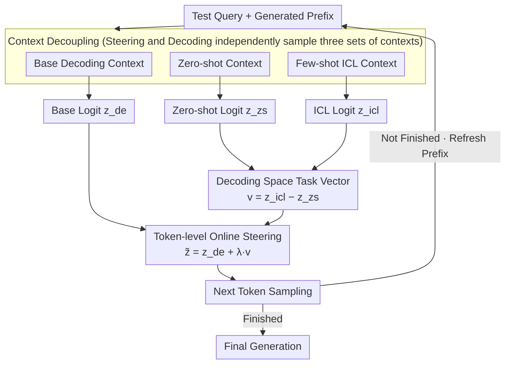

# DeCoVec: Building Decoding Space based Task Vector for Large Language Models via In-Context Learning

**Conference**: ACL 2026 Findings  
**arXiv**: [2604.11129](https://arxiv.org/abs/2604.11129)  
**Code**: [GitHub](https://github.com/szu-tera/DeCoVec)  
**Area**: Robotics  
**Keywords**: Task Vector, Decoding Space, In-Context Learning, Training-free LLM Steering, logit manipulation

## TL;DR
This paper proposes DeCoVec (Decoding Space based Task Vector), a training-free and non-invasive framework that constructs task vectors in the decoding space by calculating the differences in output logit distributions between few-shot and zero-shot prompts. These vectors are injected into the decoding process to guide generation, achieving an average accuracy improvement of up to 5.50 over standard few-shot baselines on TruthfulQA, Math-500, and AQUA-RAT.

## Background & Motivation

**Background**: Task vectors—directions that encode specific task behaviors in high-dimensional spaces—have emerged as promising tools for steering LLMs. Existing methods typically operate in two spaces: (1) Weight-space task vectors (requiring fine-tuning); (2) Activation-space task vectors (requiring invasive manipulation of internal hidden states).

**Limitations of Prior Work**: (1) Weight-space methods require full fine-tuning for every task, incurring high computational costs; (2) Activation-space methods require complex optimization or auxiliary training to manipulate hidden states, making them structurally invasive; (3) Both categories limit flexibility and scalability.

**Key Challenge**: The need to effectively guide the task behavior of LLMs without modifying model parameters or invading internal architectures.

**Goal**: To construct task vectors in the decoding space (output logit layer) to achieve training-free, non-invasive LLM steering.

**Key Insight**: In-context learning (ICL) modifies the output distribution of LLMs, and this change itself encodes task-specific information. This shift can be directly captured in the output logit space as a task vector.

**Core Idea**: Task vector = few-shot logit - zero-shot logit. This difference vector is injected into the standard decoding process to guide generation.

## Method

### Overall Architecture
DeCoVec bypasses model parameters and internal hidden states, operating exclusively at the output logit layer. Given a test query, it maintains three concurrent sets of contexts at each decoding step: the base decoding context, the zero-shot context, and the few-shot ICL context. Three sets of logits are generated via forward passes. The core observation is that the difference between zero-shot and few-shot logits characterizes "which task behaviors are activated by the examples." By adding this difference vector to the base logit according to a specific ratio, task knowledge is injected into the generation token-by-token without any training or structural modifications.

### Key Designs

**1. Decoding Space Task Vector: Reading Task Behavior as Logit Differences**

Previously, task vectors existed either in the weight space (requiring fine-tuning) or the activation space (requiring hidden state invasion). DeCoVec moves the vector to the final output interface of the model—the logits. The rationale is that the zero-shot context represents the task-agnostic state of the model, while the few-shot ICL context represents the task-aware state after being activated by examples. The difference between the two encodes the task-level features introduced by ICL. The task vector at step $t$ is defined as $\mathbf{v}_\mathcal{T}^t = \mathbf{z}_{\text{icl}}^t - \mathbf{z}_{\text{zs}}^t$. crucially, as the two contexts share the same generated prefix $y^{1:t}$, their logits are strictly aligned on the same vocabulary distribution. The subtraction is naturally valid, avoiding the sequence length mismatch issues common in activation-space methods while remaining transparent and fully controllable.

**2. Token-level Online Steering: Dynamic Alignment of Task Signals**

DeCoVec does not treat the task vector as a one-time static bias. Instead, it is recalculated and injected at every decoding step. Each step involves three forward passes to obtain the base decoding logit $\mathbf{z}_{\text{de}}^t$, the zero-shot logit $\mathbf{z}_{\text{zs}}^t$, and the steering ICL logit $\mathbf{z}_{\text{icl}}^t$. The task vector is scaled by a factor $\lambda$ and added to the base logit to produce the final distribution $\tilde{\mathbf{z}}^t = \mathbf{z}_{\text{de}}^t + \lambda \cdot \mathbf{v}_\mathcal{T}^t$. The token-by-token calculation allows the task vector to refresh in real-time with the current decoding context, ensuring it remains aligned with the content currently being generated. $\lambda$ controls the injection intensity; excessively large values may distort semantics, while the $0.5$–$1.5$ range proved most stable in experiments.

**3. Decoupling of Steering and Decoding Contexts: Preventing Double Example Bias**

DeCoVec decouples the "ICL context used for calculating the task vector" and the "context used for base decoding," using independent sampling strategies for each. This may involve different sets of examples. The motivation is that if the same set of examples determines both base decoding and the task vector, the selection bias of those examples is amplified twice. Through decoupling, the task vector is responsible for injecting task semantics while the base decoding ensures fluency. The independent example sources prevent mutual contamination and make the method more robust to example ordering.

### A Complete Example
Consider a math multiple-choice question from AQUA-RAT. At decoding step $t$, the model performs forward passes under three contexts: the base context provides $\mathbf{z}_{\text{de}}^t$, the zero-shot context (query only, no examples) provides $\mathbf{z}_{\text{zs}}^t$, and the few-shot context (query with several examples and their steps) provides $\mathbf{z}_{\text{icl}}^t$. The subtraction yields the task vector $\mathbf{v}_\mathcal{T}^t$, which amplifies the probabilities of tokens related to "step-by-step reasoning." Using $\lambda=1.0$ for the final $\tilde{\mathbf{z}}^t$, the model is more likely to generate a complete reasoning chain rather than jumping directly to an answer compared to original few-shot methods. This process repeats with the updated prefix until the final option is output.

## Key Experimental Results

### Main Results (7 LLMs, 0.5B-9B)

| Method | TruthfulQA MC1/MC2/MC3 | Math-500 | AQUA-RAT | Average Δ |
|------|----------------------|----------|----------|-------|
| Zero-shot | Baseline | Baseline | Baseline | - |
| Few-shot (Random) | +Small | +Small | +Small | - |
| Few-shot (KATE) | +Moderate | +Moderate | +Moderate | - |
| **DeCoVec** | **+Significant** | **+Significant** | **+Significant** | **+5.50** |

### Ablation Study

| Config | Description |
|------|------|
| λ=0 (No task vector) | Degenerates to standard few-shot |
| λ too large | Task signal too strong, risk of semantic distortion |
| λ moderate (0.5-1.5) | Optimal range, stable improvement |
| Variable k (No. of examples) | 3-5 shots observed to be optimal |

### Key Findings
- **DeCoVec consistently outperforms few-shot baselines across all 7 models**, with a maximum average accuracy gain of 5.50.
- **Task vectors encode high-level task semantics rather than surface patterns**: Analysis shows the vectors amplify token probabilities associated with correct reasoning.
- **Effective suppression of generation degradation and logical flaws**: Error analysis indicates that DeCoVec reduces logical errors in mathematical reasoning.
- **Robust to example ordering**: Unlike standard ICL which is sensitive to the order of examples, DeCoVec exhibits stable performance.
- **No additional input token costs**: The task vector operates in the logit space and does not increase the input context length of the base decoding.

## Highlights & Insights
- **Constructing task vectors in the decoding space** is a conceptual breakthrough—moving task vectors from the "model internals" to the "model output interface," making the method entirely non-invasive.
- The discovery that **"ICL logit differences encode task semantics"** provides theoretical value for understanding the underlying mechanisms of ICL.
- While the **overhead of three forward passes** is higher than standard decoding, it remains significantly more lightweight than fine-tuning or training auxiliary models.

## Limitations & Future Work
- Each decoding step requires three forward passes, leading to an inference latency approximately 3x higher than the standard.
- The optimal value of $\lambda$ varies across tasks and models, requiring some hyperparameter tuning.
- Validated only within the 0.5B-9B range; performance on larger models (70B+) remains unknown.
- Evaluation was focused on knowledge and reasoning tasks; effectiveness on open-ended generation tasks (e.g., dialogue, translation) is yet to be explored.
- The interpretability of decoding space task vectors requires further investigation.

## Related Work & Insights
- **vs. Weight-space Task Vectors (Ilharco et al.)**: Requires fine-tuning and lacks flexibility. DeCoVec is training-free.
- **vs. Activation-space Task Vectors (In-Context Vector)**: Requires invasive manipulation of internal hidden states. DeCoVec is non-invasive.
- **vs. Contrastive Decoding**: Contrastive decoding uses the logit difference between "experts and amateurs" to improve quality; DeCoVec uses the "few-shot vs. zero-shot" difference to inject task knowledge. The logic is similar, but the objective differs.

## Rating
- Novelty: ⭐⭐⭐⭐ Decoding space task vectors are a new concept, though the core mechanism of logit difference injection is simple.
- Experimental Thoroughness: ⭐⭐⭐⭐ Covers 7 models and 3 benchmarks with in-depth analysis.
- Writing Quality: ⭐⭐⭐⭐ Clear methodology and useful comparison tables with existing work.
- Value: ⭐⭐⭐⭐ A lightweight, plug-and-play solution that offers insights into ICL understanding.

<!-- RELATED:START -->

## Related Papers

- [\[ACL 2026\] UCS: Estimating Unseen Coverage for Improved In-Context Learning](ucs_estimating_unseen_coverage_for_improved_in-context_learning.md)
- [\[AAAI 2026\] LILAD: Learning In-context Lyapunov-stable Adaptive Dynamics Models](../../AAAI2026/llm_nlp/lilad_learning_in-context_lyapunov-stable_adaptive_dynamics_models.md)
- [\[ACL 2025\] Enhancing Input-Label Mapping in In-Context Learning with Contrastive Decoding](../../ACL2025/llm_nlp/enhancing_input-label_mapping_in_in-context_learning_with_contrastive_decoding.md)
- [\[NeurIPS 2025\] Unifying Attention Heads and Task Vectors via Hidden State Geometry in In-Context Learning](../../NeurIPS2025/llm_nlp/unifying_attention_heads_and_task_vectors_via_hidden_state_geometry_in_in-contex.md)
- [\[ACL 2026\] MoRI: Learning Motivation-Grounded Reasoning for Scientific Ideation in Large Language Models](mori_learning_motivation-grounded_reasoning_for_scientific_ideation_in_large_lan.md)

<!-- RELATED:END -->
