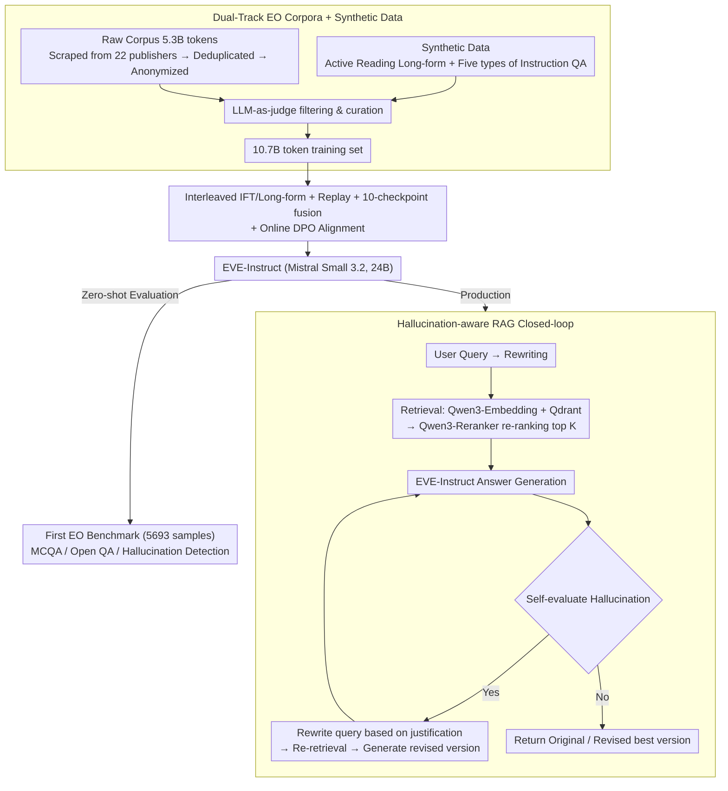

# EVE: A Domain-Specific LLM Framework for Earth Intelligence

**Conference**: ACL 2026  
**arXiv**: [2604.13071](https://arxiv.org/abs/2604.13071)  
**Code**: <https://github.com/eve-esa> (Models at <https://huggingface.co/eve-esa>)  
**Area**: Domain LLM / Earth Science / RAG  
**Keywords**: Earth Observation, Domain LLM, RAG, Hallucination Detection, Mistral Small 3.2, ESA

## TL;DR
This paper introduces EVE—the first open-source end-to-end LLM framework for Earth Observation / Earth Sciences led by the ESA $\Phi$-lab. It includes EVE-Instruct, a 24B domain-adapted model (based on Mistral Small 3.2 + 10.7B synthetic tokens via interleaved IFT/CPT fine-tuning + 10-checkpoint fusion), the first human-annotated EO evaluation benchmark with 5693 samples, and a RAG + hallucination detection pipeline, which has served 350 users in a 6-month pilot.

## Background & Motivation

**Background**: Earth Observation (EO) and Earth Sciences generate massive volumes of high-value knowledge daily. However, this knowledge is scattered across heterogeneous sources (satellite imagery, scientific papers, proprietary databases, internal ESA documents), requiring deep expertise to synthesize. General LLMs lack domain specialization and rigorous evaluation, failing to meet the scientific rigor required for "Earth Action" decision-making.

**Limitations of Prior Work**: (i) Existing domain LLM work either focuses solely on corpora + CPT (e.g., INDUS, K2, AstroLLaMA, COSMOSAGE) but lacks end-to-end deployment, or focuses on spatial reasoning tool integration (e.g., GeoLLM, GeoGPT, ChatGeoAI) without genuine domain SFT. (ii) Earth Sciences lack standardized dialogue/NLP benchmarks, making horizontal model comparison impossible. (iii) Determining how a "medium-scale" 24B model can adapt to a domain without sacrificing general capabilities (tool calling / IF / chat quality) is the key challenge for production deployment.

**Key Challenge**: Developing a truly usable domain assistant requires simultaneously addressing data (high-quality EO corpora), training (avoiding catastrophic forgetting), evaluation (domain benchmarks), and deployment (RAG grounding + hallucination control). Prior works typically cover only one or two of these aspects.

**Goal**: (i) Construct a 5.3B token high-quality EO corpus + 10.7B token synthetic training dataset; (ii) Implement domain adaptation while retaining general capabilities using a training recipe of interleaved IFT/long-form text + replay + 10-checkpoint fusion; (iii) Release the first EO evaluation benchmark with 5693 samples (MCQA + Open QA + Hallucination Detection); (iv) Integrate an end-to-end RAG + hallucination detection pipeline into production to serve 350 users.

**Key Insight**: The authors found that LoRA is insufficient for a "medium-scale" of 5.3B tokens, while pure CPT compromises instruction-following. Consequently, a hybrid "interleaved IFT + long-form text + replay data" training strategy was chosen, crossing long-form and instruct data within the same run and using an active reading pipeline for synthetic augmentation.

**Core Idea**: A five-part suite consisting of "small-scale high-quality corpora + large-scale synthetic data + interleaved IFT/long-form text + replay + checkpoint fusion" is employed to transform a 24B general model into a domain expert without increasing parameters.

## Method

### Overall Architecture
EVE is an end-to-end production system integrating data, training, evaluation, and deployment. The system consists of four synergistic modules: at the core is **EVE-Instruct** (fine-tuned from Mistral Small 3.2, 24B, 128k context), responsible for answer generation, query rewriting, and summarization. This connects to a multi-source Knowledge Base (~365k documents, including open access, Wiley proprietary, and ESA internal documents, supporting hybrid semantic + metadata retrieval). The Retrieval Pipeline recalls candidates based on queries and filters, followed by re-ranking using Qwen3-Reranker-4B. The outermost Chat System + Hallucination Detection manages conversation states, performs fact-checking, and triggers a "rewrite answer" loop when necessary. A user query undergoes retrieval grounding, generation, self-assessment for hallucinations, and demand-driven revision before returning a response.

### Key Designs

**1. Dual-Track EO Corpora + Synthetic Data: Balancing raw sparsity and synthetic drift**
High-quality raw EO corpora totaled only 5.3B tokens, falling into the gap of "enough for SFT but insufficient for CPT." Pure CPT risks damaging instruction-following, so the authors used real corpora as a foundation and synthetic data for volume. Raw data was harvested using a custom scraper from 22 trusted publishers and 172 sources (4.2B open + 1.1B Wiley proprietary), processed with Trafilatura/Nougat OCR, SHA-256/MinHash LSH deduplication, and Presidio anonymization. Synthetic data followed two paths: long-form text used an Active Reading pipeline (Mistral Medium 3.1 for strategy, Mistral Small 3.2 for generation) to restructure key content, while instruction text was produced by 7 high-quality models (Mistral Large 3, GPT-4o Mini, Qwen3-235B, DeepSeek-R1, etc.) across five sample categories. The final 10.7B token set, curated via LLM-as-judge, ensures both scale and quality.

**2. Interleaved IFT/Long-form Training + Replay + 10-checkpoint Fusion: Domain adaptation without losing general capabilities**
When adapting a medium-scale 24B model, the primary risk is catastrophic forgetting of general tasks like tool calling. The authors interleaved instruction-formatted text and long-form text within the same training run, with 50/50 or 60/40 general-domain replay mixed in. A learning rate between typical IFT and CPT was used to balance "fact integration" and "alignment stability." The critical engineering innovation was checkpoint fusion: after 10 training runs with different mixing ratios—producing models varying in domain vs. general strength—uniform parameter interpolation was used to average them into a single optimal trade-off model. This provides a low-cost ensemble alternative that improves robustness at training time without additional inference overhead, finalized with Online DPO.

**3. First EO Benchmark + Hallucination-aware RAG Closed-loop: Quantifying performance and self-repairing hallucinations**
General hallucination benchmarks fail to cover EO domain knowledge. The authors built a 5693-sample benchmark across 5 tasks (MCQA Single-choice 1261 / Multi-choice 431 / Open-ended without context 1257 / with context 418 / Hallucination Detection 2326), annotated by 25 EO experts. The RAG pipeline utilizes ~512-word chunks with Qwen3-Embedding-4B and Qdrant binary quantization. Hallucination control uses a lightweight self-repair loop: EVE-Instruct evaluates its own output $\rightarrow$ if hallucinations are flagged, it rewrites the query with justification $\rightarrow$ re-retrieves $\rightarrow$ generates a revision $\rightarrow$ re-evaluates. Consolidating detection, revision, and selection within EVE-Instruct itself avoids deploying a separate verifier and maintains acceptable production latency.

### Loss & Training
The base model is Mistral Small 3.2 (24B, 128k context). Training was mixed at a ratio of 30% long-form + 70% instruction, with 50/50 or 60/40 replay data added internally. The learning rate was set between standard IFT and CPT values. Finally, 10 checkpoints with different mix proportions were fused, and alignment was performed using Online DPO. Training costs are estimated at approximately 38 tons of $CO_2eq$.

## Key Experimental Results

### Main Results (EO benchmark zero-shot)

| Model | Parameters | MCQA Multi IoU | MCQA Single Acc | Hallucination F1 | Open QA Judge | Average Rank ↓ |
|------|-------|---------------|----------------|------------------|----------------|-------------|
| Llama4 Scout | 109-A17 | 80.32 | 71.23 | 66.08 | 87.37 | 3.67 |
| Qwen3 | 30-A3 | 78.40 | 66.36 | 81.30 | 94.92 | 2.67 |
| Gemma3 | 27 | 73.60 | 57.54 | 75.07 | 94.41 | 3.83 |
| Mistral Small 3.2 (parent) | 24 | 80.19 | 70.30 | 82.19 | 91.78 | 3.50 |
| **EVE-Instruct** | **24** | **86.12** | **77.73** | **84.70** | **96.40** | **1.33** |

EVE-Instruct ranked first in 4 out of 5 tasks with an average rank of 1.33. Its MCQA Multi-choice IoU of 86.12 is 6 points higher than the parent model. The Hallucination F1 of 84.70 significantly outperforms Llama4 Scout (66.08), demonstrating the discriminatory gains from domain adaptation.

### Ablation Study (Impact on General Capabilities)

| Category | Small 3.2 | EVE-Instruct | Gain |
|----------|-----------|--------------|---|
| Math & Reasoning | 50.8 | 54.9 | +4.1 |
| Coding | 55.6 | 56.5 | +0.9 |
| Knowledge | 67.7 | 69.0 | +1.3 |
| Tool Calling | 87.9 | 90.9 | +3.0 |
| Instruction Following | 80.1 | 81.2 | +1.1 |
| Chat Quality | 90.8 | 91.7 | +0.9 |
| **Overall** | **72.2** | **74.0** | **+1.8** |

All general capability sub-items showed improvements, proving that the training recipe of interleaved IFT/long-form + replay + 10-checkpoint fusion successfully avoids the "domain vs. general" trade-off.

### Key Findings
- **24B can outperform 109B**: EVE-Instruct consistently beats Llama4 Scout (109B MoE) on EO tasks, indicating that refined domain data and training strategies are more critical than scale alone for vertical domains.
- **Domain adaptation without degradation**: All general task gains were positive, debunking the assumption that domain LLMs must degrade on general tasks.
- **Judge bias verification**: Swapping the LLM-judge for Claude Sonnet 4.6 or Gemini 2.5 Flash resulted in a maximum rank shift of only $\pm 0.25$, validating the robustness of the evaluation.
- **Production feasibility**: The 6-month pilot for 350 users using RunPod serverless + Qdrant binary quantization proves that a 24B domain assistant is economically viable.
- **Open-Ended QA with Context**: Qwen3 scored slightly higher in judge scores, but EVE achieved the best Win Rate, suggesting comparable quality in RAG-enhanced scenarios.

## Highlights & Insights
- **"10-checkpoint fusion" as a low-cost ensemble**: Using uniform parameter interpolation instead of inference-time ensembles solves the "domain vs. general" trade-off post-training—a valuable engineering trick for other domain projects.
- **Active Reading pipeline for synthetic long-form text**: Unlike simple paraphrasing, Active Reading encourages the LLM to restructure "important content + key terminology," which is more effective for domain adaptation by reinforcing schemas and terms.
- **First EO benchmark + 25-expert annotation**: This public release provides the Earth Sciences NLP community with a standardized evaluation framework, a community-level contribution.
- **Hallucination self-assessment + self-repair loop**: Consolidating detection and revision within a single model makes it production-friendly by limiting latency, representing a successful engineering realization of RARR/SelfCheckGPT concepts.

## Limitations & Future Work
- Licensing restrictions with Wiley prevent the release of 1.1B tokens (~21% of the corpus), affecting full external reproducibility.
- Evaluation relies heavily on LLM-as-judge due to the scarcity of EO domain experts, which remains a structural bottleneck.
- EVE is currently text-only and cannot process satellite imagery or structured geospatial data directly; future work aims for a multimodal agentic platform.
- RAG timeliness depends on manual KB refreshes; a process for automated, frequent knowledge updates has not yet been engineered.

## Related Work & Insights
- **vs. INDUS / K2 / AstroLLaMA / COSMOSAGE**: While those projects focus on corpora and CPT, EVE provides a full end-to-end system (data + training + evaluation + RAG + deployment) and the first domain benchmark.
- **vs. GeoGPT / GeoLLM / ChatGeoAI**: Those tools focus on spatial reasoning via tool calling, whereas EVE focuses on text understanding, scientific QA, and hallucination control, making them complementary.
- **vs. SelfCheckGPT / RARR**: EVE's self-repair loop adapts RARR's ideas into a single-model deployment suitable for production.
- **vs. LoRA / Selective Parameter Freezing**: Abandoning LoRA in favor of full-parameter interleaved fine-tuning + checkpoint fusion proved superior for corpora of this size (5.3B tokens).

## Rating
- Novelty: ⭐⭐⭐ Components (IFT/CPT mix, fusion, RAG loop) are known, but the complete end-to-end EO system + public benchmark is a first.
- Experimental Thoroughness: ⭐⭐⭐⭐ Use of multiple judges, cross-family evaluation, general capability checks, and 6-month pilot deployment is exceptional.
- Writing Quality: ⭐⭐⭐⭐ Clear structure with comprehensive coverage of methods, evaluation, and deployment engineering.
- Value: ⭐⭐⭐⭐⭐ The open-sourcing of models, corpora, benchmarks, and code is an infrastructure-level contribution to the EO NLP community.

<!-- RELATED:START -->

## Related Papers

- [\[ACL 2025\] TrimLLM: Progressive Layer Dropping for Domain-Specific LLMs](../../ACL2025/llm_nlp/trimllm_layer_dropping.md)
- [\[ACL 2026\] When TableQA Meets Noise: A Dual Denoising Framework for Complex Questions and Large Tables](when_tableqa_meets_noise_a_dual_denoising_framework_for_complex_questions_and_la.md)
- [\[ACL 2026\] MulDimIF: A Multi-Dimensional Constraint Framework for Evaluating and Improving Instruction Following in Large Language Models](muldimif_a_multi-dimensional_constraint_framework_for_evaluating_and_improving_i.md)
- [\[ICLR 2026\] BOTS: A Unified Framework for Bayesian Online Task Selection in LLM Reinforcement Finetuning](../../ICLR2026/llm_nlp/bots_a_unified_framework_for_bayesian_online_task_selection_in_llm_reinforcement.md)
- [\[ICLR 2026\] ELLMob: Event-Driven Human Mobility Generation with Self-Aligned LLM Framework](../../ICLR2026/llm_nlp/ellmob_event-driven_human_mobility_generation_with_self-aligned_language_models.md)

<!-- RELATED:END -->
