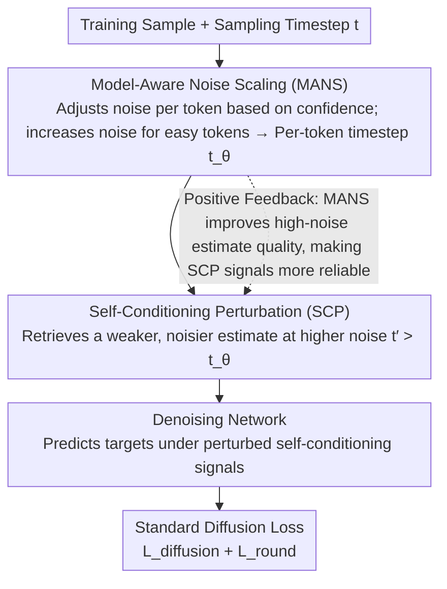

# FastDiSS: Few-step Match Many-step Diffusion Language Model on Sequence-to-Sequence Generation

**Conference**: ACL 2026 Findings  
**arXiv**: [2604.05551](https://arxiv.org/abs/2604.05551)  
**Code**: None  
**Area**: LLM/NLP  
**Keywords**: Diffusion Language Models, Few-step Sampling, Self-Conditioning Perturbation, Noise Scaling, Sequence-to-Sequence

## TL;DR
This paper analyzes two bottlenecks in continuous diffusion language models during few-step sampling: the mismatch of self-conditioning signals and training saturation. It proposes the FastDiSS framework, which improves robustness through Self-Conditioning Perturbation (SCP) and Model-Aware Noise Scaling (MANS), achieving 4×-400× acceleration across six benchmarks while maintaining generation quality.

## Background & Motivation

**Background**: As an alternative to autoregressive text generation, diffusion models achieve linear-time decoding by generating all tokens in parallel. Self-conditioning techniques reuse the prediction from the previous step as a conditioning signal to improve few-step sampling, yet they introduce unrecognized failure modes.

**Limitations of Prior Work**: (1) Training-inference self-conditioning mismatch—During training, ground-truth targets are available for conditioning, whereas during inference, the model must rely on its own imperfect predictions. This distribution shift is more severe in few-step settings where predictions at high-noise steps differ significantly from low-noise steps, causing reused signals to become biased conditions. (2) Late-stage training saturation—Models exhibit a loss plateau after quickly fitting early targets. Uniform noise sampling fails to provide effective learning signals for tokens that are already predicted with high confidence.

**Key Challenge**: The deployment appeal of diffusion models lies precisely in few-step fast inference; however, self-conditioning—the key technology for improving few-step sampling—introduces its greatest errors in these very settings.

**Goal**: Design a training framework that enables diffusion language models to achieve quality in few-step sampling comparable to many-step sampling.

**Key Insight**: Directly simulate inference-time noise conditions during training by perturbing self-conditioning signals to match the inference error distribution and dynamically adjusting noise per token to avoid training saturation.

**Core Idea**: SCP intentionally uses noisier estimates as self-conditioning signals during training. MANS dynamically assigns higher noise to tokens based on denoising confidence levels.

## Method

### Overall Architecture

FastDiSS does not modify the network architecture of continuous diffusion language models. Instead, it adjusts the training process to bridge the quality gap in few-step sampling. It addresses the two neglected bottlenecks: Self-Conditioning Perturbation (SCP) mitigates "training-inference mismatch" by making training signals as noisy as those in inference, and Model-Aware Noise Scaling (MANS) addresses "late-stage training saturation" by dynamically assigning noise based on each token's denoising confidence. In a training iteration, the model first samples timesteps, uses MANS to adjust per-token noise levels, retrieves a weaker self-conditioning estimate at higher noise via SCP, and finally optimizes with standard diffusion loss. These components work synergistically so that signals reused during few-step inference no longer act as sources of bias.

### Key Designs

**1. Self-Conditioning Perturbation (SCP): Rehearsing "Signal Deterioration" during Training**

The primary pain point of few-step sampling is that training uses ground-truth targets while inference reuses the previous noisier, imperfect prediction. SCP "worsens" self-conditioning signals during training by running the denoising network at a higher noise level $t' > t$ rather than the current $t$. This produces a weaker estimate that simulates the degraded signal passed from previous steps during inference. The network is then trained to denoise accurately under these perturbed conditions, internalizing the cost of signal reuse before inference occurs.

**2. Model-Aware Noise Scaling (MANS): Reallocating Training Signals to "Hard" Tokens**

Uniform noise sampling involves an implicit waste: tokens that the model has already learned with high confidence are repeatedly trained with the same noise distribution, contributing negligible gradients. MANS adopts a token-adaptive approach: it calculates confidence as the distance between the model prediction and the ground-truth embedding for each token $i$. More "easy" (high-confidence) tokens are assigned higher noise levels and timesteps, forcing the model to process positions it previously mastered. This focuses the learning signal on valuable areas to avoid saturation and improves denoising quality in high-noise regions.

**3. End-to-End Training Framework: Synergistic Effects**

SCP and MANS are integrated into the standard diffusion training pipeline while maintaining stability. The iteration sequence is: sample timestep $t$, apply MANS to obtain adjusted per-token timesteps $t_\theta$, retrieve perturbed self-conditioning signals via SCP at $t_\theta$, and calculate the standard diffusion loss. While they can function independently, their combination creates a positive feedback loop: MANS improves estimation quality in high-noise regions, thereby enhancing the quality of the perturbation signals that SCP relies on.

### Loss & Training

The overall objective follows the sum of two standard diffusion modeling terms: $\mathcal{L}_{\text{total}} = \mathcal{L}_{\text{diffusion}} + \mathcal{L}_{\text{round}}$. SCP and MANS only alter the noise conditions and self-conditioning signals fed into the loss functions without introducing new terms. During training, diffusion loss and self-conditioning loss are optimized alternately.

## Key Experimental Results

### Main Results

| Setting | Model | 5-step BLEU | Speedup |
|------|------|---------|---------|
| IWSLT14 De-En | Standard Diffusion | 27.85 | 1× |
| IWSLT14 De-En | FastDiSS | **29.70** | 200×-400× |
| Upper Bound (Oracle) | — | 29.70 | — |

### Ablation Study

| Configuration | 5-step BLEU | Description |
|------|---------|------|
| Standard Self-Conditioning | 27.85 | Baseline |
| + SCP only | 29.1+ | Reduces training-inference mismatch |
| + MANS only | 28.5+ | Avoids training saturation |
| + SCP + MANS | **29.70** | Optimal synergy |

### Key Findings
- Self-conditioning mismatch causes a loss of approximately 2 BLEU in 5-step sampling; FastDiSS recovers nearly the entire gap.
- SCP enables few-step sampling quality to approach the theoretical upper bound of using "correct" self-conditioning.
- MANS-based token-level noise adjustment is more effective than uniform sampling, preventing late-stage training saturation.
- Consistent improvements were observed across six seq2seq benchmarks, including translation and summarization.
- FastDiSS remains competitive compared to other single-step diffusion frameworks.

## Highlights & Insights
- **Simulating Inference Error during Training**: The core concept of SCP—intentionally introducing inference-time imperfections during training to improve robustness—can be generalized to any scenario with training-inference mismatch (e.g., teacher forcing vs. autoregressive inference).
- **Hard-Example Aware Training**: By dynamically increasing noise for "easy" tokens, MANS serves as a natural application of curriculum learning and hard example mining within the diffusion paradigm.
- **Analysis-Driven Design**: By quantifying the performance gap between "oracle" and "reused" self-conditioning, the authors precisely characterized the problem before designing a targeted solution.

## Limitations & Future Work
- Validated only on continuous diffusion language models; discrete diffusion models were not tested.
- Benchmarks primarily cover translation and summarization; more complex generation tasks await testing.
- The selection of noise levels for SCP may require per-task tuning.
- An absolute quality gap still remains when comparing diffusion language models to the latest autoregressive LLMs.

## Related Work & Insights
- **vs. DiffusionLM**: DiffusionLM defined the base framework for continuous diffusion language modeling; FastDiSS solves the efficiency bottlenecks in its few-step sampling.
- **vs. CDCD**: While CDCD introduced self-conditioning to accelerate diffusion, FastDiSS addresses new problems introduced by self-conditioning in few-step settings.
- **vs. One-step Methods**: FastDiSS's few-step strategy provides a more flexible trade-off between quality and efficiency.

## Rating
- Novelty: ⭐⭐⭐⭐ The idea of "simulating inference error during training" in SCP is simple and effective.
- Experimental Thoroughness: ⭐⭐⭐⭐ Six benchmarks, detailed ablations, and comparisons across multiple step counts.
- Writing Quality: ⭐⭐⭐⭐ Thorough problem analysis and clear methodological descriptions.
- Value: ⭐⭐⭐⭐ Removes key efficiency barriers for the practical deployment of diffusion language models.

<!-- RELATED:START -->

## Related Papers

- [\[AAAI 2026\] TransMamba: A Sequence-Level Hybrid Transformer-Mamba Language Model](../../AAAI2026/llm_nlp/transmamba_a_sequence-level_hybrid_transformer-mamba_language_model.md)
- [\[ACL 2025\] Automated CAD Modeling Sequence Generation from Text Descriptions via Transformer-Based Large Language Models](../../ACL2025/llm_nlp/cadllm_cad_modeling_from_text.md)
- [\[ACL 2026\] Automatic Combination of Sample Selection Strategies for Few-Shot Learning](automatic_combination_of_sample_selection_strategies_for_few-shot_learning.md)
- [\[AAAI 2026\] Uncertainty Under the Curve: A Sequence-Level Entropy Area Metric for Reasoning LLMs](../../AAAI2026/llm_nlp/uncertainty_under_the_curve_a_sequence-level_entropy_area_metric_for_reasoning_l.md)
- [\[ACL 2026\] Unlocking the Potential of Diffusion Language Models through Template Infilling](unlocking_the_potential_of_diffusion_language_models_through_template_infilling.md)

<!-- RELATED:END -->
