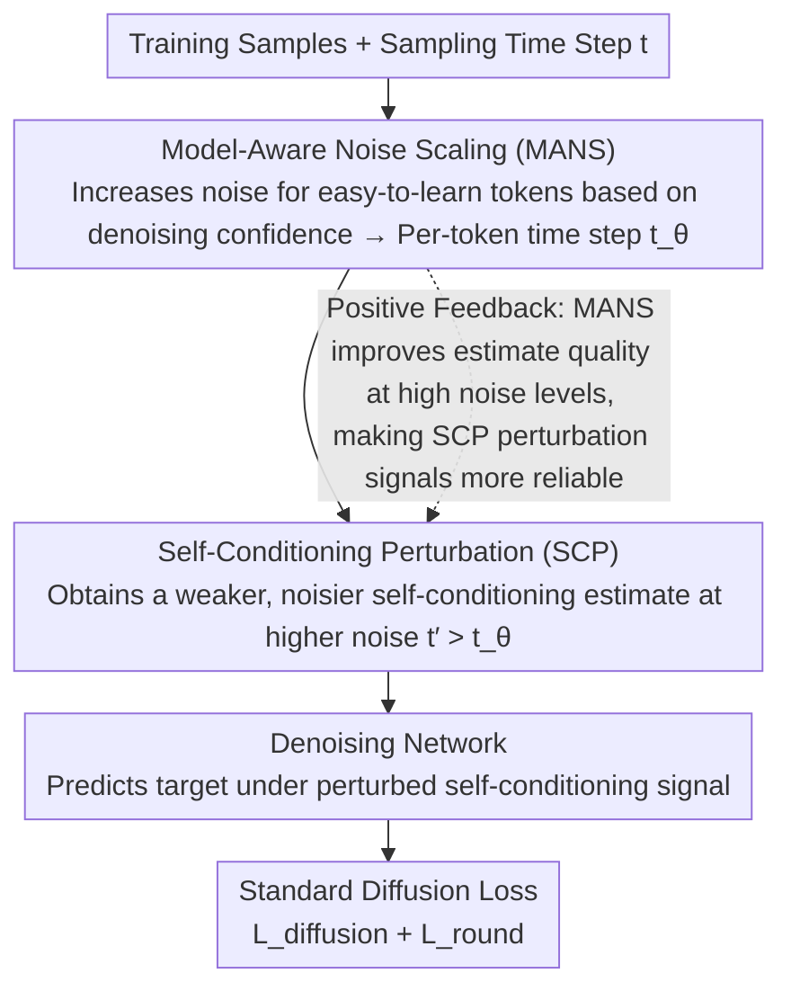

# FastDiSS: Few-step Match Many-step Diffusion Language Model on Sequence-to-Sequence Generation

**Conference**: ACL 2026 Findings  
**arXiv**: [2604.05551](https://arxiv.org/abs/2604.05551)  
**Code**: None  
**Area**: LLM/NLP  
**Keywords**: Diffusion Language Models, Few-step Sampling, Self-Conditioning Perturbation, Noise Scaling, Seq2Seq

## TL;DR
This paper identifies two bottlenecks in continuous diffusion language models during few-step sampling: self-conditioning signal mismatch and training saturation. It proposes the FastDiSS framework, which utilizes Self-Conditioning Perturbation (SCP) and Model-Aware Noise Scaling (MANS) to improve robustness, achieving 4×-400× acceleration across six benchmarks while maintaining generation quality.

## Background & Motivation

**Background**: As an alternative to autoregressive text generation, diffusion models achieve linear-time decoding by generating all tokens in parallel. Self-conditioning techniques improve few-step sampling results by reusing the prediction from the previous step as a condition signal, but they introduce under-recognized failure modes.

**Limitations of Prior Work**: (1) Training-inference self-conditioning mismatch—During training, ground-truth targets are available for conditioning, but inference must rely on the model's own imperfect predictions. This distribution shift is more severe in few-step settings, where high-noise step predictions differ significantly from low-noise ones, causing reused signals to become biased conditions. (2) Late-stage training saturation—Models exhibit a clear loss plateau after quickly fitting early targets; uniform noise sampling fails to provide effective learning signals for tokens that are already predicted with high confidence.

**Key Challenge**: The deployment appeal of diffusion models lies in few-step fast inference, yet self-conditioning—the key technique for improving few-step sampling—introduces the largest errors precisely in few-step settings.

**Goal**: To design a training framework that enables diffusion language models to achieve quality under few-step sampling that is comparable to many-step sampling.

**Key Insight**: Directly simulate inference-time noise conditions during training by perturbing self-conditioning signals to match inference error distributions, and dynamically adjust noise for each token to avoid training saturation.

**Core Idea**: SCP intentionally uses noisier estimates as self-conditioning signals during training, while MANS dynamically assigns higher noise to high-confidence tokens based on denoising likelihood.

## Method

### Overall Architecture

FastDiSS does not modify the network architecture of continuous diffusion language models but intervenes on the training side to make few-step sampling quality approach many-step quality. It addresses two neglected bottlenecks: Self-Conditioning Perturbation (SCP) treats the "training-inference mismatch" by ensuring training self-conditioning signals are as noisy as those during inference; Model-Aware Noise Scaling (MANS) addresses "late-stage training saturation" by dynamically assigning noise according to each token's denoising confidence. In one training iteration, the time step is sampled, MANS adjusts per-token noise levels, SCP retrieves a weaker self-conditioning estimate from a higher noise step, and finally, the network is supervised by standard diffusion loss. These components work synergistically so that reused self-conditioning signals during few-step inference no longer act as sources of bias.

### Key Designs

**1. Self-Conditioning Perturbation (SCP): Rehearsing Inference-Time "Signal Deterioration" in Training**

The pain point of few-step sampling is that training uses the real target as a condition, while inference can only reuse the imperfect prediction from the previous (higher noise) step. SCP's strategy is to intentionally "degrade" the self-conditioning signal during training: instead of running the denoising network at the current noise level $t$ to get the signal, it is run at a higher level $t' > t$. This produces a weaker, noisier estimate that simulates the degraded signal passed from previous steps during inference. The network is then required to denoise accurately under this perturbed condition, learning to be robust to noisy self-conditioning.

**2. Model-Aware Noise Scaling (MANS): Allocating Learning Signals to "Difficult" Tokens**

Uniform noise sampling involves an implicit waste—tokens that the model has already learned with high confidence are repeatedly trained with the same noise distribution, contributing no effective gradients. MANS switches to per-token adaptation: it calculates the distance between model predictions and ground-truth embeddings as a confidence measure. Higher noise (higher time steps) is applied to "easier" tokens with higher confidence, forcing the model to tackle these mastered positions. This avoids late-stage saturation and improves denoising estimate quality in high-noise regions.

**3. End-to-End Training Framework: Synergistic Gains**

SCP and MANS are integrated into the standard diffusion training pipeline while maintaining stability. The iteration sequence samples time step $t$, obtains per-token adjusted $t_\theta$ via MANS, takes the perturbed self-conditioning signal at the higher noise level corresponding to $t_\theta$ via SCP, and concludes with the standard diffusion loss. The components can be used independently or jointly; when joint, a positive feedback loop exists where MANS improves the quality of high-noise estimates, thereby improving the quality of the perturbation signals that SCP relies on.

### Loss & Training

The total objective follows the sum of two terms from standard diffusion modeling: $\mathcal{L}_{\text{total}} = \mathcal{L}_{\text{diffusion}} + \mathcal{L}_{\text{round}}$ (denoising loss plus rounding loss). SCP and MANS only change the noise conditions and self-conditioning signals fed into the loss and do not introduce extra loss terms. Training alternates between optimizing the diffusion loss and the self-conditioning loss.

## Key Experimental Results

### Main Results

| Setting | Model | 5-step BLEU | Speedup |
|------|------|---------|---------|
| IWSLT14 De-En | Standard Diffusion | 27.85 | 1× |
| IWSLT14 De-En | FastDiSS | **29.70** | 200×-400× |
| Upper Bound (Correct Self-Cond) | — | 29.70 | — |

### Ablation Study

| Configuration | 5-step BLEU | Description |
|------|---------|------|
| Standard Self-Conditioning | 27.85 | Baseline |
| + SCP only | 29.1+ | Reduces training-inference mismatch |
| + MANS only | 28.5+ | Avoids training saturation |
| + SCP + MANS | **29.70** | Optimal synergy |

### Key Findings
- Self-conditioning mismatch causes a loss of approximately 2 BLEU during 5-step sampling; FastDiSS almost entirely bridges this gap.
- SCP enables few-step sampling quality to reach the theoretical upper bound of using "correct" self-conditioning.
- Token-level noise adjustment in MANS is more effective than uniform noise sampling and prevents late-stage training saturation.
- Consistent improvements are observed across 6 seq2seq benchmarks, including translation and summarization tasks.
- It remains competitive compared to other one-step diffusion frameworks.

## Highlights & Insights
- **Simulating Inference Errors during Training**: The core idea of SCP—intentionally introducing inference-time imperfections during training to improve robustness—can be generalized to any scenario with training-inference mismatch (e.g., teacher forcing vs. autoregressive inference).
- **Hard Example Aware Training**: MANS dynamically increases noise for "easy" tokens, representing a natural application of curriculum learning and hard example mining ideas within diffusion models.
- **Analysis-Driven Design**: By comparing the performance gap between "correct" and "reused" self-conditioning, the severity of the problem was quantified, followed by a targeted solution.

## Limitations & Future Work
- Validated only on continuous diffusion language models; discrete diffusion models were not tested.
- The 6 benchmarks are primarily translation and summarization; more complex generation tasks have not been tested.
- Noise level selection for SCP may require tuning for different tasks.
- Compared with the latest autoregressive LLMs, the absolute quality of diffusion language models still lags.

## Related Work & Insights
- **vs DiffusionLM**: DiffusionLM defines the basic framework for continuous diffusion language modeling; FastDiSS resolves its efficiency bottleneck in few-step sampling.
- **vs CDCD**: CDCD introduced self-conditioning to accelerate diffusion; FastDiSS solves new problems introduced by self-conditioning in few-step settings.
- **vs One-step Diffusion Methods**: The few-step strategy of FastDiSS provides a more flexible trade-off between quality and efficiency.

## Rating
- Novelty: ⭐⭐⭐⭐ The idea of "simulating inference errors during training" in SCP is simple and effective.
- Experimental Thoroughness: ⭐⭐⭐⭐ 6 benchmarks, detailed ablations, and multiple step-count comparisons.
- Writing Quality: ⭐⭐⭐⭐ Problem analysis is thorough and the method description is clear.
- Value: ⭐⭐⭐⭐ Removes a key efficiency barrier for the practical deployment of diffusion language models.

<!-- RELATED:START -->

## Related Papers

- [\[CVPR 2026\] Single-step Diffusion-based Video Coding with Semantic-Temporal Guidance](../../CVPR2026/llm_nlp/single-step_diffusion-based_video_coding_with_semantic-temporal_guidance.md)
- [\[AAAI 2026\] TransMamba: A Sequence-Level Hybrid Transformer-Mamba Language Model](../../AAAI2026/llm_nlp/transmamba_a_sequence-level_hybrid_transformer-mamba_language_model.md)
- [\[ACL 2025\] Automated CAD Modeling Sequence Generation from Text Descriptions via Transformer-Based Large Language Models](../../ACL2025/llm_nlp/cadllm_cad_modeling_from_text.md)
- [\[ACL 2026\] Automatic Combination of Sample Selection Strategies for Few-Shot Learning](automatic_combination_of_sample_selection_strategies_for_few-shot_learning.md)
- [\[ACL 2026\] Unlocking the Potential of Diffusion Language Models through Template Infilling](unlocking_the_potential_of_diffusion_language_models_through_template_infilling.md)

<!-- RELATED:END -->
