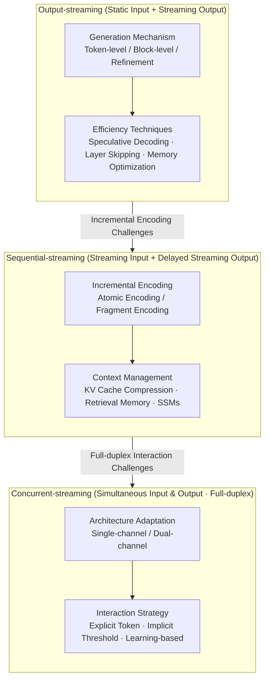

# From Static Inference to Dynamic Interaction: A Survey of Streaming Large Language Models

**Conference**: ACL 2026 Findings  
**arXiv**: [2603.04592](https://arxiv.org/abs/2603.04592)  
**Code**: [GitHub](https://github.com/EIT-NLP/Awesome-Streaming-LLMs)  
**Area**: LLM Systems / Streaming Inference  
**Keywords**: Streaming LLMs, Real-time Interaction, Incremental Encoding, Full-duplex, Speculative Decoding

## TL;DR

This paper provides the first systematic survey of Streaming Large Language Models (Streaming LLMs). It proposes a unified definition based on data flow and interaction concurrency, categorizing existing methods into a three-level progressive taxonomy: Output-streaming, Sequential-streaming, and Concurrent-streaming, covering methodologies and applications across text, audio, and video modalities.

## Background & Motivation

**Background**: Standard LLMs adopt a "one-time full input reading" static inference paradigm—encoding the entire input into the KV cache before autoregressive decoding. While effective for benchmarks, this fundamentally limits applicability in dynamic scenarios such as real-time translation, streaming video understanding, and interactive tool agents.

**Limitations of Prior Work**: (1) In real-world settings, information arrives incrementally, accumulates over time, and can be infinitely long, which the static paradigm cannot handle; (2) Existing definitions of "Streaming LLM" are inconsistent—concepts like autoregressive decoding, incremental/chunked encoding, and full-duplex interaction are often conflated under the same label; (3) There is a lack of large-scale pre-training data supporting real-time interaction, partial input supervision, and fine-grained temporal alignment.

**Key Challenge**: A fundamental mismatch exists between the offline, full-context design of LLMs and the online, incremental, interactive data streams of the real world—models must dynamically decide when to respond, when to wait for more information, and when to terminate.

**Goal**: Propose a unified definition and systematic classification for Streaming LLMs to clarify terminology and provide a structured research roadmap for this emerging field.

**Key Insight**: Categorize Streaming LLMs based on two dimensions—data flow and interaction concurrency—rather than modality or architecture.

**Core Idea**: Streaming LLMs form a three-level progressive hierarchy: (1) Output-streaming: Static input + streaming output (standard autoregressive); (2) Sequential-streaming: Streaming input + streaming output (generation after incremental encoding); (3) Concurrent-streaming: Simultaneous streaming input and output (full-duplex interaction). Each level introduces new challenges atop the previous one.

## Method

### Overall Architecture

Rather than modality, this survey redefines the field through data flow and interaction concurrency. "Streaming LLM" is decomposed into a three-level progressive hierarchy: Output-streaming focuses on streaming generation and efficiency; Sequential-streaming adds incremental encoding and context management; Concurrent-streaming further incorporates architecture adaptation and interaction strategies.

### Key Designs

**1. Output-streaming LLMs: Maximizing Throughput on Static Inputs**

The main bottleneck is low efficiency in token-by-token generation. This level seeks higher throughput given full input. Generation mechanisms include: Token-level (standard autoregressive), Block-level (Semi-autoregressive like SoT, or block diffusion like SSD-LM), and Refinement (multi-scale like VAR, or global diffusion like LLaDA). Efficiency is further enhanced via Speculative Decoding, Layer Skipping (AdaInfer), and memory optimization (e.g., StreamingLLM’s attention sink for preserving initial KV caches).

**2. Sequential-streaming LLMs: Encoding while Receiving Incomplete Information**

Models must decide when to respond with incremental, potentially infinite inputs. The first challenge is Incremental Encoding: splitting continuous input into "Atomic" units (discrete units like subwords) or "Fragments" (segmented by fixed intervals or semantics via CTC/DiSeg). The second is Context Management to handle linear KV cache growth: using KV cache compression (H2O, KVQuant), Retrieval-Augmented Memory (MemWalker), or State Space Models (Mamba’s linear complexity).

**3. Concurrent-streaming LLMs: Full-duplex Interaction (Simultaneous Speaking and Listening)**

Full-duplex is natural for human dialogue but difficult for standard "turn-taking" LLMs. Architecture Adaptation challenges include: Single-channel (interleaving input/output in one sequence, e.g., SpeechGPT) which is simple but prone to interference, and Dual-channel (independent channels, e.g., Moshi’s dual-Transformer) which allows parallelism at the cost of doubled parameters. Interaction Strategies ("when to respond") include explicit strategies (special `<wait>/<speak>` tokens), implicit heuristic strategies (triggering on output probability thresholds), and learning-based strategies (using RL to find optimal timing).

### Loss & Training
As a survey, this work identifies three common difficulties: lack of streaming pre-training data, design of partial input supervision, and the high cost of temporal alignment annotations.

## Key Experimental Results

### Main Results

The paper compares existing paradigms and techniques through systematic categorization:

**Comparison of the Three Streaming Paradigms**

| Paradigm | Input Mode | Output Mode | Key Challenge | Representative Methods |
|:---|:---|:---|:---|:---|
| Output-streaming | Static | Streaming | Efficient Generation | Speculative Decoding, SoT |
| Sequential-streaming | Streaming | Streaming (Delayed) | Incremental Encoding + Context Mgmt | StreamingLLM, H2O, Mamba |
| Concurrent-streaming | Streaming | Streaming (Simultaneous) | Full-duplex Architecture + Interaction | Moshi, MiniOmni, OmniChat |

**Comparison of KV Cache Compression Methods**

| Category | Representative Work | Mechanism | Pros/Cons |
|:---|:---|:---|:---|
| Token Eviction | H2O, FastGen | Evict unimportant tokens based on attention | Simple but may lose key info |
| Quantization | KVQuant, KIVI | Reduce KV cache bit-precision | High compression but potential accuracy loss |
| Merging | CaM, D2O | Merge similar token representations | Preserves info but higher computation |

### Key Findings

- The three-level classification clearly illustrates the progression of technical challenges—Concurrent-streaming builds on the previous two by adding architectural and interaction layers.
- Speech streaming is currently the most mature direction (e.g., Moshi), followed by text, while video streaming remains the least explored.
- KV cache management is a universal bottleneck; the "attention sink" discovery in StreamingLLM (importance of initial tokens) has been pivotal.
- The most significant open problem in full-duplex interaction is strategy learning for "when to respond"—threshold methods are brittle, while RL is promising but difficult to train.

## Highlights & Insights

- The progressive three-level framework unifies fragmented terminology from a data flow perspective, providing a structured roadmap.
- The comparison of Single-channel vs. Dual-channel architectures reveals core trade-offs: simplicity vs. interference/parameter redundancy.
- The systematic categorization of interaction strategies (explicit, implicit, learning-based) covers the full spectrum from simple heuristics to complex optimization.

## Limitations & Future Work

- Evaluation standards are not yet unified—latency, quality, and interactivity dimensions lack a consensus metric.
- Scarcity of streaming pre-training data is a fundamental bottleneck, especially for full-duplex scenarios.
- Unified architectures for multimodal concurrent streaming (simultaneous speech, video, text) remain an open challenge.
- Safety considerations are insufficient—streaming outputs are harder to retract, making error costs higher than in static inference.

## Related Work & Insights

- **vs. Xiao et al. (2023) StreamingLLM**: StreamingLLM is a specific method (attention sink + sliding window); this survey categorizes it as a KV cache management technique within Sequential-streaming.
- **vs. Speculative Decoding Surveys**: These focus on efficient generation (Output-streaming); this survey places them within a broader streaming context.
- **vs. Speech Dialogue Model Surveys**: Those focus primarily on Concurrent-streaming; this survey extends the scope to text and video.

## Rating

- **Novelty**: ⭐⭐⭐⭐ The three-level classification framework and unified definition offer significant conceptual contributions.
- **Experimental Thoroughness**: ⭐⭐ This is a survey without its own experimental benchmarks.
- **Writing Quality**: ⭐⭐⭐⭐⭐ Clear taxonomy, excellent diagrams, and comprehensive coverage.
- **Value**: ⭐⭐⭐⭐⭐ Provides a much-needed structured framework for the rapidly evolving field of Streaming LLMs.

<!-- RELATED:START -->

## Related Papers

- [\[ICLR 2026\] Massive Editing for Large Language Models Based on Dynamic Weight Generation](../../ICLR2026/llm_nlp/massive_editing_for_large_language_models_based_on_dynamic_weight_generation.md)
- [\[ACL 2026\] PersonaArena: Dynamic Simulation for Evaluating and Enhancing Persona-Level Role-Playing in Large Language Models](personaarena_dynamic_simulation_for_evaluating_and_enhancing_persona-level_role-.md)
- [\[ACL 2025\] Large Language Models in Bioinformatics: A Survey](../../ACL2025/llm_nlp/large_language_models_in_bioinformatics_a_survey.md)
- [\[AAAI 2026\] Quantifying Conversational Reliability of Large Language Models under Multi-Turn Interaction](../../AAAI2026/llm_nlp/quantifying_conversational_reliability_of_large_language_models_under_multi-turn.md)
- [\[ACL 2025\] Knowledge Boundary of Large Language Models: A Survey](../../ACL2025/llm_nlp/knowledge_boundary_survey.md)

<!-- RELATED:END -->
