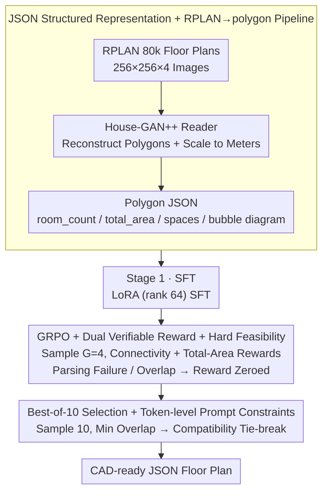

# Generative Floor Plan Design with LLMs via Reinforcement Learning with Verifiable Rewards

**Conference**: ACL 2026 Findings  
**arXiv**: [2605.14117](https://arxiv.org/abs/2605.14117)  
**Code**: <https://github.com/ludolara/floor-plan-rlvr>  
**Area**: LLM Generation / RLVR / Architectural Design  
**Keywords**: floor plan generation, JSON structured output, GRPO, verifiable rewards, bubble diagram

## TL;DR
The authors converted 80,000 real apartment floor plans from RPLAN into JSON polygon formats and conducted two-stage training (SFT + GRPO with verifiable rewards: connectivity + total-area rewards, with overlap/parsing failures hard-zeroed) using Llama-3.3-70B-Instruct. This enables the LLM to output CAD-ready floor plans that satisfy both bubble diagram topological constraints and numerical area constraints. On the 8-room task, Compatibility decreased by 94% compared to HouseDiffusion (2.5 → 0.15).

## Background & Motivation
**Background**: Architectural floor plan generation is a classic task in AI-aided design. Mainstream approaches include: ① Visual GANs (House-GAN/House-GAN++) using bubble diagrams as graph conditions to output rasterized images; ② Diffusion-based (HouseDiffusion) using 1-D polygonal loops for room representation and iterative denoising; ③ Early symbolic systems (Lopes et al.) using constraint satisfaction and manual rules.

**Limitations of Prior Work**: ① Mainstream models only accept connectivity (which rooms are adjacent) but cannot handle **numerical constraints** (e.g., a bedroom must be $12\text{ m}^2$, total area $80\text{ m}^2$); ② Visual/diffusion outputs are rasterized or scale-invariant shapes that cannot be directly fed into CAD; ③ Existing evaluations only consider Compatibility / Realism / Diversity, failing to explicitly measure "whether user-specified room areas are met" or basic geometric validity like "whether rooms overlap"; ④ Tell2Design attempted text-to-floor-plan but used image rendering for evaluation, ignored structural errors, and handled spatial relationships poorly.

**Key Challenge**: Professional architects require simultaneous control over topology (room adjacency) + geometric values (room sizes, polygon coordinates) + geometric validity (non-overlapping, closed polygons). The first two require structured text output (cannot be rasterized), and the third requires the generator to learn "geometric feasibility"—whereas default free-form LLM generation easily outputs invalid JSON or overlapping polygons.

**Goal**: ① Use JSON as a unified representation to carry both structural and numerical constraints; ② Use LLMs to learn the real distribution of RPLAN; ③ Use RL with verifiable rewards to turn "matching bubble diagram" and "matching total area" into automatically verifiable rewards, using "overlap/parsing failure = 0 reward" as a hard feasibility condition to enforce geometric validity; ④ Propose 4 new metrics (Room Area / Room ID / Overlap / % Overlap) to fill evaluation gaps.

**Key Insight**: Reframe the problem from "image generation + post-processing" to a "structured text to structured text" seq2seq task. LLMs are already adept at generating JSON, calling tools, and following schemas. Use RLVR to reward constraints that can be programmatically verified, avoiding the unverifiable trap of "using reward models to learn aesthetic preferences."

**Core Idea**: Treat floor plan generation as a dual RL task of "program synthesis + geometric verification"—using connectivity rewards + total-area rewards + hard-zeroing for overlaps + hard-zeroing for invalid JSON to let the LLM learn structured outputs that are both topologically and geometrically consistent.

## Method

### Overall Architecture
The authors fine-tune Llama-3.3-70B-Instruct in two stages. The input is JSON (containing `room_count`, `total_area`, `spaces` list, and `input_graph` bubble diagram), and the output is also JSON (each space contains `id`, `room_type`, `area`, and `floor_polygon` vertex list in meters). **Stage 1 SFT**: Supervised fine-tuning using LoRA (rank 64, $\alpha=128$, 2 epochs) on RPLAN-converted JSON floor plans to learn basic prompt-to-JSON mapping. **Stage 2 GRPO**: After merging LoRA, RL is performed using verifiable rewards. For each prompt, $G=4$ candidates are sampled, and group-relative advantage is calculated based on the average score of connectivity reward + total-area reward. **Inference**: Best-of-10 selection, choosing the final output based on "minimum overlap area → tie-break with Compatibility."

### Key Designs

**1. JSON Structured Representation + RPLAN→polygon Pipeline: Reframing floor plan generation from "drawing" to "writing structured text"**

Mainstream approaches treat floor plans as image generation, but images cannot easily incorporate numerical constraints like "the bedroom must be $12\text{ m}^2$," nor can rasterized shapes be directly imported into CAD. The authors adopt a different representation: each space (room or door) is a JSON object containing `id`, `room_type`, `area` ($m^2$), and `floor_polygon` (vertex list in absolute coordinates). The input includes `room_count`, `total_area`, and the `input_graph` adjacency list. Since original RPLAN data consists of $256\times256\times4$ images, the authors developed a custom converter to translate them into polygon JSON—leveraging the House-GAN++ reader to extract boundaries, reconstruct polygons, scale from pixels to meters, and derive bubble diagrams from door connectivity. JSON is chosen because it satisfies four requirements: unambiguous parsing of numerical constraints, enforced schema consistency, natural expression of floor plan hierarchies, and direct CAD compatibility. More importantly, structured text is the "home turf" of LLMs, and verifiers can directly parse it to assign scores.

**2. GRPO + Dual Verifiable Reward + Hard Feasibility: Aligning constraints with programmatically verifiable rewards and a hard gate for geometric violations**

SFT only learns to "look like RPLAN"; further alignment is needed to ensure topology and area accuracy. The authors use GRPO: for each prompt $x$, $G=4$ candidates are sampled to calculate the group-relative advantage:

$$\hat{A}_i=\frac{R(x,y_i)-\mu_x}{\sigma_x+\epsilon},$$

optimizing a PPO-style objective $L^{\text{GRPO}}(\theta)=\mathbb{E}_x\big[\tfrac{1}{G}\sum_i \tfrac{\pi_\theta(y_i|x)}{\pi_{\theta_{\text{old}}}(y_i|x)}\hat{A}_i\big]$ without a critic network. Rewards are the average of two terms: Connectivity reward $r_{\text{conn}}\in[0,1]$, which validates the generated adjacency graph against the input bubble diagram, and Total-area reward $r_{\text{TA}}=\max(0,\,1-\text{TAE})$, where $\text{TAE}=|A(y)-A^\star|/A^\star$ is the relative error of the total area. A crucial feature is **hard feasibility**: if JSON parsing fails or any two room polygons overlap, the reward is zeroed rather than softly penalized. This design works because connectivity and area are automatically verifiable, falling within the ideal scope of RLVR, while geometric validity is better enforced as a binary kill switch.

**3. Best-of-10 Selection + Token-level Prompt Restrictions: Using verifiable standards at inference to ensure legal outputs**

Even after training, single-sample outputs occasionally overlap (Overlap is 0.26 for best-of-1 on the 8-room task). During inference, the authors sample 10 candidates (temperature 0.7, top-p 0.9) and select the final output using "minimum overlap area" as the primary criterion and "Compatibility" as the tie-breaker. Concurrently, hard instructions are placed in the system message (e.g., "Your top priority is that no two room polygons ever overlap"). This effectively trades inference compute for constraint adherence. Since the training rewards and inference selection use the same "verifiable" yardstick, the logic remains symmetric and self-consistent.

### Loss & Training
SFT uses standard NLL: $L^{\text{SFT}}(\theta)=\mathbb{E}_{(x,y)\sim\mathcal{D}}[-\sum_t \log \pi_\theta(y_t|y_{<t},x)]$ with LoRA rank 64, lr 1e-4, and 2 epochs. GRPO uses AdamW, lr 1e-6, clip 0.2, KL coefficient 0.04, temperature 0.9, top-p 1.0, and 4096 tokens for prompt+completion. $G=4$ generations per prompt. The authors noted that the optimal checkpoint usually occurs at step 100 (~2h wall-clock time), meaning the GRPO stage is shorter than SFT. The 80,788 RPLAN floor plans were partitioned by room count (5/6/7/8) for cross-room-count generalization testing.

## Key Experimental Results

### Main Results (vs. HouseDiffusion and other SOTAs)

| Method | Comp(5)↓ | Comp(6)↓ | Comp(7)↓ | Comp(8)↓ | Realism↑ (8) | Div(8)↓ |
|------|----------|----------|----------|----------|--------------|---------|
| Johnson et al. 2018 | 7.7 | 6.5 | 10.2 | 11.3 | -1.00 | 186.0 |
| House-GAN | 2.5 | 2.4 | 3.2 | 5.3 | -0.95 | 66.4 |
| House-GAN++ | 1.9 | 2.2 | 2.4 | 3.9 | -0.52 | 32.9 |
| HouseDiffusion | 1.5 | 1.2 | 1.7 | 2.5 | -0.19 | 9.5 |
| **Ours (SFT+RLVR best-of-10)** | **0.01** | **0.02** | **0.10** | **0.15** | **0.03** | **7.0** |
| Gain vs. HouseDiffusion | -99.3% | -98.3% | -94.1% | **-94.0%** | +0.22 | -26.3% |

Key Observation: In the 8-room task, Compatibility dropped from HouseDiffusion's 2.5 to 0.15 (-94%). Realism is 0.03 (near 0, implying generated plans are nearly indistinguishable from real ones for volunteers), and Diversity (FID) is the lowest among all methods.

### Ablation Study (Training Stages + Inference Budget)

| Configuration | 8 Room Area↓ | Room ID↑ | Overlap↓ | % Overlap↓ | Compatibility↓ |
|------|------------------|----------|----------|------------|----------------|
| Few-shot (3-shot, best-of-10) | 0.12 | 0.91 | 0.51 | 0.04 | 6.89 |
| SFT only (best-of-10) | 0.08 | **1.00** | 0.37 | 0.01 | 0.41 |
| **SFT + RLVR (best-of-10)** | 0.10 | **1.00** | **0.13** | **0.00** | **0.15** |
| SFT + RLVR (best-of-1) | **0.09** | 1.00 | 0.26 | 0.01 | 1.89 |
| SFT + RLVR (best-of-100) | 0.09 | 1.00 | 0.10 | 0.00 | **0.02** |

On average (5-8 rooms), RLVR reduced Overlap by 65% and Compatibility by 56% compared to SFT alone, without degrading Room Area or Room ID performance.

### Key Findings
- **Structured text generation + RLVR paradigm completely outperforms visual/diffusion SOTA in professional design tasks**: Compatibility dropped by an order of magnitude (HouseDiffusion 2.5 → 0.15), while geometric validity (Overlap 0.13), area accuracy (Room Area 10%), and label accuracy (Room ID 1.00) all passed benchmarks, proving that LLM structured generation capabilities have been long undervalued in this field.
- **Hard feasibility is the key to preventing reward hacking in RLVR**: When using only connectivity rewards, the model attempted to game the system by shrinking rooms to needle-points; adding total area and overlap=0 hard floors successfully blocked reward hacking.
- **70B models are necessary, 8B is insufficient**: Llama-3.1-8B-Instruct failed even with high-rank LoRA, falling into repetitive loops or invalid geometry; switching to Llama-3.3-70B provided stability.
- **Few-shot GPT-4o / o3 / QwQ-32B perform poorly**: Even the strongest proprietary models failed at few-shot generation—producing non-closed polygons, self-intersections, and numerical drift—implying professional structured output tasks require SFT.
- **JSON is more reliable than natural language, but models can handle both**: Replacing JSON inputs with natural language templates resulted in nearly identical Room Area/ID/Overlap, though Compatibility rose slightly (0.15 → 0.37) due to linguistic ambiguity.

## Highlights & Insights
- **Dual RL of "program synthesis + geometric verification" is an ideal blueprint for verifiable rewards**: It aligns with RLVR in math/code but extends the paradigm to 2D geometry/architecture. Any task with programmatically verifiable constraints—such as PCB layout, circuit routing, or UI mockup generation—can adopt this template.
- **Hybrid of Hard Feasibility + Soft Rewards**: Converting "must-have" constraints (non-overlap, valid JSON) into binary kill switches while keeping "optimization goals" (connectivity/area) as continuous rewards is more stable than merging all constraints into a single reward.
- **RLVR is significantly shorter than SFT**: The optimal GRPO checkpoint was reached much faster (~2h) than the 2-epoch SFT, suggesting that a small amount of RL can effectively "lock in" and refine the capabilities learned during SFT.
- **New Constraint-Compliance Evaluation System**: The four direct, verifiable metrics (Room Area / Room ID / Overlap / % Overlap) address blind spots in traditional Compatibility/Realism/Diversity metrics.

## Limitations & Future Work
- Only automatically verifiable constraints (connectivity/area/overlap) are modeled; professional architectural needs like circulation, egress, daylight, and structural code are not yet integrated.
- Limited to the RPLAN dataset and Asian single-story residential layouts; generalization to commercial buildings, multi-story structures, or Western layouts is unknown.
- Inference requires best-of-10 or best-of-100 to minimize Overlap, signifying high inference costs.
- Reward weights (50/50 for connectivity and area) were chosen heuristically without extensive scanning of trade-offs.

## Related Work & Insights
- **vs. HouseDiffusion**: Their 1-D polygonal loop diffusion was the prior peer-reviewed SOTA for Compatibility (2.5), but lacked numerical constraints and overlap management; this work improves on it by an order of magnitude (0.15).
- **vs. Tell2Design**: Similar text-to-floor-plan approach, but they evaluated via image rendering, ignoring structural errors; this work evaluates directly from JSON to maintain geometric precision.
- **vs. RLVR in Math/Code**: This work proves the RLVR paradigm can generalize to geometry and architectural design by expanding verifier types from code execution results to geometric intersection tests.

## Rating
- **Novelty**: ⭐⭐⭐⭐ First successful implementation of JSON representation + RLVR + hard feasibility for floor plan generation.
- **Experimental Thoroughness**: ⭐⭐⭐⭐ 5 baselines + 4 room-count tasks + 4 new metrics + inference budget scaling + human evaluation with 40 volunteers.
- **Writing Quality**: ⭐⭐⭐⭐⭐ Clear methodology, honest limitations, and a "Behind-the-Scenes" section sharing failed engineering attempts.
- **Value**: ⭐⭐⭐⭐⭐ Provides a template for structured text generation + verifiable RL in professional domains (PCB, UI design, etc.).

<!-- RELATED:START -->

## Related Papers

- [\[ACL 2026\] Generative Interfaces for Language Models](generative_interfaces_for_language_models.md)
- [\[ACL 2026\] Solver-Independent Automated Problem Formulation via LLMs for High-Cost Simulation-Driven Design](solver-independent_automated_problem_formulation_via_llms_for_high-cost_simulati.md)
- [\[ICML 2026\] T$^2$PO: Uncertainty-Guided Exploration Control for Stable Multi-Turn Agentic Reinforcement Learning](../../ICML2026/llm_nlp/t2po_uncertainty-guided_exploration_control_for_stable_multi-turn_agentic_reinfo.md)
- [\[NeurIPS 2025\] Preference-based Reinforcement Learning beyond Pairwise Comparisons: Benefits of Multiple Options](../../NeurIPS2025/llm_nlp/preference-based_reinforcement_learning_beyond_pairwise_comparisons_benefits_of_.md)
- [\[ICLR 2026\] Rethinking Code Similarity for Automated Algorithm Design with LLMs](../../ICLR2026/llm_nlp/rethinking_code_similarity_for_automated_algorithm_design_with_llms.md)

<!-- RELATED:END -->
