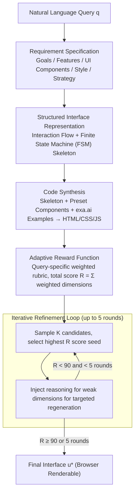

# Generative Interfaces for Language Models

**Conference**: ACL 2026 Findings  
**arXiv**: [2508.19227](https://arxiv.org/abs/2508.19227)  
**Code**: https://github.com/SALT-NLP/GenUI  
**Area**: LLM Interaction / Human-Computer Interaction / UI Generation  
**Keywords**: Generative UI, Adaptive UI, Finite State Machine, Iterative Refinement, Adaptive Reward

## TL;DR
This paper proposes **Generative Interfaces (GenUI)**, which enables LLMs to move beyond single-box chat responses by generating interactive Web interfaces tailored to specific queries. Using a structured intermediate representation of "interaction flow graphs + finite state machines" and "adaptive reward-driven iterative refinement," GenUI achieves an **84%** overall preference win rate against Claude 3.7's chat UI across 100 UIX prompts.

## Background & Motivation

**Background**: The current dominant LLM application paradigm remains *Conversational UI* (ConvUI)—regardless of task complexity, outputs are constrained within a linear chat box as long blocks of text. Tools like OpenAI Canvas and Claude Artifacts separate code or documents into side windows, but the UI components remain preset and static.

**Limitations of Prior Work**: In multi-turn, information-dense, or exploratory tasks (e.g., "help me understand neural networks," "how to practice piano efficiently"), pure text outputs lead to high cognitive load and a lack of actionable interactions (e.g., schematic animations, instant feedback, modular navigation). Users must repeatedly prompt to approximate the "tool" they actually need.

**Key Challenge**: While LLMs can synthesize entire web pages (e.g., Design2Code, Sketch2Code), the *interaction paradigm* between LLMs and users remains stuck in "textual dialogue." There is a fundamental asymmetry between strong generation capabilities and weak interaction forms.

**Goal**: This work addresses two sub-problems: (I) How to generate a *functionally correct, interactive* interface for each query "on-demand" (infrastructure); (II) How to *systematically evaluate* whether generated interfaces truly improve user experience (evaluation protocol).

**Key Insight**: The authors argue that direct LLM output of HTML/JS code has an excessively large search space and poor controllability. Instead, an *interface-oriented structured intermediate representation* should be introduced—interaction flow graphs to characterize "user paths" and Finite State Machines (FSM) to characterize "component responses." The LLM fills this structured skeleton, followed by multi-round refinement using task-adaptive reward functions.

**Core Idea**: Upgrade "generating answers" to "generating interfaces"—using "interaction flow + FSM" as scaffolding and "query-specific rubrics" as rewards, an online generate→evaluate→regenerate loop is performed to evolve the UI for each specific query.

## Method

### Overall Architecture

GenUI redefines "generating an answer for a query" as "online generation of an interactive interface": the input is a natural language query $q$, and the output is an HTML/CSS/JS interface $u^*$ renderable in a browser. The inference pipeline consists of five LLM calls: translating $q$ into a structured requirement specification (goals, features, components, style, strategy); generating a two-layer skeleton (Interaction Flow + FSM); synthesizing executable code using the skeleton, preset component libraries, and UI examples retrieved via exa.ai; and finally, constructing a weighted rubric as a reward to drive a 5-round generate→evaluate→regenerate loop. The system is implemented on the OpenCanvas framework using Claude 3.7 as the backbone without any weight updates.

### Key Designs

**1. Structured Interface Representation: Interaction Flow + FSM as Scaffolding**

Directly generating interactive interfaces end-to-end often results in "dead" UIs—buttons that don't respond or modals that won't close—due to missing states or events. GenUI establishes two explicit layers of scaffolding before code synthesis: a high-level *Interaction Flow* defined as a directed graph $\mathcal{G}=(\mathcal{V},\mathcal{T})$, where nodes $\mathcal{V}$ are UI views or sub-goals and edges $\mathcal{T}$ are transitions triggered by navigation; and a low-level *Finite State Machine* $\mathcal{M}=(\mathcal{S},\mathcal{E},\delta,s_0)$ for each component, where $\mathcal{S}$ represents atomic states (e.g., `isModalOpen=true`), $\mathcal{E}$ represents user events, and $\delta:\mathcal{S}\times\mathcal{E}\to\mathcal{S}$ defines state transitions. This interface-level CoT significantly improves interaction correctness and interpretability.

**2. Adaptive Reward Function: Query-Specific Rubrics**

Traditional UI heuristics (usability, information organization) fail to distinguish the interactive needs of "understanding quantum physics" from "checking the weather." GenUI uses an LLM to generate a set of evaluation dimensions for the current query, each containing `name / description / criteria / weight`. The final score is $R(u)=\sum_i w_i\cdot s_i(u)$. For a quantum physics query, the rubric might include "Interactive models effectively demonstrate wave-particle duality." This task-conditional reward modeling provides "intent-aligned" signals rather than generic aesthetic ones.

**3. Iterative Refinement: Polishing from Coarse to Fine**

One-shot UI generation often suffers from crowded layouts or lack of onboarding. GenUI performs reward-guided best-of-N during inference: at round $t$, it samples $K$ candidates $\{u^t_k\}$, selects $u^t_*=\arg\max_k R(u^t_k)$, and feeds this seed along with reasoning for its weaknesses into round $t+1$. Ablations show that iterative refinement improves win rates by +14% overall, with continuous score improvements in rounds 2 and 3.

## Key Experimental Results

### Main Results
The evaluation protocol involved 100 UIX prompts across 10 domains. 428 Prolific US users performed pairwise comparisons (majority vote of three), achieving Fleiss' $\kappa = 0.525$.

| Comparison | Dimension | GenUI Win | Tie | Opponent Win |
|------|------|---------|----|--------|
| GenUI vs ConvUI (Claude 3.7) | Overall | **84%** | 4% | 12% |
| GenUI vs ConvUI (Claude 3.7) | ASA (Aesthetics) | 89% | 8% | 3% |
| GenUI vs ConvUI (Claude 3.7) | IES (Satisfaction) | 87% | 7% | 6% |
| GenUI vs ConvUI (GPT-4o) | Overall | **69%** | 1% | 30% |
| GenUI vs IUI (Claude 3.7 + Artifact) | Overall | **75%** | 8% | 17% |

LLM-as-judge scores indicate that GenUI improves Usability relative to ConvUI (Claude) from 34.7 to 87.0 (+151%) and Task Efficiency from 47.6 to 84.2 (+77%).

### Ablation Study

| Configuration | Representation | Generation | Reward | Overall Loss vs Full |
|------|------|------|--------|----------------------|
| Full GenUI | Structured | Iterative | Adaptive | — |
| w/o Adaptive Reward | Structured | Iterative | Static | 54% |
| w/o Iterative | Structured | One-shot | Static | 78% |
| w/o Structured | Natural Lang. | One-shot | Static | 82% |

### Key Findings
- **Aesthetics and Satisfaction are Primary Drivers**: The largest gains over ConvUI were in ASA (+86%) and Usability (+151%), suggesting GenUI wins primarily by "looking like a tool" rather than just organizing text.
- **Significant Domain Variance**: GenUI excels in Data Analysis & Visualization (93.8% win rate) but is less dominant in Advanced AI/ML (50%), where text-heavy explanations remain crucial.
- **Rubric Quality Over Iteration Quantity**: Replacing adaptive rewards with static ones results in a larger performance drop (−17%) than replacing iterative refinement with one-shot generation (−14%).
- **Real-world Generalization**: In a study of 380 user-reported queries, GenUI achieved a 50.8% win rate vs 41.1% loss, with 30.3% of users showing strong preference for GenUI.

## Highlights & Insights
- **Paradigm Shift**: Upgrading "generating answers" to "generating interfaces" is a significant redefinition of LLM application forms, introducing new evaluation axes (Functional/Interactive/Emotional).
- **Value of Structured IR**: Using Interaction Flow as interface-level CoT and FSM as component-level constraints is a paradigm transferable to Agent UI, educational tools, and other "constrained semantic" code generation tasks.
- **Task-Conditional Reward Modeling**: Generating rubrics on-the-fly provides high-quality signals for inference-time selection without the costs of RLHF training.
- **"Professionalism" through Presentation**: 86.5% of users selected GenUI as more "credible/professional" even when content was similar, proving that layout significantly impacts trust in LLM outputs.

## Limitations & Future Work
- **Frontend Only**: No backend logic support; struggles with long-tail tasks requiring persistent data or complex server-side flows.
- **Significant Latency**: 5 rounds of iteration and multi-candidate sampling take several minutes, making it unsuitable for real-time chat.
- **Lack of Triggering Logic**: The system currently generates a UI for every query (e.g., "weather in NY" may not need a full GUI). A router/classifier is needed.
- **Accessibility**: Graphical interfaces are often less friendly to screen readers than pure text.
- **Evaluation Bias**: Agreement with human raters is 69%, suggesting potential LLM-as-judge biases toward visual complexity.

## Related Work & Insights
- **vs Claude Artifacts**: Artifacts provide fixed windows for content; GenUI dynamically generates the *entire UI structure*.
- **vs Design2Code / WebSight**: These focus on vision-to-code (screenshot to HTML); GenUI maps *natural language intent* to code without UI sketches.
- **vs Graphologue**: Graphologue post-processes responses into graphs; GenUI generates an interactive tool end-to-end.

## Rating
- Novelty: ⭐⭐⭐⭐⭐ 
- Experimental Thoroughness: ⭐⭐⭐⭐ 
- Writing Quality: ⭐⭐⭐⭐⭐ 
- Value: ⭐⭐⭐⭐⭐ 

<!-- RELATED:START -->

## Related Papers

- [\[ACL 2026\] Generative Floor Plan Design with LLMs via Reinforcement Learning with Verifiable Rewards](generative_floor_plan_design_with_llms_via_reinforcement_learning_with_verifiabl.md)
- [\[ACL 2025\] MExGen: Multi-Level Explanations for Generative Language Models](../../ACL2025/llm_nlp/mexgen_multi_level_explanations.md)
- [\[ACL 2025\] Generative Psycho-Lexical Approach for Constructing Value Systems in Large Language Models](../../ACL2025/llm_nlp/generative_psycholexical_approach_for_constructing_value.md)
- [\[ICLR 2026\] ConflictScope: Generative Value Conflicts Reveal LLM Priorities](../../ICLR2026/llm_nlp/quamo_quaternion_motions_for_vision-based_3d_human_kinematics_capture.md)
- [\[ICML 2025\] Generative Social Choice: The Next Generation](../../ICML2025/llm_nlp/generative_social_choice_the_next_generation.md)

<!-- RELATED:END -->
