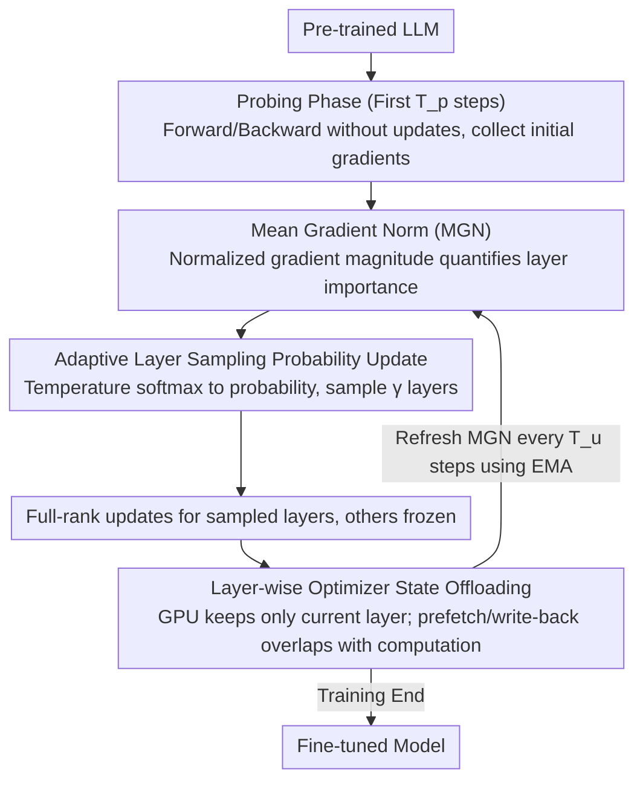

# GRASS: Gradient-based Adaptive Layer-wise Importance Sampling for Memory-Efficient LLM Fine-tuning

**Conference**: ACL 2026 Findings  
**arXiv**: [2604.07808](https://arxiv.org/abs/2604.07808)  
**Area**: LLM/NLP  
**Keywords**: Layer sampling, Gradient importance, Memory-efficient fine-tuning, Optimizer state offloading, Adaptive training

## TL;DR

Ours proposes the GRASS framework, which utilizes Mean Gradient Norm (MGN) as a task-aware and training-phase-aware metric for layer importance. It adaptively samples and updates subsets of model layers for fine-tuning, combined with a layer-wise optimizer state offloading mechanism. This approach achieves an average accuracy improvement of up to 4.38 points while reducing memory usage by up to 19.97%.

## Background & Motivation

**Background**: Full Parameter Fine-tuning (FFT) of LLMs provides the best performance for downstream task adaptation, but GPU memory requirements become a bottleneck as model scales increase. Parameter-Efficient Fine-Tuning (PEFT) methods like LoRA reduce memory by updating only a small number of parameters, making them the most popular compromise.

**Limitations of Prior Work**: Although efficient, low-rank methods like LoRA restrict model expressiveness, leading to performance that is inevitably lower than FFT. Layer-wise fine-tuning methods (e.g., LISA) provide another path—activating only a portion of layers for full-parameter updates at each step, thereby avoiding low-rank constraints. However, LISA employs a static uniform sampling strategy for layer selection, implicitly assuming constant importance across layers, which contradicts practical observations. For instance, LISA performs 4.4% worse than FFT on GSM8K and 8.9% worse on SingleEq.

**Key Challenge**: Layer-wise fine-tuning faces the dynamic nature of layer importance—different tasks require updates to different layers, and the critical layers shift during different training phases. Static selection strategies fail to capture this dynamics.

**Goal**: To design an adaptive layer sampling strategy capable of sensing both the task and the training phase, maintaining the memory advantages of layer-wise fine-tuning while approaching or even exceeding FFT performance.

**Key Insight**: Gradients directly encode the sensitivity of the loss to parameter updates. Under a first-order Taylor approximation, layers with larger gradient norms contribute more to the training objective after an update. Therefore, gradient statistics are a natural indicator of real-time layer importance.

**Core Idea**: Use Mean Gradient Norm (MGN) to dynamically quantify the contribution of each layer to loss reduction, convert this into sampling probabilities via softmax with periodic updates, and adaptively select the most important layers for fine-tuning.

## Method

### Overall Architecture

Under the framework of layer-wise fine-tuning, GRASS replaces static uniform sampling with adaptive sampling driven by real-time gradient signals. Training is divided into two phases: first, a "probing" phase for the initial $T_p$ steps—performing forward and backward passes as usual without updating parameters to collect initial gradient statistics; then, the adaptive fine-tuning phase begins. In each step, $\gamma$ layers are sampled for full-parameter updates based on layer importance probabilities while other layers remain frozen. These probabilities are recalculated every $T_u$ steps to track the dynamics of critical layers across tasks and stages. Concurrently, a layer-wise optimizer state offloading mechanism keeps only the states of the layers currently being updated on the GPU, compressing memory usage to levels comparable to LoRA.

### Key Designs

**1. Mean Gradient Norm (MGN): Quantifying Layer Importance**

LISA uses uniform sampling, OWS uses weight norms, and IST uses response suppression with reinforcement learning. These metrics are either static or heuristic and do not reflect which layer needs updating most at the current optimization step. GRASS appeals directly to gradients—under a first-order Taylor approximation, layers with larger gradient norms contribute more to loss reduction. Specifically, for each layer $l$, normalized gradient magnitudes are aggregated over $T$ steps: $m_l(T) = \frac{1}{T}\sum_{t=1}^T \sqrt{\frac{1}{N_p^{(l)}} \|g_t^{(l)}\|_2^2}$, where dividing by the parameter count $N_p^{(l)}$ ensures comparability across layers of different sizes.

This indicator is inherently task-aware and stage-aware: experiments show that TinyLlama exhibits significant differences in normalized MGN distributions between arithmetic and common-sense reasoning. For example, the 20th layer is crucial for common-sense reasoning but not for arithmetic—a difference static strategies cannot capture.

**2. Adaptive Layer Sampling Probability Update: Evolving Selection Strategy**

Using only the initial MGN from the probing phase (i.e., "Static GRASS") leads to sub-optimal selection as the importance distribution shifts during training. GRASS refreshes the strategy every $T_u$ steps: current MGNs are converted into sampling probabilities via temperature-controlled softmax $p^{(l)} = \frac{\exp(m_l/\tau)}{\sum_i \exp(m_i/\tau)}$, from which $\gamma$ layers are sampled. During updates, the MGN of sampled layers is updated using an Exponential Moving Average (EMA), $m_l(T) = \alpha m_l(T_u) + (1-\alpha)m_l(T-T_u)$, while frozen layers retain their previous MGN.

The temperature $\tau$ controls the exploration-exploitation balance of sampling, while EMA ensures smooth transitions in importance estimation under noisy gradients, preventing single-step fluctuations from biasing the strategy.

**3. Layer-wise Optimizer State Offloading (Overlapped Offloading): Pushing Memory to the Limit**

All trainable layers in layer-wise fine-tuning must store optimizer states; keeping them all on the GPU exhausts memory, while storing them all on the CPU introduces latency. GRASS keeps only the optimizer state of the currently updated layer on the GPU, storing others on the CPU. Crucially, it overlaps communication with computation: while updating layer $i$, it asynchronously prefetches the state for layer $i+1$ (HtoD) and writes back the state for layer $i-1$ (DtoH), hiding PCIe latency.

This engineering design reduces the memory overhead introduced by layer-wise fine-tuning from 1.63GB to 0.14GB, serving as a direct benefit of the synergy between algorithm selection and system offloading.

### Loss & Training

GRASS does not change the original training loss; it only modifies which layers participate in gradient computation and parameter updates. Frozen layers participate in the forward pass but do not generate gradients, while sampled layers undergo full-parameter (full-rank) updates. The probing phase skips parameter updates and optimizer management, keeping extra overhead controllable.

## Key Experimental Results

### Main Results

Accuracy comparison on arithmetic reasoning tasks (Average across six benchmarks):

| Model | Method | MultiArith | GSM8K | SingleEq | Average |
|------|------|-----------|-------|----------|------|
| TinyLlama | FFT | 64.17 | 15.16 | 42.92 | 33.48 |
| TinyLlama | LoRA r=128 | 61.17 | 15.16 | 38.19 | 29.84 |
| TinyLlama | LISA | 65.00 | 17.74 | 43.11 | 33.63 |
| TinyLlama | **GRASS** | **68.00** | 17.13 | 42.52 | **34.22** |
| Gemma-2B | FFT | 86.67 | 42.53 | 80.12 | 60.16 |
| Gemma-2B | LISA | 90.17 | 40.18 | 75.00 | 56.46 |
| Gemma-2B | **GRASS** | **93.50** | **43.06** | 78.35 | **60.65** |

### Ablation Study

| Configuration | Key Metric | Description |
|------|---------|------|
| GRASS (Full) | 34.22 (TinyLlama avg) | Complete adaptive framework |
| Static GRASS | Decrease in some tasks | Uses initial MGN only, no probability updates |
| w/o Offloading | +1.49GB VRAM | All optimizer states kept on GPU |
| FFT vs GRASS VRAM | 51.3GB vs 19.1GB | 62.8% reduction for LLaMA2-7B |

### Key Findings
- GRASS even exceeds FFT performance on TinyLlama and Gemma-2B, suggesting that adaptive layer selection may provide an implicit regularization effect.
- Compared to LoRA r=128, GRASS improves accuracy by 4.38 points on TinyLlama (34.22 vs 29.84).
- LISA's performance fluctuates significantly across tasks, whereas GRASS is more stable.
- In long-sequence scenarios (1792 tokens), LoRA/DoRA exceed the 24GB VRAM limit, while GRASS stays within 23.25GB.
- On common-sense reasoning tasks, GRASS consistently outperforms other PEFT methods, demonstrating strong cross-task generalization.

## Highlights & Insights
- **Gradient Norm as an Importance Signal**: Compared to static metrics like weight norms, gradient norms directly reflect the needs of the current training objective, providing clear theoretical intuition and experimental effectiveness. This could be transferrable to mixed-precision training or layer selection in distillation.
- **Unexpectedly Surpassing FFT**: Selective updates may introduce regularization effects, echoing theories from dropout and model pruning, implying that not all layers need to be updated at all times.
- **Engineering Value of Overlapped I/O**: The combination of layer-wise offloading and overlapped transmission compresses optimizer state memory growth from 1.63GB to 0.14GB, showcasing the efficacy of co-designing algorithms and system optimizations.

## Limitations & Future Work
- Experiments were only validated on 1B-7B scale models; for LLaMA2-7B, GRASS was slightly behind FFT, and its performance on larger models remains unknown.
- The framework involves several hyperparameters (gamma, Tp, Tu, Ts, tau, alpha), and tuning costs might offset some convenience.
- Experiments were conducted on a single GPU; adaptation for multi-card distributed training has not been discussed.
- No direct comparison provided with recent memory-efficient methods like GaLore or quantized fine-tuning.

## Related Work & Insights
- **vs LISA**: LISA uses uniform static sampling, which can degrade severely on certain tasks. GRASS improves performance across the board through adaptive sampling.
- **vs LoRA/DoRA**: LoRA is restricted by low-rank parameterization; GRASS maintains full-rank updates while reducing memory via layer selection.
- **vs LIFT**: LIFT follows a fixed forward-to-backward update order and lacks layer importance judgment; GRASS's gradient-driven selection is more targeted.

## Rating
- Novelty: ⭐⭐⭐⭐ The idea of using gradient norms for layer sampling weights is intuitive and effective when combined with adaptive updates and offloading.
- Experimental Thoroughness: ⭐⭐⭐⭐ Covers three model scales and two major task categories with thorough ablations, though lacking comparison on very large models.
- Writing Quality: ⭐⭐⭐⭐ Clear presentation with a logical chain from motivation to methodology.
- Value: ⭐⭐⭐⭐ Provides a practical and general adaptive framework for layer-wise fine-tuning, significant for memory-constrained scenarios.

<!-- RELATED:START -->

## Related Papers

- [\[ACL 2026\] Synthetic Eggs in Many Baskets: The Impact of Synthetic Data Diversity on LLM Fine-Tuning](synthetic_eggs_in_many_baskets_the_impact_of_synthetic_data_diversity_on_llm_fin.md)
- [\[ACL 2025\] A Semantic-Aware Layer-Freezing Approach to Computation-Efficient Fine-Tuning of Language Models](../../ACL2025/llm_nlp/a_semantic-aware_layer-freezing_approach_to_computation-efficient_fine-tuning_of.md)
- [\[ACL 2025\] GORP: Continual Gradient Low-Rank Projection Fine-Tuning for LLMs](../../ACL2025/llm_nlp/gorp_continual_gradient_projection.md)
- [\[ACL 2025\] Efficient Ensemble for Fine-tuning Language Models on Multiple Datasets](../../ACL2025/llm_nlp/efficient_ensemble_for_fine-tuning_language_models_on_multiple_datasets.md)
- [\[NeurIPS 2025\] Synergy over Discrepancy: A Partition-Based Approach to Multi-Domain LLM Fine-Tuning](../../NeurIPS2025/llm_nlp/synergy_over_discrepancy_a_partition-based_approach_to_multi-domain_llm_fine-tun.md)

<!-- RELATED:END -->
