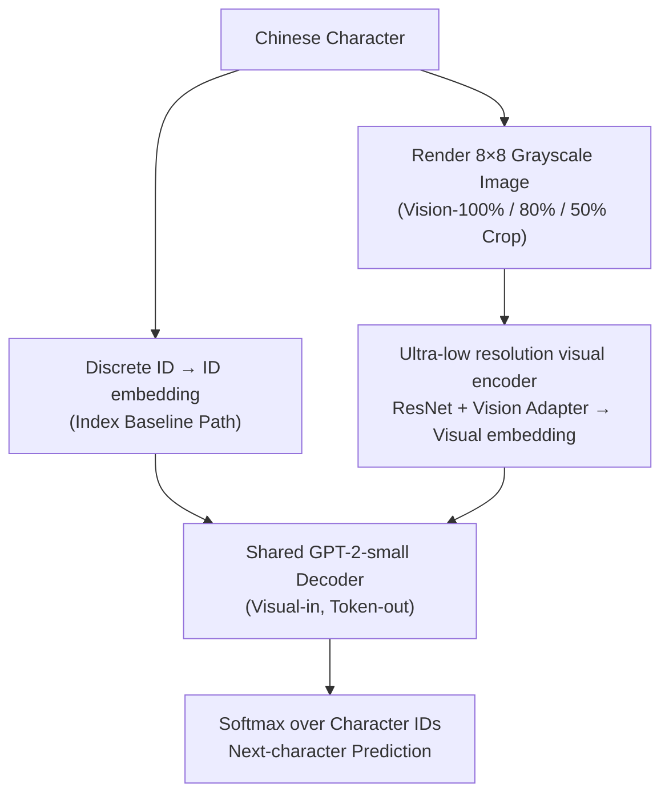

# Hot-Start from Pixels: Low-Resolution Visual Tokens for Chinese Language Modeling

**Conference**: ACL 2026  
**arXiv**: [2601.09566](https://arxiv.org/abs/2601.09566)  
**Code**: TBD  
**Area**: NLP / Chinese Language Modeling / Visual Representation  
**Keywords**: pixel-based LM, Chinese characters, hot-start, low-resolution, visual tokens

## TL;DR
By rendering Chinese characters into $8\times 8$ grayscale images and feeding them into a GPT-2 style decoder for next-character prediction, this work achieves final accuracy (39.21%) comparable to index-based baselines (39.10%). Crucially, it doubles the baseline accuracy in early training (at 0.4% data), demonstrating that "visual structure" serves as a natural hot-start prior for Chinese character modeling.

## Background & Motivation

**Background**: Mainstream Chinese LMs treat characters as discrete token IDs (e.g., Chinese versions of GPT/BERT). Previous glyph-augmented works (Glyce, ChineseBERT) integrate glyph features **as auxiliary information** into token embeddings; pixel-based LMs like PIXEL perform MLM directly on rendered text but target pixel-to-pixel reconstruction.

**Limitations of Prior Work**:
- Index-based representations strip characters like "shan" (mountain) into abstract IDs, losing visual information (shape and structure) that is inherently meaningful to humans.
- Chinese is logographic; character forms encode semantic and phonetic information. Discrete IDs converge slowly when data is scarce.
- Existing glyph-augmented methods treat glyphs as side info without controlled experiments on "complete replacement of token IDs."

**Key Challenge**: Should the representation be token IDs or pixels? While both achieve similar final accuracy, the **training dynamics** might differ significantly—visual representations naturally possess geometric structure in the embedding space, potentially providing a structural prior for early training.

**Goal**: To completely replace character indices with pixels and systematically answer four research questions: (RQ1) Is visual information sufficient? (RQ2) How are the early learning dynamics? (RQ3) How low can the resolution be? (RQ4) Can it function under partial occlusion?

**Key Insight**: Conduct a clean "visual-in, token-out" controlled experiment using the same GPT-2-small decoder, with the input path preceded by a ResNet+Adapter processing grayscale images ranging from $4\times 4$ to $96\times 96$.

**Core Idea**: Visual structure itself is a ready-to-use prior. A **minimum resolution of $8\times 8$** is sufficient to match the index-based baseline and creates a "hot-start" effect during early training.

## Method

### Overall Architecture

This study employs a clean "visual-in, token-out" controlled experiment. Two pipelines share the same GPT-2-small (117M parameters, 12 layers, 768 dimensions) decoder, differing only in the character representation at the input. The Index path follows the traditional route: Character → Discrete ID → Embedding → Decoder. The Visual path renders each character as a grayscale image (default $8\times 8$, 10% margin) → ResNet encoder → Vision Adapter → mapping into the decoder's embedding space. Since both outputs are identical—performing standard next-character prediction on character IDs—metrics like accuracy and perplexity are directly comparable, allowing the effects of "changing representation" to be cleanly attributed.

The training objective is next-character cross-entropy:

$$\mathcal{L}_{CE} = -\frac{1}{N}\sum_{i=1}^N \sum_{t=1}^T \log P(c_{t+1}^{(i)}|I_1^{(i)}, \dots, I_t^{(i)})$$

(Inline as $\mathcal{L}_{CE} = -\frac{1}{N}\sum_i \sum_t \log P(c_{t+1}|I_{\le t})$.)

### Key Designs

**1. Learnable visual encoder for ultra-low resolution: Proving visual representation does not rely on parameter bloat**

Original ResNet is designed for $64\times 64$ images and is severely over-parameterized for $8\times 8$ character images. To ensure the validity of the conclusion that "visual representation works," the possibility that it succeeds simply due to more parameters must be excluded. The authors compare three implementations: (a) Original ResNet (26.45M parameters, +16% FLOPs); (b) A minimal encoder optimized for $8\times 8$ with a deep adapter (22.32M, +12%); (c) A minimal encoder with a simple linear adapter (12.61M, +7%).

The results show that the most streamlined version (c) uses 33.5% fewer parameters than the index baseline (18.97M) yet matches the final accuracy of larger encoders. This suggests $8\times 8$ inputs do not require large networks—over-engineering hampers efficiency. The advantage of visual representation stems from structural priors, not capacity.

**2. Vision-100% / 80% / 50% cropping: Verifying the model relies on "structure" rather than "OCR reconstruction"**

A natural skepticism is whether the model simply performs reverse OCR to convert images back to IDs. If so, occluding pixels should cause failure. The authors apply three levels of vertical cropping: Vision-80% retains only the top 80% of pixels, and Vision-50% retains the top 50%, with the rest filled as background. At $8\times 8$, the actual signal-carrying pixels occupy only $6\times 6$; Vision-80% reduces this to $6\times 5$, and Vision-50% further to $6\times 3$.

Empirically, Vision-50% maintains 38.63% accuracy (compared to 39.21% for full resolution) under heavy occlusion. This proves the model learns **distributed visual features** rather than pixel-by-pixel reconstruction—the so-called "toast-center" effect: central strokes carry most discriminative information while edge pixels are largely expendable.

**3. Visual-in, token-out paradigm: Locking the output for fair comparison**

Unlike the "pixel-in, pixel-out" approach of the PIXEL / PIXAR series, this work intentionally keeps the output as a softmax over character IDs, switching only the input from ID embeddings to visual embeddings. This ensures cross-entropy, perplexity, and accuracy are all comparable under the same scale as the index baseline. The goal is to isolate the utility of "vision as an input representation" by eliminating confounding factors at the output.

### Loss & Training

- The dataset is THUCNews (740k news articles, 12.8M character instances, cut into fixed sequences of length 128). A quadratic curriculum is used: the number of training sequences per epoch grows by $5000 + 918.37 \cdot \text{epoch} + 18.74 \cdot \text{epoch}^2$, with a fixed 5K sequence validation set.
- Optimizer: AdamW, lr $2\times 10^{-4}$ (OneCycle max $1.5\times 10^{-3}$), batch 128, weight decay 0.01, FP16, and early stopping patience of 7.
- Visual encoder + adapter + decoder are trained end-to-end; ablations found that freezing the decoder and only training the adapter performs significantly worse than joint training.
- No OCR pre-training or character ID signals are introduced, ensuring a clean "modeling language via images" setup.

## Key Experimental Results

### Main Results: Final Accuracy (RQ1 + RQ3 + RQ4)
Accuracy / PPL across resolutions and cropping levels on THUCNews:

| Mode | $4\times 4$ | $8\times 8$ | $20\times 20$ | $30\times 30$ | $80\times 80$ |
|------|-------------|-------------|---------------|---------------|---------------|
| Vision-100% | 29.70 / 85.33 | **39.21 / 46.59** | 39.16 / 45.83 | 39.14 / 48.73 | 39.03 / 49.41 |
| Vision-80% | 18.28 / 195 | 39.18 / 46.23 | 39.15 / 46.33 | 39.07 / 48.83 | 39.08 / 48.74 |
| Vision-50% | 2.10 / 2249 | **38.63 / 47.95** | 38.70 / 48.04 | 38.66 / 49.81 | 38.57 / 50.33 |
| Index-based baseline | — | — | — | — | **39.10 / 47.58** |

Key Observation: $8\times 8$ nearly matches the accuracy of $80\times 80$; Vision-50% drops less than 0.6 points despite severe occlusion.

### Ablation Study: Hot-Start and Efficiency (RQ2)

| Training Samples | Index baseline | $8\times 8$ Vision | $40\times 40$ Vision |
|------------|----------------|--------------------|---------------------|
| 4,096 | 4.30% | 4.19% (-0.11) | 13.06% (+8.76) |
| 6,152 | 4.61% | 5.57% (+0.96) | 14.7% (+10.09) |
| 8,200 | 5.84% | **12.34%** (+6.5) | 15.46% (+9.62) |
| 10,248 | 8.45% | 13.94% (+5.49) | 15.92% (+7.47) |

Efficiency analysis (zhwp + RTX 5090 Laptop GPU):

| Config | Params | FLOPs | samples/sec | Acc@8k | Final Acc |
|------|--------|-------|-------------|--------|-----------|
| Text (index) | 18.97M | 26.30G | 347.3 | 5.30% | 39.10% |
| Vision-100% (orig.) | 26.45M | 30.61G (+16%) | 314.3 | 8.88% | 39.21% |
| Vision-100% (opt.) | 22.32M | 29.56G (+12%) | 306.9 | 8.75% | 39.18% |
| **Vision-100% (simp.)** | **12.61M** | 28.14G (+7%) | 323.4 | 6.97% | 39.19% |

### Key Findings
- **Hot-start effect is real**: The $8\times 8$ visual model reaches 12.34% at 8.2k samples, 2.1x the index baseline (5.84%); $40\times 40$ achieves 13.06% at 4.1k samples, 3x the baseline (4.30%).
- **Higher resolution enables earlier hot-start**, but final accuracy converges around 39% for all, indicating "visual priors" primarily affect early convergence speed rather than the asymptotic limit.
- **"Toast-center" effect**: Attention is concentrated on central strokes (≈30% of pixels carry most discriminative power); edge pixels are nearly negligible, explaining the robustness of Vision-50%.
- **Vision (simp.) uses fewer parameters (12.61M) + only +7% FLOPs** to achieve complete hot-start gains; net training efficiency is better than the text baseline (8k vision samples reach 6.97% while 10k text samples reach only 6.26%).
- Replicated on Chinese Wikipedia 2019: $8\times 8$ vision reaches 8.88% at 8k samples vs. 5.30% for text; final accuracy 32.4% vs. 32.1%.

## Highlights & Insights
- **Counter-intuitive evidence of "vision as a prior"**: While intuitively Chinese is a logographic language, mainstream LMs have discarded glyphs; this paper provides solid evidence through a controlled study that discarding them is indeed a loss.
- **"Hot-start" as a new metric**: Instead of just final accuracy, the study focuses on accuracy during the "first 1% of training," characterizing the true value of the prior.
- **Simplistic encoders are superior**: Contrary to the "scale is all you need" trend, $8\times 8$ inputs do not benefit from large networks. This suggests other low-resolution or low-token tasks might benefit from aggressive model sizing.

## Limitations & Future Work
- Only validated on GPT-2-small; whether larger LMs benefit similarly from hot-starting is yet to be explored.
- Only next-character prediction was tested; the performance of visual representations on downstream tasks (QA, reasoning, translation) remains to be seen.
- Some inferences (e.g., toast-center) rely on qualitative visualization and lack rigorous attribution analysis.
- The study did not explore modern tokenization (multi-character tokens, subwords) mixed with visual representations.

## Related Work & Insights
- **vs. Glyce / ChineseBERT**: They use glyphs as auxiliary info; this work replaces IDs entirely for clean attribution.
- **vs. PIXEL / PIXAR**: They are visual-in/visual-out; this work is visual-in/token-out, facilitating comparison with index baselines.
- **vs. DeepSeek-OCR / Pix2Struct**: They focus on OCR/transcription; this work focuses on "language modeling via vision," which is a distinct goal.

## Rating
- Novelty: ⭐⭐⭐⭐ The "Hot-start phenomenon" and "$8\times 8$ is enough" findings are fresh.
- Experimental Thoroughness: ⭐⭐⭐⭐ Covered resolution, cropping, efficiency, and scale, though downstream tasks are missing.
- Writing Quality: ⭐⭐⭐⭐ RQ-driven structure is clear; high information density in tables.
- Value: ⭐⭐⭐⭐ Insightful for character representation, low-resource training, and interpretable modeling in Chinese LMs.

<!-- RELATED:START -->

## Related Papers

- [\[ACL 2026\] Text-to-Distribution Prediction with Quantile Tokens and Neighbor Context](text-to-distribution_prediction_with_quantile_tokens_and_neighbor_context.md)
- [\[AAAI 2026\] LoKI: Low-damage Knowledge Implanting of Large Language Models](../../AAAI2026/llm_nlp/loki_low-damage_knowledge_implanting_of_large_language_models.md)
- [\[CVPR 2025\] Test-Time Visual In-Context Tuning](../../CVPR2025/llm_nlp/test-time_visual_in-context_tuning.md)
- [\[AAAI 2026\] Identifying and Analyzing Performance-Critical Tokens in Large Language Models](../../AAAI2026/llm_nlp/identifying_and_analyzing_performance-critical_tokens_in_large_language_models.md)
- [\[ACL 2025\] ChartLens: Fine-Grained Visual Attribution in Charts](../../ACL2025/llm_nlp/chartlens_fine-grained_visual_attribution_in_charts.md)

<!-- RELATED:END -->
