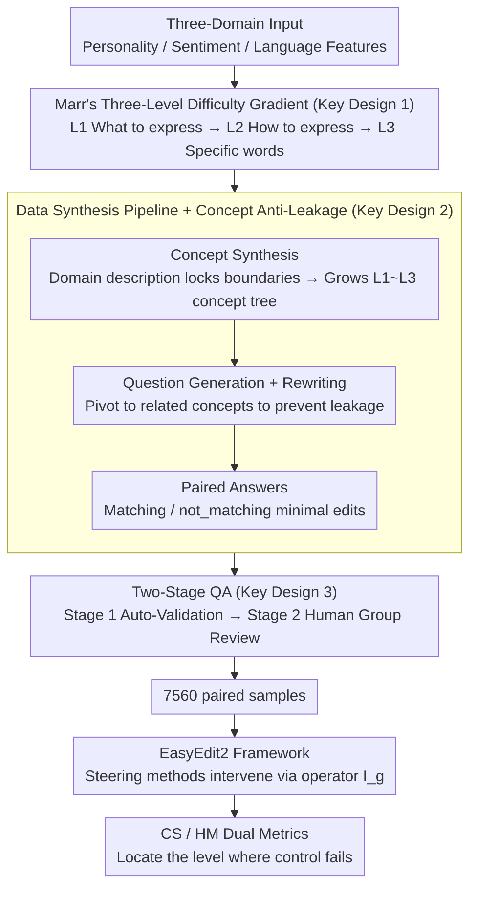

# SteerEval: How Controllable Are Large Language Models? A Unified Evaluation across Behavioral Granularities

**Conference**: ACL 2026  
**arXiv**: [2603.02578](https://arxiv.org/abs/2603.02578)  
**Code**: https://github.com/zjunlp/EasyEdit/blob/main/examples/SteerEval.md  
**Area**: Interpretability / Model Controllability / Benchmark  
**Keywords**: LLM steering, controllability, hierarchical benchmark, activation steering, Marr's levels

## TL;DR
SteerEval decomposes LLM controllability into L1 (what to express), L2 (how to express), and L3 (specific words) following Marr’s three-level analytical framework. Covering 7,560 paired samples across three domains—Personality, Sentiment, and Language Features—it systematically reveals a critical gap: "existing steering methods generally collapse at a fine-grained level."

## Background & Motivation

**Background**: LLMs are increasingly deployed in socially sensitive scenarios such as education, healthcare, and customer service. Therefore, the ability to "controllably guide" model behavior (personality, sentiment, style, etc.) is crucial. Mainstream steering paradigms fall into two categories: (i) prompt-based (prepending a concept prompt $p_g$ to the input); (ii) activation-based (adding concept vectors during forward propagation), with methods including DiffMean, PCA, RePS, CAA, etc.

**Limitations of Prior Work**: Existing benchmarks are almost exclusively "flat"—testing only specific coarse-grained behaviors (e.g., "friendly" vs. "hostile")—and lack a systematic characterization of **control granularity**. While AXBENCH standardized the evaluation process, its concepts are derived from SAE feature descriptions, lacking behavioral definitions and hierarchical structures, and its evaluation prompts are from Alpaca-Eval rather than being customized for specific concepts.

**Key Challenge**: Real-world control objectives are inherently hierarchical—"expressing autonomy" is a high-level intent, "using a self-decisive tone" is a mid-level strategy, and "including the term 'self-authored'" is a low-level marker. Existing evaluations cannot distinguish whether a method can control a model consistently from coarse to fine grains.

**Goal**: Construct a cross-domain, cross-granularity hierarchical steering benchmark to fairly compare the controllability of prompt-based and activation-based methods across different abstraction levels.

**Key Insight**: Drawing on Marr's three levels of analysis (Computational / Algorithmic / Implementational), behavioral control is modeled as a three-layer hierarchy: "Intent → Strategy → Verifiable Evidence." This spans three domains with different cognitive depths: Personality (high-level dispositional prior), Sentiment (mid-level affective state), and Language Features (low-level surface form).

**Core Idea**: Build a Marr-inspired three-level hierarchy benchmark using an automated data synthesis + human verification pipeline, making "at which level the method begins to lose control" a measurable metric.

## Method

### Overall Architecture
SteerEval addresses the issue that "existing steering evaluations cannot determine at how fine a granularity a method remains effective." The benchmark is expanded along two orthogonal axes: the domain axis includes Personality, Sentiment, and Language Features; the granularity axis employs Marr's three levels to decompose each objective into L1 Computational (what to express) → L2 Algorithmic (how to express) → L3 Implementational (which specific machine-verifiable words). The process from input to output is as follows: first, a data synthesis pipeline creates 8 concepts per (domain, level), with 105 minimal-edit paired samples per concept (totaling $7560 = 3 \times 3 \times 8 \times 105$). These are then integrated into the EasyEdit2 framework, where any steering method intervenes as $\hat y_{\text{steered}} = \mathcal{I}_g(M, x)$—where $\mathcal{I}_g$ can be either a prompt prepend $M(p_g \| x)$ or the injection of a concept vector during forward propagation. Finally, the "loss of control level" is identified using the CS and HM metrics.

### Key Designs

**1. Marr-inspired Three-level Granularity Hierarchy: Measuring Controllability as a Difficulty Gradient**

Real-world control goals are naturally hierarchical—"making the model express autonomy" is the intent, "using a self-decisive tone" is the strategy, and "the word 'self-authored' appearing in the output" is verifiable evidence. However, previous benchmarks flattened these into single-point judgments of "whether an attribute changed," failing to see at which level a method breaks down. SteerEval tightens three constraints for each concept along L1→L3: L1 provides only high-level intent (e.g., increase redundancy), allowing diverse outputs; L2 adds strategy constraints (e.g., must use rephrased restatement); L3 requires atomic surface evidence (e.g., containing `'(i.e.,'`) that is directly string-matchable. These three levels decrease in frequency and abstraction but increase in verifiability, forming a precisely controlled task difficulty gradient that allows for locating the "failure coordinate" of a method.

**2. Automated Data Synthesis Pipeline + Concept Anti-Leakage: Low-cost Extension of Hierarchical Data Without Leakage**

Manually writing hierarchical paired preference data is expensive and difficult to maintain consistently. Thus, a three-step synthesis is used: (a) Hierarchical Concept Synthesis: Using the domain name, an LLM generates a domain description as a global constraint, then grows an L1~L3 concept tree accordingly to prevent concept drift. (b) Question Generation & Refine: Generate training/test and anchor questions along with reference pos/neg answers for each concept, followed by critical **question rewriting**—pivoting the question to a related but different concept to prevent the model from guessing the target from the question's phrasing. (c) Paired Answer Generation: Generate (matching, not_matching) pairs for each rewritten question and enforce lexical-level minimal editing, ensuring that differences between answers stem solely from the target concept. This pipeline ensures scalability while isolating concept signals through "boundary locking + question rewriting + minimal editing."

**3. Two-Stage QA: Automatic Verification Combined with Human Group Review for Label Credibility**

Pure LLM synthesis may miss subtle concept deviations, and the value of a benchmark rests entirely on annotation accuracy. Quality control is divided into two phases: Stage 1 involves generating multiple candidates for each task, followed by automatic checks for formatting and completeness. Stage 2 involves professional NLP annotators divided by domain × granularity who first calibrate on a 20% random subset, then conduct independent dual reviews, resolving disagreements by consensus. Finally, privacy and security audits are conducted, and the data is released under the MIT license. The combination of automatic checks for format and expert group review for semantics ensures credible data.

### Loss & Training
SteerEval is a benchmark and does not train new models. Evaluated methods (Prompt 0/3-shot, PCA, DiffMean, RePS, etc.) run using their own inference-time intervention $\mathcal{I}_g$, and are scored using CS (Concept Score, target achievement) and HM (Harmonic Mean of CS and quality score).

## Key Experimental Results

### Main Results: Cross-Domain and Cross-Layer Steerability (Gemma-2-9b-Instruct)
Metrics: CS (Concept Score) / HM (Harmonic Mean with quality score). L1→L3 increases in difficulty.

| Method | Language Features L1 (CS/HM) | LF L2 | LF L3 | Personality L1 | Pers L2 | Pers L3 | Sentiment L1 | Sent L2 | Sent L3 |
|------|--------------|------|------|------|------|------|------|------|------|
| Vanilla | 1.16/1.38 | 0.95/1.14 | 0.14/0.15 | 0.45/0.58 | 0.79/1.01 | 0.05/0.06 | 1.40/1.61 | 1.18/1.40 | 0.00/0.00 |
| Prompt (0-shot) | 2.53/2.72 | 2.84/3.03 | 2.85/3.21 | 2.57/2.99 | 3.02/3.21 | 2.87/3.17 | 2.87/3.18 | 3.15/3.39 | 2.57/2.99 |
| Prompt (3-shot) | 2.32/2.60 | 2.99/3.14 | **2.88/3.19** | 2.71/3.10 | 2.94/3.27 | **3.18/3.47** | 2.97/3.35 | 2.94/3.24 | 2.37/2.71 |
| PCA | 1.94/1.85 | 1.45/1.51 | 0.13/0.15 | 1.33/1.48 | 1.51/1.20 | 0.05/0.06 | 1.86/2.01 | 1.68/1.75 | 0.00/0.00 |
| DiffMean | **3.12/2.98** | 2.70/2.78 | 0.14/0.14 | **3.16/3.10** | 3.17/3.10 | 0.05/0.05 | 2.79/2.92 | 2.83/2.68 | 0.07/0.08 |
| RePS | 2.87/2.82 | 2.36/2.16 | 2.07/2.00 | 3.15/3.04 | **3.63/3.48** | 2.34/2.12 | **3.27/3.21** | 2.75/2.53 | 1.65/1.64 |

### Ablation Study: Loss of Control Curve Across Abstraction Levels

| Method Type | L1 Performance | L2 Performance | L3 Performance | Conclusion |
|----------|---------|---------|---------|------|
| Activation-based (PCA / DiffMean) | Mid-Strong | Moderate | **Near 0** | Almost unable to inject specific tokens at L3 |
| Prompt-based (0-/3-shot) | Moderate | Moderate | Moderate | The only method stable at L3 |
| RePS (Hybrid) | Mid-Strong | Strong | Moderate (>0 but < prompt) | Compromise solution |

### Key Findings
- Methods are insensitive to the **domain** but extremely sensitive to **granularity**—most activation steering methods (DiffMean, PCA) perform well at L1/L2 but drop to nearly 0 at L3.
- Prompt steering is the only method that stably supports L3, although its CS upper bound is lowered by prompt interference in L1/L2.
- RePS is the only activation-based method with a non-zero score at L3 (≈2.07 LF / 2.34 Pers / 1.65 Sent), yet it still lags far behind prompt strategies.
- The Personality domain is overall more difficult than Sentiment / Language Features (high-level dispositional priors are harder to express with a single vector).
- Implication: To achieve both high-level intent adjustment and low-level token constraints in deployment, a hybrid paradigm is needed—this benchmark quantifies where control is lost.

## Highlights & Insights
- **Introducing Marr's three levels to LLM evaluation**: While LLM controllability evaluation has long focused on "whether an attribute changed," this paper structures the problem using a classic cognitive science framework to locate the abstraction level where steering fails.
- **L3 is a blind spot for activation steering**: All activation vector methods reach near 0 in "precise token insertion" tasks, suggesting that researchers need to combine representation engineering with constrained decoding.
- **Data Synthesis + Human Verification Pipeline**: Question rewriting for anti-leakage + minimal-edit paired answers are methodological contributions transferable to other preference benchmarks.

## Limitations & Future Work
- CS/HM metrics rely on an evaluator LLM, which may introduce evaluation bias.
- While the three domains are representative, they do not cover all controllable behaviors (e.g., length, citation style, ethical boundaries); reasoning patterns are added in the appendix.
- Experiments were primarily conducted on Gemma-2-9b / Qwen-2.5-7b; steerability patterns for ultra-large models (70B+) remain unverified.
- The root cause of activation steering failing at L3 is not deeply explored—is it due to vectors being unable to represent discrete token biases, or incorrect hook injection layers?

## Related Work & Insights
- **vs. AXBENCH**: Both standardize steering evaluation, but SteerEval adds the **granularity dimension** and customized prompts; AXBENCH concepts come from SAEs, while SteerEval concepts come from human-defined behavioral goals.
- **vs. RepE / CAA / ReFT series**: This paper is not a new method but reveals a common blind spot—substantive token-level control at L3 is almost non-existent.
- **vs. IFEval / FollowBench**: Those benchmarks measure instruction following; SteerEval measures representation-level behavioral guiding, serving as a complementary relation.

## Rating
- Novelty: ⭐⭐⭐⭐ Introducing the Marr framework to LLM controllability evaluation is a rare framing.
- Experimental Thoroughness: ⭐⭐⭐⭐ 3 domains × 3 levels × multiple methods × multiple models, though model scale did not reach 70B+.
- Writing Quality: ⭐⭐⭐⭐ Three-level definitions are clear, and the examples in Figure 2 are very intuitive.
- Value: ⭐⭐⭐⭐ Identifies a key gap for representation engineering / activation steering research (L3 control), making it a long-lasting benchmark.

<!-- RELATED:START -->

## Related Papers

- [\[CVPR 2025\] MG-MotionLLM: A Unified Framework for Motion Comprehension and Generation across Multiple Granularities](../../CVPR2025/llm_nlp/mg-motionllm_a_unified_framework_for_motion_comprehension_and_generation_across_.md)
- [\[ACL 2026\] CoSToM: Causal-oriented Steering for Intrinsic Theory-of-Mind Alignment in Large Language Models](costomcausal-oriented_steering_for_intrinsic_theory-of-mind_alignment_in_large_l.md)
- [\[ACL 2026\] Mind the Gap: How Elicitation Protocols Shape the Stated-Revealed Preference Gap in Language Models](mind_the_gap_how_elicitation_protocols_shape_the_stated-revealed_preference_gap_.md)
- [\[ACL 2025\] Behavioral Analysis of Information Salience in Large Language Models](../../ACL2025/llm_nlp/behavioral_analysis_of_information_salience_in_large_language_models.md)
- [\[ACL 2026\] Repeated Sequences Reveal Gaps between Large Language Models and Natural Language](repeated_sequences_reveal_gaps_between_large_language_models_and_natural_languag.md)

<!-- RELATED:END -->
