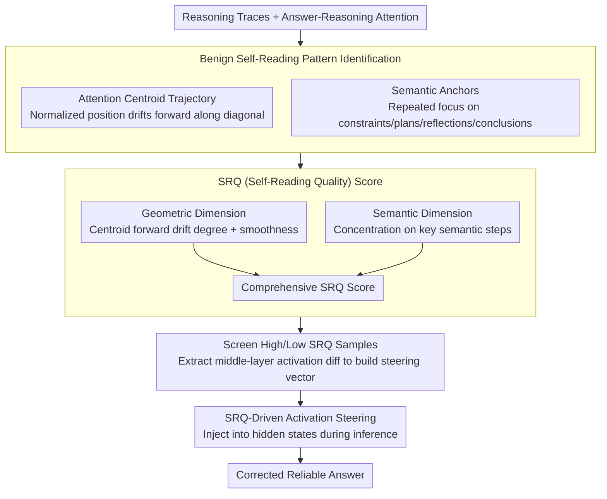

# How Do Answer Tokens Read Reasoning Traces? Self-Reading Patterns in Thinking LLMs

**Conference**: ACL 2026 Findings  
**arXiv**: [2604.19149](https://arxiv.org/abs/2604.19149)  
**Code**: None  
**Area**: LLM/NLP  
**Keywords**: Reasoning models, self-reading patterns, attention analysis, activation steering, quantitative reasoning  

## TL;DR

This paper identifies a "benign self-reading" pattern in reasoning LLMs (such as DeepSeek-R1) during quantitative reasoning. Answer tokens exhibit a forward drift (advancing step-by-step along the reasoning chain) and concentration on semantic anchors (repeatedly revisiting key steps) when attending to reasoning traces, a pattern strongly correlated with correctness. Based on this, a training-free activation steering method driven by SRQ (Self-Reading Quality) is proposed, improving accuracy by up to 2.6% across multiple benchmarks.

## Background & Motivation

**Background**: Reasoning LLMs (e.g., DeepSeek-R1, GPT-5, Gemini 3) generate reasoning traces (separated by `</think>`) before producing an answer. Activation steering has been proven effective in controlling reasoning trace behavior, such as compressing redundant outputs or guiding verification and backtracking.

**Limitations of Prior Work**: Existing research primarily focuses on shaping the reasoning traces themselves, while how answer tokens "read" and integrate these traces to produce reliable outputs remains unclear. Navigating key information within noise is a critical challenge when reasoning chains extend to thousands of tokens.

**Key Challenge**: Reasoning traces contain both crucial reasoning steps and exploratory attempts or redundant content. Answer tokens require "selective reading"—however, the mechanism by which models achieve this and the relationship between reading patterns and correctness are unknown.

**Goal**: (1) Understand how answer tokens read reasoning traces; (2) Establish a correlation between self-reading patterns and correctness; (3) Utilize self-reading quality signals for training-free steering.

**Key Insight**: Analyzing the attention distribution of answer tokens over reasoning tokens—the trajectory of the attention centroid and concentration points—reveals the model's "reading strategy."

**Core Idea**: Benign self-reading serves as a behavioral signature of internal certainty—the model has selected a solution path and relies on a few key reasoning steps as evidence for generating the answer. The forward drift of the attention centroid reflects "control" (advancing along a selected branch), while persistent focus on semantic anchors reflects "monitoring" (repeatedly verifying evidence).

## Method

### Overall Architecture

The core question is "how answer tokens read the preceding reasoning trace of thousands of tokens, and whether this reading style relates to correctness." The method proceeds from analysis to application: first, observing answer-reasoning attention of three reasoning LLMs on GSM8K to extract geometric and semantic features of "benign self-reading"; then, quantifying these features into an SRQ (Self-Reading Quality) score to measure reading orderliness; finally, constructing steering vectors from the activation differences between high-SRQ and low-SRQ samples to inject into hidden states during inference, pushing the model from chaotic reading toward benign self-reading. Inputs are reasoning traces and attention; intermediate products are SRQ scores and steering vectors; the output is a more reliable, corrected answer.

### Key Designs

**1. Benign Self-Reading Pattern Identification: Visualizing Reading Trajectories as Discernible Geometric Signatures**

The problem lies in reasoning traces containing both key steps and exploratory detours. To understand navigation, the authors calculate the weighted average position of attention distribution for each answer token—the attention centroid—normalized to $[0,1]$. In correct samples, the centroid trajectory drifts forward along the diagonal as the answer is generated, showing a steady progression of reading focus. Meanwhile, attention repeatedly falls on specific "semantic anchors" (problem constraints, solution plans, reflections, final conclusions). In contrast, incorrect samples show scattered, irregular attention. This maps abstract "reading strategies" to observable geometric patterns, explainable via metacognitive frameworks: reasoning tokens perform object-level computation, while answer tokens perform meta-level operations—centroid drift corresponds to "control," and anchor revisiting corresponds to "monitoring," consistent with cognitive theories (Nelson 1990 / Koriat 1997).

**2. SRQ (Self-Reading Quality) Score: Complementary Geometric and Semantic Quantization**

To use "benign self-reading" for sample screening and vector construction, it must be scored. SRQ consists of two dimensions: the geometric dimension measures the forward drift and smoothness of the attention centroid trajectory (diagonal progression), while the semantic dimension measures attention concentration on key semantic steps (constraints, plans, conclusions). Both are combined for the final score. Using both dimensions prevents selecting samples that are "smooth but semantically meaningless" (geometry only) or "anchored correctly but procedurally chaotic" (semantics only). High scores in both signify ordered reading grounded in correct evidence.

**3. SRQ-Driven Activation Steering: Training-Free Correction via Activation Differences**

Given that benign self-reading strongly correlates with correctness (manual verification shows 159/171 correct samples exhibit this pattern), actively pushing the model toward benign self-reading should improve accuracy. Specifically, high-SRQ and low-SRQ sample groups are selected to extract activation differences in intermediate layers as steering vectors. During inference, these vectors are added to the hidden states of target layers to steer the model away from chaotic reading and toward ordered reading. This process requires no parameter updates or extra training, serving as a lightweight inference-time intervention.

### Loss & Training

Completely training-free. Steering vectors are extracted from activation differences of high/low SRQ contrastive samples and added to hidden states of target layers during inference.

## Key Experimental Results

### Main Results

**Accuracy Improvement of SRQ Steering Across Benchmarks**

| Model | Benchmark | Baseline Accuracy | + SRQ Steering | Gain |
|------|------|----------|-----------|------|
| R1-Distill-Llama-8B | GSM8K | ~82% | ~84.6% | +2.6% |
| R1-Distill-Qwen-7B | GSM8K | ~83% | ~85% | +2.0% |
| Qwen3-4B-Thinking | GSM8K | ~80% | ~81.5% | +1.5% |

### Ablation Study

| Configuration | Effect | Description |
|------|------|------|
| Geometric Dimension Only | Small Gain | Lacks semantic anchoring signals |
| Semantic Dimension Only | Moderate Gain | Lacks procedural structure signals |
| **Geometric + Semantic** | **Optimal** | Both dimensions are complementary |

**Manual Annotation Verification (200 Samples)**

| Category | Count | Description |
|------|------|------|
| Correct + Benign Self-Reading | 159/171 Correct | 93% of correct samples show benign self-reading |
| Incorrect + Benign Self-Reading | 3/26 Incorrect | Only 12% of incorrect samples show benign self-reading |
| Balanced Subset (50+50) | 48 Correct/Benign vs 46 Incorrect/None | Consistent trend |

### Key Findings

- Benign self-reading patterns are nearly universal in correct samples (93%) and rare in incorrect ones (12%).
- Aggregating attention maps across 100 correct samples still maintains a clear diagonal ridge, proving it is a stable systemic behavior.
- SRQ steering consistently improves accuracy without parameter modification, validating the causal link between reading patterns and correctness.
- Geometric and semantic dimensions are complementary; using either alone is less effective than the combination.

## Highlights & Insights

- The discovery of "self-reading" behavior in reasoning LLMs and its correlation with correctness is a significant contribution to understanding LLM internal mechanisms.
- The introduction of a metacognition framework (control + monitoring) provides a theoretical foundation from cognitive science to explain LLM behavior.
- SRQ-driven activation steering demonstrates a complete closed-loop from understanding to application.

## Limitations & Future Work

- Verified only on quantitative reasoning tasks; applicability to other reasoning types (logic, commonsense) is unknown.
- The magnitude of accuracy improvement is limited (up to 2.6%).
- Identification of semantic anchors might be task-specific.
- Future work could explore guiding models to learn better self-reading patterns during the training phase.

## Related Work & Insights

- **vs. Venhoff et al. (2025)**: Steers verification and backtracking behavior within reasoning traces; Ours steers reading behavior during the answer phase.
- **vs. Azizi et al. (2025)**: Steers compression of reasoning length; Ours focuses on how answers utilize reasoning.
- **vs. Zhang et al. (2025)**: Confirms the existence of answer-reasoning attention links; Ours deeply analyzes their structural patterns and functional significance.

## Rating

- Novelty: ⭐⭐⭐⭐⭐ First systematic analysis of self-reading behavior in reasoning LLM answer tokens; conceptually novel with cognitive science depth.
- Experimental Thoroughness: ⭐⭐⭐⭐ Three models, manual verification, and activation steering validation, though task scope is limited.
- Writing Quality: ⭐⭐⭐⭐⭐ Excellent visualizations, in-depth analysis, and appropriate cognitive analogies.
- Value: ⭐⭐⭐⭐ Provides a new analytical perspective and practical tools for understanding and improving reasoning LLMs.

<!-- RELATED:START -->

## Related Papers

- [\[NeurIPS 2025\] AceSearcher: Bootstrapping Reasoning and Search for LLMs via Reinforced Self-Play](../../NeurIPS2025/llm_nlp/acesearcher_bootstrapping_reasoning_and_search_for_llms_via_reinforced_self-play.md)
- [\[ACL 2025\] How Numerical Precision Affects Arithmetical Reasoning Capabilities of LLMs](../../ACL2025/llm_nlp/how_numerical_precision_affects_arithmetical_reasoning_capabilities_of_llms.md)
- [\[ACL 2025\] Unlocking Recursive Thinking of LLMs: Alignment via Refinement](../../ACL2025/llm_nlp/unlocking_recursive_thinking_of_llms_alignment_via_refinement.md)
- [\[ICLR 2026\] How Far Are LLMs from Professional Poker Players? Revisiting Game-Theoretic Reasoning with Agentic Tool Use](../../ICLR2026/llm_nlp/how_far_are_llms_from_professional_poker_players_revisiting_game-theoretic_reaso.md)
- [\[ICML 2026\] Reasoning on the Manifold: Bidirectional Consistency for Self-Verification in Diffusion Language Models](../../ICML2026/llm_nlp/reasoning_on_the_manifold_bidirectional_consistency_for_self-verification_in_dif.md)

<!-- RELATED:END -->
