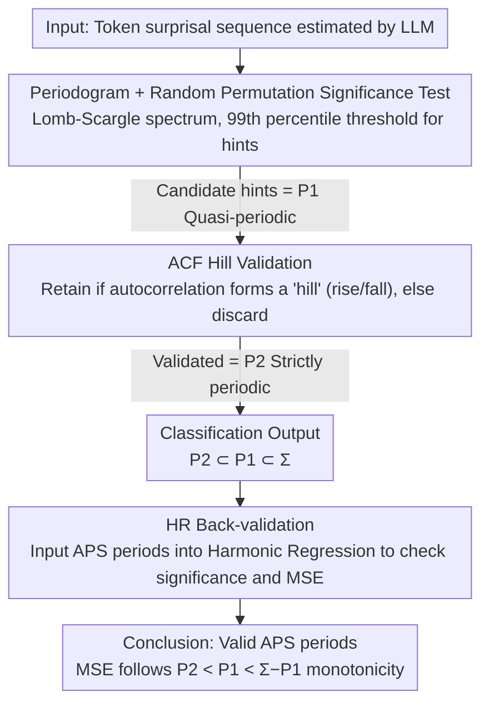

# Identifying the Periodicity of Information in Natural Language

**Conference**: ACL 2026  
**arXiv**: [2510.27241](https://arxiv.org/abs/2510.27241)  
**Code**: <https://github.com/CLCS-SUSTech/APS>  
**Area**: Information-theoretic Linguistics / Information Density / Machine-generated Text Detection  
**Keywords**: Information Periodicity, surprisal, AutoPeriod, Harmonic Regression, LLM Detection

## TL;DR
This paper adapts the AutoPeriod detection algorithm from signal processing to token-surprisal sequences, proposing APS (AutoPeriod of Surprisal) to **directly detect** information density cycles at a single-document level (e.g., "one cycle every 53 tokens"). It discovers that approximately 11% of human-written documents exhibit strict periodicity, and the periodicity of LLM-generated text is twice as strong as that of humans (30% vs. 14.8%), providing direct evidence for the UID theory and offering explainable features for AI text detection.

## Background & Motivation

**Background**: Since Shannon (1948), a core hypothesis of information-theoretic linguistics has been the Uniform Information Density (UID; Aylett & Turk 2004; Jaeger 2010), which posits that natural language tends to equalize token-level surprisal for efficient communication. However, UID is an asymptotic property; surprisal naturally fluctuates within short windows. Genzel & Charniak (2002/2003) noted higher surprisal at paragraph beginnings and sharp drops at the ends. Recent work has upgraded "fluctuation" to a "periodicity" hypothesis—Xu & Reitter (2017) / Yang et al. (2023) (FACE) used Fourier spectra to distinguish text surprisal from white noise; Tsipidi et al. (2025) used Harmonic Regression (HR) to validate significant periodic signals corresponding to discrete structural units (sentences, paragraphs, EDUs).

**Limitations of Prior Work**: (1) Fourier methods (frequency domain) only provide indirect evidence that the "spectrum is not white noise" without translating frequencies back into "specific period lengths" in the time domain; (2) HR methods rely on **pre-selected candidate periods** (requiring "sentence/paragraph/EDU length" as $U_t$), failing to discover periods not specified during training and unable to judge if a single document is truly periodic; (3) The lack of a doc-level period detector prevents correlation with doc-level variables like genre, authorship, or human-vs-LLM origin.

**Key Challenge**: To address whether natural language information is periodic, one must (a) provide rejectable statistical judgments at the single-document level (whether periods exist and what they are), (b) ensure period discovery requires no candidate priors, and (c) detect "unknown periods" outside of known structural units. Existing methods fail all three.

**Goal**: (1) Design a doc-level period detection algorithm to return all significant periods using confidence thresholds; (2) Quantify "how many documents are truly periodic" across four corpora; (3) Compare findings with known structural units; (4) Use HR to back-validate APS discoveries; (5) Identify periodicity differences between human and LLM texts.

**Key Insight**: The AutoPeriod algorithm proposed by Vlachos et al. (2005) for financial/social time series—which uses a periodogram to find candidate periods followed by ACF (Autocorrelation Function) "hill" filtering to remove false positives—is mature and reliable. It can be adapted to surprisal sequences (using Lomb-Scargle periodograms to improve long-period resolution).

**Core Idea**: Combine classic signal processing (AutoPeriod) with surprisal sequences to create a doc-level information period detector; use periodogram selection plus ACF hill validation to ensure low false discovery rates; finally, use HR for back-validation and exploration of human vs. LLM differences.

## Method

### Overall Architecture
The input to APS is a document’s token surprisal sequence $\mathbf{x} = (x_0, \dots, x_{N-1})$, where $x_n = -\log p(t_n \mid t_{<n})$ is estimated by a language model (LLaMA3-8B / Yarn-LLaMA2-7B for English, Qwen2-7B for Chinese). The output is a set of valid periods $\{\tau_1, \tau_2, \dots\}$ or an empty set. It adapts the two-step AutoPeriod process to surprisal: first, identify statistically significant candidate periods (period hints) in the frequency domain; then, use the geometric shape of the ACF to filter out false positives in the time domain. Documents are categorized into three types: $P_1$ (quasi-periodic with at least one hint), $P_2 \subseteq P_1$ (strictly periodic passing ACF validation), and $\Sigma - P_1$ (non-periodic); this classification serves as both the output of APS and a slicing tool for experiments involving doc-level variables like genre or human-vs-LLM status.

### Key Designs

**1. Surprisal-based Periodogram + Random Permutation Test (Step 1): Identifying candidate periods "significantly higher than noise" in the frequency domain**

One could apply DFT $X_k = \sum_n x_n e^{-i 2\pi k n / N}$ and use $\|X_k\|$ for the periodogram $\bm{\mathcal{P}}$ (practically, the Lomb-Scargle version is used for higher resolution in long periods). However, peaks in the spectrum might be random noise. Thus, $m=100$ random permutations $\text{Permute}(\mathbf{x})$ are performed, recording the max power of each to create a null distribution. The 99th percentile is taken as the threshold $P_{\text{threshold}}$. Any frequency $k$ where $\bm{\mathcal{P}}[k] > P_{\text{threshold}}$ leads to the candidate period $\tau = N/k$ being recorded as a period hint. This model-free permutation test directly answers "what is the maximum power if the signal has no periodicity," making it more robust than absolute thresholds or Bonferroni corrections.

**2. ACF Hill Validation for False Positive Filtering (Step 2): Time-domain confirmation using autocorrelation geometry**

Candidate short periods are prone to false positives because high energy does not necessarily imply self-similarity. A true period $\tau$ must manifest as a "hill" (local maximum) on the autocorrelation curve $\text{ACF}(\tau) = \frac{1}{N}\sum_n x(n) \cdot x(n+\tau)$. For each hint $\tau' = N/k$, a neighborhood window $W = [(\tau + \tau_{\text{next}})/2 - 1, (\tau + \tau_{\text{prev}})/2 + 1]$ is defined. Two linear regressions are run within the window by iterating through split points $t$ to minimize $\epsilon_L + \epsilon_R$. If the left slope is greater than the right slope and the difference $|\theta_L - \theta_R| > 0.01$, the segment is confirmed as a "hill." If isHill is true, a refined period is returned using findPeak; otherwise, the hint is discarded. This dual confirmation significantly reduces false positives—Table 1 shows $|P_2|/|P_1| \approx 66\%$.

**3. HR Back-validation + Filter-based Gain: Independently proving APS identifies true "statistical periods"**

APS performs detection ("there is a period"), while an independent tool is needed for explanation. Harmonic Regression (HR), following Tsipidi et al. (2025), is used: $s(w_t) \sim \text{baseline} + \text{HR}(U_t)$, where $U_t$ is the period returned by APS. The significance of harmonic terms $\beta_{1,k} \sin(k 2\pi t/U_t) + \beta_{2,k}\cos(k 2\pi t/U_t)$ is evaluated (amplitude $A_k = \sqrt{\beta_{1,k}^2 + \beta_{2,k}^2}$, p < 0.001). Simultaneously, the MSE of HR is checked to ensure it follows the order $P_2 < P_1 < \Sigma < \Sigma - P_1$. Since APS and HR are independent, if the APS-detected periods lead to significant harmonic terms and monotonic MSE rankings, it confirms the discoveries are statistical periods rather than noise artifacts.

### Loss & Training
No model training is involved—APS is a deterministic algorithm (DFT + permutation + linear regression), and HR is OLS regression. Hyperparameters: $m=100$ permutations, percentile=99 (default) / 90 (used in text), HR harmonic terms $K=10$. Corpora: WSJ, Brown, CTB, GCDT, RST Discourse Treebank, FACE, EvoBench. LLMs are used only for surprisal estimation and are not updated.

## Key Experimental Results

### Main Results (Periodic Document Proportions across 4 Corpora)

| Corpus | $|\Sigma|$ | $|P_1|$ | $|P_2|$ | $|P_1|/|\Sigma|$ | $|P_2|/|P_1|$ | $|P_2|/|\Sigma|$ |
|------|------------|---------|---------|------------------|----------------|------------------|
| WSJ (en) | 2499 | 221 | 131 | 8.84% | 59.28% | 5.24% |
| Brown (en) | 500 | 52 | 25 | 10.40% | 48.08% | 5.00% |
| GCDT (zh) | 50 | 15 | 13 | **30.00%** | **86.67%** | **26.00%** |
| CTB (zh) | 2773 | 304 | 212 | 10.96% | 69.74% | 7.65% |
| **Avg** | — | — | — | **15.05%** | **65.94%** | **10.97%** |

Chinese shows significantly higher periodicity than English. GCDT, containing formal multi-genre texts, shows the strongest periodicity at 26%.

### Ablation Study (HR Back-validation: MSE Ranking)

WSJ HR MSE:

| Data Slice | Baseline (No HR) | EDU as $U_t$ | Sentence as $U_t$ | Whole Text |
|----------|------------------|---------------|--------------------|-------------|
| $P_2$ (Strict) | **16.33** | **13.78** | **15.60** | 16.29 |
| $P_1$ (Quasi) | 16.87 | 14.14 | 16.14 | 16.84 |
| $\Sigma$ (Total) | 18.26 | 15.18 | 17.56 | 18.25 |
| $\Sigma - P_1$ (Non) | 18.59 | 15.42 | 17.89 | 18.57 |

MSE perfectly follows the order $P_2 < P_1 < \Sigma < \Sigma - P_1$.

### Key Findings
- **5-11% of documents are strictly periodic, 15% are quasi-periodic**: Periodicity is not universal but certainly not rare.
- **Chinese > English**: All metrics are higher for Chinese, possibly due to more rigid topic/paragraph structures or differences in tokenizer behavior.
- **Genre determines periodicity**: Formal texts (academic, biography) in GCDT far exceed news, suggesting a focus for future research on verse vs. prose.
- **APS identifies long cycles beyond structural units**: 33.33% of valid periods exceed 150 tokens, whereas only 3.63% of paragraphs exceed this length. This indicates "long-range periodicity" potentially stemming from cross-paragraph semantic or topic structures.
- **LLM text is twice as periodic as human text**: On FACE BBC News, LLaMA3-70B generated text has a $|P_2|/|\Sigma|$ of 30.06% vs. human 14.80%. Even after excluding repeated phrases, the gap remains (27.86% vs. 14.80%).
- **LLM periodicity predominantly occurs in long segments (>50 tokens)**: This suggests an LLM tendency to maintain structural coherence across long distances.

## Highlights & Insights
- **Adapting 50-year-old signal processing algorithms to NLP**: The innovation lies in asking the right question rather than using brand-new technology.
- **Permutation testing as a model-free significance judgment**: This is more robust than absolute thresholds for surprisal sequences and is suitable for any tasks requiring statistical judgment of patterns.
- **Discovery of long-range periods (>150 tokens)**: This supplements the UID theory with a "long-range version," suggesting that surprisal structures arise from abstract latent variables like topic flow.
- **Interpretability for LLM detection**: Rather than black-box spectrum features, the study reveals that LLMs have an interpretable tendency toward structural over-coherence.

## Limitations & Future Work
- **Language and Genre**: Limited to English and Chinese; impact of genre is observed but not deeply analyzed.
- **Short-period resolution**: DFT has lower resolution for high frequencies, and permutation tests are more susceptible to false positives in short cycles.
- **Confounding factors in LLM text**: Differences in document length, style, or vocabulary distribution might affect surprisal estimation.
- **Why vs. What**: APS detects *that* periods exist but does not answer *why* (topic vs. rhetoric vs. cognition).

## Related Work & Insights
- **vs. Tsipidi et al. 2025 (HR)**: HR requires candidate priors for $U_t$; APS discovers periods without priors. The two are complementary (detection vs. explanation).
- **vs. Yang et al. 2023 (FACE)**: FACE works in the frequency domain to evaluate NLG quality; APS translates this to interpretable time-domain values.
- **vs. Xu et al. 2024 (Spectrum-based LLM Detection)**: APS provides the specific interpretable basis—"LLMs have longer and more frequent periods"—behind the spectral differences used in LLM detection.

## Rating
- Novelty: ⭐⭐⭐⭐
- Experimental Thoroughness: ⭐⭐⭐⭐
- Writing Quality: ⭐⭐⭐⭐⭐
- Value: ⭐⭐⭐⭐

<!-- RELATED:START -->

## Related Papers

- [\[ACL 2026\] LinkNav: Surfacing Interconnected Information in Scientific Articles](linknav_surfacing_interconnected_information_in_scientific_articles.md)
- [\[ACL 2026\] Repeated Sequences Reveal Gaps between Large Language Models and Natural Language](repeated_sequences_reveal_gaps_between_large_language_models_and_natural_languag.md)
- [\[AAAI 2026\] Identifying and Analyzing Performance-Critical Tokens in Large Language Models](../../AAAI2026/llm_nlp/identifying_and_analyzing_performance-critical_tokens_in_large_language_models.md)
- [\[ACL 2025\] Cooperating and Competing Through Natural Language](../../ACL2025/llm_nlp/cooperating_and_competing_through_natural_language.md)
- [\[ACL 2025\] What Makes a Good Natural Language Prompt?](../../ACL2025/llm_nlp/good_natural_language_prompt.md)

<!-- RELATED:END -->
## Related Papers

- [\[ACL 2026\] Repeated Sequences Reveal Gaps between Large Language Models and Natural Language](repeated_sequences_reveal_gaps_between_large_language_models_and_natural_languag.md)
- [\[AAAI 2026\] Identifying and Analyzing Performance-Critical Tokens in Large Language Models](../../AAAI2026/llm_nlp/identifying_and_analyzing_performance-critical_tokens_in_large_language_models.md)
- [\[ACL 2025\] Cooperating and Competing Through Natural Language](../../ACL2025/llm_nlp/cooperating_and_competing_through_natural_language.md)
- [\[ACL 2025\] What Makes a Good Natural Language Prompt?](../../ACL2025/llm_nlp/good_natural_language_prompt.md)
- [\[ACL 2025\] Internal and External Impacts of Natural Language Processing Papers](../../ACL2025/llm_nlp/internal_and_external_impacts_of_natural_language_processing_papers.md)

<!-- RELATED:END -->
