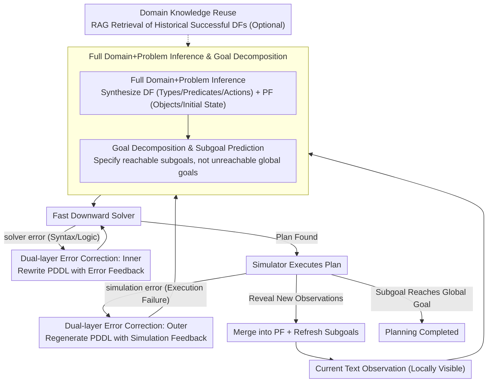

# Iterative Formalization and Planning in Partially Observable Environments

**Conference**: ACL 2026 Findings  
**arXiv**: [2505.13126](https://arxiv.org/abs/2505.13126)  
**Code**: [GitHub](https://github.com/zharry29/pddlego-plus)  
**Area**: LLM NLP / AI Planning  
**Keywords**: Partially observable environments, PDDL formalization, Iterative planning, LLM-as-Formalizer, Error correction

## TL;DR

The PDDLego+ framework is proposed to enable LLMs to iteratively generate and refine PDDL (Planning Domain Definition Language) representations in partially observable environments. Through a dual-layer error correction loop (solver error + simulation error), it achieves effective planning without the need for fine-tuning or examples.

## Background & Motivation

**Background**: Utilizing LLMs for planning is a prominent direction in the AI planning field. Existing methods are primarily categorized into LLM-as-planner (direct action plan generation) and LLM-as-formalizer (formalizing the environment into PDDL for traditional solvers). The latter is favored for its better interpretability and controllability, yet most research focuses exclusively on fully observable environments.

**Limitations of Prior Work**: Real-world planning scenarios (e.g., robots exploring unknown rooms, web agents) are typically partially observable—the agent only sees local observations and cannot generate a complete plan at once. Few works addressing partial observability suffer from three deficiencies: (1) assuming partial planning representations are known (e.g., predefined predicates or domain files); (2) using one-time formalization instead of iterative refinement; (3) depending on existing trajectories as in-context examples.

**Key Challenge**: Planning languages like PDDL are based on the Closed World Assumption, requiring complete definitions of the initial state and goals. This directly contradicts the nature of partially observable environments where information is revealed incrementally.

**Goal**: To design a framework that requires no fine-tuning, no examples, and no preset domain files, allowing LLMs to incrementally build a complete PDDL representation and complete planning tasks through iterative exploration and error correction in partially observable environments.

**Core Idea**: Decompose the partially observable problem into a sequence of fully observable subproblems. At each step, generate a local PDDL based on current observations, plan and execute using a solver, and iteratively update the model based on new observations and error feedback.

## Method

### Overall Architecture

The core challenge PDDLego+ addresses is that planning languages like PDDL assume a closed world, requiring the initial state and goals to be fully specified upfront, whereas an agent in reality only sees local observations. Its solution is to decompose "complete planning" into a series of "observe, formalize, and execute" mini-loops. At each time step, the LLM first generates a Domain File ($\mathbb{DF}$, defining types, predicates, and action semantics) and a Problem File ($\mathbb{PF}$, defining objects, initial states, and subgoals) based on current text observations. These are handed to a formal solver (Fast Downward) to search for an action plan, which is then executed in a simulated environment. PDDL is revised based on new observations and error feedback revealed after execution—repeating until the global goal is reached. The primary difference from the predecessor PDDLego is that PDDLego+ simultaneously infers both DF and PF, rather than assuming the domain file is provided.

### Key Designs

**1. Dual-layer Error Correction Loop: Separating "Solver Errors" and "Execution Failures"**

It is nearly impossible for LLM-generated PDDL to be correct on the first attempt, but errors fall into two distinct categories. The inner loop handles solver errors—instances where PDDL syntax or logic prevents Fast Downward from finding a solution. Feedback is immediate and local, allowing for direct rewriting: $\mathrm{df}_i^{j,k+1}, \mathrm{pf}_i^{j,k+1} = \text{LLM}(\mathrm{err}_{\text{sol}}, \mathrm{df}_i^{j,k}, \mathrm{pf}_i^{j,k})$. The outer loop handles simulation errors—where the solver finds a plan, but it fails in the simulator (often due to missing preconditions or semantic mismatches). In this case, the entire PDDL set is regenerated with simulation feedback: $\mathrm{df}_i^{j+1}, \mathrm{pf}_i^{j+1} = \text{LLM}(\mathrm{err}_{\text{sim}}, \mathrm{df}_i^j, \mathrm{pf}_i^j)$. Layering ensures that "fixing a bracket" and "rethinking action models" occur at different granularities.

**2. Goal Decomposition and Subgoal Prediction: Pursuing Reachable Goals in an Incomplete World**

In partially observable environments, global goals (e.g., "find the coin") cannot be written into a solvable PDDL when exploration is incomplete, as solvers will fail due to unreachability. Thus, at each time step, the LLM predicts a reachable local subgoal to drive exploration toward the final objective. The paper provides two prompt variants: a simple prompt with rough decomposition guidance, and a detailed prompt providing PDDL goal skeletons (e.g., `(:goal (at ?location))`) for the LLM to fill. The latter is more constrained and easier to solve, while the former tests the model's planning intuition.

**3. Full Domain+Problem Inference: LLM-Derived Action Models from Observations**

Unlike PDDLego, which assumed DF was known, PDDLego+ requires the LLM to derive action models. Inferring DF is significantly harder than PF, as it involves synthesizing classes and functions from scratch. PDDLego+ enables the LLM to digest natural language observations (e.g., "You are in the kitchen, there is a closed door to the east") and output the PDDL type definitions, predicates, and action preconditions/effects (DF) alongside object instances, initial states, and subgoals (PF). This step relies heavily on model capability and is the source of most analyzed bugs.

**4. Domain Knowledge Reuse: Accumulating "Learned World Rules"**

A unique benefit of formal methods over LLM-as-planner is knowledge accumulation. A DF produced after a successful trial represents a verified action model that can be reused for future similar tasks. The paper uses RAG to retrieve DFs from historically successful trials, fixing the DF and only requiring the LLM to predict PF. This significantly increases success rates for models like DeepSeek-R1 and GPT-4o with average DF generation capabilities, whereas for o3-mini, which writes DFs well, reuse shows a slight performance decrease.

### Key Experimental Results

### Main Results

Evaluations were conducted on CoinCollector (navigation) and ALFWorld (object manipulation) text environments:

| Method | CoinCollector (o3-mini) | ALFWorld (o3-mini) |
|------|------------------------|-------------------|
| PlanGen (LLM-as-planner) | 52% | 5% |
| PDDLego (No Correction) | 49% | 3% |
| Ours (PDDLego+) | **86%** | **38%** |

| Model | CoinCollector PlanGen / Ours | ALFWorld PlanGen / Ours |
|------|-------------------------------|--------------------------|
| DeepSeek-R1 | ~55% / ~75% | ~8% / ~25% |
| GPT-4.0 | ~60% / ~55% | ~3% / ~20% |
| o3-mini | 52% / 86% | 5% / 38% |
| o4-mini | ~65% / ~80% | ~10% / ~30% |

### Ablation Study

- **Complexity Robustness**: As the number of rooms in CoinCollector increases from 3 to 11, the success rate of PDDLego+ remains stable, while PlanGen and PDDLego show gradual declines.
- **Goal Prompt Ablation**: Detailed prompts outperform simple prompts, but PDDLego+ still significantly outperforms baselines under simple prompts.
- **Domain Knowledge Reuse**: Using RAG-retrieved DFs improves success rates for DeepSeek-R1 and GPT-4.0, while o3-mini sees a slight decline.

### Key Findings

- PDDLego+ outperforms PlanGen across all models in the more complex ALFWorld environment, demonstrating the advantage of formal methods in complex planning tasks.
- Most errors are solver errors (PDDL syntax issues) rather than simulation errors; o3-mini has the highest error correction rate.
- Error analysis indicates that the primary bottleneck lies in PF semantic errors: hallucinated facts, unreachable goals, and forgetting previously observed information.

## Highlights & Insights

- **Feasibility of Formal Methods in PO Environments**: This work is the first to systematically demonstrate the effectiveness of LLM-as-formalizer in partially observable environments, challenging the notion that PDDL is only suitable for fully observable settings.
- **Interpretability Advantage**: Unlike LLM-as-planner, every failure in PDDLego+ can be attributed to specific PDDL errors, supporting causal error analysis.
- **Transferable Domain Knowledge**: DFs generated from successful trials are reusable, showcasing the unique advantage of formal methods in knowledge accumulation.
- **Advantage of Reasoning Models**: Reasoning models like o3-mini significantly outperform standard models in PDDL generation, aligning with findings by Huang & Zhang (2025).

## Limitations & Future Work

- Dependency on environments providing informative error messages; may fail in environments with vague feedback.
- Requirement for environment-specific prompt engineering limits generalization to unknown domains.
- High computational cost due to multiple calls to high-capability LLMs (e.g., o3-mini/DeepSeek-R1).
- Success rates in ALFWorld (max 38%) still leave significant room for improvement.
- Hallucinated facts and forgetting in PF remain major bottlenecks, requiring better world-state maintenance mechanisms.

## Related Work & Insights

- **vs PDDLego (Zhang et al. 2024)**: PDDLego assumes DF is known and lacks error correction; PDDLego+ infers complete DF+PF and introduces a dual-layer correction loop.
- **vs PlanGen (LLM-as-planner)**: PlanGen may be superior for simple tasks (direct action generation without formalization), but PDDLego+ leads decisively in complex tasks like ALFWorld.
- **vs ReAct**: PDDLego+ can be viewed as a formalized upgrade of ReAct—replacing natural language reasoning with PDDL to obtain formal guarantees.

## Rating

- Novelty: ⭐⭐⭐⭐ First to achieve complete iterative PDDL formalization in PO environments; dual-layer loop is cleverly designed.
- Experimental Thoroughness: ⭐⭐⭐⭐ Two environments, four models, multi-dimensional analysis, and error dissection; though ALFWorld success rates remain low.
- Writing Quality: ⭐⭐⭐⭐ Clear motivation, complete methodology formalization, and detailed error analysis.
- Value: ⭐⭐⭐⭐ Provides a viable path for the application of LLM-driven formal planning in real-world scenarios.

<!-- RELATED:START -->

## Related Papers

- [\[ICML 2026\] SAC-Opt: Semantic Anchors for Iterative Correction in Optimization Modeling](../../ICML2026/llm_nlp/sac-opt_semantic_anchors_for_iterative_correction_in_optimization_modeling.md)
- [\[ACL 2025\] PlanGenLLMs: A Modern Survey of LLM Planning Capabilities](../../ACL2025/llm_nlp/plangenllms_planning_survey.md)
- [\[ACL 2025\] On the Limit of Language Models as Planning Formalizers](../../ACL2025/llm_nlp/limit_llm_planning_formalizer.md)
- [\[ACL 2025\] LLM as a Broken Telephone: Iterative Generation Distorts Information](../../ACL2025/llm_nlp/llm_broken_telephone.md)
- [\[ACL 2025\] An Empirical Study of Iterative Refinements for Non-Autoregressive Translation](../../ACL2025/llm_nlp/an_empirical_study_of_iterative_refinements_for_non-autoregressive_translation.md)

<!-- RELATED:END -->
