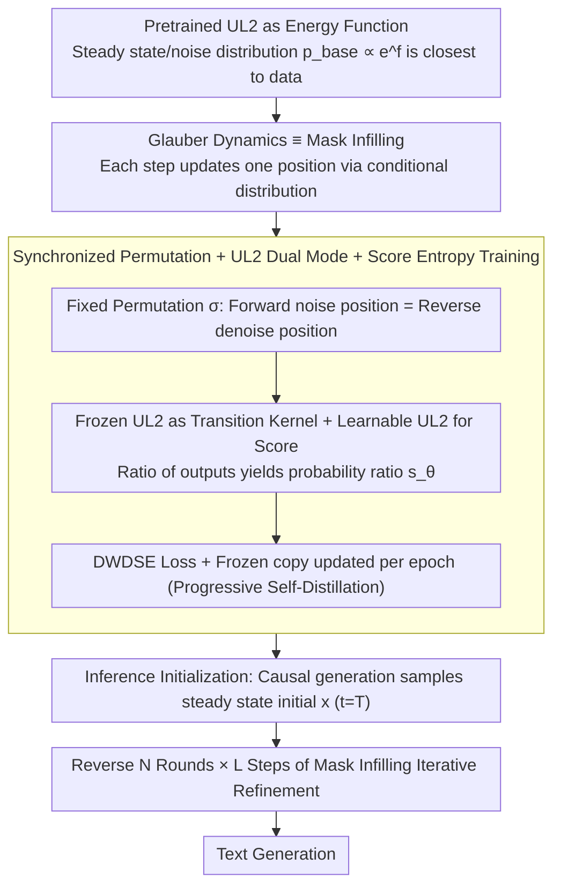

# Leveraging Pretrained Language Models as Energy Functions for Glauber Dynamics Text Diffusion

**Conference**: ACL 2026  
**arXiv**: [2605.04291](https://arxiv.org/abs/2605.04291)  
**Code**: TBD  
**Area**: Energy-Based Models / Text Generation / Discrete Diffusion  
**Keywords**: Glauber Dynamics, Discrete Diffusion Language Models, UL2, score entropy loss, energy functions

## TL;DR
This paper constructs discrete text diffusion using Glauber dynamics from statistical physics. By treating the pretrained UL2 model as the "energy function/noise distribution" and using mask infilling as the Markov transition kernel, the trained Glauber-UL2 **matches the generation perplexity of same-sized GPT-2-M/L AR models for the first time**. It outperforms MDLM in search and planning tasks like Sudoku/Zebra and surpasses AR in best-of-N results under iso-compute constraints.

## Background & Motivation
**Background**: Autoregressive (AR) LMs dominate text generation but suffer from structural weaknesses in global planning, complex structural constraints, and self-correction (Bachmann & Nagarajan 2024). Discrete diffusion LMs (D3PM, SEDD, MDLM, GGM, etc.) are promising alternatives but currently face challenges such as instability, slow training, weak theoretical foundations, or low sampling efficiency.

**Limitations of Prior Work**: While popular masked diffusion LMs (MDLM, SEDD-Absorb) offer fast inference, Zheng et al. 2025 strictly proved they **cannot surpass AR**—the optimal solution for their loss is equivalent to a time-invariant masked LM, and their perplexity advantage disappears at 64-bit precision (revealing "temperature hacking" in low precision). Liu et al. 2025 further proved that certain problems are inherently non-parallelizable, meaning MDLM's parallel sampling advantage comes at the cost of quality.

**Key Challenge**: As a **stochastic process minimizing path-wise relative entropy** (Föllmer 1985, Lehec 2013), a diffusion model's performance depends on: (a) the distance between the noisy and data distributions, and (b) the curvature/entropy decay rate of the underlying Markov chain. Existing discrete diffusion models use uniform, unigram, or absorbing distributions as the noisy distribution, which are distant from the real data distribution, and use independent token transition kernels with poor curvature.

**Goal**: (1) Bring the noisy distribution as close to the data distribution as possible to reduce the required steps; (2) Select a Markov chain with favorable entropy decay properties; (3) Reuse the compute invested in AR pretraining to avoid the sample inefficiency of training diffusion LMs from scratch.

**Key Insight**: The authors observe that:
- The pretrained LM itself is a **natural candidate** for a distribution closer to data than uniform/unigram distributions;
- The sampler specifically designed for "energy functions $p(x) \propto e^{f(x)}$" in statistical physics is **Glauber dynamics**, which updates one position $x_k$ at each step given all other positions $x_{\setminus k}$;
- The "conditional sampling" step in Glauber is essentially **mask infilling**;
- The UL2 model weights simultaneously support causal generation (sampling the approximate steady state) and mask infilling (acting as the conditional transition kernel), making it an ideal backbone.

**Core Idea**: Treat a pretrained UL2 as the energy function for Glauber dynamics. Use causal generation for steady-state initialization and mask infilling as the Markov transition kernel. Fine-tune the system as a diffusion transformer using score entropy loss.

## Method

### Overall Architecture
- **State Space**: Token sequence of length $L=1024$, vocabulary $\Sigma$, data distribution $p_D$.
- **Energy Function / Steady-state Distribution**: The pretrained UL2 defines $p_{\text{base}}(x) \propto e^{f(x)}$, where $f$ is implicitly defined by UL2.
- **Forward Markov Process**: Glauber dynamics with $N$ rounds $\times L$ steps = $T = N \cdot L$ total steps. For each round, a random permutation $\sigma_i$ of $[1, L]$ is fixed. At step $j$ of round $i$, only position $\sigma_i(j)$ is updated by sampling from $p(x_k \mid x_{\setminus k})$ (provided by UL2 mask infilling).
- **Loss & Training**: Diffusion Weighted Denoising Score Entropy (DWDSE), which learns the probability ratio $s_\theta(x, t)_y \approx p_{t|0}(y|x_0)/p_{t|0}(x_t|x_0)$.
- **Architecture**: UL2 (FLAN-T5 encoder-decoder) + AdaLN-Zero time embeddings + RoPE, with ~15% time-dependent parameters initialized to zero. One copy is frozen to serve as the transition kernel, while another is learnable for the reverse score.
- **Inference**: First, use UL2 at $t=T$ to perform causal generation for the initial $x$; then perform $N$ rounds in reverse order, where each round updates tokens via mask infilling according to the reverse permutation, totaling $(N+1)L$ model calls.

### Key Designs

**1. Pretrained LM as Energy Function: Pulling the noise distribution close to data**
Discrete diffusion typically trains slowly and underperforms compared to AR because the noisy distributions (uniform, unigram, absorbing) are too far from the real text distribution. The reverse process must travel a long "distance" from gibberish back to data, while diffusion receives only one supervisory signal per step compared to $L$ teacher-forcing signals in AR. This paper uses the pretrained UL2's implicit distribution $p_{\text{base}}(x) \propto e^{f_{\text{UL2}}(x)}$ as the steady-state/noise distribution. Since diffusion is a process of path-wise relative entropy minimization, a closer starting point enables higher sample efficiency.

**2. Glauber Dynamics ≡ Mask Infilling: Unifying the transition kernel and infilling operations**
Glauber dynamics is the standard sampler for energy functions $p(x) \propto e^{f(x)}$, updating $x_k$ given $x_{\setminus k}$ via the conditional $p(x_k \mid x_{\setminus k})$. This "fill-in-the-blank" step matches the mask infilling objectives (R-/S-/X-denoising) of UL2. Thus, the same set of weights can be used for both initial sampling (causal mode) and transition steps (infilling mode), ensuring theoretical convergence to a unique steady state.

**3. Synchronized Permutation + UL2 Dual Mode + Score Entropy Training: Aligning training and inference**
Traditional MDLM suffers from "position mismatch" between forward and reverse processes due to independent kernels. This method fixes permutations $\sigma_1, \dots, \sigma_N$ so that the token update order in the reverse process strictly matches the forward process. During training, a frozen UL2 and a learnable UL2 calculate the probability ratio $s_\theta = p_t(y)/p_t(x)$ to compute the DWDSE loss. The frozen copy is refreshed periodically, acting as progressive self-distillation.

### Loss & Training
- **DWDSE Loss**: $\mathcal{L}_{\text{DWDSE}} = \mathbb{E}_{x_0, x_t \sim p_{t|0}}[\int_0^T \sum_{y \sim x_t} Q_t(x_t, y)(s_\theta(x_t, t)_y - p_{t|0}(y|x_0)/p_{t|0}(x_t|x_0) \log s_\theta(x_t, t)_y + K(\cdot))dt]$, where $K(a) = a(\log a - 1)$.
- **Training Data**: OpenWebText.
- **Model Scale**: Glauber-UL2-M (419M, comparable to GPT-2-M), Glauber-UL2-L (898M, comparable to GPT-2-L).
- **Compute Cost**: 32 H100 $\times$ ~6 days for the large model; comparable to GGM (24 H100 $\times$ 8 days on TPU) under iso-TFLOPs.
- **Hyperparameters**: $L=1024$, $N \in \{1, 3\}$ (inference calls of $2L$ and $4L$).

## Key Experimental Results

### Main Results: Unconditional Generation Perplexity (Evaluated via GPT-2-L/XL/NEO, lower is better)

| Model | Params | Inference Steps | Gen PPL (GPT2-L) | Gen PPL (GPT2-XL) | Gen PPL (GPT-NEO) |
|------|--------|----------|-------------------|--------------------|--------------------|
| GPT-2-M (AR baseline) | 345M | $L=1024$ | 12.4 | 13.0 | 14.5 |
| GPT-2-L (AR baseline) | 774M | $L$ | 6.5 | — | 7.4 |
| SEDD-M | 424M | $T=2048$ | 27.3 | 28.0 | 25.2 |
| MDLM | 170M | $T=10$ | 4.2* | 45.4 | 40.9 |
| GGM | 387M | $T=4096$ | 19.5 | 19.9 | 18.0 |
| Plaid (continuous) | 1.3B | $T=4096$ | 19.7 | 19.7 | 17.9 |
| **Glauber-UL2-M ($N=1$)** | 419M | $T=2048$ | 17.1 | 17.5 | 16.6 |
| **Glauber-UL2-M ($N=3$)** | 419M | $T=4096$ | **13.2** | 13.7 | 14.9 |
| **Glauber-UL2-L ($N=1$)** | 898M | $T=2048$ | 9.5 | 9.9 | — |
| **Glauber-UL2-L ($N=3$)** | 898M | $T=4096$ | **6.9** | 7.8 | — |

(*MDLM's 4.2 PPL under GPT-2-L evaluation is identified as a "temperature hacking" artifact at lower precision.)

**Key Observation**: Glauber-UL2-M ($N=3$) at 13.2 $\approx$ GPT-2-M 12.4, **matching same-sized AR models for the first time in discrete diffusion**. Glauber-UL2-L ($N=3$) at 6.9 $\approx$ GPT-2-L 6.5, with the gap $< 0.5$ PPL, significantly outperforming SEDD/GGM/Plaid.

### Ablation Study

| Configuration | LAMB | WT2 | WT103 | 1BW | Gain / Meaning |
|------|------|-----|-------|-----|------|
| GPT-2-M (AR) | 15.60 | 22.76 | 26.37 | 55.72 | AR Reference |
| UL2-M pre-SEDD (causal only) | 21.7 | — | — | — | Baseline without diffusion |
| UL2-M post-SEDD CAUSAL-GEN | 19.1 | — | — | — | Improvement in causal mode |
| Glauber-UL2-M ($N=1$) | 17.89 | 23.95 | 30.21 | 56.12 | Better than baseline with 1 round |
| Glauber-UL2-M ($N=3$) | **17.14** | **20.98** | **25.47** | **52.18** | Matches GPT-2-M with 3 rounds |
| Glauber-UL2-L ($N=3$) | **10.14** | 20.35 | 20.83 | **44.12** | Approaches GPT-2-L |

### Iso-Compute Best-of-N (Compare AR with $2K$ candidates vs Glauber with $K$ candidates)

| Task | AR BoN=2 | AR BoN=4 | Glauber BoN=1 | Glauber BoN=2 |
|------|----------|----------|---------------|---------------|
| GSM8K | 43.9 | 46.1 | 46.9 | **50.4** |
| Winogrande | 68.3 | 69.7 | 69.4 | **71.2** |
| PIQA | 77.6 | 79.9 | 79.1 | **80.8** |
| SIQA | 48.9 | 50.3 | 49.5 | **50.2** |

Glauber BoN=1 (iterative self-correction) $\approx$ AR BoN=2 (independent sampling).

### Key Findings
- **$N$ is the critical tuning parameter**: $N=1$ allows UL2 to compete with GPT-2, while $N=3$ reaches or exceeds AR in PPL, suggesting iterative refinement is the true path for diffusion to surpass AR.
- **Causal generation improves after SEDD**: Score entropy training implicitly enhances the base UL2's language modeling performance.
- **Diffusion > AR under Iso-Compute**: Glauber's self-correction is more compute-efficient than independent sampling.
- **Common Sense Reasoning**: Glauber-M ($N=3$) outperforms GPT-2-M and SEDD-M, showing structural advantages in tasks requiring consistency.

## Highlights & Insights
- Applying **Glauber dynamics + Energy Functions from statistical physics** provides a first-principles foundation for discrete diffusion LMs.
- **UL2 as the backbone is a crucial design choice**: It enables reusing "steady-state samplers" and "transition kernels" within the same weights.
- **Synchronized permutations** resolve the training-inference mismatch inherent in MDLM.
- The **Iso-compute framework** provides a clearer positioning for diffusion LMs in the era of reasoning agents and test-time training.

## Limitations & Future Work
- **Inference Speed**: Requires $(N+1)L$ model calls, 2-4x slower than AR.
- **Training Cost**: High resource requirement (32 H100s for 6 days for a 0.9B model).
- **UL2 Dependency**: Requires specialized pretraining; high barrier to entry for replication.
- **Hyperparameter $N$**: Must be fixed in advance; dynamic $N$ or optimized permutations are unexplored.
- **Future Work**: (1) Flow matching for stability; (2) Parallel Glauber to reduce inference complexity; (3) Second-order optimization (Muon); (4) GRPO + Glauber for reasoning.

## Related Work & Insights
- **vs MDLM/SEDD-Absorb**: These use noise distributions far from data; Glauber-UL2 uses pretrained LM energy functions to bridge this gap.
- **vs GGM**: GGM uses unigram distributions; Glauber-UL2 achieves 13.2 PPL vs GGM's 19.5 by using a stronger noise distribution.
- **Key Insight**: Reusing pretrained models as steady-state distributions allows diffusion LMs to avoid "repooling" linguistic knowledge from scratch.

## Rating
- Novelty: ⭐⭐⭐⭐⭐ 
- Experimental Thoroughness: ⭐⭐⭐⭐ 
- Writing Quality: ⭐⭐⭐⭐ 
- Value: ⭐⭐⭐⭐⭐ 

<!-- RELATED:START -->

## Related Papers

- [\[ACL 2025\] EdiText: Controllable Coarse-to-Fine Text Editing with Diffusion Language Models](../../ACL2025/llm_nlp/editext_diffusion_text_editing.md)
- [\[ACL 2026\] Min-k Sampling: Decoupling Truncation from Temperature Scaling via Relative Logit Dynamics](min-k_sampling_decoupling_truncation_from_temperature_scaling_via_relative_logit.md)
- [\[ACL 2026\] Unlocking the Potential of Diffusion Language Models through Template Infilling](unlocking_the_potential_of_diffusion_language_models_through_template_infilling.md)
- [\[ACL 2026\] Text-to-Distribution Prediction with Quantile Tokens and Neighbor Context](text-to-distribution_prediction_with_quantile_tokens_and_neighbor_context.md)
- [\[AAAI 2026\] LILAD: Learning In-context Lyapunov-stable Adaptive Dynamics Models](../../AAAI2026/llm_nlp/lilad_learning_in-context_lyapunov-stable_adaptive_dynamics_models.md)

<!-- RELATED:END -->
