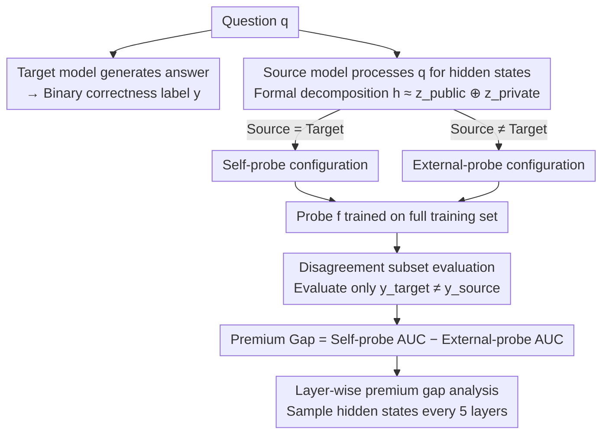

# Masked by Consensus: Disentangling Privileged Knowledge in LLM Correctness

**Conference**: ACL 2026  
**arXiv**: [2604.12373](https://arxiv.org/abs/2604.12373)  
**Code**: None  
**Area**: LLM/NLP  
**Keywords**: Privileged Knowledge, Correctness Prediction, Hidden State Probing, Inter-model Consensus, Domain Specificity

## TL;DR

By comparing the ability of self-probing (using the model's own hidden states) and external probing (using hidden states from other models) to predict correctness, this paper identifies "inter-model consensus" as a key confounding factor that masks privileged knowledge. After eliminating consensus, the study reveals domain-specific privileged knowledge: it exists in factual tasks but is absent in mathematical reasoning.

## Background & Motivation

**Background**: Recent studies indicate that LLMs can encode meta-information about their outputs through internal hidden states, including entity recognition, temperature reasoning, and cognitive state representations. A core question is whether LLMs possess "privileged knowledge" regarding answer correctness—internal signals inaccessible to external observers. Existing work shows that linear probes can predict output correctness with high accuracy from hidden states.

**Limitations of Prior Work**: Contradictory conclusions exist regarding the existence of privileged knowledge. Some research suggests probes primarily detect retrieval activation patterns rather than correctness signals, as external models can achieve predictive performance comparable to self-probes, implying privileged knowledge is absent. Conversely, other studies find that internal models indeed encode correct answer signals even when generating incorrect responses.

**Key Challenge**: Prior conclusions claiming "privileged knowledge does not exist" may result from confounded evaluations. When external models can utilize shared correctness patterns as proxy signals, true privileged knowledge (if it exists) may be obscured.

**Goal**: Design a rigorous experimental framework to resolve this debate and determine whether LLMs truly possess privileged knowledge about their own correctness.

**Key Insight**: The authors identify "inter-model consensus" as the critical confounding factor. Since models produce identical correct/incorrect labels for approximately 80% of questions, external probes can use the external model's own correctness patterns as a proxy for the target model's behavior. This confusion can be eliminated by constructing a "disagreement subset" (questions where models provide opposite labels).

**Core Idea**: While self-probes and external probes perform similarly on the full test set (showing no privilege), a significant premium gap (~5%) emerges in factual tasks on the disagreement subset, whereas no such gap exists in mathematical reasoning. This suggests privileged knowledge is domain-specific.

## Method

### Overall Architecture

Given a target model $M_{target}$ and a question $q$, the model generates an answer and obtains a binary correctness label $y \in \{0,1\}$. A source model $M_{source}$ processes the same question $q$ to obtain hidden states $\mathbf{h}$, and a classifier (probe) $f$ is trained to predict $y$. Different configurations are created by varying the source model: self-probing ($M_{source} = M_{target}$) and external probing ($M_{source} \neq M_{target}$). The premium gap is defined as the advantage of the self-probe over the external probe in terms of AUC.

### Key Designs

**1. Formal Definition of Privileged Knowledge: Separating "Publicly Observable" from "Private"**

The controversy persists because hidden states are often treated as inseparable black boxes. This paper proposes a decomposition: $\mathbf{h} \approx \mathbf{z}_{public} \oplus \mathbf{z}_{private}$. Here, $\mathbf{z}_{public}$ encodes inherent features of the question (domain, entity types, syntax) reproducible by any model reading the same question; $\mathbf{z}_{private}$ encodes model-specific internal states—such as whether a memory retrieval succeeded or the level of confidence during reasoning. "Privileged knowledge" is precisely defined as the correctness-related signals within $\mathbf{z}_{private}$. This turns the question into an operational hypothesis: can a self-probe access signals from $\mathbf{z}_{private}$ that an external probe cannot?

**2. Disagreement Subset Evaluation: Comparing Only Where Models "Dispute" to Force Out True Signals**

Comparing self-probes and external probes on the full test set is a trap. Since models of similar scale agree on labels ~80% of the time, external probes can "free-ride" by using their own internal patterns as proxies. The solution is the "disagreement subset"—retaining only questions where $y_{target} \neq y_{source}$. Here, the proxy signals of external models fail, and predictive success can only stem from the model's own internal state. A crucial technical detail is that probes are **still trained on the full training set** and only filtered during inference. Directly retraining on the disagreement subset would introduce new artifacts (perfect negative correlation between labels).

**3. Layer-wise Premium Gap Analysis: Tracking Signal Emergence Across Network Depth**

To verify if privileged signals originate from memory retrieval, the authors calculate the premium gap every 5 layers. The criterion is clear: if privileged signals stem from factual memory retrieval, they should emerge in the middle layers and accumulate toward the deeper layers, aligning with known "mid-layer info-flow" mechanisms. In factual tasks, the experimental curves follow this trajectory, providing mechanistic evidence for the retrieval-based origin of privileged knowledge.

### Experimental Thoroughness

The study uses three instruction-tuned models of similar scale (Llama-3.1-8B, Qwen2.5-7B, Gemma-2-9B) and an embedding model (Qwen3-Embedding-8B) as an external source. Five datasets are evaluated: factual knowledge (Mintaka, TriviaQA, HotPotQA) and mathematical reasoning (GSM1K, MATH). Linear probes (Logistic Regression + L2) with 10-fold nested stratified cross-validation are used, with AUC as the metric.

## Key Experimental Results

### Main Results

| Evaluation Mode | Factual Tasks Premium Gap | Math Reasoning Premium Gap |
| :--- | :--- | :--- |
| Full Test Set | $\approx 0$ (No advantage in 22/33) | $\approx 0$ (No advantage in any) |
| Disagreement Subset | **~5% (Significant in all 9 configs)** | $\approx 0$ (No significant advantage) |

| Dataset Type | Inter-model Consensus Rate | Notes |
| :--- | :--- | :--- |
| Factual Knowledge | ~80% | High consensus masks privileged signals |
| Math Reasoning | ~75% | No privileged signals even after removing consensus |

### Ablation Study

| Analysis Dimension | Factual Tasks | Math Reasoning | Notes |
| :--- | :--- | :--- | :--- |
| Early Layers (0-0.25) | Premium gap $\approx 0$ | No consistent advantage | Surface/syntax features (public info) |
| Middle Layers (0.25-0.40) | Premium gap turns positive | No consistent advantage | Factual retrieval signals emerge |
| Deep Layers (0.40-1.0) | Premium gap grows | MATH $\approx 0$, GSM1K negative | Factual privilege accumulates; math lacks it |
| MLP Probe | Qualitatively same | Qualitatively same | Nonlinearity does not change conclusions |
| Qwen-3-32B | Same trend | Same trend | Larger models do not change conclusions |

### Key Findings

- **Conclusions of "no privileged knowledge" on full sets are premature**: High inter-model consensus acts as a confounder. Gemma performs best as an external probe in 7/9 factual configurations likely because it encodes superior public features $\mathbf{z}_{public}$, not because privileged knowledge is absent.
- **Privileged knowledge is domain-specific**: Significant and consistent premium gaps (~5%) exist in factual tasks but are entirely absent in math. This suggests factual correctness depends on model-specific memory retrieval states, while math correctness is determined by problem structure observable by any model.
- **Privileged signals accumulate from middle layers**: This aligns with the middle-layer information flow mechanism for knowledge retrieval—where recall is dominated by flow from the subject to the answer token.
- **Anomaly in GSM1K**: External probes actually outperform self-probes on the disagreement subset (negative premium gap), suggesting math difficulty is dictated by problem structure rather than model-specific knowledge.

## Highlights & Insights

- **Methodological contribution is highly sophisticated**: Identifying "inter-model consensus" as a confounder and designing "disagreement subsets" reconciles previously contradictory findings. The "train full, evaluate subset" design is particularly effective at avoiding artifacts.
- **Factual vs. Math dichotomy** provides deep insight: Factual knowledge relies on model-specific parametric memory, while math reasoning relies on universal computation of problem structures. This explains why factual hallucinations are harder to detect externally than math errors.
- **Layer-wise emergence patterns** align with causal mechanisms, strengthening the interpretation that privileged knowledge stems from memory retrieval.
- **Disagreement subset methodology** is highly transferable to other research needing to isolate model-specific signals.

## Limitations & Future Work

- Analysis is limited to 7B-9B models; larger models might exhibit different patterns.
- Only factual knowledge and math reasoning are covered; mixed domains like coding and commonsense reasoning require exploration.
- Probing methods (linear and MLP) might not capture all privileged signals; more complex classifiers could reveal more.
- The study is correlational; future work could use activation steering to verify if intervening on the correctness direction in the residual stream predictably adjusts output correctness.

## Related Work & Insights

- **vs. Xiao et al. (2025)**: They proposed "universal correctness models" and argued privileged knowledge doesn't exist. This paper shows their conclusion was masked by consensus.
- **vs. Chi et al. (2025)**: They found hidden states were indistinguishable from correct answers during hallucinations. This paper's findings on the disagreement subset suggest their results might also be affected by consensus.
- **vs. Kadavath et al. (2022)**: They found LLMs predict their own correctness well. This paper further distinguishes true privileged knowledge from predictions based on public features.

## Rating

- Novelty: ⭐⭐⭐⭐⭐ 
- Experimental Thoroughness: ⭐⭐⭐⭐⭐ 
- Writing Quality: ⭐⭐⭐⭐⭐ 
- Value: ⭐⭐⭐⭐

<!-- RELATED:START -->

## Related Papers

- [\[ICLR 2026\] Stopping Computation for Converged Tokens in Masked Diffusion-LM Decoding](../../ICLR2026/llm_nlp/stopping_computation_for_converged_tokens_in_masked_diffusion-lm_decoding.md)
- [\[ACL 2025\] Disentangling Memory and Reasoning Ability in Large Language Models](../../ACL2025/llm_nlp/disentangle_memory_reasoning.md)
- [\[ACL 2025\] Enabling LLM Knowledge Analysis via Extensive Materialization](../../ACL2025/llm_nlp/enabling_llm_knowledge_analysis_via_extensive_materialization.md)
- [\[ACL 2026\] 当梯度相撞：多目标提示优化对 LLM 评判员的失效模式](when_gradients_collide_failure_modes_of_multi-objective_prompt_optimization_for_.md)
- [\[ACL 2025\] Condor: Enhance LLM Alignment with Knowledge-Driven Data Synthesis and Refinement](../../ACL2025/llm_nlp/condor_enhance_llm_alignment_with_knowledge-driven_data_synthesis_and_refinement.md)

<!-- RELATED:END -->
