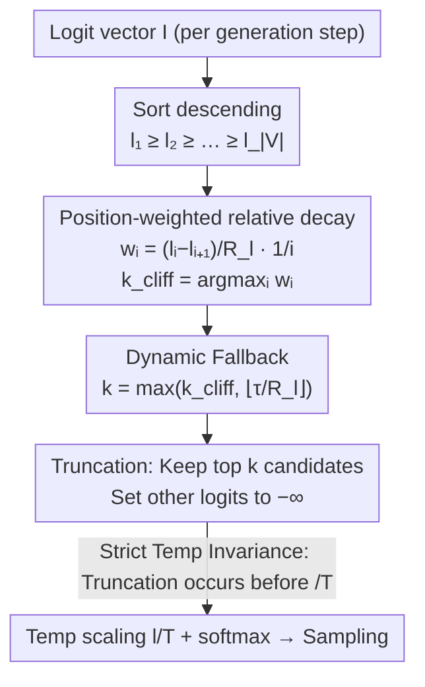

# Min-k Sampling: Decoupling Truncation from Temperature Scaling via Relative Logit Dynamics

**Conference**: ACL 2026  
**arXiv**: [2604.11012](https://arxiv.org/abs/2604.11012)  
**Code**: [https://github.com/YecanLee/Mink](https://github.com/YecanLee/Mink)  
**Area**: LLM Evaluation  
**Keywords**: Sampling Strategy, Temperature Invariance, Semantic Cliff Detection, Dynamic Truncation, Logit Space

## TL;DR

Min-k Sampling detects the "semantic cliff" (the boundary between high-confidence candidates and low-quality tail noise) by analyzing the local structure of sorted logit distributions. It achieves strict temperature-invariant truncation, maintaining robust reasoning and creative writing quality even at extreme temperatures.

## Background & Motivation

**Background**: LLM text generation quality highly depends on decoding sampling strategies. Mainstream methods such as Top-k, Top-p (nucleus sampling), and Min-p balance diversity and accuracy via probability space truncation. Recently, Top-$n\sigma$ shifted operations to the logit space to achieve temperature invariance.

**Limitations of Prior Work**: (1) Probability space methods (Top-k/p/Min-p) are extremely sensitive to temperature—noise rates exceed 90% when temperature exceeds 2.0, and they collapse completely at temperature 10.0; (2) Although Top-$n\sigma$ is temperature-invariant, it relies on global standard deviation $\sigma$, making it susceptible to interference from massive long-tail noise tokens and unable to precisely locate fine-grained confidence differences among high-confidence candidates; (3) Top-$n\sigma$ is highly sensitive to the hyperparameter $n$ ($n=1.0$ introduces noise, while $n=2.0$ amplifies it).

**Key Challenge**: Temperature scaling simultaneously controls two effects that should ideally be independent—increasing diversity among reasonable candidates (desired) and introducing noise tokens from the tail (undesired). An ideal truncation mechanism should decouple these two effects.

**Goal**: Design a dynamic truncation strategy that is temperature-invariant, insensitive to hyperparameters, and capable of precisely capturing the model's confidence boundary.

**Key Insight**: Analyze the local morphology of the sorted logit sequence rather than global statistics. Within the logit sequence arranged from high to low, there exists a "semantic cliff"—a sharp drop from meaningful candidate tokens to irrelevant noise tokens. The truncation boundary is determined by detecting the position of this cliff.

**Core Idea**: Use position-weighted relative decay rates to detect the maximum drop point (semantic cliff) of sorted logits. This calculation is strictly invariant to temperature scaling, achieving complete decoupling of truncation decisions from temperature.

## Method

### Overall Architecture

Min-k addresses the pain point where "truncation decisions are contaminated by temperature." Traditional methods leave the candidate set size to be determined by thresholds in the probability space, which change drastically with temperature, leading to an influx of noise tokens at high temperatures. Min-k shifts the perspective back to the logit space. At each generation step, after obtaining the logit vector $\mathbf{I}\in\mathbb{R}^{|V|}$, it sorts them in descending order and looks for a "semantic cliff"—the steepest drop between meaningful candidates and tail noise—along this curve. The cliff position is treated as the truncation point $k$. Logits after the cliff are set to $-\infty$, and only the remaining logits undergo temperature scaling and softmax for sampling. Since cliff detection only considers the relative morphology of logits and occurs before division by $T$, the composition of the candidate set in the entire pipeline is completely decoupled from temperature.

### Key Designs

**1. Position-Weighted Relative Decay: Locating the cliff using local slopes instead of global statistics**

Previous Top-$n\sigma$ relied on global standard deviation $\sigma$ to draw a line, where thousands of noise tokens in the long tail pull $\sigma$ larger, drowning out the truly important subtle drops among top candidates. Min-k instead examines the slope at each position: it first calculates the dynamic range $R_l = l_1 - l_{|V|}$ as a normalization benchmark, then calculates a weighted relative decay rate $w_i = \frac{l_i - l_{i+1}}{R_l}\cdot\frac{1}{i}$ for each adjacent interval. Here, $(l_i - l_{i+1})/R_l$ is the normalized local drop and $1/i$ is the position weight. The truncation point is taken as $k_{cliff}=\arg\max_i w_i$. The $1/i$ prior comes from an empirical observation—the most discriminative probability gaps almost always fall at the head of the distribution, so earlier drops should be amplified. Ablation studies confirm both factors are indispensable: removing $1/i$ allows $\arg\max$ to drift to the tail and include noise, while removing $R_l$ normalization causes collapse at high temperatures. Linear decay $1/i$ also outperforms logarithmic or quadratic forms.

**2. Dynamic Fallback Mechanism: Providing an exploration path when the "model is truly uncertain"**

When a model is highly uncertain and the logits are nearly uniform, the $w_i$ sequence lacks a clear peak, and $\arg\max$ easily collapses to $i^*=1$, degrading sampling to near-greedy. To prevent this, Min-k defines a fallback candidate size $k_{fallback}=\lfloor \tau / R_l\rfloor$, with the final $k=\max(k_{cliff}, k_{fallback})$. Here $\tau$ is a small constant; when the dynamic range $R_l$ is very small (extremely flat distribution), this term automatically increases to ensure at least a reasonable minimum exploration range. Ablations show this fallback is nearly irrelevant for structured reasoning tasks—the main mechanism is robust enough—but it serves as a necessary safety net to prevent diversity collapse in high-entropy open-ended generation.

**3. Strict Temperature Invariance: Locking the decoupling via basic derivation**

The core promise is that the truncation point is entirely unaffected by temperature, which can be strictly proven. Temperature scaling $l'_i = l_i/T$ does not change the ranking. In the normalized decay $d'_i = (l'_i - l'_{i+1})/(l'_1 - l'_{|V|})$, the factor $1/T$ exists in both the numerator and denominator and cancels out, meaning $d'_i = d_i$. Consequently, weighted decay $w'_i = d'_i/i = d_i/i = w_i$, thus $\arg\max_i w'_i = \arg\max_i w_i$. The truncation position $k$ remains constant for any $T$. This property narrows the responsibility of the "temperature" knob to only adjusting diversity within the selected candidate set, without affecting who is in that set—effectively untangling the two long-entangled effects of temperature scaling.

### Loss & Training

Min-k is a pure inference-time method requiring no training. The only hyperparameter is the fallback constant $\tau$ (default $3.0$), which experiments show has almost no impact on performance within the $1.0$–$10.0$ range. The execution order is first performing cliff detection and truncation on the original logits, then applying $l'/T$ scaling and softmax on the remaining logits to obtain the sampling distribution. The core implementation is less than ten lines of code with negligible computational overhead.

## Key Experimental Results

### Main Results

**Math Reasoning Accuracy (EM%, LLaMA3-8B-Instruct, GSM8K)**

| Method | T=1.0 | T=3.0 | T=5.0 | T=10.0 |
|------|-------|-------|-------|--------|
| Top-k | 75.44 | 9.86 | 0.08 | 0.00 |
| Top-p | 76.27 | 2.50 | 0.00 | 0.00 |
| Min-p | 75.36 | 28.81 | 0.38 | 0.00 |
| Top-$n\sigma$ | 75.44 | 72.55 | 74.07 | 73.77 |
| **Ours (Min-k)** | **77.39** | **76.02** | **76.48** | **74.79** |

**AQuA Reasoning Accuracy (EM%, LLaMA3-8B-Instruct)**

| Method | T=1.0 | T=5.0 | T=10.0 |
|------|-------|-------|--------|
| Top-$n\sigma$ | 48.03 | 44.49 | 49.61 |
| **Ours (Min-k)** | **50.00** | **50.39** | **46.06** |

**Creative Writing Win Rate (%, LLaMA3-8B-Instruct vs Greedy)**

| Method | T=1.0 | T=3.0 | T=10.0 |
|------|-------|-------|--------|
| Top-k | 50.80 | 1.40 | - |
| Top-p | 49.60 | 0.00 | - |
| Top-$n\sigma$ | 52.40 | 51.40 | 50.00 |
| **Ours (Min-k)** | **58.60** | **53.60** | **52.80** |

### Ablation Study

**Human Evaluation (200 Pairwise Comparisons, Min-k vs Top-$n\sigma$)**

| Preference | LLaMA3-8B | Qwen3-4B | Total |
|------|-----------|----------|------|
| Min-k Wins | 41 | 34 | 75 (37.5%) |
| Top-$n\sigma$ Wins | 33 | 34 | 67 (33.5%) |
| Tie | 26 | 32 | 58 (29.0%) |

### Key Findings

- Traditional methods almost completely collapse at $T > 2.0$ (noise rate $>90\%$), whereas Min-k maintains 74.79% accuracy on GSM8K at $T = 10.0$.
- Min-k outperforms all baselines even under the standard $T = 1.0$ setting (77.39% on GSM8K vs 75.44% for Top-$n\sigma$), suggesting that semantic cliff detection is advantageous even at normal temperatures.
- In creative writing, Min-k achieves a 58.60% win rate at $T = 1.0$, significantly better than all other methods.
- Human evaluation shows a clear advantage for Min-k on LLaMA3 (41 vs 33), while it performs similarly on Qwen3.
- The hyperparameter $\tau$ has minimal impact on performance within the 1.0-10.0 range, verifying the claim of low hyperparameter sensitivity.

## Highlights & Insights

- The complete decoupling of "truncation" and "temperature" is an elegant methodological solution to a long-standing entanglement.
- The proof for temperature invariance is concise and powerful: the factor $T$ is canceled out in the derivation.
- The algorithm is extremely simple—the core code is less than 10 lines with negligible computational overhead.
- The design of the $1/i$ position weight is intuitive and well-validated by experiments.

## Limitations & Future Work

- Binomial tests did not show a statistically significant difference between Min-k and Top-$n\sigma$ in human evaluation.
- The selection of $\tau$ in the fallback mechanism lacks theoretical guidance for extreme cases.
- Validated only on LLaMA3 and Qwen3 series; other architectures have not been tested.
- Future work could explore combining semantic cliff detection with acceleration techniques like speculative decoding.

## Related Work & Insights

- Represent a new advancement in logit space methods following Top-$n\sigma$, but replaces global $\sigma$ with local statistics.
- Shared naming convention with Min-p (dynamic truncation in probability space) but fundamentally different: Min-k operates in the logit space and is temperature-invariant.
- Provides a new paradigm for decoding strategy design: focusing on the local structure of the distribution rather than global features.

## Rating

- Novelty: ⭐⭐⭐⭐ The semantic cliff detection idea is novel and theoretically elegant, though it builds upon existing logit space methods.
- Experimental Thoroughness: ⭐⭐⭐⭐ Covers reasoning and creative writing tasks across 4 models, including human evaluation, though the practical utility of extreme temperature scenarios is debatable.
- Writing Quality: ⭐⭐⭐⭐⭐ Motivation is clearly articulated, the temperature invariance proof is concise, and experiments align well with the theory.

<!-- RELATED:START -->

## Related Papers

- [\[ACL 2026\] Leveraging Pretrained Language Models as Energy Functions for Glauber Dynamics Text Diffusion](leveraging_pretrained_language_models_as_energy_functions_for_glauber_dynamics_t.md)
- [\[AAAI 2026\] STEM: Efficient Relative Capability Evaluation of LLMs through Structured Transitive Evaluation Model](../../AAAI2026/llm_nlp/stem_efficient_relative_capability_evaluation_of_llms_through_structured_transit.md)
- [\[AAAI 2026\] LILAD: Learning In-context Lyapunov-stable Adaptive Dynamics Models](../../AAAI2026/llm_nlp/lilad_learning_in-context_lyapunov-stable_adaptive_dynamics_models.md)
- [\[ACL 2026\] GRASS: Gradient-based Adaptive Layer-wise Importance Sampling for Memory-Efficient LLM Fine-tuning](grass_gradient-based_adaptive_layer-wise_importance_sampling_for_memory-efficien.md)
- [\[CVPR 2025\] Dora: Sampling and Benchmarking for 3D Shape Variational Auto-Encoders](../../CVPR2025/llm_nlp/dora_sampling_and_benchmarking_for_3d_shape_variational_auto-encoders.md)

<!-- RELATED:END -->
