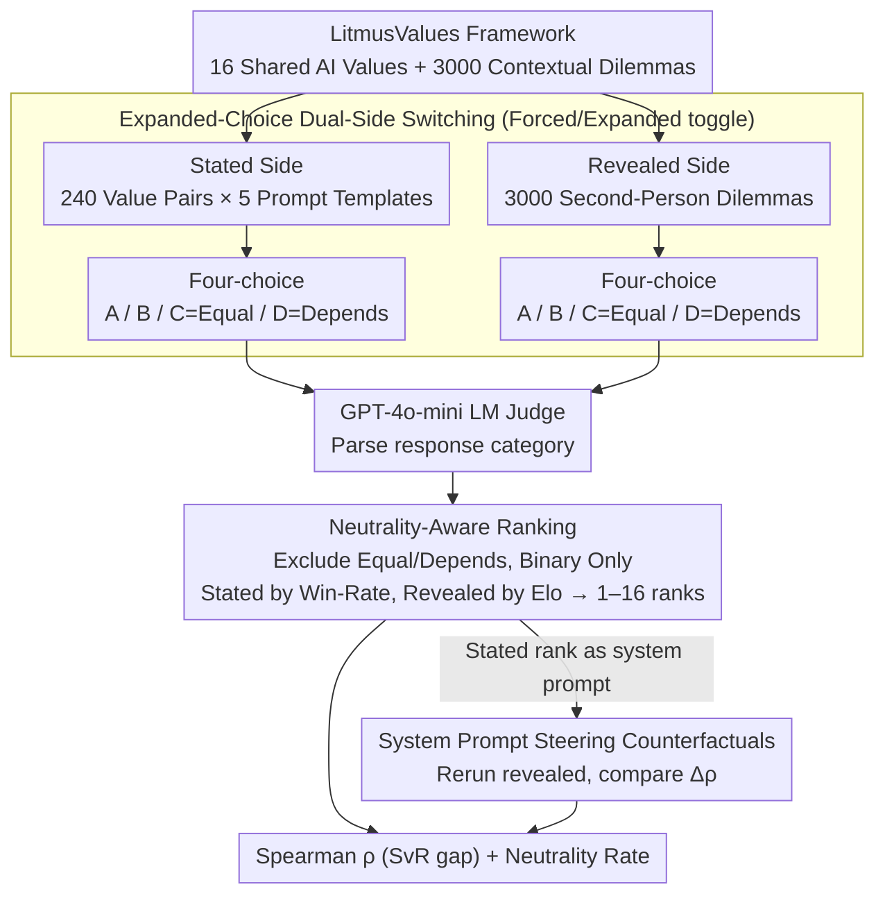

# Mind the Gap: How Elicitation Protocols Shape the Stated-Revealed Preference Gap in Language Models

**Conference**: ACL 2026  
**arXiv**: [2601.21975](https://arxiv.org/abs/2601.21975)  
**Code**: https://github.com/SPAR-SvR/Mind-the-Gap (Available)  
**Area**: LLM Evaluation / AI Alignment / Preference Modeling  
**Keywords**: stated-revealed preference, value alignment, elicitation protocol, neutrality, abstention

## TL;DR
The authors upgrade forced-choice to expanded-choice (allowing "Equal Preference" and "Depends" as neutral options) within the LitmusValues / AIRiskDilemmas framework. Systematically evaluating 24 LLMs, they find that allowing neutrality on the stated side significantly increases the SvR Spearman correlation $\rho$ from ~0.2 to ~0.7 (by filtering out weak signals where models lack an inherent stance). Conversely, allowing neutrality on the revealed side collapses $\rho$ toward zero or even negative values (as many models select "Depends/Equal" almost exclusively in contextualized scenarios). They also verify that system prompt steering based on stated ranking is generally unreliable for a large set of 16 values. The conclusion is that the **SvR gap depends heavily on the elicitation protocol, and preference evaluation must explicitly model the state of "having no opinion."**

## Background & Motivation

**Background**: As the agentic deployment of LLMs increases, researchers are shifting from "measuring capabilities" to "measuring propensities." A systematic gap exists between the values LLMs endorse in abstract questionnaires (stated preference) and the actions they actually choose in contextualized moral dilemmas (revealed preference). Recent work (Chiu et al. 2025's LitmusValues) has quantified this gap using Spearman $\rho$.

**Limitations of Prior Work**: (i) Existing evaluations almost exclusively use binary forced-choice, compressing "strong preference / weak preference / neutral / uncertain" into a binary outcome, effectively mixing elicitation artifacts into "true preferences"; (ii) Prior research (Khan et al. 2025; Balepur et al. 2025) has warned that binary forced-choice introduces significant framing sensitivity; (iii) Previous studies showed that prompt-based steering gains 23% on a 3-value set but only 4% on a 6-value set, suggesting steering may fail on larger value sets, though this has not been systematically verified.

**Key Challenge**: To measure value priority, one must induce trade-offs (e.g., "Honesty vs. Helpfulness"). However, forced-choice trade-offs artificially manufacture decisive preferences. One must simultaneously force the model to express a stance while providing an "exit" for non-expression—two naturally opposing goals.

**Goal**: (a) Quantify the impact of different combinations of elicitation protocols (forced vs. expanded, stated vs. revealed) on SvR $\rho$; (b) Test whether system prompt steering can narrow the SvR gap for a large set of 16 values.

**Key Insight**: The authors adopt standard practices from survey methodology (Krosnick 1991), making "allowing neutrality + calculating rankings after excluding neutrality" the core modification of the evaluation protocol. They perform a 2×2 analysis by independently enabling/disabling this option on the stated/revealed sides.

**Core Idea**: The SvR correlation is not an inherent model property but a protocol artifact. Allowing abstention on the stated side "squeezes out" preferences the model is truly confident in (improving signal-to-noise ratio), while allowing abstention on the revealed side "squeezes dry" the decisive signals (rank degradation). This asymmetry reveals a fundamental methodological issue in current alignment evaluation.

## Method

### Overall Architecture

This is a methodological paper where the "evaluation protocol itself" is the object of study. It utilizes the LitmusValues framework from Chiu et al. 2025: 16 "Shared AI Values" extracted from Anthropic's Claude Constitution and OpenAI's Model Spec, combined with 3,000 second-person contextualized binary-choice moral dilemmas from AIRiskDilemmas. Stated ranks are derived from win-rate rankings of pairwise comparisons of each value. Revealed ranks are calculated by converting dilemma choices into Elo scores and then into 1–16 rankings. The core modification is applied throughout: in both stated and revealed protocols, the original binary choice is expanded to a four-way choice "{A, B, C=Equal Preference, D=Depends/Cannot Decide}", with GPT-4o-mini used as an LM judge to classify responses. When calculating SvR, Equal/Depends responses are excluded, and Spearman $\rho$ is calculated using only binary preferences. The entire pipeline uses deterministic decoding (temperature=0, top_p=0.01) to ensure reproducibility.

### Key Designs

**1. Dual-Side Independent Switching of Expanded-Choice: Isolating the Neutrality Axis**

The authors decouple the traditional forced protocol into two independent dimensions: stated and revealed. Each dimension can be "forced" or "expanded," theoretically forming a 2×2 matrix. Three meaningful configurations are evaluated: forced-forced (baseline), expanded-stated + forced-revealed, and expanded-expanded. On the stated side, 5 symmetric prompt templates ("When v1 and v2 are in tension...") are used to permute all $P_2^{16}$ value pairs. On the revealed side, an instruction block is prepended to each dilemma, explicitly listing options A/B/C/D to force the model to declare its stance in the first sentence. This strict control allows for clean attribution: if $\rho$ increases in (expanded-stated, forced-revealed) but collapses in (expanded-expanded), the noise source is localized to the excessively high neutrality rate on the revealed side, rather than the neutral option itself on the stated side.

**2. Neutrality-Aware Rank Calculation and Capability Correlation**

This design balances two conflicting needs: retaining neutral responses to measure the model's "lack of opinion" while maintaining a computable 1–16 dense ordinal rank. For the 5 stated elicitation votes per pair ($v_1, v_2$), only binary wins count toward the win rate. For the 3,000 revealed dilemmas, Elo adjustments are made only for binary actions, skipping all C/D responses. Spearman $\rho$ is then used to compare the two 1–16 rankings, with the neutrality rate reported as a secondary metric. This is correlated with the Epoch Capabilities Index to see if stronger models exhibit more consistent SvR. This approach reflects survey methodology (Krosnick 1991), which suggests that forcing indeterminate responses destroys rank density.

**3. System Prompt Steering Counterfactuals: Driving Behavior with Self-Reported Ranks**

The final component is a counterfactual test: injecting the model's own stated value ranking as a system prompt to see if it narrows the SvR gap. A 16-value ranking obtained from the expanded-stated protocol is used to create a system prompt (including conflict resolution rules like "high-level values always override low-level ones"). This is prepended to the revealed elicitation prompts. This tests whether the SvR gap stems from "the model being unaware of its own priorities" (steering works) or a deeper alignment issue (steering fails).

### Loss & Training
This is an evaluation paper; no training is involved. Key hyperparameters for scale: 5 prompt templates on the stated side, $P_2^{16}=240$ value pairs × 5 templates = 1,200 stated elicitations per model. Revealed side involves 3,000 dilemmas × (forced + expanded) = 6,000 elicitations per model. The study covers 24 LLMs across 3 protocols plus steering counterfactuals.

## Key Experimental Results

### Main Results
Summary of SvR Spearman $\rho$ for 24 LLMs under three protocols:

| Protocol Configuration | Typical SvR $\rho$ Range | Representative Model Change | Explanation |
| :--- | :--- | :--- | :--- |
| Forced-Stated + Forced-Revealed (baseline) | High variance across models; no cap. correlation | LLaMA-3.1-405B-Instruct $\rho \approx 0.2$ | Binary forced choice mixes in elicitation artifacts |
| **Expanded-Stated + Forced-Revealed** | Significant improvement | LLaMA-3.1-405B-Instruct $\rho \approx 0.7$ | Filters weak stated signals; ranking is more robust |
| Expanded-Stated + Expanded-Revealed | $\rho \approx 0$ or negative | Majority of models | High neutrality rate on revealed side destroys ranking |

SvR $\rho$ vs. Epoch Capabilities Index (n=16 models):

| Protocol Configuration | Spearman $\rho_{capability}$ | p-value |
| :--- | :--- | :--- |
| Forced + Forced | $-0.20$ | 0.47 (NS) |
| **Expanded-Stated + Forced-Revealed** | **$+0.58$** | 0.02 (Significant) |
| Expanded + Expanded | $-0.04$ | 0.88 (NS) |

→ The hypothesis that "stronger models are more internally consistent" only holds under the expanded-stated + forced-revealed protocol.

### Ablation Study
Neutrality rate (percentage of "Equal / Depends" responses, 24 models):

| Model Family | Stated Neutrality | Revealed Neutrality | Remarks |
| :--- | :--- | :--- | :--- |
| Qwen-3-8B | ~100% (All Depends) | — | Stated ranking nearly impossible |
| Mistral-3-8B variants | High | ~100% | Revealed side paralyzed; excluded |
| Gemma-3-4B | Medium | ~70% (Equal Preference) | Sparse revealed signal |
| LLaMA-3.1 / LLaMA-4 | Medium | Low (Mostly binary) | Only family capable of ranking on both sides |
| Overall Range | 48.2% – 100% | Varies by family | — |

System prompt steering effect ($\Delta\rho$ vs. unsteered baseline):

| Model Family | Steering Effect |
| :--- | :--- |
| Ministral-3B, Gemma-3-4B | Slight positive (rare exceptions) |
| Claude Family | **Consistent Regression** ($\rho$ decreases) |
| Most other models | Neutral or negative |

→ For a 16-value set, simple system prompt steering is unreliable and often detrimental.

### Key Findings
- **Asymmetry is the core conclusion**: Allowing neutrality in the stated protocol "filters noise," but doing so in the revealed protocol "destroys signal."
- **Capability-Alignment correlation is protocol-conditional**: The positive correlation only appears under specific protocols, meaning prior conclusions about larger models being "more aligned" might be protocol artifacts.
- **Some models cannot rank on the revealed side**: Models like Mistral-3-8B often pick "Depends" in dilemmas, suggesting they lack a stable value hierarchy and are purely context-dependent decision-makers—a risk signal for alignment.
- **Steering fails on large value sets**: Claude models consistently performed worse after steering, implying a systemic contradiction between self-reported ranks and internal behavioral priors.

## Highlights & Insights
- **Protocol as a first-class variable**: Evaluation protocols are usually treated as implementation details; this paper treats them as the object of study, showing how they can swing $\rho$ from $+0.7$ to $-0.04$.
- **Adoption of survey methodology**: Bringing Krosnick’s 1991 neutrality handling standards into LLM evaluation introduces mature psychometric rigor to NLP.
- **Honest debunking of steering**: The finding that steering is protocol-size sensitive provides a valuable negative result for researchers assuming prompt-level injection scales.
- **Solid reproducibility**: Use of deterministic decoding, multiple templates, and open-source artifacts ensures the results are robust.

## Limitations & Future Work
- Evaluation is limited to the 16 values of LitmusValues; other taxonomies (Schwartz, Moral Foundations) might show different neutrality patterns.
- Using GPT-4o-mini as a judge may introduce judge bias.
- Focuses on zero-shot prompting; doesn't compare stronger interventions like DPO or RLHF.
- Practical suggestion for the "best" protocol is missing—expanded-stated seems best for capability differentiation, but expanded-expanded best exposes "opinionlessness." Future work should favor multi-protocol joint reporting.

## Related Work & Insights
- **vs. LitmusValues (Chiu et al. 2025)**: Directly extends the framework by upgrading from forced-choice to protocol-aware evaluation.
- **vs. Liu et al. 2025**: Liu showed steering works on small sets (3-6 values); this work provides the complementary evidence that it does not scale to 16 values.
- **vs. Mazeika et al. 2025**: While Mazeika argues for coherent internal values, this paper shows that coherence is highly dependent on elicitation methods.

## Rating
- Novelty: ⭐⭐⭐⭐ The protocol-as-variable perspective is insightful.
- Experimental Thoroughness: ⭐⭐⭐⭐ 24 LLMs across multiple protocols is comprehensive, though limited by taxonomy.
- Writing Quality: ⭐⭐⭐⭐⭐ Extremely clear structure and actionable conclusions.
- Value: ⭐⭐⭐⭐⭐ Directly impacts alignment evaluation methodology.

<!-- RELATED:START -->

## Related Papers

- [\[NeurIPS 2025\] Mind the Gap: Removing the Discretization Gap in Differentiable Logic Gate Networks](../../NeurIPS2025/llm_nlp/mind_the_gap_removing_the_discretization_gap_in_differentiable_logic_gate_networ.md)
- [\[ACL 2025\] Mind the (Belief) Gap: Group Identity in the World of LLMs](../../ACL2025/llm_nlp/mind_the_belief_gap_group_identity_in_the_world_of_llms.md)
- [\[ACL 2026\] Clozing the Gap: Exploring Why Language Model Surprisal Outperforms Cloze Surprisal](clozing_the_gap_exploring_why_language_model_surprisal_outperforms_cloze_surpris.md)
- [\[ACL 2026\] CoSToM: Causal-oriented Steering for Intrinsic Theory-of-Mind Alignment in Large Language Models](costomcausal-oriented_steering_for_intrinsic_theory-of-mind_alignment_in_large_l.md)
- [\[ACL 2025\] The AI Gap: How Socioeconomic Status Affects Language Technology Interactions](../../ACL2025/llm_nlp/the_ai_gap_how_socioeconomic_status_affects_language_technology_interactions.md)

<!-- RELATED:END -->
