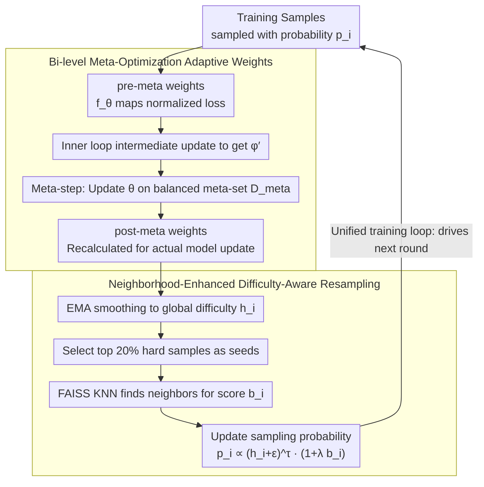

# Model-Agnostic Meta Learning for Class Imbalance Adaptation

**Conference**: ACL 2026 Findings  
**arXiv**: [2604.18759](https://arxiv.org/abs/2604.18759)  
**Code**: [GitHub](https://github.com/trust-nlp/ImbalanceLearning)  
**Area**: Medical Imaging  
**Keywords**: Class Imbalance, Meta Learning, Adaptive Weights, Difficulty-Aware Resampling, Bi-level Optimization

## TL;DR

This paper proposes HAMR (Hardness-Aware Meta-Resample), a unified meta-learning framework. It dynamically estimates instance-level weights through bi-level optimization to prioritize truly difficult samples, combined with a neighborhood-aware resampling mechanism to focus training on difficult instances and their semantic neighbors. It consistently outperforms strong baselines across 6 imbalanced NLP datasets.

## Background & Motivation

**Background**: Class imbalance is ubiquitous in NLP tasks such as text classification and Named Entity Recognition (NER). Existing methods are primarily categorized into loss re-weighting (e.g., Focal Loss, Dice Loss) and data resampling (over-sampling or synthetic generation).

**Limitations of Prior Work**: (1) These methods typically rely on predefined static heuristics—applying the same adjustment ratio to all samples within a category. (2) Sample difficulty is not synonymous with class membership; not all minority instances are inherently difficult, and not all majority samples are trivial. (3) Static schemes may erroneously down-weight informative majority samples while over-emphasizing simple minority instances.

**Key Challenge**: There is a need for a method that dynamically identifies and prioritizes truly difficult samples regardless of their class membership, adjusting learning strategies based on the model's evolving understanding of the data.

**Goal**: Design a unified framework to simultaneously address class imbalance and instance-level difficulty, dynamically guiding the model's training focus.

**Key Insight**: Decouple "what the model should focus on" (adaptive weighting) and "what the model should see" (resampling) into two complementary modules optimized within a unified meta-learning framework.

**Core Idea**: Utilize bi-level meta-optimization to dynamically learn instance importance weights (using pre-meta weights for intermediate updates in the inner loop and updating the weight network on a balanced meta-validation set in the outer loop to obtain post-meta weights for the actual update). This is paired with neighborhood-enhanced resampling based on FAISS to shift the training distribution toward difficult semantic regions.

## Method

### Overall Architecture

HAMR's starting point is to decouple two frequently conflated issues in class imbalance: "which samples the model should value" (instance-level difficulty) and "which samples the model should see" (training distribution). It constructs a training pipeline with two complementary modules. Adaptive weight estimation first uses a lightweight weight network $f_\theta$ to map normalized sample losses to instance importance weights, which are dynamically calibrated via bi-level meta-optimization. Difficulty-aware neighborhood resampling then smooths these weights into global difficulty scores via EMA and, in conjunction with KNN-based neighborhood enhancement, rewrites the sampling distribution for the next iteration. These two modules feed data to each other in a unified loop: weight estimation outputs "what to focus on" signals, and resampling determines "what to let the model see more of," pushing the training focus toward truly difficult semantic regions.

### Key Designs

**1. Bi-level Meta-Optimization Adaptive Weights: Replacing Static Heuristics with "Trial-and-Error"**

Methods like Focal/Dice apply fixed adjustment ratios to all samples within a class. However, sample difficulty is not equivalent to class membership—minority classes contain trivial samples, and majority classes contain highly informative difficult cases. HAMR employs bi-level optimization for dynamic weight estimation: the inner loop uses the current weight network's pre-meta weights $w_i^{\text{pre}}$ for an intermediate gradient update to obtain temporary parameters $\phi'$. The outer loop evaluates $f_{\phi'}$ on a class-balanced meta-validation set $\mathcal{D}_{\text{meta}}$, back-propagates to update the weight network parameters $\theta$, and then uses the updated network to recalculate post-meta weights $w_i^{\text{post}}$ for the actual model update. Pre-meta weights represent "what the model initially thinks is important," while post-meta weights represent "what actually benefits generalization after calibration against the balanced meta-set." This closed-loop approach is more adaptive to the changing difficulty distribution during training than any static ratio.

**2. Neighborhood-Enhanced Difficulty-Aware Resampling: Spreading Point-wise Difficulty to Regions**

Focusing solely on isolated difficult samples is insufficient, as their semantic neighbors are often equally challenging. HAMR first uses EMA to smooth post-meta weights into stable global difficulty scores $h_i \leftarrow \gamma\cdot h_i + (1-\gamma)\cdot w_i^{\text{post}}$. It then selects the top 20% difficult samples as "seeds" and uses FAISS-accelerated KNN to find $k$ semantic neighbors for each seed, calculating a neighborhood enhancement score $b_i$. The final sampling probability is $p_i \propto (h_i + \varepsilon)^\tau \cdot (1 + \lambda b_i)$. The temperature $\tau<1$ softens the sharpness of difficulty scores to encourage balanced exploration, while $\lambda b_i$ raises the sampling probability for entire semantic regions around difficult seeds. Consequently, difficulty signals are no longer confined to single samples but are diffused along semantic neighborhoods into regional training focal points.

**3. Unified Training Loop: Mutual Reinforcement of Modules in an End-to-End Flow**

The two modules are coupled through a fixed-rhythm cycle. To avoid the overhead of running KNN at every step, neighborhood enhancement is recalculated every $F$ epochs. However, every mini-batch passes through the full chain: sampling via current $p_i \rightarrow$ calculating pre-meta weights $\rightarrow$ inner intermediate update $\rightarrow$ meta-step updating the weight network on $\mathcal{D}_{\text{meta}} \rightarrow$ calculating post-meta weights for the actual update $\rightarrow$ refreshing global difficulty scores via EMA. Weight estimation provides instance-level importance for resampling, while resampling ensures the weight network continuously sees sufficient samples from difficult regions.

### A Complete Example

Consider the Cyclone-Idai19 classification task with a high imbalance ratio. In early training, a rare "Emergency Assistance Request" sample has a high loss, and the weight network assigns a large pre-meta weight. After an intermediate update based on this, the outer loop finds on the balanced meta-set that "over-emphasizing this specific sample actually harms overall Macro-F1," leading the meta-step to adjust the weight network to produce a more moderate post-meta weight. over time, this weight accumulates into the global difficulty score $h_i$ via EMA. When neighborhood enhancement is triggered, if the sample remains in the top 20%, FAISS will increase the sampling probability for other semantically similar assistance request samples. Thus, in subsequent batches, the entire "difficult assistance region" is seen more frequently—avoiding overfitting to a single outlier while ensuring the minority region is adequately learned.

### Loss & Training

The primary loss is weighted cross-entropy (classification) or token-level weighted loss (NER). The meta-validation set $\mathcal{D}_{\text{meta}}$ is constructed as a balanced set by combining the full validation set with samples from the training set selected based on median class counts. The input to the weight network is normalized via batch-wise z-score, and the output is clipped to a fixed range to ensure numerical stability.

## Key Experimental Results

### Main Results

| Dataset | Task | HAMR Macro-F1 | Best Baseline Macro-F1 | Gain |
|--------|------|-------------|----------------|------|
| BioNLP | NER | 72.7 | 70.6 (Dice) | +2.1 |
| TweetNER | NER | 60.2 | 59.0 (Dice/LNR) | +1.2 |
| MIT-Restaurant | NER | 81.1 | 80.4 (Dice) | +0.7 |
| Hurricane-Irma17 | CLS | 73.4 | 72.7 (ICF) | +0.7 |
| Cyclone-Idai19 | CLS | 65.7 | 63.8 (ICF) | +1.9 |
| SST-5 | CLS | 57.0 | 56.3 (ICF) | +0.7 |

### Ablation Study

| Configuration | BioNLP F1 | Irma17 F1 | Description |
|------|----------|----------|------|
| HAMR (Full) | 72.7 | 73.4 | Complete model |
| w/o Resampling | 71.4 | 72.1 | Remove neighborhood resampling |
| w/o Meta-Weight | 70.9 | 71.8 | Remove adaptive weighting |
| w/o Neighborhood Boost | 71.8 | 72.5 | Remove KNN neighborhood boost |

### Key Findings

- HAMR achieves the best Macro-F1 across all 6 datasets, with the most significant advantage (+1.9pp) on the dataset with the highest imbalance ratio (Cyclone-Idai19, IR=98.4).
- The two modules contribute synergistically; removing either results in a performance drop, though meta-weighting contributes slightly more than resampling.
- Neighborhood enhancement provides a consistent marginal gain (+0.6-0.9pp), proving the value of diffusing signals from point-wise difficulty to regional difficulty.

## Highlights & Insights

- The "trial-and-error" strategy of bi-level meta-optimization is elegant—the pre-meta weights act as a "draft," while feedback from the meta-validation set teaches the network what weight distribution truly favors generalization.
- The neighborhood-enhanced resampling approach is unique—treating hard samples as "seeds" to diffuse difficulty signals via semantic neighborhoods is more robust than focusing on isolated hard samples.
- The unified framework design decouples "what to focus on" from "what to see"—weighting determines *how to learn*, while resampling determines *what to learn from*.

## Limitations & Future Work

- Reliance on FAISS for KNN may present computational bottlenecks for extremely large datasets.
- The construction of the meta-validation set depends on reasonable assumptions regarding class distribution.
- Validation was only performed on BERT-based encoders; applicability in the LLM era remains unknown.
- Integration with synthetic data augmentation methods has not been explored.

## Related Work & Insights

- **vs Focal Loss/Dice Loss**: While static heuristics do not distinguish instance difficulty, HAMR dynamically learns instance weights.
- **vs Meta-Weight-Net**: Similar meta-learning frameworks exist but lack neighborhood resampling; HAMR adds regional-level training distribution adjustments.
- **vs SMOTE**: Instead of generating new synthetic samples, HAMR dynamically adjusts weights and sampling for existing samples, making it more lightweight and free of generation noise.

## Rating

- Novelty: ⭐⭐⭐⭐ The combination of bi-level meta-optimization and neighborhood resampling is novel, though individual components have precedents.
- Experimental Thoroughness: ⭐⭐⭐⭐ Covering 6 datasets and 2 tasks with detailed ablations, though comparisons with more recent methods could be added.
- Writing Quality: ⭐⭐⭐⭐ Clear methodology and comprehensive algorithmic pseudocode.
- Value: ⭐⭐⭐⭐ Provides a general and effective solution for class imbalance in NLP.

<!-- RELATED:START -->

## Related Papers

- [\[ICLR 2026\] Prompt-MII: Meta-Learning Instruction Induction for LLMs](../../ICLR2026/llm_nlp/prompt-mii_meta-learning_instruction_induction_for_llms.md)
- [\[NeurIPS 2025\] System Prompt Optimization with Meta-Learning](../../NeurIPS2025/llm_nlp/system_prompt_optimization_with_meta-learning.md)
- [\[ACL 2025\] Cultural Learning-Based Culture Adaptation of Language Models](../../ACL2025/llm_nlp/cultural_learning-based_culture_adaptation_of_language_models.md)
- [\[ACL 2025\] Meta-Reflection: A Feedback-Free Reflection Learning Framework](../../ACL2025/llm_nlp/meta-reflection_a_feedback-free_reflection_learning_framework.md)
- [\[NeurIPS 2025\] C²Prompt: Class-aware Client Knowledge Interaction for Federated Continual Learning](../../NeurIPS2025/llm_nlp/c2prompt_class-aware_client_knowledge_interaction_for_federated_continual_learni.md)

<!-- RELATED:END -->
