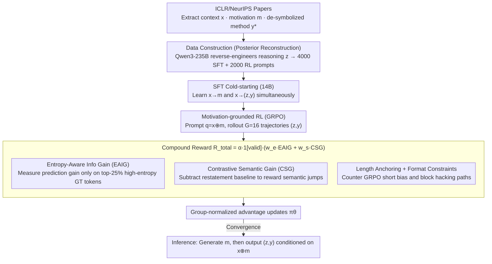

# MoRI: Learning Motivation-Grounded Reasoning for Scientific Ideation in Large Language Models

**Conference**: ACL 2026  
**arXiv**: [2603.19044](https://arxiv.org/abs/2603.19044)  
**Code**: See the paper's GitHub (The paper mentions "The code is available on GitHub" but provides no specific URL)  
**Area**: Scientific Ideation / LLM Reasoning / RL for Reasoning  
**Keywords**: Scientific Ideation, Motivation-grounded Reasoning, GRPO, Entropy-Aware Information Gain, Contrastive Semantic Gain  

## TL;DR
Scientific ideation is explicitly modeled as a two-stage conditional reasoning task: "context → motivation → reasoning → method." Based on SFT cold-starting, a 14B model is trained using GRPO and a pair of novel verifiable rewards (**Entropy-Aware Information Gain, EAIG** and **Contrastive Semantic Gain, CSG**). The model outperforms agentic frameworks such as GPT-4o, Claude-3.5-Sonnet, and AI-Scientist-V2 on held-out test sets from ICLR/NeurIPS.

## Background & Motivation

**Background**: LLMs are evolving from chatbots toward "scientific assistants / autonomous researchers," with scientific ideation (generating new methods from research context) considered the most upstream task. Existing solutions primarily rely on **agentic pipelines**—such as AI-Scientist-V2, ResearchAgent, and VirSci—which simulate the human research process through multi-agent debates, tree search, or peer reviews.

**Limitations of Prior Work**: (1) These agentic frameworks essentially use heuristic scaffolding to "patch together" base LLMs into researchers without enhancing the model's intrinsic scientific reasoning capabilities. The outputs often consist of **superficial conceptual recombinations** lacking technical depth. (2) Large-scale human evaluations (Si et al. 2024 / Kumar et al. 2025) confirm that native LLMs capture "new ideas" but struggle with implementation details and feasibility. (3) Sutton’s *Bitter Lesson* warns that relying on external scaffolding is unsustainable; reasoning must be internalized.

**Key Challenge**: Scientific ideation lacks a "standard answer"—a single context can have multiple valid Method sections, and these methods vary significantly in wording. This presents three difficulties for RL training: (a) lack of a deterministic verifier (unlike math or code with unit tests); (b) high noise when using reference probability or perplexity as rewards; and (c) the high cost and hackability of LLM-as-a-judge rewards.

**Goal**: Rather than relying on agentic scaffolding, the goal is to **internalize the scientific reasoning process into the model via RL**, forcing the model to explicitly learn the chain of thought from "research motivation to method."

**Key Insight**: High-quality method sections contain "hard knowledge" (e.g., specific algorithms or parameters) within high-entropy, unpredictable tokens, whereas boilerplate text like "we propose to" carries almost zero information. Furthermore, a method should move the model **from the context toward the ground-truth method** in semantic space, rather than merely restating the context.

**Core Idea**: Ideation is split into a two-stage process $x \to m \to (z, y)$. RL is applied using two **complementary verifiable rewards**: EAIG (measuring whether reasoning improves prediction accuracy on high-entropy tokens of the ground-truth method) and CSG (measuring whether the generated method truly "advances" in semantic space relative to a contrastive baseline), supplemented by length anchoring and format constraints to prevent reward hacking.

## Method

### Overall Architecture
MoRI is a three-stage pipeline (Figure 2 + 7):
(1) **Data Construction**: Context $x$, motivation $m$, and de-symbolized method $y^*$ are extracted from ICLR 2024-2025 papers. Using "posterior reconstruction," Qwen3-235B-Thinking first generates an initial reasoning $z_{\text{init}}$ from the context alone. Then, Qwen3-235B-Instruct rewrites $z_{\text{init}}$ into $z$ aligned with the ground-truth given $(x, y^*)$, reverse-engineering a 4000-sample SFT set and a 2000-sample RL prompt set.
(2) **SFT Cold-starting**: Two tasks are trained simultaneously on DeepSeek-R1-Distilled-Qwen-14B: motivation generation ($x \to m$) and method generation ($x \to (z, y)$).
(3) **Motivation-grounded RL**: Optimized using GRPO with token-level loss and clip-higher. Each prompt is concatenated as $q = x \oplus m$, and $G=16$ trajectories $(z_i, y_i)$ are rolled out. Group-normalized advantages are calculated based on a compound reward.
**Inference**: The model first generates motivation $m$, then produces reasoning and the method conditioned on $x \oplus m$.

### Key Designs

**1. Entropy-Aware Information Gain (EAIG): Rewarding Prediction Gains on "Hard Tokens"**

The fundamental difficulty in open-ended ideation is the lack of a deterministic verifier. EAIG focuses only on the "hard" tokens in the ground-truth method. First, a fixed SFT model calculates the entropy of each position under teacher-forcing: $H_t = -\sum_v \pi_{\text{sft}}(v \mid x, m, y^*_{<t}) \log \pi_{\text{sft}}(\cdot)$. The top 25% highest-entropy tokens form a mask $\mathcal{M}_t$. Empirically, this selects 34.2% of technical terms while common words and numbers account for only 14.5% and 5.5%, respectively. The per-token prediction improvement is then calculated:

$$g_t(z) = \log \pi_\theta(y^*_t \mid x, m, z, y^*_{<t}) - \log \pi_{\text{sft}}(y^*_t \mid x, m, y^*_{<t})$$

The final reward is the average over the mask: $\Delta_{IG}(z) = \frac{1}{\sum \mathcal{M}_t} \sum_t \mathcal{M}_t \cdot g_t(z)$. By anchoring rewards to fixed GT tokens, MoRI prevents reward hacking; no matter what the model writes, it cannot change which GT tokens are technical details.

**2. Contrastive Semantic Gain (CSG): Forcing Real Semantic Leaps**

While EAIG handles technical depth, CSG ensures the method moves toward the ground-truth solution space. Using $S_{gen} = \cos(\mathbf{E}(\hat{y}), \mathbf{E}(y^*))$ alone allows for "lazy" high scores by simply rephrasing the context. CSG introduces a counterfactual baseline $S_{base} = \cos(\mathbf{E}(x \oplus m), \mathbf{E}(y^*))$, representing the similarity gained by paraphrasing the input. The reward is only given for the increment $\Delta_{sem} = S_{gen} - S_{base}$. $\Delta_{sem} > 0$ implies the model has pushed the semantic focus from the problem space to the solution space.

**3. Length Anchoring + Format Constraints: Countering GRPO's Implicit Short Bias**

EAIG's high variance can trigger two types of collapse: shrinking reasoning chains or "entropy hacking" through gibberish. Format constraints $\mathds{1}[\text{valid}]$ require the CoT to be non-empty, $\ge 1000$ characters, and free of `##`/`###` (to prevent leaking method content into the reasoning segment). Length anchoring uses a modulation factor:

$$\alpha(z) = \min\Big(1,\ 1 - \lambda \frac{L_{anchor} - |z|}{L_{anchor}}\Big)$$

This discounts rewards when $|z| < L_{anchor}$, forcing the model to maintain reasoning depth. The total reward is $R_{\text{total}} = \alpha(z) \cdot \mathds{1}[\text{valid}] \cdot (w_e f_{\text{step}}(\Delta_{IG}) + w_s f_{\text{step}}(\Delta_{sem}))$, with optimal weights at $w_s = 0.7, w_e = 0.3$. 

### Loss & Training
GRPO with token-mean loss, $\varepsilon_{\text{low}}/\varepsilon_{\text{high}} = 0.2/0.28$ (clip-higher), KL coefficient 0.001, rollout $G=16$, lr $5 \times 10^{-7}$ with 10% warmup cosine, global batch 8, temperature 1.0, and max prompt/response length of 5000. Continuous gains are quantized into 4 discrete levels for noise resistance: EAIG thresholds $[1.0, 1.5, 2.0]$, CSG thresholds $[0.01, 0.05, 0.1]$, with reward levels $[0, 0.5, 0.8, 1.0]$.

## Key Experimental Results

### Main Results
Evaluated on 83 ICLR 2025 in-domain papers and 67 NeurIPS 2025 OOD papers (Metrics: Novelty / Tech Rigor / Feasibility / Mean, 1-5 scale; Gemini-2.5-Pro RAG LLM-judge + 3 PhD human evaluators):

| Model / Framework | ICLR Mean | NeurIPS OOD Mean | Combined Mean | Δ vs MoRI |
|------------|-----------|------------------|---------------|-----------|
| GPT-4o | 2.69 | 2.77 | 2.74 | +16.1% |
| Claude-3.5-Sonnet | 3.09 | 3.13 | 3.11 | +2.3% |
| AI-Scientist-V2† (Sonnet, ICLR only) | 3.14 | – | – | +1.6% |
| AI-Scientist-V2 (GPT-4o) | 2.71 | 2.48 | 2.60 | +22.3% |
| ResearchAgent | 2.60 | 2.37 | 2.50 | +27.2% |
| VirSci | 2.25 | 2.23 | 2.24 | +42.0% |
| Full-SFT (x → m → y) | 2.99 | 2.85 | 2.93 | +8.5% |
| **MoRI** | **3.19** | **3.15** | **3.18** | — |
| Ground Truth (oracle) | 3.58 | 3.59 | 3.59 | – |

On ICLR, MoRI's Feasibility (3.11) is 10.3% higher than Claude-3.5-Sonnet (2.82), and Rigor is 2.9% higher. The only dimension where it is surpassed by Claude Sonnet (3.39) and AI-Scientist-V2†(Sonnet) (3.45) is Novelty. Human-LLM correlation Pearson $r = 0.715$ ($p < 0.001$), and the 95% bootstrap CI [3.11, 3.25] does not overlap with any agentic baselines.

### Ablation Study

| Config | Novelty | Rigor | Feas. | Mean | Observation |
|------|---------|-------|-------|------|------|
| Full-SFT (direct $x \to y$) | 2.80 | 2.69 | 2.81 | 2.75 | No explicit motivation modeling |
| Full-SFT (two-stage $x \to m \to y$) | 2.85 | 2.76 | 2.94 | 2.85 | +0.10, motivation conditioning helps |
| MoRI (full) | 3.30 | 3.00 | 3.16 | 3.15 | +0.30 vs two-stage SFT |
| EAIG only ($w_s=0, w_e=1$) | 2.68 | 2.22 | 2.63 | 2.51 | Reward collapse + length explosion |
| CSG only ($w_s=1, w_e=0$) | 3.16 | 2.93 | 3.06 | 3.05 | Stable but suboptimal |
| Balanced ($w_s=w_e=0.5$) | 3.32 | 2.96 | 2.98 | 3.09 | Close to optimal |
| **Optimal ($w_s=0.7, w_e=0.3$)** | **3.34** | **3.04** | 3.07 | **3.15** | CSG as primary, EAIG as supplement |
| Top-50% Entropy Mask | 3.16 | 2.78 | 3.00 | 2.98 | Noisy tokens hinder performance |
| **Top-25% Entropy Mask** | **3.32** | **2.96** | **2.98** | **3.09** | +3.7%, purer tech token signal |
| Optimal w/o Length Anchor | 3.22 | 2.94 | 3.00 | 3.05 | -0.10 |
| **Optimal w/ Length Anchor** | **3.34** | **3.04** | **3.07** | **3.15** | +3.2% |

### Key Findings
- **EAIG cannot function alone**: Pure EAIG leads to CoT length explosion and gibberish content ("entropy hacking"), proving the need for a macro-level directional signal.
- **CSG is the foundation**: A $w_s : w_e = 7 : 3$ ratio outperforms 5:5, suggesting that the "semantic direction" provided by CSG is the stable signal, while EAIG adds technical depth.
- **Entropy masks must be strict**: A top-50% mask includes common words, introducing noise; a top-25% mask ensures the model learns to "explain hard tokens" rather than "padding word count."
- **Length Anchoring is essential**: Appendix F explains that GRPO's group normalization maximizes the Sharpe ratio, favoring low-variance (short) CoTs. Anchoring provides the necessary positive gradient to stabilize training.
- **Minimal OOD performance decay**: ICLR 3.19 → NeurIPS 3.15 ($\Delta = 0.04$) is not significant, proving the model learns reasoning patterns rather than venue templates.
- **Outperforming agentic frameworks**: MoRI (14B + internalized reasoning) significantly outperforms AI-Scientist-V2 using GPT-4o (3.18 vs 2.60, +22.3%) with $p < 0.001$.

## Highlights & Insights
- **Decoupling using "motivation as RL condition"**: Conditioning $(z, y)$ on $m$ simplifies RL by focusing on "problem to solution" reasoning rather than simultaneous "questioning + solving."
- **EAIG as a surrogate verifier**: By measuring relative likelihood gains on "hard tokens," EAIG solves the lack of verifiers in open-ended generation. Anchoring it to the ground truth prevents reward hacking.
- **$S_{base}$ in CSG is a vital detail**: Subtracting the restatement baseline ensures the model is rewarded only for generating content that "goes beyond the input."
- **Theory-Experiment Closure**: The use of Sharpe ratio analogies to explain and correct GRPO's short bias provides a formal understanding of training dynamics.

## Limitations & Future Work
- **Limitations**: (1) Limited to CS/ML; (2) Evaluation relies on LLM-judge/manual checks rather than physical experiments; (3) Risk of large-scale "paper mill" usage.
- **Ours**: (1) Novelty still lags behind Claude-3.5-Sonnet; (2) Posterior reconstruction introduces hindsight bias; (3) Entropy masks are static and may drift during training; (4) Sensitivity to the embedding model for CSG.
- **Future Work**: Implementing online updates for EAIG reference distributions; introducing RAG to improve Novelty; using real introductions instead of posterior reconstruction to reduce hindsight bias.

## Related Work & Insights
- **vs Agentic Frameworks (AI-Scientist-V2, etc.)**: These rely on scaffolding; MoRI internalizes reasoning into weights, achieving better performance and faster inference.
- **vs Verifier-free RL (NOVER, etc.)**: MoRI uses localized signals (EAIG) and contrastive baselines (CSG) to reduce the noise typical of reference-based rewards.
- **vs LLM-as-a-judge (Dr. Tulu, etc.)**: MoRI is model-based (embeddings and logprobs), making it significantly cheaper and harder to hack.
- **vs Beyond 80/20**: While that work filters entropy on reasoning tokens, MoRI filters entropy on the **ground-truth target**, providing a more robust anchor.

## Rating
- Novelty: ⭐⭐⭐⭐ First end-to-end RL for open-ended scientific ideation.
- Experimental Thoroughness: ⭐⭐⭐⭐⭐ Extensive testing, ablations, and statistical corrections.
- Writing Quality: ⭐⭐⭐⭐ Strong theoretical and visual evidence.
- Value: ⭐⭐⭐⭐ Provides a reproducible paradigm for "internalizing reasoning" in open-ended tasks.

<!-- RELATED:START -->

## Related Papers

- [\[ACL 2026\] DeCoVec: Building Decoding Space based Task Vector for Large Language Models via In-Context Learning](decovec_building_decoding_space_based_task_vector_for_large_language_models_via_.md)
- [\[ACL 2025\] The Role of Deductive and Inductive Reasoning in Large Language Models](../../ACL2025/llm_nlp/the_role_of_deductive_and_inductive_reasoning_in_large_language_models.md)
- [\[ACL 2025\] Disentangling Memory and Reasoning Ability in Large Language Models](../../ACL2025/llm_nlp/disentangle_memory_reasoning.md)
- [\[ACL 2026\] Repeated Sequences Reveal Gaps between Large Language Models and Natural Language](repeated_sequences_reveal_gaps_between_large_language_models_and_natural_languag.md)
- [\[ACL 2026\] Adam's Law: Textual Frequency Law on Large Language Models](adam39s_law_textual_frequency_law_on_large_language_models.md)

<!-- RELATED:END -->
