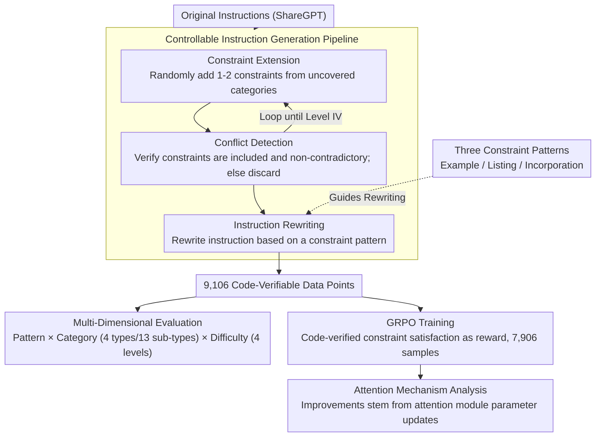

# MulDimIF: A Multi-Dimensional Constraint Framework for Evaluating and Improving Instruction Following in Large Language Models

**Conference**: ACL 2026  
**arXiv**: [2505.07591](https://arxiv.org/abs/2505.07591)  
**Code**: [GitHub](https://github.com/Junjie-Ye/MulDimIF)  
**Area**: LLM Evaluation and Improvement  
**Keywords**: Instruction following, multi-dimensional constraints, evaluation benchmark, GRPO training, attention mechanism analysis

## TL;DR
The authors propose MulDimIF, a multi-dimensional constraint framework that systematically evaluates the instruction-following capabilities of LLMs across three dimensions: constraint patterns (3 types), constraint categories (4 categories, 13 subcategories), and constraint difficulty (4 levels). Model performance is significantly improved via GRPO training, with findings indicating that improvements primarily stem from parameter updates in the attention modules.

## Background & Motivation

**Background**: Instruction following is a fundamental capability of LLMs, especially critical in Agent and tool-assisted workflows. Outputs must strictly adhere to format requirements like JSON, as minor deviations can lead to downstream system failures.

**Limitations of Prior Work**: (1) Existing evaluation benchmarks (e.g., IFEval) primarily focus on the diversity of constraint categories but utilize a single evaluation dimension, failing to comprehensively characterize instruction-following capabilities. (2) Training methods often boost benchmark scores through data engineering but rarely analyze the internal mechanisms of performance improvement. (3) There is a lack of systematic research on constraint presentation styles (Examples/Listing/Incorporation) and difficulty gradients.

**Key Challenge**: Both evaluation and training lack a multi-dimensional perspective. Existing methods cannot distinguish whether a model "fails to understand the constraint type," "struggles with complex constraint combinations," or "finds it difficult to extract constraints from specific presentation styles."

**Goal**: To build a multi-dimensional framework covering constraint patterns, categories, and difficulty, utilized for both fine-grained evaluation and guiding training improvements, while analyzing the underlying mechanisms of these improvements.

**Key Insight**: Three constraint patterns (Example, Listing, Incorporation) are refined from real-world user prompt writing guides. A multi-dimensional evaluation system is constructed by combining these patterns with constraint categories and difficulty gradients.

**Core Idea**: A controllable pipeline involving constraint extension $\rightarrow$ conflict detection $\rightarrow$ instruction rewriting is used to generate code-verifiable evaluation data. Additionally, it is discovered that performance gains from GRPO training primarily occur through the attention modules.

## Method

### Overall Architecture
MulDimIF consists of an evaluation framework and an improvement pipeline. The evaluation framework defines three constraint patterns (Example/Listing/Incorporation), four constraint categories (Content/Format/Language/Length, with 13 subcategories), and four difficulty levels (combinations of 1-4 constraint types). The improvement pipeline first utilizes a controllable instruction generation pipeline (Constraint Extension $\rightarrow$ Conflict Detection $\rightarrow$ Instruction Rewriting) to transform raw instructions from ShareGPT into code-verifiable data. This data is then used for multi-dimensional evaluation and GRPO training. Finally, the source of improvement is analyzed at the parameter level.

### Key Designs

**1. Three Constraint Patterns: Treating "How constraints are written into the instruction" as an evaluation dimension**

Previous benchmarks (like IFEval) focused solely on the diversity of constraint categories while ignoring that the same constraint can be presented in completely different ways, as real users do. This study distills three patterns from user prompt guides: the **Example** pattern provides Q&A examples satisfying constraints (akin to in-context learning); the **Listing** pattern lists constraints as a structured list (zero-shot friendly); and the **Incorporation** pattern embeds constraints into the instruction text, which flows naturally but is the hardest to parse. This categorization is valuable because it distinguishes whether a model "fails to understand the constraint type" or "struggles to extract the constraint from a specific presentation style"—experimental results showing models perform best on Example and worst on Incorporation prove that the presentation itself is an independent and significant source of difficulty.

**2. Controllable Instruction Generation Pipeline: Automating the transformation of ordinary instructions into code-verifiable constraint variants**

Manually constructing constraint-rich instructions is expensive and difficult to scale while maintaining diversity and controlling the distribution of categories and difficulties. The pipeline automates this in three steps: **Constraint Extension** randomly selects from uncovered categories and adds 1-2 specific constraints, looping until Level IV difficulty is reached. **Conflict Detection** verifies the new constraints are correctly written and non-contradictory; instructions failing this are discarded to ensure data hygiene. **Instruction Rewriting** randomly selects one of the three patterns to rewrite the final instruction. Using instructions sampled from ShareGPT, the process yields 9,106 code-verifiable data points. The "code-verifiable" nature is crucial—constraint satisfaction is determined by code rather than an LLM-as-judge, eliminating subjectivity and allowing the data to serve as reward signals for GRPO.

**3. Attention Mechanism Analysis: Moving beyond "efficacy" to answer "why GRPO is effective"**

Most training methods only report benchmark score increases without explaining which model components drive the improvement. Through parameter-level comparative analysis and case studies, the authors find that the improvement in instruction following brought by GRPO training primarily stems from parameter updates in the attention modules. These updates allow the model's attention focus to better align with specified constraints. This conclusion transforms "black-box improvements" into an interpretable mechanism, validating the source of progress and providing a basis for more precise future training (e.g., fine-tuning only the attention layers).

### Loss & Training
The GRPO (Group Relative Policy Optimization) algorithm is employed for training on 7,906 data points. The constraint satisfaction rate, verified via code, serves as the reward signal.

## Key Experimental Results

### Main Results (Overall Scores)

| Model | Example | Listing | Incorporation | Overall |
| :--- | :--- | :--- | :--- | :--- |
| Claude 3.5 Sonnet | 72.50 | 69.00 | 61.00 | **67.50** |
| Qwen3-32B (Reason) | 70.50 | 69.50 | 59.50 | 66.50 |
| Gemini 1.5 Pro | 73.50 | 61.75 | 65.25 | 66.83 |
| GPT-4o | 70.50 | 62.50 | 59.00 | 64.00 |
| LLaMA 3.1 70B | 68.00 | 54.25 | 48.25 | 56.83 |

### Ablation Study (Difficulty Gradients)

| Difficulty Level | Average Accuracy | Description |
| :--- | :--- | :--- |
| Level I (1 Category) | 80.82% | Single constraints are relatively easy |
| Level II (2 Categories) | ~62% | Accuracy drops significantly with multi-type combinations |
| Level III (3 Categories) | ~50% | Continued decline |
| Level IV (4 Categories) | 36.76% | Most difficult; even the best models achieve only ~55% |

### Key Findings
- Average accuracy plummets from 80.82% at Level I to 36.76% at Level IV, revealing the massive challenge multiple constraint combinations pose to LLMs.
- The **Example** pattern consistently outperforms **Listing** and **Incorporation**, suggesting that in-context learning remains the most effective strategy for constraint following.
- Reasoning models (e.g., Qwen3 Reasoning) significantly outperform standard modes at high difficulty levels, suggesting reasoning capability assists in processing complex constraints.
- GRPO training improves model performance across all dimensions without compromising general capabilities.

## Highlights & Insights
- The multi-dimensional evaluation framework is highly systematic: the orthogonal combination of Pattern × Category × Difficulty provides unprecedented fine-grained diagnostic capability.
- The attention module is key to instruction-following improvements—this finding provides a theoretical basis for future targeted training (e.g., only fine-tuning attention layers).
- Code-verifiable evaluation data eliminates the subjectivity of LLM-as-judge, making the evaluation results more reliable.

## Limitations & Future Work
- Constraint types are currently limited to four categories (Content/Format/Language/Length); logical and semantic constraints have not yet been addressed.
- Code verifiers may not cover all constraint types (e.g., soft constraints like "maintaining a formal tone").
- The training data size is relatively limited (7,906 samples), and the effects of larger-scale training remain to be validated.

## Related Work & Insights
- **vs. IFEval**: IFEval only assesses the diversity of constraint categories; MulDimIF adds patterns and difficulty levels for a more comprehensive evaluation.
- **vs. FollowBench**: FollowBench focuses on logical reasoning and style consistency, whereas MulDimIF focuses more on the structural presentation of constraints.
- **vs. IOPO**: IOPO optimizes instruction following via preference signals but lacks mechanism analysis; MulDimIF's attention module analysis provides an interpretable path for improvement.

## Rating
- Novelty: ⭐⭐⭐⭐ The design of the multi-dimensional constraint framework is systematic and comprehensive.
- Experimental Thoroughness: ⭐⭐⭐⭐⭐ Includes 18 LLMs, multi-dimensional evaluation, and mechanism analysis.
- Writing Quality: ⭐⭐⭐⭐ Clear structure with rich visualizations.
- Value: ⭐⭐⭐⭐ The framework and data provide direct reference value to the community.

<!-- RELATED:START -->

## Related Papers

- [\[ACL 2025\] Revisiting Compositional Generalization Capability of Large Language Models Considering Instruction Following Ability](../../ACL2025/llm_nlp/compositional_generalization_instruction.md)
- [\[ACL 2025\] MDCure: A Scalable Pipeline for Multi-Document Instruction-Following](../../ACL2025/llm_nlp/mdcure_a_scalable_pipeline_for_multi-document_instruction-following.md)
- [\[ACL 2025\] Catching Shortcuts: A Framework for Evaluating Shortcuts in Large Language Models](../../ACL2025/llm_nlp/catching_shortcuts_a_framework_for_evaluating_shortcuts_in_large_language_models.md)
- [\[ACL 2026\] Why Did Apple Fall: Evaluating Curiosity in Large Language Models](why_did_apple_fall_evaluating_curiosity_in_large_language_models.md)
- [\[ICLR 2026\] Attend to the Active: Structure-Aware Dynamic Attention in LLMs for Compositional Instruction Following](../../ICLR2026/llm_nlp/attend_to_the_active_structure-aware_dynamic_attention_in_llms_for_compositional.md)

<!-- RELATED:END -->
