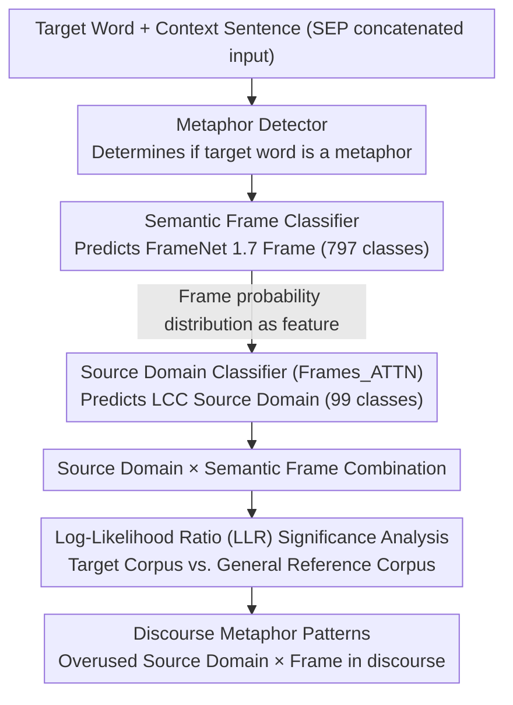

# Not All Animals Are Equal: Metaphorical Framing through Source Domains and Semantic Frames

**Conference**: ACL 2026 Findings  
**arXiv**: [2604.20454](https://arxiv.org/abs/2604.20454)  
**Code**: [https://github.com/julia-nixie/ConceptFrameMet](https://github.com/julia-nixie/ConceptFrameMet)  
**Area**: LLM/NLP  
**Keywords**: Metaphor Detection, Conceptual Metaphor Theory, Semantic Frames, Discourse Analysis, Media Framing

## TL;DR

This paper proposes ConceptFrameMet, the first computational framework combining FrameNet semantic frames and Conceptual Metaphor Theory (CMT) source domains. Using a RoBERTa-based multi-task model, it detects metaphors and predicts their semantic frames and source domains. Combined with log-likelihood ratio (LLR) statistics to identify salient metaphorical patterns in discourse, the study reveals that liberals and conservatives use the same source domains in immigration discourse but choose different semantic frames to convey drastically different associations.

## Background & Motivation

**Background**: Conceptual Metaphor Theory (CMT) is the dominant framework for analyzing metaphors, understanding abstract target concepts through source domains (e.g., WATER, ANIMAL, WAR). Metaphor research in NLP has focused primarily on metaphor detection and source domain mapping.

**Limitations of Prior Work**: Source domains alone cannot fully explain the specific associations conveyed by metaphors. For instance, "illegal aliens flood into our country" and "waves of immigrants have always enriched us" both stem from the WATER source domain but convey opposite attitudes—the former emphasizes flood-like loss of control, while the latter treats it as part of a natural landscape. Existing work fails to explain why the same source domain can be used simultaneously by opposing ideological camps.

**Key Challenge**: A source domain points to a set of associations, but which specific associations are activated depends on the semantic frame corresponding to the vocabulary used. The semantic frame of "flood" is Filling (emphasizing negative consequences of motion and overflow), while "wave"/"tide" refers to Quantified_mass or Natural_features (more neutral associations). This interaction between source domains and semantic frames has been overlooked by NLP.

**Goal**: (1) Construct a computational model to automatically detect metaphors and predict source domains and semantic frames; (2) design statistical methods to discover salient metaphorical patterns in discourse; (3) analyze ideological differences in the use of metaphorical framing.

**Key Insight**: Introduce constructivist linguistic theories (Sullivan 2013, 2025) into NLP—semantic frames are mechanisms for "picking" specific associations from a source domain. The interaction of source domain × frame uniquely defines the metaphorical association.

**Core Idea**: Source domains specify clusters of associations, while semantic frames precisely locate specific associations within those clusters. The interaction of both—rather than either dimension alone—is critical for analyzing the effects of metaphorical framing.

## Method

### Overall Architecture

ConceptFrameMet addresses a long-ignored problem in NLP: why the same metaphorical source domain (e.g., WATER) can be used by opposing sides to convey contradictory attitudes. The solution is to integrate "source domains" and "semantic frames"—the source domain delimits a set of associations, and the semantic frame selects the one actually activated. The system operates in two layers: first, a set of RoBERTa-based multi-task classifiers jointly determine if a target word is a metaphor, which FrameNet 1.7 semantic frame (797 classes) it belongs to, and which LCC dataset source domain (99 classes) it corresponds to. Second, a log-likelihood ratio (LLR) module compares the distribution of these predictions in specific discourse (e.g., immigration, climate news) against a general reference corpus to identify source domain × frame combinations that are "exceptionally frequent" in that discourse.

### Key Designs

**1. Semantic Frame Classifier: Ensuring accurate "frame activation" as the foundation for all subsequent analysis.**

Since source domains only identify a cluster of associations, the specific vocabulary choice—the semantic frame—dictates the listener's association. "flood" points to the Filling frame (motion, overflow, loss of control), while "wave/tide" points to Quantified_mass or Natural_features. The first step must be robust frame prediction. Ours fine-tunes RoBERTa-base using SEP to separate the target word and context sentence rather than masking the target word. Retaining surface lexical information improved test accuracy from 0.806 to 0.861 and macro-F1 from 0.053 to 0.648, approaching SOTA models that require heavy data augmentation. In comparison, zero-shot Gemini 2.5 and Claude Sonnet 4.0 performed significantly worse on this 797-class fine-grained task, indicating that specialized small models remain necessary.

**2. Frame-Augmented Source Domain Classifier: Feeding frame predictions as features for source domain prediction to verify the key hypothesis.**

Many source domains are semantically close and easily confused contextually. Building on RoBERTa SEP, the probability distribution from the semantic frame classifier is introduced as a frozen feature vector. A Frames_ATTN variant is proposed: it maintains both a trainable and a frozen frame vector, using the source domain embedding as a query for attention over the trainable matrix. This allows the model to learn which frames are most discriminative for specific source domains, with the frozen vector serving as a residual. This design directly validates the theoretical hypothesis—frame information effectively separates similar source domains, achieving a macro-F1 gain of 20 percentage points on underrepresented classes.

**3. Log-Likelihood Ratio (LLR) Significance Analysis: Isolating "abnormally high-frequency metaphors" from raw word counts.**

Raw frequency of a source domain is insufficient, as many metaphors are common in any language. Ours adopts the LLR method from Rayson & Garside (2000) to compare the frequency distribution of source domains/frames in the target corpus (e.g., climate news) against a reference corpus (general metaphor dataset). Higher LLR values indicate that a source domain or frame is "overused" in that specific discourse, reflecting its significance as a discourse metaphor. This allows for the identification of prominent BODY/WAR/MACHINE domains in climate discourse and the divergence in frame selection despite similar source domain distributions in immigration discourse.

### Loss & Training

Three classifiers are independently fine-tuned based on RoBERTa-base: the metaphor detector is fine-tuned on VUA; the semantic frame classifier is fine-tuned on FrameNet 1.7 (Train/Val/Test: 19,391/2,272/6,714); the source domain classifier is fine-tuned on the large-scale LCC dataset (11,704/2,509/2,509), utilizing the frozen semantic frame probability distribution as an auxiliary feature during prediction.

## Key Experimental Results

### Main Results

**Semantic Frame Prediction Performance (FrameNet 1.7 Test Set)**

| Method | Accuracy | micro-F1 | macro-F1 |
|------|----------|----------|----------|
| RoBERTa MASK | 0.806 | 0.806 | 0.053 |
| RoBERTa SEP | 0.861 | 0.866 | 0.648 |
| Gemini 2.5 | 0.508 | 0.508 | 0.430 |
| Claude Sonnet 4.0 | 0.736 | 0.736 | 0.600 |

**Source Domain Prediction Performance (LCC Test Set)**

| Method | Accuracy | F1 |
|------|----------|-----|
| RoBERTa SEP | 0.833 | 0.740 |
| Frames_CONCAT | 0.837 | 0.754 |
| **Frames_ATTN** | **0.838** | **0.756** |
| Gemini 2.5 | 0.528 | 0.345 |

### Ablation Study

| Configuration | Description | Effect |
|------|------|------|
| No Frame Info | RoBERTa only | F1 0.740 |
| CONCAT Fusion | Simple concatenation of frame vectors | F1 0.754 (+1.4) |
| ATTN Fusion | Attention-based fusion of frames | F1 0.756 (+1.6) |
| Low-Freq Improvement | Categories with <10 samples | macro-F1 gain of 20 percentage points |

### Key Findings

- The most prominent source domains in climate change discourse are BODY (climate as a "sick body"), WAR ("fight against"), and MACHINE ("levers of change").
- In immigration discourse, conservatives and liberals use similar source domain distributions, but their choice of semantic frames differs significantly.
- Conservatives prefer frames emphasizing uncontrollability (e.g., Motion_directional within the WATER domain), while liberals prefer neutral or "victimizing" frames (e.g., Quantified_mass).
- Within the ANIMAL domain, conservatives tend toward Biological_urge (animal instinct/aggression), whereas liberals use Self_motion (autonomous movement, which is more neutral).
- Zero-shot LLMs are significantly inferior to fine-tuned small models in fine-grained classification (797 frames, 99 source domains), showing these tasks still require specialized training.

## Highlights & Insights

- Significant theoretical contribution—the first to introduce the constructivist linguistic "source domain × semantic frame" interaction theory into NLP, providing a new analytical dimension for understanding why opposing camps use the same metaphors.
- The empirical finding that conservatives and liberals choose different semantic frames under the same source domain has direct value for political communication studies.
- The Frames_ATTN design, which uses target task embeddings as queries to select auxiliary features, is transferable to other NLP tasks requiring multi-granularity feature fusion.

## Limitations & Future Work

- The macro-F1 of the semantic frame classifier remains relatively low (0.648), mainly due to the large number of semantically similar subcategories among the 797 classes.
- Analysis is limited to English corpora; cross-linguistic differences in metaphorical framing warrant exploration.
- The log-likelihood ratio method is statistical and cannot capture the dynamic evolution of metaphors in context.
- Future work could extend to more discourse types such as social media and political speeches.

## Related Work & Insights

- **vs. Mendelsohn & Budak (2025)**: They identified that opposing ideologies use the same source domains but could not explain why; ours provides an explanation through the semantic frame dimension.
- **vs. Gordon et al. (2015)**: They encoded semantic roles but did not analyze the interaction between frames and source domains; ours is the first to systematically combine the two.
- **vs. Stowe et al. (2021)**: They used frames to assist metaphor generation; ours uses frames for metaphor analysis and source domain prediction.

## Rating

- Novelty: ⭐⭐⭐⭐⭐ First to introduce source domain × frame interaction from constructivist metaphor theory into NLP; significant theoretical innovation.
- Experimental Thoroughness: ⭐⭐⭐⭐ Analysis of two discourse domains with multi-baseline comparisons, though quantitative evaluation relies heavily on classification metrics.
- Writing Quality: ⭐⭐⭐⭐⭐ Rigorous interdisciplinary argumentation, vivid examples, and strong integration of theory and empirical evidence.
- Value: ⭐⭐⭐⭐ Opens new directions for metaphor analysis and framing effect research with interdisciplinary impact.

<!-- RELATED:START -->

## Related Papers

- [\[ACL 2025\] Entity Framing and Role Portrayal in the News](../../ACL2025/llm_nlp/entity_framing_and_role_portrayal_in_the_news.md)
- [\[ICML 2026\] Differential Syntactic and Semantic Encoding in LLMs](../../ICML2026/llm_nlp/differential_syntactic_and_semantic_encoding_in_llms.md)
- [\[ICLR 2026\] Evaluating Text Creativity across Diverse Domains: A Dataset and Large Language Model Evaluator](../../ICLR2026/llm_nlp/evaluating_text_creativity_across_diverse_domains_a_dataset_and_large_language_m.md)
- [\[AAAI 2026\] VSPO: Validating Semantic Pitfalls in Ontology via LLM-Based CQ Generation](../../AAAI2026/llm_nlp/vspo_validating_semantic_pitfalls_in_ontology_via_llm-based_cq_generation.md)
- [\[ICML 2026\] SAC-Opt: Semantic Anchors for Iterative Correction in Optimization Modeling](../../ICML2026/llm_nlp/sac-opt_semantic_anchors_for_iterative_correction_in_optimization_modeling.md)

<!-- RELATED:END -->
