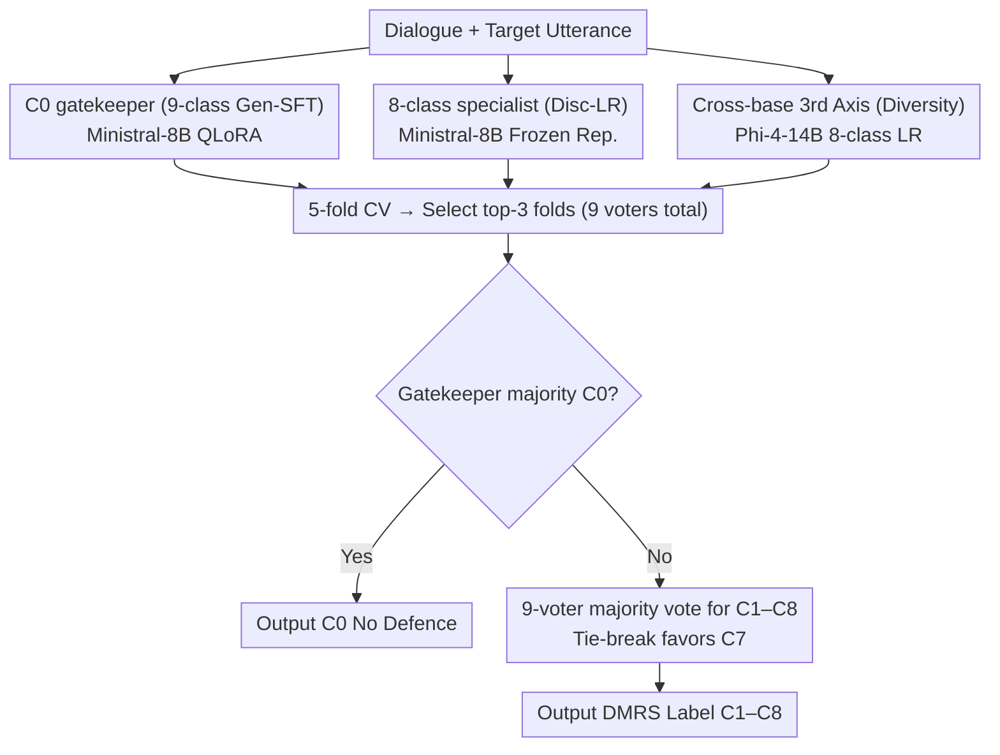

# Nürnberg NLP at PsyDefDetect: Multi-Axis Voter Ensembles for Psychological Defence Mechanism Classification

**Conference**: ACL2026  
**arXiv**: [2605.07606](https://arxiv.org/abs/2605.07606)  
**Code**: https://github.com/th-nuernberg/nuernberg-nlp-psydefdetect  
**Area**: NLP Understanding / Mental Health NLP  
**Keywords**: Defense Mechanism Identification, Mental Health Dialogue, Model Ensemble, Class Imbalance, Shared Task System

## TL;DR
This BioNLP 2026 PsyDefDetect shared task system paper treats psychological defense mechanism classification as a problem with fuzzy boundaries and limited annotation consistency. It utilizes an ensemble of 9 voters across different granularities, training paradigms, and base models, achieving an F1=.420 on the hidden test set and ranking 1st among 21 registered teams.

## Background & Motivation
**Background**: Mental Health NLP is evolving from sentiment recognition, risk assessment, and counseling dialogue assistance toward finer-grained clinical concept identification. The PsyDefDetect task requires models to determine the psychological defense mechanism hierarchy of a seeker's target utterance within emotional support conversations. Labels are derived from the Defense Mechanism Rating Scale (DMRS), including 8 positive defense levels and a No Defence category.

**Limitations of Prior Work**: This task is not a simple semantic classification problem. Many defense mechanisms appear linguistically identical to rationalization, explanation, reflection, or self-consolation; the true distinctions often lie in pragmatic functions and contextual intentions. The paper notes that even trained annotators achieve only moderate consistency (Cohen's $\kappa=.639$), indicating that the label boundaries themselves are unstable.

**Key Challenge**: A single large model easily develops fixed biases on these fuzzy boundaries. Scaling to stronger models does not necessarily resolve confusion between middle-to-high levels like C5, C6, and C7, as they share common "mature, restrained, reflective" expressive forms. The valuable signal lies not in the absolute strength of a single model, but in the fact that different models make different errors on various samples.

**Goal**: The authors aim to construct a shared task system that can distinguish the highly separable No Defence category while minimizing majority class attraction among the 8 defense categories, all while handling real-world constraints like extreme class imbalance, an invisible hidden test set, and limited validation signals.

**Key Insight**: Starting from "error independence," the system is designed as a multi-axis voter ensemble rather than a single-path fine-tuning approach. The authors first use representation space analysis to confirm that C0 (No Defence) is the most separable, while the 8 defense categories overlap significantly. They then assign C0 judgment to a 9-class "gatekeeper" and internal defense classification to 8-class "specialists."

**Core Idea**: Use a voter ensemble across category granularity, training objectives, and base models to replace a single-model classifier, converting independent errors on fuzzy psychological defense boundaries into ensemble gains.

## Method
The method in this paper is more of a system engineering solution for a shared task rather than a new network architecture: first, use synthetic data to alleviate minority class scarcity; then, train several sets of "complementary models that fail on different samples"; finally, fuse them using a voting rule with a C0 override. Its true design focus is selecting axes around "which model combinations produce useful disagreements."

### Overall Architecture

The system input is an emotional support dialogue and a specific seeker target utterance, and the output is a DMRS defense mechanism label—C0 for No Defence, and C1 to C8 for the 8 defense levels. The core is a three-axis ensemble consisting of 9 voters: the first axis features 3 Min-SFT 9c gatekeepers (generative SFT fine-tuning of Ministral-8B, retaining all 9 classes); the second axis features 3 Min-LR 8c specialists (8-class Logistic Regression trained on Ministral-8B adapted representations for C1–C8 only); the third axis features 3 Phi4-LR 8c specialists (8-class LR trained on Phi-4-14B representations to provide cross-base diversity). Each branch undergoes 5-fold cross-validation, and the top-3 folds per branch are selected for the final system based on internal CV performance.

Inference follows a two-stage rule: "Gatekeeping followed by refinement." Gatekeepers first collectively decide if a sample is C0. If the majority votes for C0, the system outputs C0 directly. Otherwise, all 9 voters perform majority voting on C1–C8, with ties broken by favoring the majority class C7 (High-Adaptive). This way, the high separability of No Defence, the fine-grained confusion within the 8 defense classes, and the complementarity of different models are unified within a single framework.

### Key Designs
**1. Granularity Split between C0 gatekeeper and 8-class specialist: Dividing "Defense Presence" and "Defense Type" into sub-problems of varying difficulty.**

The authors performed t-SNE on the hidden states of the 9-class SFT model and found that C0 (No Defence) was the only relatively clear cluster, while C1–C8 overlapped significantly. Forcing all models into flat 9-class classification would cause the clear C0 boundary to interfere with the fuzzy internal boundaries of the defense classes. Thus, they retained the 9-class models solely as gatekeepers to trigger C0 override, while training dedicated specialists for C1–C8 to focus their capacity entirely on the subtle differences between defense categories.

**2. Complementarity between Generative SFT and Discriminative LR: Manually creating useful "error independence" via differing training objectives.**

Ensemble gains require members to fail on different samples. This system runs two branches with entirely different paradigms: the SFT branch uses QLoRA for generative supervised fine-tuning (LLM generates label digits directly); the LR branch reuses representations from a fine-tuned ClsHead but discards the original head, training a multinomial Logistic Regression with L2 regularization on frozen hidden states. This adds negligible compute but allows for rapid exploration of "model × granularity" combinations. Crucially, instead of selecting the 9-class LR with the highest CV, they kept the generative SFT gatekeeper because it exhibits different failure modes compared to the 8-class LR specialists. Experiments confirmed this: pairing SFT gatekeepers with SFT specialists yielded no gain, but pairing them with LR specialists increased hidden test F1 from .373 to .391.

**3. Cross-base 3rd Axis Voting: Adding a different model lineage to resolve Ministral's internal disagreements.**

The first two axes are both based on Ministral, meaning their error patterns are likely correlated. The authors tested several 8-class LR specialists (Phi-4-14B, Llama-3.1-8B, PsychoCounsel-Llama3-8B) and calculated the complementarity based on their F1 profile correlation across 5 folds. The Phi4-LR 8c was selected for the third branch as it showed the most inverse profile. Its role is not to overpower the 6 Ministral voters through sheer numbers but to act as an arbitrator when Ministral is split. Flip analysis showed its influence was concentrated on the C6/C7 boundary, precisely where the most critical errors occurred.

### Loss & Training
All fine-tuning utilized 4-bit NF4 QLoRA on all linear projection layers, with a dropout of 0.05, cosine schedule, 10% warm-up, 10 epochs, a batch size of 8, and a max sequence length of 4096. SFT used LoRA rank 32, $\alpha=64$, targeting generative cross-entropy of label digits. ClsHead used LoRA rank 16, $\alpha=32$, and focal loss with class weights $w_c=N/(K n_c)$. LR was trained on frozen hidden states using multinomial logistic regression with L2 regularization and balanced class weights, with the regularization strength $C$ swept within each fold.

For data augmentation, GPT-5.2 was used on a dialog-stratified 80/20 split to generate dialogues for minority classes. The budget was set to a maximum of 200 samples per class, not exceeding 75% of the original class count. C0 and C7 were not augmented due to sufficient samples. A total of 738 synthetic dialogues were generated and used only in the training folds; the validation and hidden test sets remained strictly original human annotations. Final voting rule: if the count of gatekeepers predicting C0 reaches a majority, $\hat{y}=0$; otherwise, $\arg\max_c \sum_j \mathbf{1}[v_j=c]$ across all voters.

> ⚠️ Model names like GPT-5.2 are based on the original text.

## Key Experimental Results

### Main Results
The main results focus on macro-F1 on the hidden test set, calculated only for classes C1 to C8.

| System | Diversity Axes Activated | Hidden Test F1 | Gain over Baseline |
|------|----------------|-------------|---------------|
| Organizer Baseline: Min-SFT 9c, no aug | Single Model | .315 | - |
| Min-SFT 9c full-train, aug, single model | Augmentation only | .307 | -0.008 |
| 5V Min-SFT 9c | 5-fold Voting | .373 | +0.058 |
| 6V Min-SFT 9c + Min-LR 8c | Granularity + Paradigm | .391 | +0.076 |
| 9V Min-SFT 9c + Min-LR 8c + PCounsel-LR 8c | + Model Axis | .414 | +0.099 |
| 9V Min-SFT 9c + Min-LR 8c + Llama-LR 8c | + Model Axis | .417 | +0.102 |
| 9V Min-SFT 9c + Min-LR 8c + Phi4-LR 8c | + Model Axis | **.420** | **+0.105** |

The largest jump comes from voting itself: 5-fold Min-SFT 9c improves from around .315/.307 to .373.

Adding the LR specialist further improves results to .391, proving that training paradigm differences provide complementarity.

The addition of the third base model continues the trend, with Phi4-LR 8c reaching .420.

This represents a relative improvement of approximately 33.4% over the baseline and is the first-place result reported for the shared task.

### Ablation Study
The most insightful ablation is on synthetic data augmentation.

| System | With GPT-5.2 Aug | Without Aug | Difference | Note |
|------|----------------|--------|------|------|
| Min-SFT 9c Single Model | .307 | .315 | -0.008 | Synthetic data alone introduces noise |
| 5V Min-SFT 9c | .373 | .319 | +0.054 | Voting averages out synthetic noise |
| 6V + Min-LR 8c | .391 | .369 | +0.022 | Gain from augmentation persists |
| 9V + Phi4-LR 8c | .420 | .378 | +0.042 | Augmentation contribution is clear in the final system |

This table shows that augmentation is not a "more is better" independent module.

While single models are dragged down by synthetic noise, the ensemble combines the recall gains with noise cancellation.

### Models vs Training Comparison
The CV5 table in the Appendix explains why the LR specialist was chosen.

| Model | SFT 8c | SFT 9c | ClsHead 8c | ClsHead 9c | LR 8c | LR 9c |
|------|--------|--------|------------|------------|-------|-------|
| Ministral-8B | .321 | .306 | .333 | .311 | **.342** | .315 |
| Phi-4-14B | - | .293 | .337 | - | **.337** | - |
| Llama-3.1-8B | .251 | .279 | .246 | .284 | **.312** | .284 |
| Qwen2.5-7B | .266 | .256 | .302 | .268 | **.307** | .283 |
| PsychoCounsel-8B | - | - | **.316** | - | .301 | - |
| PsyLLM-8B | - | - | **.295** | - | .289 | - |
| GPT-OSS-20B | .212 | .183 | .278 | - | **.292** | - |

LR outperforms or matches ClsHead on most models with lower training costs.

### Key Findings
- Voting is more critical than the single model. 5-fold isomorphic voting improved F1 from .315 to .373, confirming that variance and boundary uncertainty are core issues in this task.
- The 3rd model axis gain comes from critical boundary arbitration. Phi4-LR only flips samples where Ministral lacks internal agreement; 33 of the 39 actual flips involved the C6/C7 boundary.
- Synthetic data requires coupling with voting. Single-model performance dropped with augmentation, but the 9V system gained .042, suggesting ensemble robustness against synthetic noise.
- Class imbalance still dominates error patterns. C7 accounts for 52% of the training set and absorbs many misclassified samples from intermediate levels; performance is not equivalent to clinical utility.

## Highlights & Insights
- The paper frames the system as a story of "error complementarity" rather than leaderboard chasing. It uses t-SNE, CV profile correlation, Krippendorff's $\alpha$, and flip analysis to explain why voting works.
- The C0 gatekeeper design is practical. Many real-world classification tasks have a "clear external class" and a "difficult internal set"; separating them is often more stable than flat multi-classification.
- The LR specialist is a high-efficiency trick. Training linear heads on frozen LLM representations allows rapid exploration of multiple bases and generates different error patterns from generative SFT.
- Honesty regarding augmentation: The paper does not pitch synthetic data as a panacea, noting it harms single models and only provides value when noise is averaged out by the ensemble.
- Clinical awareness in per-class analysis: Instead of just reporting the top score, the authors highlight that misclassifying C5 as C7 underestimates intervention needs, a more responsible approach than purely chasing F1.

## Limitations & Future Work
- Statistical support remains limited. The PSYDEFCONV training set has only 1,864 original samples. The +.029 gain of 9V over 6V comes from a single hidden test observation, not proving Phi4 is universally optimal.
- Decisions like top-3 fold selection and C0 override thresholds are heuristic and lack rigorous validation.
- Hard ceiling on annotation quality. Annotator consistency is only $\kappa=.639$. Small classes like C2, C5, and C8 are in zones of high subjective judgment, potentially capping macro-F1 due to label noise.
- Narrow scope. Experiments were conducted only on English ESConv/PSYDEFCONV in simulated support scenarios, which differ from real clinical sessions.
- Ethical risk is significant. An F1 of .420 means most defense utterances are still misclassified. This system can only serve as a supportive signal in supervised workflows and cannot be used independently for diagnosis.

## Related Work & Insights
- **vs PSYDEFCONV / PsyDefDetect baseline**: The baseline uses Ministral-8B for 9-class SFT. This work follows the task and prompt setup but improves F1 from .315 to .420 via augmentation, CV voter pools, granularity splitting, training paradigm splitting, and cross-model specialists.
- **vs Classical Ensemble Methods**: Dietterich’s ensemble theory emphasizes diverse and accurate classifiers. This work applies this principle to LLM mental health classification and uses flip analysis to prove diversity works on the C6/C7 confusion boundary.
- **vs Single-model LLM Fine-tuning**: While fine-tuning seeks an optimal representation, this work shows that multiple imperfect decision boundaries are more reliable when labels are ambiguous and categories overlap.
- **Insight for other tasks**: Tasks like medical triage or risk assessment often have one clear negative class and multiple fuzzy positive classes. One can adapt the gatekeeper-specialist design to separate "risk trigger" from "risk level/type" modeling.

## Rating
- Novelty: ⭐⭐⭐⭐☆ Not a new architecture, but a systematic application of multi-axis voter diversity to defense mechanism detection with targeted design.
- Experimental Thoroughness: ⭐⭐⭐⭐☆ Comprehensive main results, augmentation ablation, model selection, and error analysis, though limited by sample size.
- Writing Quality: ⭐⭐⭐⭐⭐ Clear system paper with a closed loop of motivation, design, and failure analysis.
- Value: ⭐⭐⭐⭐☆ Highly relevant for shared tasks and small-sample clinical NLP; great reference for ensemble diagnostics despite the current F1 being insufficient for high-risk applications.

<!-- RELATED:START -->

## Related Papers

- [\[ACL 2026\] Evaluating Customized vs. Generalist Transformer-based Models for Legal Contract Classification](evaluating_customized_vs_generalist_transformer-based_models_for_legal_contract_.md)
- [\[ICML 2025\] Theoretical Limitations of Ensembles in the Age of Overparameterization](../../ICML2025/llm_nlp/theoretical_limitations_of_ensembles_in_the_age_of_overparameterization.md)
- [\[ACL 2025\] The Nature of NLP: Analyzing Contributions in NLP Papers](../../ACL2025/llm_nlp/the_nature_of_nlp_analyzing_contributions_in_nlp_papers.md)
- [\[ACL 2026\] Wait, There’s a Way Out: A Decision Mechanism for Dialogue Derailment Prediction](wait_theres_a_way_out_a_decision_mechanism_for_forecasting_conversational_derail.md)
- [\[ACL 2025\] Unintended Harms of Value-Aligned LLMs: Psychological and Empirical Insights](../../ACL2025/llm_nlp/unintended_harms_of_value-aligned_llms_psychological_and_empirical_insights.md)

<!-- RELATED:END -->
## Related Papers

- [\[ACL 2026\] Evaluating Customized vs. Generalist Transformer-based Models for Legal Contract Classification](evaluating_customized_vs_generalist_transformer-based_models_for_legal_contract_.md)
- [\[ICML 2025\] Theoretical Limitations of Ensembles in the Age of Overparameterization](../../ICML2025/llm_nlp/theoretical_limitations_of_ensembles_in_the_age_of_overparameterization.md)
- [\[ACL 2025\] The Nature of NLP: Analyzing Contributions in NLP Papers](../../ACL2025/llm_nlp/the_nature_of_nlp_analyzing_contributions_in_nlp_papers.md)
- [\[ACL 2025\] Unintended Harms of Value-Aligned LLMs: Psychological and Empirical Insights](../../ACL2025/llm_nlp/unintended_harms_of_value-aligned_llms_psychological_and_empirical_insights.md)
- [\[ACL 2025\] Computation Mechanism Behind LLM Position Generalization](../../ACL2025/llm_nlp/computation_mechanism_behind_llm_position_generalization.md)

<!-- RELATED:END -->
