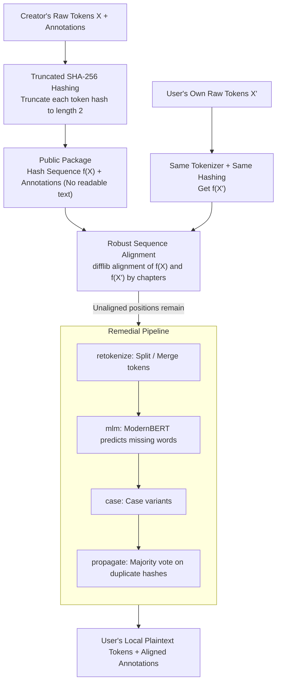

# Overcoming Copyright Barriers in Corpus Distribution Through Non-Reversible Hashing

**Conference**: ACL2026  
**arXiv**: [2604.23412](https://arxiv.org/abs/2604.23412)  
**Code**: https://github.com/CompNet/novelshare  
**Area**: NLP Corpus Sharing / Literary Text Processing / Copyright-Compliant Data Release  
**Keywords**: Non-reversible hashing, Copyrighted text, Corpus distribution, Sequence alignment, Annotation sharing

## TL;DR
This paper proposes **novelshare**: it transforms tokens of copyrighted text into truncated, non-reversible hashes and publishes only the hash sequences along with the researcher's own annotations. This allows users who legally possess the original text to re-align the annotations under slight version differences, achieving a token alignment accuracy of 98.7% to 99.79% on close-edition novels.

## Background & Motivation
**Background**: NLP research relies heavily on annotated corpora, especially for tasks like NER, POS, coreference resolution, character network extraction, and quotation attribution. For literary and long-form narrative texts, complete works are more valuable than fragments because characters, events, narrative perspectives, and long-range dependencies often unfold across chapters.

**Limitations of Prior Work**: The core problem is that many representative modern texts remain under copyright. If academic teams only use public domain texts, research becomes systematically biased toward the 19th century or earlier. If copyrighted corpora are withheld entirely, subsequent research cannot be reproduced or compared. If only excerpts are released, they fail to cover full-scale long-text tasks. Seeking permission from authors individually is legally sound but costly and lacks scalability.

**Key Challenge**: Researchers want to share the annotations they produced rather than the original copyrighted works. However, traditional corpus distribution formats typically bind raw tokens and annotations together. Furthermore, even if users own a copy of the same work, it may not be the exact electronic version used by the corpus creator: revisions, OCR errors, punctuation normalization, chapter splitting, and tokenization can all cause discrepancies in the token sequences.

**Goal**: The authors aim to design a corpus sharing mechanism that allows creators to release token-level annotations without disclosing readable original text. Users must independently possess the original text to reconstruct the token sequence locally and align it with the shared annotations. The system must also tolerate reasonable minor discrepancies rather than requiring verbatim identity between the two versions.

**Key Insight**: Drawing from the hash-alignment concept of Bost et al. (2020), this work generalizes it into a universal scheme for arbitrary token-level sequential annotations. The key observation is that if only truncated hashes are released, external attackers cannot directly reconstruct the text; meanwhile, users holding a similar original text can apply the same hashing to their tokens and map the shared annotations back via sequence alignment.

**Core Idea**: Replace "public raw text" with "truncated non-reversible hashes + robust sequence alignment + minor discrepancy recovery strategies," creating an operational middle layer between copyright compliance and corpus reproducibility.

## Method
The methodology focuses on a corpus distribution protocol and alignment algorithm rather than training a specific NLP model. The problem is defined as: the creator has copyrighted tokens $X=(x_1, \dots, x_n)$ and corresponding annotations; the user has a legally obtained similar text $X'=(x'_1, \dots, x'_m)$. The system must map the creator's annotations to $X'$ as accurately as possible without leaking $X$.

### Overall Architecture
The workflow is divided into creator-side and user-side processes.

On the creator side, the original text is tokenized into a sequence, maintaining one or more annotation sequences of equal length. For example, in NER, tokens correspond to BIO tags. The creator applies SHA-256 to each token and truncates the hash. Only the truncated hash sequence $f(X)$ and the annotations are published.

The user must possess the same work or a close version. The user processes their own token sequence using the same tokenizer and hashing rules to obtain $f(X')$. The system then performs sequence alignment between $f(X)$ and $f(X')$. If a creator's hash matches a user's hash, the annotation from that position is transferred to the user's token.

Since version differences (additions, deletions, modifications) may exist, exact matching is insufficient. Thus, the paper applies several recovery strategies for unaligned positions, including propagation based on duplicate hashes, re-tokenization fixes, case normalization, and MLM predictions. The final output is "plaintext tokens + aligned annotations" on the user's local machine.

### Key Designs

**1. Truncated SHA-256 Hashing as a Publishable Proxy**
To avoid releasing copyrighted text, novelshare applies SHA-256 to each token and truncates the resulting hash to a very short length. While a full SHA-256 hash has almost no collisions, it could be reversed by an attacker via a pre-computed lookup table of common vocabularies. By truncating the hash (e.g., to 2 characters), many different tokens map to the same short hash. Even with a full vocabulary, an attacker would only see a set of candidates, making reconstruction impossible.

**2. Robust Alignment via Hash Sequences**
Because user versions may vary from the creator's version due to OCR or editorial changes, novelshare utilizes `difflib`'s enhanced gestalt pattern matching. Alignment between $f(X)$ and $f(X')$ only occurs if truncated hashes match. Global sequence alignment uses surrounding context to resolve ambiguities caused by short hash collisions. To optimize for long novels, alignment is performed chapter-by-chapter.

**3. Remedial Pipeline for Unaligned Positions**
Post-alignment gaps are addressed by specific modules:
- **propagate**: Uses majority voting from successfully aligned positions of identical hashes to infer unaligned ones.
- **retokenize**: Iteratively merges or splits user tokens to check if the new hash matches the creator's hash, addressing tokenizer inconsistencies.
- **case**: Attempts various casing variants.
- **mlm**: Inserts `[MASK]` at unaligned slots in the user's context and uses ModernBERT-base to predict candidates; the prediction is only accepted if its hash matches the creator's hash.

### Loss & Training
The paper does not involve a trained primary model. The only usage of a pre-trained model is in the **mlm** strategy, where **ModernBERT-base** (window size 32) predicts missing tokens within local contexts. The evaluation setup uses early editions as creator versions and later editions as user versions to simulate realistic data sharing.

## Key Experimental Results

### Main Results
The main experiments use three public-domain novels (Frankenstein, Moby Dick, Pride and Prejudice) to simulate copyrighted sharing.

| Experiment Subject | User Version Relation | Best Strategy | Main Results | Description |
|:---|:---|:---|:---|:---|
| Close editions | User has a version near the creator's | `pipe`, hash len 2 | Correct alignment 98.7% - 99.79% | Proves the method does not require identical digital files. |
| Distant editions | Modernized or heavily revised editions | `pipe`, hash len 2 | Errors increase significantly (approx. 8% error) | Shows the system correctly "fails" on overly divergent texts. |
| Identical text | User version matches creator's exactly | Any reasonable strategy | 100% alignment | Basic upper bound validation. |
| NER Application | Aligning entity annotations | `novelshare` pipeline | 96.48% entities aligned | Demonstrates utility for downstream NLP tasks. |

### Ablation Study
The ablation focuses on hash lengths and the effectiveness of recovery strategies.

| Configuration / Dimension | Key Findings | Description |
|:---|:---|:---|
| Hash Length 1 | ~1907.06 collisions per token | High security, but too many collisions lead to alignment errors. |
| Hash Length 2 | ~118.25 collisions per token | The chosen trade-off for security and alignment reliability. |
| Hash Length 3+ | < 6.45 collisions per token | Better alignment accuracy, but smaller candidate space for attackers. |
| `retokenize` / `case` | Limited improvement alone | Targets specific errors like tokenizer mismatches. |
| `mlm` / `propagate` | Usually superior to `case` | Leverages context or token redundancy; broader coverage. |
| `pipe` meta-strategy | Overall best performance | Successive application minimizes the risk of error propagation. |

### Key Findings
- **Hash length is the primary lever**: Shorter hashes enhance security via collisions but complicate alignment. Length 2 was found to be a pragmatic compromise.
- **Version proximity is fundamental**: Close editions maintain errors below 1.3%. This aligns with the legal logic: only users who already own a similar version should successfully retrieve the corpus.
- **Ordered pipeline (pipe) is superior**: Combining specialized modules (retokenize, mlm, propagate) covers a wider range of realistic discrepancies.
- **High-quality user text is still required**: While it handles minor differences, heavy OCR corruption makes alignment significantly difficult.

## Highlights & Insights
- **Reframing the Problem**: Instead of trying to bypass copyright, this work mandates that users must possess the original text, transforming the problem into a "linkage of non-readable indices."
- **Embracing Collisions**: Unlike most systems where collisions are bugs, here they serve as a protection layer against pre-computation attacks while remaining resolvable via sequence context.
- **Failure as a Feature**: The system's inability to align distant versions is a legal advantage, as it prevents the reconstruction of text from unauthorized inputs.
- **Broad Task Compatibility**: The protocol supports any token-level sequence labeling task (POS, NER, Chunking, etc.).

## Limitations & Future Work
- **Dependency on Versioning**: Users with heavily redacted or poor-quality OCR versions will face high error rates. Creators need to specify the edition and publisher used.
- **Tokenizer Sensitivity**: The choice of tokenizer affects all subsequent steps. Subword tokenization might localize OCR errors better but was not the primary focus here.
- **Computational Cost**: While basic alignment is fast, the MLM-based `pipe` strategy can take significant time for entire novels due to neural network inference.
- **Entity vs. Token Sensitivity**: Certain tasks (like coreference chains) might be more sensitive to a 1% token misalignment than others (like POS tagging).

## Related Work & Insights
- **Comparison to Public Domain Corpora**: Works like LitBank avoid copyright by using old texts. This method allows researchers to work on contemporary texts without selecting biased, out-of-copyright samples.
- **Comparison to Redaction/Excerpts**: Redaction often breaks long-range context. This method allows sharing of annotations for the entire work.
- **Comparison to Serial Speakers (Bost et al., 2020)**: While Bost used hashing for dialogue alignment, this work generalizes the approach to arbitrary NLP tags and introduces sophisticated recovery strategies like MLM and re-tokenization.

## Rating
- **Novelty**: ⭐⭐⭐⭐☆ Refines hash-alignment into a robust, legally-aware distribution protocol.
- **Experimental Thoroughness**: ⭐⭐⭐⭐☆ Covers real-world versioning and synthetic noise, though more downstream task-specific metrics would be beneficial.
- **Writing Quality**: ⭐⭐⭐⭐☆ Clear motivation and thorough legal appendices.
- **Value**: ⭐⭐⭐⭐⭐ High utility for literary NLP and reproducible research on copyrighted data.

<!-- RELATED:START -->

## Related Papers

- [\[ACL 2026\] Text-to-Distribution Prediction with Quantile Tokens and Neighbor Context](text-to-distribution_prediction_with_quantile_tokens_and_neighbor_context.md)
- [\[ACL 2025\] LLMs Know Their Vulnerabilities: Uncover Safety Gaps through Natural Distribution Shifts](../../ACL2025/llm_nlp/llms_know_their_vulnerabilities_uncover_safety_gaps_through_natural_distribution.md)
- [\[ACL 2026\] Unlocking the Potential of Diffusion Language Models through Template Infilling](unlocking_the_potential_of_diffusion_language_models_through_template_infilling.md)
- [\[ACL 2025\] An Empirical Study of Iterative Refinements for Non-Autoregressive Translation](../../ACL2025/llm_nlp/an_empirical_study_of_iterative_refinements_for_non-autoregressive_translation.md)
- [\[ACL 2025\] Conversational Quality Assessment: A Large-Scale Corpus and Comprehensive Study](../../ACL2025/llm_nlp/conversational_quality_assessment_a_large-scale_corpus_and_comprehensive_study.md)

<!-- RELATED:END -->
