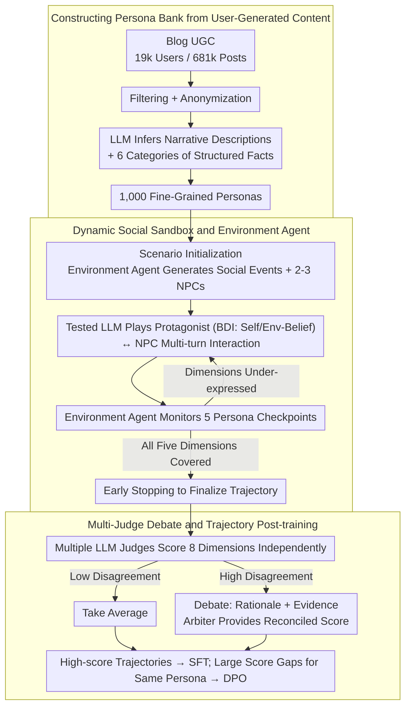

# PersonaArena: Dynamic Simulation for Evaluating and Enhancing Persona-Level Role-Playing in Large Language Models

**Conference**: ACL2026 Findings  
**arXiv**: [2605.17044](https://arxiv.org/abs/2605.17044)  
**Code**: https://aka.ms/personaarena  
**Area**: LLM Role-Playing Evaluation / Persona-level Simulation  
**Keywords**: Role-playing, Persona Evaluation, Multi-agent Simulation, LLM-as-Judge, DPO

## TL;DR
PersonaArena utilizes user-generated content to construct 1,000 fine-grained personas and evaluates and enhances the persona-level role-playing capabilities of LLMs through dynamic social simulations and multi-judge debates.

## Background & Motivation
**Background**: LLMs are increasingly used as social companions, virtual characters, and social simulation agents. Role-playing capability requires models not only to know character settings but also to maintain behavioral consistency and emotional authenticity over multi-turn interactions, responding to scene changes in a manner consistent with the persona.

**Limitations of Prior Work**: A large volume of role-playing research focuses on character-level settings from novels, films, and celebrities. These characters often exist in popular culture, and models may simply recite common knowledge or mimic exaggerated lines. Persona-level research focuses more on the occupations, experiences, values, and social behaviors of ordinary people, but existing evaluations often stop at static QA or superficial metrics, making it difficult to observe long-term consistency in realistic social scenarios.

**Key Challenge**: Persona expression inherently occurs in dynamic interactions, whereas mainstream evaluations often compress it into single-turn QA or identity recognition. A model’s ability to answer "who am I" does not imply it can consistently act like that person across complex social events.

**Goal**: The authors aim to construct a dynamic simulation framework to elicit the persona behavioral trajectories of models within controllable yet realistic multi-agent social environments, using a robust multi-judge mechanism to evaluate dimensions such as fidelity, coherence, and adaptability.

**Key Insight**: The paper observes that user-generated content such as blogs naturally contains personal experiences, values, and social expressions. Thus, a persona bank is extracted from Blog Authorship data, and the tested LLM acts as the protagonist interacting with NPCs and the environment.

**Core Idea**: Replace static persona QA with dynamic social simulation and use high-quality simulation trajectories as SFT/DPO data to enhance the model's role-playing capabilities.

## Method
PersonaArena serves as both an evaluation framework and a data generation framework. It first transforms long-term text content from ordinary individuals into persona cards, then places these personas into dynamic scenarios where the tested model plays the protagonist. The system records the entire interaction trajectory, which is finally scored independently by multiple LLM judges, with disagreements resolved through debate-based arbitration when necessary.

### Overall Architecture
Each scenario consists of $A=(P,S,E)$, where $P$ is the set of personas, $S$ is the interaction scenario, and $E$ is the evaluation engine. The process is divided into three stages: scenario initialization, sandbox social simulation, and multi-judge evaluation.

During scenario initialization, the Environment Agent generates realistic social events, times, locations, a protagonist, and 2 to 3 NPCs based on the target persona. During the simulation phase, the tested LLM controls the protagonist, while NPCs and the Environment Agent are controlled by fixed strong models to ensure consistent interaction conditions across different tested models. During the evaluation phase, multiple LLM judges score the complete trajectory across 8 dimensions and provide a final score through an arbiter who synthesizes arguments and evidence in cases of significant disagreement.

### Key Designs

**1. Constructing Persona Bank from User-Generated Content: Replacing Hand-written Personas with Long-term Text from Real People**

Hand-written or fictional celebrity personas often only have labels like name and occupation, allowing models to cheat using common knowledge or exaggerated mimicry without revealing whether they truly act like that person in daily social settings. PersonaArena instead draws material from over 19k users and 681k blog posts: it first filters and anonymizes private information, then uses LLMs to infer narrative descriptions and structured facts from these long-term texts, covering six dimensions: demographic, occupation, personality traits, values, interests, and experiences. The resulting personas are not just strings of labels but are supported by real experiences, values, interests, and emotional patterns, making them more suitable for testing "daily social authenticity" rather than "celebrity line recitation."

**2. Dynamic Social Sandbox and Environment Agent: Eliciting Personas Naturally Through Multi-turn Interaction instead of Static QA**

Persona expression essentially occurs in dynamic interactions, but mainstream evaluations often compress this into single-turn QA or identity recognition. A model's ability to answer "who am I" does not mean it can consistently act like that person across social events. PersonaArena's solution is to place the persona in a sandbox: the protagonist played by the tested LLM adopts BDI-style goal-conditioned reasoning, maintaining Self-Belief and Env-Belief, while NPCs maintain fixed self-belief and only update their environment understanding based on the protagonist's actions. The Environment Agent links the session, handling interaction analysis, adaptive turn control, character state updates, and environment updates, while monitoring five checkpoints: Background, Personality, Values, Interests, and Experiences.

The beauty of this checkpoint design is that evaluation no longer runs for a fixed number of turns: the environment controller pushes the scenario in directions where certain persona dimensions have not yet been fully expressed and stops when they are sufficient, balancing coverage and efficiency to avoid trajectories that are either too short to reveal problems or unnecessarily long and costly.

**3. Multi-judge Debate and Trajectory Post-training: Mitigating Single-judge Biases and Recycling Evaluated Trajectories as Training Signals**

Individual LLM judges have varying levels of stringency—case studies show DeepSeek-R1 tends to be lenient, while Qwen3-32B and GPT-4o are more conservative; relying on a single judge can result in systematically high or low scores. PersonaArena has multiple judges score 8 dimensions independently and takes the mean; if disagreement is high, each judge must provide scores, reasons, and evidence fragments. A referee/arbiter then synthesizes the arguments to generate a unified rationale and reconciled score, making disagreements explicit rather than relying on simple voting. Furthermore, these scored trajectories are high-quality data: high-scoring complete trajectories can be split into SFT samples, and trajectories generated by different models for the same persona can form DPO preference pairs, closing the loop between "evaluation" and "data generation."

### A Complete Example: How a Social Trajectory Runs

Taking a target persona (e.g., a middle-aged nurse) as an example: during scenario initialization, the Environment Agent generates a realistic social event, time, location, and 2–3 NPCs based on her background. Once the simulation starts, the tested LLM plays this nurse (protagonist), interacting with NPCs controlled by fixed strong models, driven by Self-Belief/Env-Belief. The Environment Agent analyzes each interaction turn while monitoring whether Background, Personality, Values, Interests, and Experiences have been touched upon. If the Values dimension remains unexposed, it adjusts events toward value-based choices until all five dimensions are sufficiently expressed, triggering early stopping. The entire interaction trajectory is then handed to multiple LLM judges for independent 8-dimension scoring. Low disagreement leads to an average score, while high disagreement leads to a debate where an arbiter provides a reconciled score. If the trajectory is high-scoring, it is used for SFT; if it shows a large score difference compared to another model’s trajectory for the same nurse persona, the pair is collected for DPO preference pairs.

### Loss & Training
The main framework of PersonaArena is for evaluation and does not directly train a new model. In enhancement experiments, the authors chose Qwen3-8B for post-training: the SFT phase extracted 1,228 behavior-level training instances from the 50 highest-scoring complete trajectories; the DPO phase selected 50 pairs with the largest score differences generated by different models for the same persona, split into 665 preference pairs. SFT enables the model to mimic high-quality behavior, while DPO further learns implicit preference differences between high- and low-quality trajectories.

## Key Experimental Results

### Main Results

| Model | Average Score | Observation |
|------|---------------|------|
| GPT-5.1 | 3.963±0.04 | Highest overall, leading in AD/BC/IR etc. |
| GPT-4.1 | 3.948±0.14 | Close to GPT-5.1, strong across dimensions |
| Deepseek-V3.2 | 3.902±0.05 | Strongest among open-source models |
| Qwen3-32B | 3.811±0.06 | Best in Qwen3 series, showing scaling trend |
| Mistral-small3.2 | 3.753±0.11 | Stable performance for medium open models |
| Qwen3-8B | 3.363±0.04 | Selected as the target for SFT/DPO enhancement |

### Ablation Study

| Analysis Item | Result | Note |
|--------|------|------|
| Multi-judge vs. Human Correlation | Multi-judge Overall 0.683; Qwen3-32B 0.669; Mistral-small3.2 0.484; DeepSeek-R1 0.330 | Multi-judge is closest to human scoring overall |
| SFT Enhancement (Qwen3-8B) | Avg improvement ~21.96%; IR +32.07%, BA +30.17%, BC +27.86% | Mimicking high-quality trajectories significantly enhances interaction richness and consistency |
| DPO Enhancement (Qwen3-8B) | ~27.83% avg improvement over base; 5.21% over SFT, IR +15.71%, AD +14.67% | Preference optimization captures implicit behavioral preferences better |
| External PersonaGym | Qwen3-8B 3.66; SFT 3.88; DPO 4.09; GPT-4.1 4.28 | Enhancement gains are transferable to external persona benchmarks |
| External RoleBench | Qwen3-8B 0.0%; SFT 28.6%; DPO 37.1%; GPT-4.1 34.3% | DPO version slightly outperforms GPT-4.1 in GPT-4-based win rate |

### Key Findings
- The model ranking in PersonaArena largely aligns with intuition: GPT-5.1 and GPT-4.1 lead, Deepseek-V3.2 is the strongest open model, and the Qwen3 series generally improves with scale. This indicates the benchmark reflects model capability gradients.
- The multi-judge mechanism is more stable than a single judge. DeepSeek-R1 is lenient in case analyses, while Qwen3-32B and GPT-4o are more conservative; multi-judge aggregation reduces the scale bias of individual models.
- Data generated by PersonaArena can be used for training as well as evaluation. Both SFT and DPO significantly improve Qwen3-8B, with DPO reaching a 37.1% win rate on the external RoleBench, surpassing GPT-4.1's 34.3%.
- Early stopping provides significant efficiency gains. Appendices show a 33.7% to 56.6% reduction in runtime when thresholds are enabled, with scores only decreasing by about 0.05 to 0.12, maintaining relative model rankings.

## Highlights & Insights
- This paper shifts role-playing evaluation from "character knowledge tests" to "social behavior trajectory evaluation." For persona-level agents, these dynamic trajectories are closer to real-world requirements than static QA.
- The Environment Agent's checkpoint design is highly practical. Instead of blindly running a fixed number of turns, it checks whether five semantic dimensions of the persona have been sufficiently expressed, thereby controlling evaluation costs.
- Multi-judge debate is not just voting; it requires judges to provide evidence and rationales. This mechanism enhances interpretability and makes scores more suitable as post-training signals.
- Using the evaluation environment to generate SFT/DPO data creates a closed loop: first constructing scenarios that expose flaws, then using high-quality trajectories to fix them. This is instructive for other agent benchmarks.

## Limitations & Future Work
- The authors admit that LLM-based multi-judges still do not reach ideal human judgment levels. Aggregated automatic judges may still share training biases, and subtle persona fidelity issues might be missed or misjudged.
- The paper primarily addresses character fidelity and consistency, without systematically discussing the ethical boundaries of playing dangerous, anti-social, or harmful characters. In actual deployment, whether a model should play certain personas needs separate governance.
- The persona bank is derived from public user-generated content, which, despite anonymization, may still inherit biases in platform demographics, writing styles, and topic distributions.
- Currently, each benchmark run only randomly samples 10 personas. While helpful for cost control, coverage of rare persona types and long-tail social contexts could be strengthened.

## Related Work & Insights
- **vs Character-level benchmarks**: RoleBench, CharacterEval, and CharacterBox focus on literary, film, or celebrity characters; PersonaArena focuses on the persona-level behavior of ordinary people, making it more suitable for evaluating daily social simulation.
- **vs Persona-Chat / Synthetic-Persona-Chat**: These datasets are often dominated by static or semi-static dialogues; PersonaArena emphasizes environmental changes, NPC reactions, and multi-turn causal trajectories.
- **vs Single LLM-as-Judge**: Single judges are prone to model family biases and scoring scale biases; PersonaArena makes disputes explicit through multi-judges and arbiters.
- **Insight**: For agent evaluation, the most valuable part of a benchmark may not be a single score, but an environment capable of generating trainable failure cases. PersonaArena demonstrates the "evaluation as data generation" path.

## Rating
- Novelty: ⭐⭐⭐⭐ The combination of dynamic persona-level social simulation and multi-judge debate is quite innovative, though it draws on existing virtual world and LLM judge concepts.
- Experimental Thoroughness: ⭐⭐⭐⭐ Includes multi-model evaluation, human correlation, post-training, external benchmarks, and robustness appendices; persona sampling scale could still be expanded.
- Writing Quality: ⭐⭐⭐⭐ Framework description is clear, with rich appendices; some implementation details and cost information are scattered in appendices.
- Value: ⭐⭐⭐⭐⭐ Highly practical for role-playing agents, social simulation, and agent post-training data construction.

<!-- RELATED:START -->

## Related Papers

- [\[ICLR 2026\] Enhancing Persona Following at Decoding Time via Dynamic Importance-Guided Token Estimation for Role-Playing Agents](../../ICLR2026/llm_nlp/enhancing_persona_following_at_decoding_time_via_dynamic_importance-guided_token.md)
- [\[ACL 2025\] Beyond Profile: From Surface-Level Facts to Deep Persona Simulation in LLMs](../../ACL2025/llm_nlp/beyond_profile_from_surface-level_facts_to_deep_persona_simulation_in_llms.md)
- [\[ACL 2026\] From Static Inference to Dynamic Interaction: A Survey of Streaming Large Language Models](from_static_inference_to_dynamic_interaction_a_survey_of_streaming_large_languag.md)
- [\[ACL 2025\] Beyond Dialogue: A Profile-Dialogue Alignment Framework Towards General Role-Playing Language Model](../../ACL2025/llm_nlp/beyond_dialogue_a_profile-dialogue_alignment_framework_towards_general_role-play.md)
- [\[ACL 2026\] Why Did Apple Fall: Evaluating Curiosity in Large Language Models](why_did_apple_fall_evaluating_curiosity_in_large_language_models.md)

<!-- RELATED:END -->
