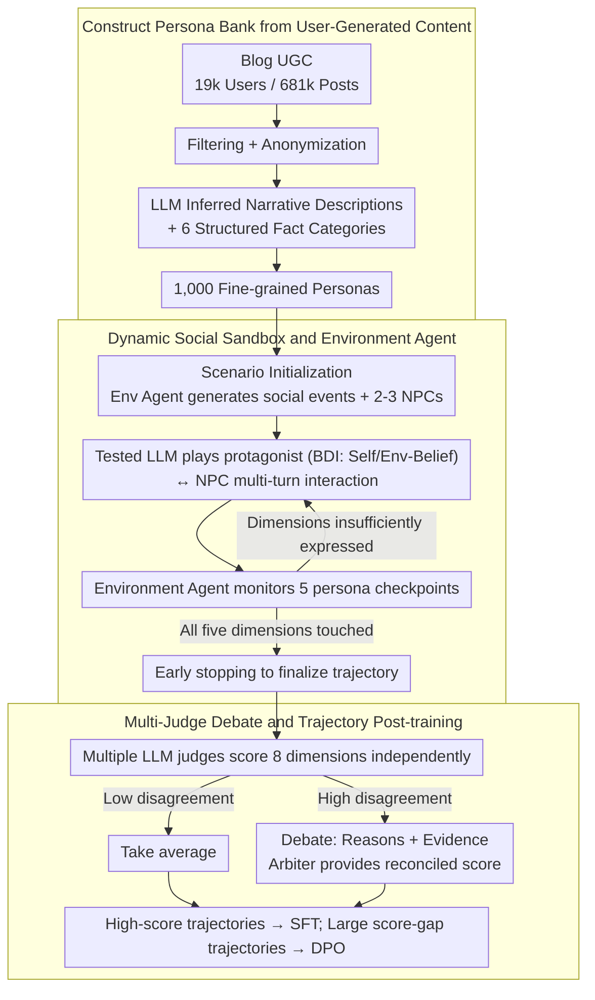

# PersonaArena: Dynamic Simulation for Evaluating and Enhancing Persona-Level Role-Playing in Large Language Models

**Conference**: ACL2026 Findings  
**arXiv**: [2605.17044](https://arxiv.org/abs/2605.17044)  
**Code**: https://aka.ms/personaarena  
**Area**: LLM Role-Playing Evaluation / Persona-level Simulation  
**Keywords**: Role-Playing, Persona Evaluation, Multi-agent Simulation, LLM-as-Judge, DPO

## TL;DR
PersonaArena constructs 1,000 fine-grained personas from real-world user-generated content and evaluates/enhances LLM persona-level role-playing capabilities through dynamic social simulation and multi-judge debates.

## Background & Motivation
**Background**: LLMs are increasingly utilized as social companions, virtual characters, and social simulation agents. Role-playing capability requires models not only to know character settings but also to maintain behavioral consistency and emotional authenticity across multi-turn interactions, responding to changing scenarios in a persona-congruent manner.

**Limitations of Prior Work**: Most role-playing research focuses on character-level settings from fiction, movies, or celebrities. These characters often exist in popular culture, allowing models to rely on memorizing common knowledge or imitating exaggerated lines. Persona-level research focuses on the occupations, experiences, values, and social behaviors of ordinary people, but existing evaluations often rely on static QA or superficial metrics, making it difficult to observe long-term consistency in realistic social scenarios.

**Key Challenge**: Persona expression inherently occurs within dynamic interactions, yet mainstream evaluations often compress it into single-turn QA or identity recognition. A model's ability to answer "who am I" does not guarantee it can consistently act as that person across complex social events.

**Goal**: The authors aim to build a dynamic simulation framework to elicit persona behavioral trajectories within controllable yet realistic multi-agent social environments, evaluating dimensions like fidelity, coherence, and adaptability using a robust multi-judge mechanism.

**Key Insight**: The paper observes that user-generated content, such as blogs, naturally contains personal experiences, values, and social expressions. A persona bank is extracted from Blog Authorship data, where the LLM under test acts as the protagonist interacting with NPCs and the environment.

**Core Idea**: Replace static persona QA with dynamic social simulation and utilize high-quality simulation trajectories as SFT/DPO data to enhance the model's role-playing capabilities.

## Method
PersonaArena serves as both an evaluation framework and a data generation framework. It transforms long-term text from ordinary users into persona cards, places these personas into dynamic scenarios, and has the tested model play the protagonist. The system records the interaction trajectory, which is then scored by multiple LLM judges independently, with disagreements resolved through debate-based arbitration.

### Overall Architecture
Each scenario is defined as $A=(P,S,E)$, where $P$ is the set of personas, $S$ is the interaction scenario, and $E$ is the evaluation engine. The process consists of three phases: scenario initialization, sandbox social simulation, and multi-judge evaluation.

During scenario initialization, the Environment Agent generates realistic social events, time, location, the protagonist, and 2 to 3 NPCs based on the target persona. During the simulation phase, the tested LLM controls the protagonist, while NPCs and the Environment Agent are controlled by fixed strong models to ensure consistent interaction conditions across different tested models. In the evaluation phase, multiple LLM judges score the complete trajectory across 8 dimensions. In case of significant disagreement, an arbiter aggregates arguments and evidence to provide a final score.

### Key Designs

**1. Constructing Persona Bank: Replacing hand-written profiles with authentic long-term text**

Hand-written or fictional celebrity profiles often contain only labels like name and occupation, allowing models to cheat using common knowledge or exaggerated imitation. PersonaArena sources data from over 19k users and 681k blog posts. After filtering and anonymizing private information, LLMs infer narrative descriptions and structured facts across six dimensions: demographic, occupation, personality traits, values, interests, and experiences. These personas are grounded in real experiences rather than just tags, making them suitable for testing "daily social authenticity" rather than "celebrity line recitation."

**2. Dynamic Social Sandbox and Environment Agent: Eliciting personas naturally through multi-turn interaction**

Since persona expression is dynamic, the Environment Agent manages the sandbox. The protagonist (tested LLM) uses BDI-style goal-conditioned reasoning, maintaining Self-Belief and Env-Belief. The Environment Agent handles interaction analysis, adaptive turn control, character state updates, and environment updates while monitoring five checkpoints: Background, Personality, Values, Interests, and Experiences. This design avoids fixed-length runs; the controller pushes the scenario toward unexpressed dimensions and triggers early stopping once coverage is sufficient, balancing efficiency and depth.

**3. Multi-judge Debate and Trajectory Post-training: Mitigating judge bias and recycling trajectories as training signals**

Individual LLM judges exhibit different stringency levels (e.g., DeepSeek-R1 is lenient, while Qwen3-32B and GPT-4o are conservative). PersonaArena aggregates scores from multiple judges. If disagreements are high, judges must provide scores, rationales, and evidence, which a referee/arbiter then summarizes to generate a reconciled score. High-scoring trajectories are converted into SFT samples, while trajectories for the same persona with large score gaps between models are paired for DPO, creating a closed loop between evaluation and data generation.

### Loss & Training
The main framework is for evaluation, but the authors select Qwen3-8B for post-training to demonstrate enhancement. In the SFT phase, 1,228 behavior-level instances are extracted from the highest-scoring trajectories. In the DPO phase, 665 preference pairs are constructed from trajectories with the largest score gaps for the same persona. SFT enables the model to imitate high-quality behaviors, while DPO learns implicit preference differences between varying quality levels.

## Key Experimental Results

### Main Results
| Model | Average Score | Observation |
|------|---------------|------|
| GPT-5.1 | 3.963±0.04 | Highest overall, leading in AD/BC/IR dimensions |
| GPT-4.1 | 3.948±0.14 | Close to GPT-5.1, strong across dimensions |
| Deepseek-V3.2 | 3.902±0.05 | Strongest among open-source models |
| Qwen3-32B | 3.811±0.06 | Best in Qwen3 series, showing scaling trends |
| Mistral-small3.2 | 3.753±0.11 | Stable performance for a mid-sized open model |
| Qwen3-8B | 3.363±0.04 | Selected as the base for SFT/DPO enhancement |

### Ablation Study
| Analysis Item | Result | Note |
|--------|------|------|
| Multi-judge vs. Human Correlation | Multi-judge Overall 0.683; Qwen3-32B 0.669; DeepSeek-R1 0.330 | Multi-judge setup is closest to human scoring |
| SFT Gain (Qwen3-8B) | Avg Gain ~21.96%; IR +32.07%, BA +30.17% | Trajectory imitation enhances richness and consistency |
| DPO Gain (Qwen3-8B) | Avg Gain ~27.83% vs. base; +5.21% vs. SFT | Preference optimization captures implicit behaviors better |
| External PersonaGym | Qwen3-8B 3.66; DPO 4.09; GPT-4.1 4.28 | Gains are transferable to external benchmarks |
| External RoleBench | Qwen3-8B 0.0%; DPO 37.1%; GPT-4.1 34.3% | DPO version slightly outperforms GPT-4.1 in win rate |

### Key Findings
- PersonaArena rankings align with intuition: GPT-5.1 and GPT-4.1 lead, Deepseek-V3.2 is the strongest open model, and the Qwen3 series scales with size, validating the benchmark's ability to reflect capability gradients.
- The multi-judge mechanism is more stable than single judges, reducing model-specific scale bias.
- Data generated by PersonaArena effectively facilitates training. Both SFT and DPO significantly improve Qwen3-8B, with the DPO version achieving a 37.1% win rate on RoleBench, surpassing GPT-4.1.
- Early stopping provides significant efficiency gains, reducing runtime by 33.7% to 56.6% with minimal impact on scores.

## Highlights & Insights
- The paper shifts role-playing evaluation from "character knowledge tests" to "social behavior trajectory evaluation," which is more relevant for persona-level agents.
- The Environment Agent's checkpoint design is highly practical, controlling evaluation costs by monitoring the semantic coverage of persona dimensions rather than relying on fixed turn counts.
- Multi-judge debates enhance interpretability and provide high-quality signals for post-training.
- The "evaluation as data generation" closed loop allows for identifying model failures in specific scenarios and using high-quality trajectories to fix them, providing a roadmap for other agent benchmarks.

## Limitations & Future Work
- LLM-based multi-judges still do not reach ideal human judgment levels and may share training biases, potentially missing subtle persona fidelity issues.
- The paper focuses on fidelity and consistency without systematically addressing ethical boundaries for dangerous or anti-social personas.
- The persona bank, derived from public UGC, may inherit demographic, stylistic, and thematic biases from the original platforms.
- Current benchmark runs use a sample of 10 personas for cost control; broader coverage of long-tail social contexts and rare persona types is needed.

## Related Work & Insights
- **vs. Character-level benchmarks**: Unlike RoleBench or CharacterEval which focus on celebrities/fiction, PersonaArena targets ordinary personas for daily social simulation.
- **vs. Persona-Chat / Synthetic-Persona-Chat**: While these rely on static dialogues, PersonaArena emphasizes environmental changes, NPC reactions, and causal multi-turn trajectories.
- **vs. LLM-as-Judge**: PersonaArena explicitly manages disagreements through multi-judge arbitration to mitigate model-family bias.
- **Insights**: For agent evaluation, the most valuable component of a benchmark may be the environment's ability to generate trainable failure cases.

## Rating
- Novelty: ⭐⭐⭐⭐
- Experimental Thoroughness: ⭐⭐⭐⭐
- Writing Quality: ⭐⭐⭐⭐
- Value: ⭐⭐⭐⭐⭐

<!-- RELATED:START -->

## Related Papers

- [\[ICLR 2026\] Enhancing Persona Following at Decoding Time via Dynamic Importance-Guided Token Estimation for Role-Playing Agents](../../ICLR2026/llm_nlp/enhancing_persona_following_at_decoding_time_via_dynamic_importance-guided_token.md)
- [\[ACL 2025\] Beyond Profile: From Surface-Level Facts to Deep Persona Simulation in LLMs](../../ACL2025/llm_nlp/beyond_profile_from_surface-level_facts_to_deep_persona_simulation_in_llms.md)
- [\[ACL 2026\] From Static Inference to Dynamic Interaction: A Survey of Streaming Large Language Models](from_static_inference_to_dynamic_interaction_a_survey_of_streaming_large_languag.md)
- [\[ACL 2025\] Beyond Dialogue: A Profile-Dialogue Alignment Framework Towards General Role-Playing Language Model](../../ACL2025/llm_nlp/beyond_dialogue_a_profile-dialogue_alignment_framework_towards_general_role-play.md)
- [\[ACL 2026\] Why Did Apple Fall: Evaluating Curiosity in Large Language Models](why_did_apple_fall_evaluating_curiosity_in_large_language_models.md)

<!-- RELATED:END -->
