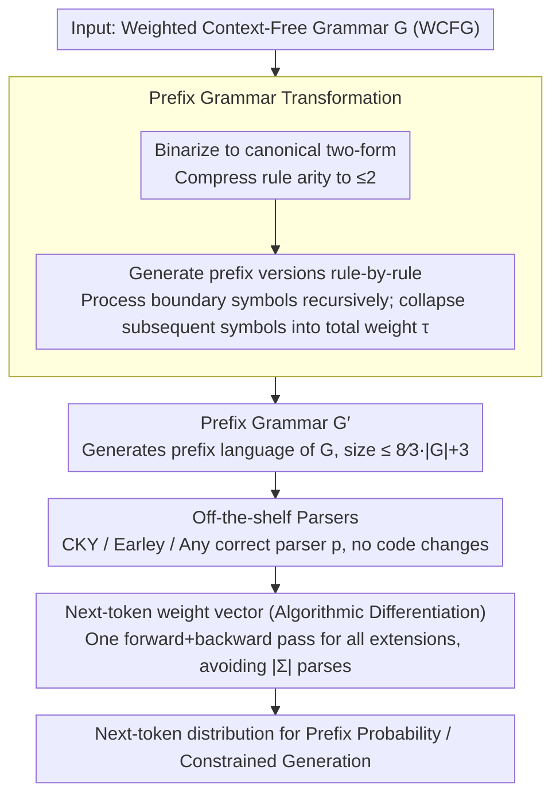

# Prefix Parsing is Just Parsing

**Conference**: ACL 2026  
**arXiv**: [2604.21191](https://arxiv.org/abs/2604.21191)  
**Code**: None  
**Area**: LLM/NLP  
**Keywords**: Prefix Parsing, Grammar Transformation, Context-Free Language Models, Prefix Probability, Constrained Generation

## TL;DR

This paper proposes **prefix grammar transformation**, an efficient method that reduces prefix parsing to ordinary parsing. Given a grammar, it constructs a new grammar that generates exactly the set of all prefix strings of the original grammar, allowing any existing ordinary parsing algorithm to be reused without modification.

## Background & Motivation

**Background**: Prefix parsing is a fundamental problem in formal language theory and NLP, determining whether an input prefix can be extended to a complete string generated by a given grammar. In weighted settings, prefix parsing also computes prefix probabilities, which is crucial for context-free language modeling, psycholinguistic analysis, and grammar-constrained generation for LLMs.

**Limitations of Prior Work**: Existing prefix parsing methods typically require designing specialized algorithms (e.g., modifying the internal logic of CYK or Earley parsers). These are complex to implement and cannot directly leverage highly optimized implementations of standard parsers.

**Key Challenge**: While prefix parsing is theoretically closely related to ordinary parsing, they require entirely different implementations in practice, creating a gap between theoretical elegance and engineering complexity.

**Goal**: To provide a simple, universal, and efficient framework that fully reduces prefix parsing to ordinary parsing.

**Key Insight**: Through grammar transformation—given a grammar $G$, construct a new grammar $G'$ such that $L(G')$ is exactly the set of all prefix strings of $L(G)$.

**Core Idea**: Prefix parsing "is" just ordinary parsing—with the correct transformation applied to the grammar, any ordinary parsing algorithm can be used for prefix parsing without modification.

## Method

### Overall Architecture

The method centers on a core reduction: transforming "prefix parsing," which seemingly requires specialized algorithms, into "ordinary parsing on a new grammar." Given an original grammar $G$, it is first binarized (into a canonical two-form where each rule's right-hand side length $\le 2$). Then, the **prefix grammar transformation** is applied to obtain $G'$, which generates only the prefix strings of $G$. Any off-the-shelf parser (CYK, Earley, etc.) can then be run on $G'$ without code changes. Furthermore, **algorithmic differentiation** is used to compute all single-token extension prefix weights (the next-token weight vector) in one pass, supporting efficient next-token prediction and constrained generation.

### Key Designs

**1. Prefix grammar transformation: Reducing prefix parsing to ordinary parsing**

Existing prefix parsers are tied to specific algorithms—Jelinek-Lafferty modifies CKY, Stolcke modifies Earley—making them complex and incompatible with optimized standard parsers. This paper modifies the grammar rather than the parser: for each rule $X \xrightarrow{w} \alpha_1\cdots\alpha_K$ in the original grammar, based on the observation that "a prefix must end inside some rule application," it generates a prefix rule for each boundary position $k$. Symbols before the boundary ($\alpha_1\cdots\alpha_{k-1}$) are parsed normally; the boundary symbol $\alpha_k$ is replaced by a new primed non-terminal $\alpha_k'$ for recursive processing; symbols after the boundary ($\alpha_{k+1}\cdots\alpha_K$) are collapsed into their total weight $\tau(\cdot)$ ($\tau=1$ for PCFGs). The resulting $G'$ is proven to generate the weighted prefix language of $G$ (Prop. 1). The practicality stems from binarization, which keeps the size of $G'$ within a small constant factor of the original ($|G'| \le \tfrac{8}{3}|G|+3$, Prop. 2), maintaining the original parsing complexity relative to string length (Thm. 2).

**2. Algorithmic differentiation for next-token weight vectors**

Incremental scenarios like constrained generation require the prefix weight vector for all possible following tokens $\pi_a(s)=\overrightarrow{\llbracket G\rrbracket}(sa)$, rather than a single prefix weight. A naive approach would run prefix parsing $|\Sigma|$ times. This paper utilizes **algorithmic differentiation**: viewing the prefix weight calculation as a computation graph and performing a backward pass (closely related to the classical outside algorithm) to obtain weights for all single-token extensions simultaneously. This keeps the asymptotic complexity equivalent to a single prefix parse, with an empirical slowdown of only ~1.2× (well below the 4× theoretical upper bound, Thm. 3), eliminating the $|\Sigma|$ overhead.

## Key Experimental Results

### Main Results

| Evaluation Aspect | Results |
|---|---|
| Correctness Verification | Transformed grammar prefix language exactly matches the original |
| Grammar Size | Transformed size is a small constant multiple of the original |
| Compatibility | Directly compatible with any standard parsing algorithm |

### Ablation Study

| Component | Effect |
|---|---|
| Grammar Transformation vs. Specialized Algorithms | Equivalent correctness, simpler implementation |
| Algorithmic Differentiation vs. Token-by-token Enumeration | Significant efficiency improvement |

### Key Findings

1.  **Theoretical Elegance**: Prefix parsing reduces entirely to ordinary parsing with no information loss.
2.  **Practical Efficiency**: Grammar size grows only by a constant factor, avoiding unacceptable overhead.
3.  **Engineering Simplification**: Eliminates the need to design and maintain specialized prefix parsers.
4.  **Broad Applications**: Directly applicable to syntax-constrained decoding for LLMs.

## Highlights & Insights

1.  **Conceptual Simplicity**: The insight that "prefix parsing is just parsing" unifies two seemingly distinct problems.
2.  **Integration of Theory and Practice**: Provides an elegant theoretical reduction while ensuring practical usability through size guarantees.
3.  **Value for Constrained Generation**: Directly accelerates the process of identifying valid token extensions in LLM constrained decoding.
4.  **Clever Application of AD**: Introduces algorithmic differentiation to formal languages/parsing to achieve efficient batch computation of next-token weights.

## Limitations & Future Work

1.  **Limited to CFGs**: Applicability to more powerful formalisms (e.g., Context-Sensitive Grammars) is not discussed.
2.  **Limited Empirical Benchmarking**: Primary focus is theoretical; evaluation in large-scale real-world scenarios is insufficient.
3.  **Integration with Existing Systems**: End-to-end integration with LLM constrained decoding frameworks (e.g., Outlines, Guidance) was not demonstrated.
4.  **Actual Constant Factors**: While the growth is constant, the impact on extremely large grammars warrants further investigation.
5.  **Restricted Detail Access**: This note is based on summaries; specific proofs and experimental details require further review.

## Related Work & Insights

1.  **Earley Parser**: Classical prefix parsing algorithm requiring internal modifications; this method removes that requirement.
2.  **CYK Algorithm**: Standard CFG parser that can now be used for prefix parsing via the transformed grammar.
3.  **Constrained Decoding (Outlines, etc.)**: Systems requiring efficient prefix parsing; this paper provides a theoretical foundation for optimization.
4.  **Algorithmic Differentiation**: Introduced here to the prefix parsing context for efficient next-token weight computation.

## Rating

*   **Novelty**: ⭐⭐⭐⭐⭐ — Elegant core insight unifying two classic problems.
*   **Experimental Thoroughness**: ⭐⭐⭐ — Primarily a theoretical contribution; empirical validation is relatively focused.
*   **Writing Quality**: ⭐⭐⭐⭐ — Clear expression of the core idea; title is highly effective.
*   **Value**: ⭐⭐⭐⭐ — Significant for both formal language theory and engineering implementations of LLM constrained generation.

<!-- RELATED:START -->

## Related Papers

- [\[ACL 2025\] Dolphin: Document Image Parsing via Heterogeneous Anchor Prompting](../../ACL2025/llm_nlp/dolphin_document_image_parsing_via_heterogeneous_anchor_prompting.md)
- [\[ACL 2025\] STEM-PoM: Evaluating Language Models Math-Symbol Reasoning in Document Parsing](../../ACL2025/llm_nlp/stem-pom_evaluating_language_models_math-symbol_reasoning_in_document_parsing.md)
- [\[ACL 2026\] 等等，还有出路：一个对话脱轨预测的决策机制](wait_theres_a_way_out_a_decision_mechanism_for_forecasting_conversational_derail.md)
- [\[ACL 2025\] Is It JUST Semantics? A Case Study of Discourse Particle Understanding in LLMs](../../ACL2025/llm_nlp/is_it_just_semantics_a_case_study_of_discourse_particle_understanding_in_llms.md)
- [\[ACL 2026\] Can AI Be a Good Peer Reviewer? A Survey of Peer Review Process, Evaluation, and the Future](can_ai_be_a_good_peer_reviewer_a_survey_of_peer_review_process_evaluation_and_th.md)

<!-- RELATED:END -->
