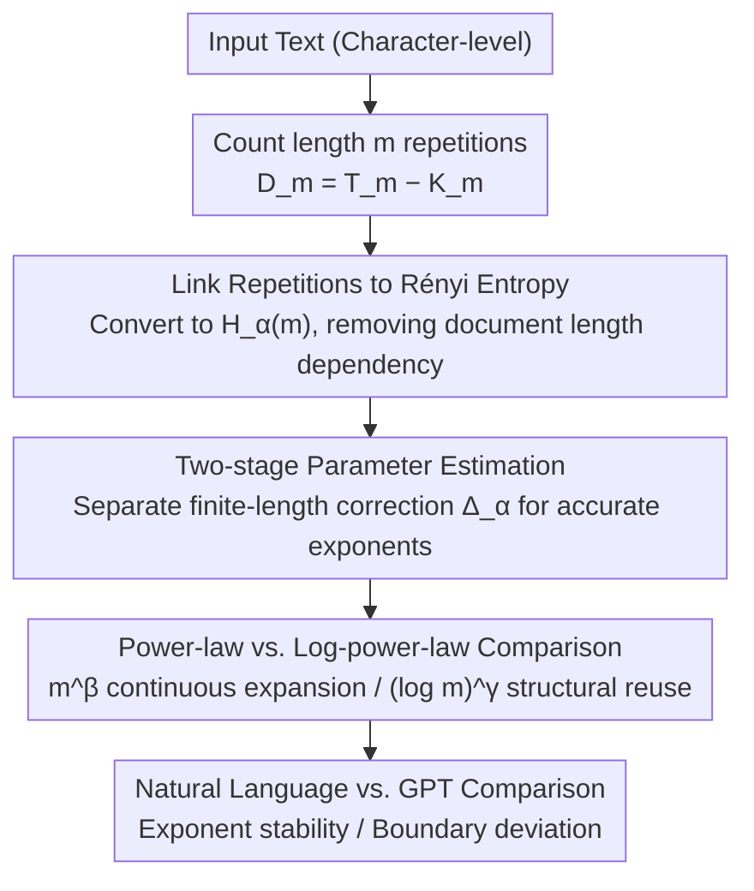

# Repeated Sequences Reveal Gaps between Large Language Models and Natural Language

**Conference**: ACL 2026  
**arXiv**: [2605.24850](https://arxiv.org/abs/2605.24850)  
**Code**: None  
**Area**: LLM/NLP  
**Keywords**: Subsequence repetition, Rényi entropy, LLM evaluation, Long-range structure, Entropy growth analysis

## TL;DR
This paper proposes an evaluation framework based on the distribution of repeated subsequences. By characterizing the entropy growth behavior of text through higher-order Rényi entropy, it reveals that natural language exhibits a stable sub-linear entropy growth pattern, whereas the entropy exponent of GPT-generated text increases monotonically with model scale, uncovering systematic differences in long-range statistical organization.

## Background & Motivation
**Background**: LLMs perform exceptionally well across various task benchmarks, but evaluation primarily depends on task performance or short-context behavior, lacking systematic analysis of the long-range statistical structure of generated text.

**Limitations of Prior Work**: Existing evaluation methods cannot determine whether LLMs truly capture the large-scale structural organization of natural language—high benchmark scores do not guarantee that generated text possesses the long-range statistical characteristics of human text. Prior studies have noted issues such as excessive repetition and decreased diversity in LLMs.

**Key Challenge**: Expressions in natural language are not used in isolation but form reference structures across long distances through repeated citation and reorganization. It remains unclear whether LLMs can reproduce this structure under the next-token prediction objective.

**Goal**: To propose a quantitative diagnostic tool based on the distribution of repeated subsequences to distinguish differences in long-range organization between natural language and LLM outputs.

**Key Insight**: Treat repetition as a distributional property analyzed across scales, rather than focusing solely on extreme repetition or generation degradation.

**Core Idea**: A deep connection exists between the number of repeated subsequences and higher-order Rényi entropy. Fitting power-law vs. log-power-law models to entropy growth can reveal the structural reuse characteristics of text.

## Method

### Overall Architecture
The method consists of three steps: (1) Count the number of repeated subsequences of length $m$, $D_m = T_m - K_m$ (total blocks minus distinct blocks); (2) Associate $D_m$ with higher-order Rényi entropy $H_\alpha(m)$, derive its asymptotic expansion, and use two-stage estimation to separate finite-length correction terms for accurate growth exponent estimation; (3) Fit $H_\alpha(m)$ to a power-law model ($\propto m^\beta$) and a log-power-law model ($\propto (\log m)^\gamma$) to compare differences between natural language and GPT text.

### Key Designs

**1. Connecting Repetitions to Rényi Entropy: Translating Countable Repetitions into Information Theory**

It is unfair to directly compare the number of repeated subsequences $D_m$ across different texts because $D_m$ is heavily influenced by total document length. The paper bridges this by showing that the expectation of $D_m$ can be expanded into power sums like $\sum p_w^\alpha$ ($\alpha \geq 2$), which are core components of Rényi entropy $H_\alpha(m) = \frac{1}{1-\alpha}\log_2 \sum p_w^\alpha$. After converting observable repetition counts into $H_\alpha(m)$, a structural feature independent of document length is obtained, allowing texts of different lengths and origins to be compared on a consistent scale.

**2. Two-stage Parameter Estimation: Accurate Entropy Growth Exponents on Finite Lengths**

Real text has finite length. Directly fitting growth exponents from $K_m$ or $H_\alpha(m)$ is biased by finite-length effects and yields unstable results. The authors adopt a two-step approach: first, estimate $\lambda_m = T_m/S_m$ from the functional relationship of $D_m/T_m$; then fit $\log_2 S_m = H_\alpha(m) + \Delta_\alpha$, where $\Delta_\alpha$ is a finite-length correction term depending on $\lambda_m$. Explicitly separating the correction term significantly improves the reliability of exponent estimation, which is the prerequisite for the method to work stably on texts of tens of thousands of characters.

**3. Power-law vs. Log-power-law Model Comparison: Distinguishing Essential Information Accumulation**

How entropy grows with $m$ corresponds to two different mechanisms of textual information organization. A power law $G(m) \propto m^\beta$ implies continuous expansion of structural degrees of freedom with the introduction of new information. A log-power law $G(m) \propto (\log m)^\gamma$ implies strong structural reuse, where text relies on reorganization and re-indexing of existing resources. The paper fits both models to $H_\alpha(m)$ and compares the goodness of fit to determine which side natural language falls on—it likely sits at the boundary of these two mechanisms. Whether GPT text deviates from this boundary is the question addressed by the experiments.

### Loss & Training
This is a purely analytical method with no training process. All analyses are performed at the character level to avoid tokenizer bias. $R^2$ coefficients and Welch's t-tests are used to evaluate fitting quality and significance of differences between groups.

## Key Experimental Results

### Dataset Scale

| Dataset | Quantity | Average Length (Chars) |
|--------|------|-----------------|
| gpt-3.5turbo | 100 | 35,045 ± 2,287 |
| gpt-4o-mini | 100 | 110,889 ± 23,379 |
| gpt-5-mini | 100 | 347,045 ± 19,793 |
| gpt-5 | 100 | 601,187 ± 24,973 |
| nl (matched to GPT lengths) | 100 each | Corresponding match |

### Main Results

| Comparison | $\beta$ Difference | $\gamma$ Difference | p-value |
|------|-------------|-------------|------|
| gpt-5 vs nl-5 | GPT significantly larger | GPT significantly larger | ≈0 |
| gpt-5-mini vs nl-5-mini | GPT significantly larger | GPT significantly larger | ≈0 |
| nl-5 vs nl-5-mini | No significant difference | No significant difference | β: 0.12, γ: 0.94 |

### Key Findings
- The entropy growth exponents $\beta$ and $\gamma$ of natural language remain stable across datasets of different lengths (weak universality), while GPT exponents increase monotonically with model scale.
- The log-power-law model generally outperforms the power-law model in long texts ($R^2 > 0.97$ vs 0.90-0.96), indicating that natural language is dominated by structural reuse.
- Short texts tend toward power-law fitting (continuous introduction of new information), while long texts favor log-power-law fitting (enhanced structural reuse).
- Traditional maximal repeated subsequence methods are nearly indistinguishable between gpt-5 and natural language (mean $\eta$ is similar), yet the proposed method detects significant differences.

## Highlights & Insights
- Proposes a novel LLM evaluation dimension based on information theory principles, independent of downstream tasks.
- The derivation from repeated subsequences to Rényi entropy is elegant, and the finite-length correction is handled rigorously.
- Discovers the "weak universality" of natural language—individual texts vary significantly, but aggregate exponents remain stable—an intriguing statistical law.
- Analysis of the complete works of Shakespeare (n=5,442,126 characters) demonstrates the significance of log-power-law behavior in extremely long texts.

## Limitations & Future Work
- Analyzes only GPT series models; applicability to other architectures (e.g., Llama/Claude) remains to be verified.
- Analysis is performed at the character level and not directly linked to word-level or syntactic linguistic structures.
- The method is descriptive and does not identify specific mechanisms causing the observed differences.
- Requires relatively long texts (tens of thousands of characters) for reliable fitting, limiting its use in short-text scenarios.
- The entropy rate $h_\alpha$ is not directly estimated, leaving it unclear if the entropy rate of natural language is zero.

## Related Work & Insights
- **Hilberg (1990)**: Hypothesized sub-linear power-law growth of block entropy in natural language; this paper further distinguishes between power-law and log-power-law mechanisms.
- **Dębowski (2015)**: Analysis based on maximal repeated subsequences; this paper shows distributional methods are more stable and discriminative than extreme statistics.
- **Holtzman et al. (2020)**: Focused on repetition degradation in LLMs; this paper repositions repetition from a "problem" to a "structural signal."
- **Insight**: Evaluating LLMs should go beyond task scores to verify whether their output possesses the intrinsic statistical structure of natural language.

## Rating
- Novelty: ⭐⭐⭐⭐⭐ New evaluation perspective, deeply integrating information theory with LLM assessment.
- Experimental Thoroughness: ⭐⭐⭐⭐ Reasonable dataset design (length matching) and rigorous statistical testing, though limited to the GPT family.
- Writing Quality: ⭐⭐⭐⭐⭐ Rigorous theoretical derivation, fluid prose, and well-designed charts.
- Value: ⭐⭐⭐⭐ Provides a brand-new tool for LLM evaluation, though practical application scenarios need further expansion.

<!-- RELATED:START -->

## Related Papers

- [\[ACL 2026\] Identifying the Periodicity of Information in Natural Language](identifying_the_periodicity_of_information_in_natural_language.md)
- [\[ICLR 2026\] Neural Synchrony Between Socially Interacting Language Models](../../ICLR2026/llm_nlp/neural_synchrony_between_socially_interacting_language_models.md)
- [\[ACL 2025\] PiFi: Plug-in and Fine-tuning: Bridging the Gap between Small Language Models and Large Language Models](../../ACL2025/llm_nlp/plugin_finetuning_bridge.md)
- [\[ACL 2025\] LLMs Know Their Vulnerabilities: Uncover Safety Gaps through Natural Distribution Shifts](../../ACL2025/llm_nlp/llms_know_their_vulnerabilities_uncover_safety_gaps_through_natural_distribution.md)
- [\[ACL 2026\] Adam's Law: Textual Frequency Law on Large Language Models](adam39s_law_textual_frequency_law_on_large_language_models.md)

<!-- RELATED:END -->
