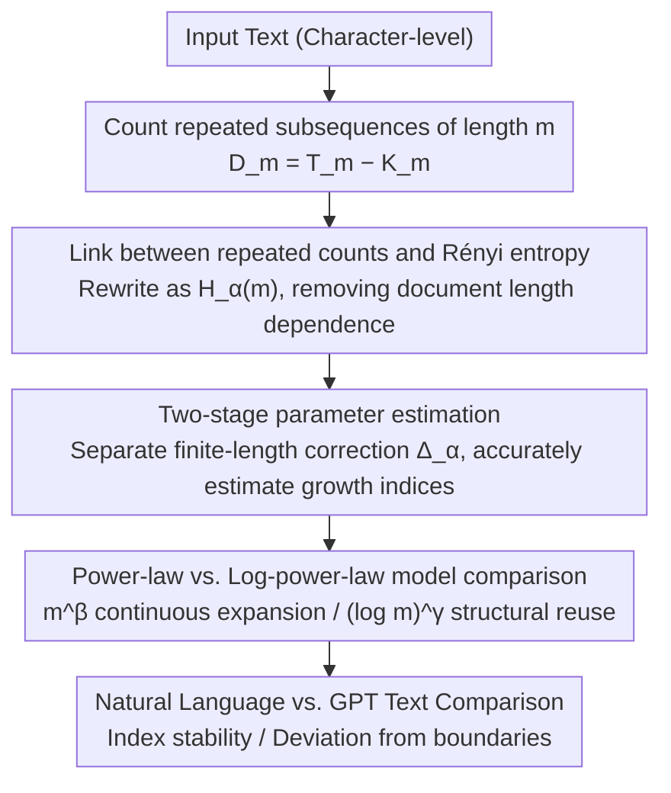

# Repeated Sequences Reveal Gaps between Large Language Models and Natural Language

**Conference**: ACL 2026  
**arXiv**: [2605.24850](https://arxiv.org/abs/2605.24850)  
**Code**: None  
**Area**: LLM/NLP  
**Keywords**: Repeated subsequences, Rényi entropy, LLM evaluation, long-range structure, entropy growth analysis

## TL;DR
This paper proposes an evaluation framework based on repeated subsequence distributions, characterizing the entropy growth behavior of text through high-order Rényi entropy. It finds that natural language exhibits a stable sub-linear entropy growth pattern, while the entropy indices of GPT-generated text increase monotonically with model scale, revealing systematic differences in long-range statistical organization between LLMs and natural language.

## Background & Motivation
**Background**: LLMs perform excellently on various task benchmarks, but evaluation relies primarily on task performance or short-context behavior, lacking systematic analysis of the long-range statistical structure of generated text.

**Limitations of Prior Work**: Existing evaluation methods cannot determine whether LLMs truly capture the large-scale structural organization of natural language—high benchmark scores do not imply that generated text possesses the long-range statistical properties of human text. Prior research has identified issues such as excessive repetition and decreased diversity in LLMs.

**Key Challenge**: Expressions in natural language are not used in isolation; they form reference structures across long distances through repeated quotation and reorganization. Whether LLMs can reproduce this structure under the next-token prediction objective remains unclear.

**Goal**: To propose a quantitative diagnostic tool based on repeated subsequence distributions to distinguish the differences in long-range organization between natural language and LLM outputs.

**Key Insight**: Treat repetition as a distributional characteristic analyzed across scales, rather than focusing solely on extreme repetition or generation degradation phenomena.

**Core Idea**: A deep connection exists between the number of repeated subsequences and high-order Rényi entropy. Fitting power-law vs. log-power-law models of entropy growth can reveal the structural reuse characteristics of text.

## Method

### Overall Architecture
The method involves three steps: (1) Counting the number of repeated subsequences of length $m$, $D_m = T_m - K_m$ (total blocks minus distinct blocks); (2) Relating $D_m$ to high-order Rényi entropy $H_\alpha(m)$, deriving its asymptotic expansion, and using a two-stage estimation to separate finite-length correction terms and accurately estimate entropy growth indices; (3) Fitting a power-law model ($\propto m^\beta$) and a log-power-law model ($\propto (\log m)^\gamma$) to $H_\alpha(m)$ and comparing the differences between natural language and GPT text.

### Key Designs

**1. Connecting repeated counts to Rényi entropy: Translating countable status into information-theoretic quantities**

Directly comparing the number of repeated subsequences $D_m$ across different texts is unfair because $D_m$ is heavily influenced by the total document length; long texts naturally have more repetitions. The paper provides a bridge: the expectation of $D_m$ can be expanded into power sum series like $\sum p_w^\alpha$ ($\alpha \geq 2$), which are core components of Rényi entropy $H_\alpha(m) = \frac{1}{1-\alpha}\log_2 \sum p_w^\alpha$. By rewriting observable repetition counts into $H_\alpha(m)$, a structural feature independent of document length is obtained, allowing texts of different lengths and sources to be compared on the same scale.

**2. Two-stage parameter estimation: Accurately estimating entropy growth indices on finite-length text**

Real text has finite length. Directly fitting growth indices from the number of distinct blocks $K_m$ or $H_\alpha(m)$ is skewed by finite-length effects, leading to unstable results. The authors adopt a two-step approach: first, estimate $\lambda_m = T_m/S_m$ from the functional relationship of $D_m/T_m$, then fit $\log_2 S_m = H_\alpha(m) + \Delta_\alpha$, where $\Delta_\alpha$ is a finite-length correction term depending on $\lambda_m$. By explicitly separating the correction term, the reliability of the index estimation is significantly improved, which is a prerequisite for this method to work stably on texts of several tens of thousands of characters.

**3. Power-law vs. Log-power-law model comparison: Distinguishing two fundamentally different information accumulation mechanisms**

How entropy grows with $m$ corresponds to two different mechanisms of organizing information in text. A power law $G(m) \propto m^\beta$ implies a continuous expansion of structural degrees of freedom, with the text constantly introducing new information. A log-power law $G(m) \propto (\log m)^\gamma$ implies strong structural reuse, where the text mainly shares existing resources through reorganization and re-indexing. The paper fits both models to $H_\alpha(m)$ and compares the goodness of fit to determine where natural language resides—it likely sits on the boundary between these two mechanisms, and whether GPT text deviates from this boundary is the question addressed in the experiments.

### Loss & Training
This is a purely analytical study with no training process. All analyses are performed at the character level to avoid tokenizer bias. $R^2$ coefficients of determination and Welch’s t-tests are used to evaluate fitting quality and the significance of differences between groups.

## Key Experimental Results

### Dataset Scale

| Dataset | Quantity | Average Length (Chars) |
|--------|------|-----------------|
| gpt-3.5turbo | 100 | 35,045 ± 2,287 |
| gpt-4o-mini | 100 | 110,889 ± 23,379 |
| gpt-5-mini | 100 | 347,045 ± 19,793 |
| gpt-5 | 100 | 601,187 ± 24,973 |
| nl (length-matched) | 100 each | Corresponding match |

### Core Statistical Test Results

| Comparison | $\beta$ Diff | $\gamma$ Diff | p-value |
|------|-------------|-------------|------|
| gpt-5 vs nl-5 | GPT significantly larger | GPT significantly larger | ≈0 |
| gpt-5-mini vs nl-5-mini | GPT significantly larger | GPT significantly larger | ≈0 |
| nl-5 vs nl-5-mini | No significant difference | No significant difference | β: 0.12, γ: 0.94 |

### Key Findings
- The entropy growth indices $\beta$ and $\gamma$ for natural language remain stable across datasets of different lengths (weak universality), while GPT text indices increase monotonically with model scale.
- The log-power-law model generally outperforms the power-law model in long texts ($R^2 > 0.97$ vs 0.90-0.96), indicating that natural language is dominated by structural reuse.
- Short texts tend toward power-law fitting (continuous introduction of new information), while long texts tend toward log-power-law fitting (enhanced structural reuse).
- Traditional maximal repeated subsequence methods are almost indistinguishable from natural language on gpt-5 (mean $\eta$ is close), but the proposed method still detects significant differences.

## Highlights & Insights
- Proposes a new LLM evaluation dimension based on first principles of information theory, independent of downstream tasks.
- The derivation from repeated subsequences to Rényi entropy is elegant, and the finite-length correction is handled rigorously.
- Discovered "weak universality" in natural language—individual text variation is large, but aggregate indices are stable, indicating an interesting statistical law.
- Analysis of the Complete Works of Shakespeare ($n=5,442,126$ characters) demonstrates the significance of log-power-law behavior in extremely long texts.

## Limitations & Future Work
- Only analyzed the GPT series; applicability to other architectures (e.g., Llama/Claude) remains to be verified.
- Analysis is performed at the character level and not directly linked to word-level or syntactic language structures.
- The method is descriptive and cannot identify the specific mechanisms leading to the differences.
- Requires relatively long texts (tens of thousands of characters or more) to obtain reliable fits, limiting short-text scenarios.
- The entropy rate $h_\alpha$ is not directly estimated, making it impossible to determine if the entropy rate of natural language is zero.

## Related Work & Insights
- **Hilberg (1990)**: Hypothesized sub-linear power-law growth of block entropy in natural language; this paper further distinguishes between power-law and log-power-law mechanisms.
- **Dębowski (2015)**: Analysis based on maximal repeated subsequences; this paper suggests distributional methods are more stable and discriminative than extreme statistics.
- **Holtzman et al. (2020)**: Focused on repetition degradation in LLMs; this paper repositions repetition from a "problem" to a "structural signal."
- Insight: Evaluation of LLMs should not only look at task scores but also verify if their output possesses the intrinsic statistical structure of natural language.

## Rating
- Novelty: ⭐⭐⭐⭐⭐ New evaluation perspective, deeply integrating information theory with LLM assessment.
- Experimental Thoroughness: ⭐⭐⭐⭐ Reasonable dataset design (length matching), rigorous statistical tests, but limited to the GPT family.
- Writing Quality: ⭐⭐⭐⭐⭐ Rigorous theoretical derivation, smooth writing, and well-designed charts.
- Value: ⭐⭐⭐⭐ Provides a brand-new tool for LLM evaluation, though practical application scenarios need expansion.

<!-- RELATED:START -->

## Related Papers

- [\[ACL 2026\] Identifying the Periodicity of Information in Natural Language](identifying_the_periodicity_of_information_in_natural_language.md)
- [\[ICLR 2026\] Neural Synchrony Between Socially Interacting Language Models](../../ICLR2026/llm_nlp/neural_synchrony_between_socially_interacting_language_models.md)
- [\[ACL 2025\] PiFi: Plug-in and Fine-tuning: Bridging the Gap between Small Language Models and Large Language Models](../../ACL2025/llm_nlp/plugin_finetuning_bridge.md)
- [\[ACL 2025\] LLMs Know Their Vulnerabilities: Uncover Safety Gaps through Natural Distribution Shifts](../../ACL2025/llm_nlp/llms_know_their_vulnerabilities_uncover_safety_gaps_through_natural_distribution.md)
- [\[ACL 2026\] Adam's Law: Textual Frequency Law on Large Language Models](adam39s_law_textual_frequency_law_on_large_language_models.md)

<!-- RELATED:END -->
