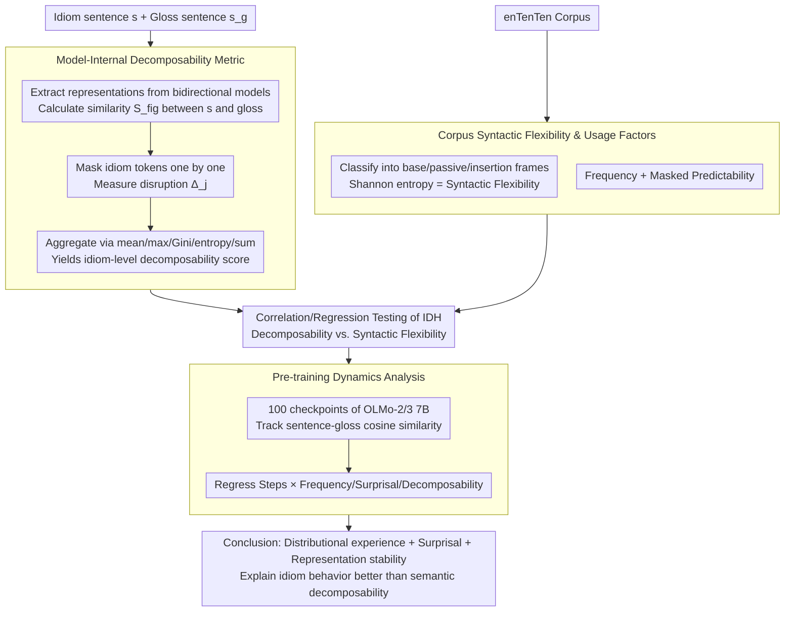

# Rethinking the Idiomaticity Decomposability Hypothesis: Evidence from Distributional Learning

**Conference**: ACL2026  
**arXiv**: [2606.03817](https://arxiv.org/abs/2606.03817)  
**Code**: https://github.com/mi-m1/idiom_decomp  
**Area**: NLP Understanding / Phrase Semantics / Language Model Analysis  
**Keywords**: idiom decomposability, syntactic flexibility, distributional learning, contextual representations, OLMo

## TL;DR
This paper re-examines the Idiom Decomposability Hypothesis using contextualized language models as "controlled distributional learners." It finds that model-derived decomposability is only weakly correlated with human judgments and exhibits a small but stable negative correlation with syntactic flexibility, suggesting that idiomatic behavior is better explained by distributional experience, surprisal, and representational stabilization.

## Background & Motivation
**Background**: Idiom research has long focused on decomposability—the extent to which the literal meanings of constituent words contribute to the overall metaphorical meaning. The classical Idiom Decomposability Hypothesis (IDH) posits that more decomposable idioms are more amenable to syntactic variations such as passivization, modifier insertion, and nominalization.

**Limitations of Prior Work**: This hypothesis relies primarily on human decomposability ratings and acceptability judgments. However, psycholinguistic studies show these ratings are task-dependent, speaker-variable, and unstable. Human judgments also conflate world knowledge, semantic intuition, familiarity, and linguistic experience, making it difficult to isolate what can be learned solely from distributional exposure.

**Key Challenge**: If idiomatic syntactic behavior is truly determined by internal semantic structure, decomposability should consistently predict syntactic flexibility. If behavior primarily stems from usage experience, then frequency, predictability, and representational stability during training may be more critical than constituent meaning mapping.

**Goal**: The authors construct a decomposability diagnostic metric using internal model representations and relate it to human ratings, syntactic flexibility in corpora, frequency, predictability, and pre-training dynamics to test whether IDH holds for distributional learners.

**Key Insight**: Contextualized models learn only from text distributions without explicit semantic role labeling or human acceptability judgments, serving as a control system for "distributional experience only." If IDH expectations emerge naturally within the model, it supports a distributional basis for IDH; otherwise, the role of decomposability requires reinterpretation.

**Core Idea**: By using the representational similarity between an idiom sentence and its gloss-replaced sentence as a measure of global meaning alignment, the authors estimate the contribution of each idiom word to the overall meaning via leave-one-out masking. This yields a model-internal decomposability score used to test whether semantic structural explanations predict actual usage.

## Method

### Overall Architecture
The pipeline consists of four steps. First, contextualized representations are extracted from bidirectional Transformers (e.g., BERT, ModernBERT) for each idiom sentence $s$ and its corresponding gloss-replaced sentence $s_g$. Second, the similarity between the full idiom sentence and the gloss is calculated, followed by masking idiom tokens one by one to observe changes in similarity; token contributions are aggregated into expression-level decomposability. Third, idiom frequencies across constructional frames are extracted from the enTenTen corpus, and syntactic flexibility is measured using Shannon entropy, alongside frequency and predictability. Fourth, the representational stabilization of idioms relative to glosses is tracked across 100 pre-training checkpoints of OLMo-2 7B and OLMo-3 7B.

### Key Designs

**1. Model-Internal Decomposability Metric: Representational Perturbation vs. Human Ratings**

Traditional tests rely on offline human ratings of decomposability, which are confounded by familiarity and world knowledge. The authors estimate the contribution of constituent words to the metaphorical meaning directly from hidden-state geometry: given the similarity $S_{fig}$ between sentence $s$ and gloss sentence $s_g$, they construct masked versions $s^{(-j)}$ for each token $j$ in the idiom span. Token contribution is defined as the magnitude of alignment disruption $\Delta_j=|S_{fig}-S_{mask}^{(j)}|$. These are aggregated into a decomposability score using functions like mean, maximum, Gini dispersion, entropy, or sum.

**2. Corpus Syntactic Flexibility and Usage Factors: Verifying IDH via Actual Usage**

If decomposability constrains syntactic deformation, it should be reflected in actual corpus usage rather than offline acceptability judgments. Idiom occurrences are categorized into constructional types (base form, adverb insertion, adjective insertion, passivization, action nominalization, etc.). Syntactic flexibility is measured using Shannon entropy: $H(i)=-\sum_c p_{i,c}\log_2 p_{i,c}$, where higher entropy indicates higher amenability to diverse constructions. Frequency and predictability (masked final-word probability) are included as independent usage factors.

**3. Pre-training Dynamics Analysis: Tracking Stability Drivers**

To determine what distributional learners rely on during representation formation, the authors track the cosine similarity between idiom and gloss sentences across 100 checkpoints of OLMo-2 7B and OLMo-3 7B. Linear regression models the interaction between training steps and log frequency, surprisal, and decomposability. This moves beyond static probing to diagnose the "learning trajectory."

### Loss & Training
This work does not train new models but performs diagnostic evaluations. Bidirectional models include BERT-base/large (cased/uncased) and ModernBERT-base/large. Pre-training analysis uses 100 checkpoints of OLMo-2-1124-7B and OLMo-3-1025-7B. Statistical tools include Spearman rank correlation, regression analysis, bootstrap confidence intervals, and VIF. Similarity functions compared include cosine, CKA, and Wasserstein distance.

## Key Experimental Results

### Main Results

| Research Question | Sample/Model | Key Results | Interpretation |
|----------|-----------|----------|------|
| Human decomposability vs. syntactic flexibility | 90 idioms (Bulkes & Tanner / IMPLI) | No significant relationship | Human ratings do not reliably predict corpus syntactic flexibility. |
| Model decomposability vs. Human ratings | BERT-large uncased, final layer, Wasserstein + sum | $r(90)=.24, p=.005$ | Weak positive correlation, suggesting limited overlap. |
| Model decomposability vs. syntactic flexibility | 527 IMPLI samples | Max correlation $r(527)=-.16, p=.0002$ | Small negative relationship, contradicting IDH positive correlation expectations. |
| PP idioms subset | 127 PP idioms | $\rho=-0.24, p=0.01$ | Higher decomposability in PP idioms correlates with lower actual flexibility. |
| VP idioms subset | 284 VP idioms | $\rho=-0.02, p=0.68$ | No significant relationship for VP idioms, the primary focus of IDH. |

### Ablation Study

| Configuration | Key Metric | Description |
|----------|---------|------|
| Human ratings: frequency | coef = -0.20, z = -2.26, p = 0.02 | Humans tend to judge high-frequency idioms as less decomposable. |
| Human ratings: predictability | coef = -0.52, z = -0.33, p = 0.73 | Predictability is not significant for human ratings. |
| BERT-large cased: frequency | coef = -0.29, z = -4.07, p < .001 | Model-derived decomposability is also significantly negatively correlated with frequency. |
| Bootstrap CI | 95% CI = [0.07, 0.40] | Best model-human correlation is unlikely due to noise but has high uncertainty. |
| VIF | All values near 1 | No severe multicollinearity between frequency, predictability, and decomposability. |

### Key Findings
- Data scale: IMPLI contains 527 samples (382 unique idioms); the Bulkes & Tanner subset includes 90 idioms. 8 models were tested (6 bidirectional encoders, 2 OLMo 7B causal LMs).
- Pre-training dynamics: Interactions between steps and all three attributes are significantly negative: Steps x Frequency (-0.0008, z = -24.69), Steps x Surprisal (-0.0007, z = -22.301), and Steps x Decomposability (-0.0010, z = -36.367). Decomposability has the largest effect on training dependence.
- Frequency is not the sole explanation: Frequency alone cannot account for idiom representation formation; surprisal and decomposability both influence the stabilization process.

## Highlights & Insights
- The strength of this paper lies in transforming a traditional linguistic hypothesis into a computable, reproducible representational diagnostic task rather than a simple classification task.
- The use of leave-one-out masking with gloss similarity is ingenious: it operationalizes the contribution of constituent words as perturbations to representational alignment, adhering to the theoretical definition while allowing internal measurement.
- The most interesting finding is the negative correlation: if decomposability supported syntactic deformation, a positive correlation should appear. The absence of this result suggests that holistic storage of high-frequency items, constructional constraints, and distributional predictability are more explanatory.

## Limitations & Future Work
- The decomposability metric is just one possible operationalization and may not capture all facets of the linguistic concept.
- Pre-training dynamics use BERT-large derived decomposability to predict OLMo's learning, introducing potential architectural bias. Ideally, this should be computed on the target model directly, though causal LMs are less suited for bidirectional masking.
- The scope is limited to English idioms and may not generalize to morphologically rich languages or different idiomatic structures.
- Syntactic flexibility counts rely on predefined frames; entropy might compress information regarding nuanced constructional variants or register differences.

## Related Work & Insights
- **vs. Idiom Decomposability Hypothesis**: IDH predicts a positive correlation between decomposability and flexibility; this study found no robust support (and even negative correlations) in both humans and models.
- **vs. Usage-based / Constructionist accounts**: These theories emphasize frequency, predictability, and constructional distribution. This paper's findings on frequency effects and training dynamics align more closely with these accounts.
- **vs. Traditional Human Norming**: Human ratings capture subjective transparency but are confounded by experience. Using models as controlled learners isolates what distributional exposure can explain.

## Rating
- Novelty: ⭐⭐⭐⭐⭐ Excellent combination of theoretical inquiry and representational diagnostics.
- Experimental Thoroughness: ⭐⭐⭐⭐☆ Covers multiple models and pre-training checkpoints, though cross-lingual breadth is missing.
- Writing Quality: ⭐⭐⭐⭐☆ Clear linguistic background, though the statistical density is high.
- Value: ⭐⭐⭐⭐☆ Highly insightful for idiom processing, interpretability, and the use of NLP to test linguistic theory.

<!-- RELATED:START -->

## Related Papers

- [\[ICML 2026\] Rethinking LLM Ensembling from the Perspective of Mixture Models](../../ICML2026/llm_nlp/rethinking_llm_ensembling_from_the_perspective_of_mixture_models.md)
- [\[ICML 2026\] The Cylindrical Representation Hypothesis for Language Model Steering](../../ICML2026/llm_nlp/the_cylindrical_representation_hypothesis_for_language_model_steering.md)
- [\[ICLR 2026\] The Lattice Representation Hypothesis of Large Language Models](../../ICLR2026/llm_nlp/the_lattice_representation_hypothesis_of_large_language_models.md)
- [\[ICML 2025\] The Lock-in Hypothesis: Stagnation by Algorithm](../../ICML2025/llm_nlp/the_lock-in_hypothesis_stagnation_by_algorithm.md)
- [\[ICLR 2026\] Rethinking Code Similarity for Automated Algorithm Design with LLMs](../../ICLR2026/llm_nlp/rethinking_code_similarity_for_automated_algorithm_design_with_llms.md)

<!-- RELATED:END -->
