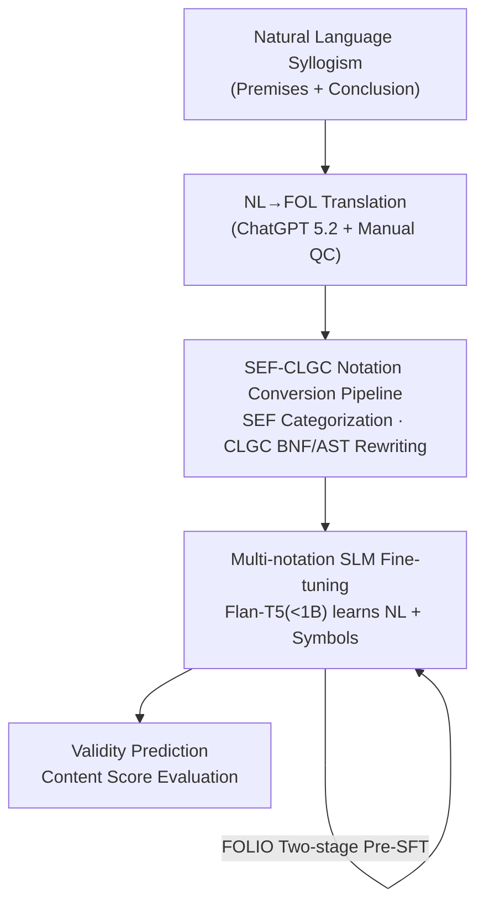

# SEF-CLGC at SemEval-2026 Task 11: Logical Notation Impact on Language Model Performance

**Conference**: ACL 2026  
**arXiv**: [2606.09157](https://arxiv.org/abs/2606.09157)  
**Code**: Model weights open-sourced (HuggingFace: HannaAbiAkl/LOGIC-NL-CLIF-Flan-T5-Large etc.)  
**Area**: NLP Understanding / Neuro-symbolic Reasoning  
**Keywords**: Syllogism validation, Small Language Models, Formal logic notation, Neuro-symbolic, Content bias

## TL;DR
This SemEval-2026 Task 11 system paper translates natural language syllogisms into various formal logic notations (FOL, CLIF, CLINGO, etc.) and performs supervised fine-tuning (SFT) on Small Language Models (SLMs) with <1B parameters (Flan-T5). It demonstrates that pairing natural language with "pre-trained" formal notations like FOL significantly reduces content bias during reasoning while maintaining extremely low computational requirements.

## Background & Motivation
**Background**: Determining the logical validity of a syllogism is a classic probe for testing the "formal reasoning vs. content memory" capabilities of language models. While current trends favor scaling up models, SLMs are being rediscovered for their potential in complex reasoning through neuro (pure prompt/fine-tuning) and neuro-symbolic (injecting rules/formal logic) enhancement paths.

**Limitations of Prior Work**: Existing research consistently finds that while larger models make fewer errors, they **still commit the same syllogistic fallacies as humans**—when the "content" (common sense) of a premise conflicts with "formal validity," models tend to follow common sense. For example, in "All cars are vehicles, no animals are cars, therefore no animals are vehicles," the conclusion is formally invalid but sounds reasonable, leading models to misjudge it. This phenomenon is termed the **Content Effect**.

**Key Challenge**: The goal of SemEval-2026 Task 11 Subtask 1 is to "decouple content reasoning from formal reasoning." The dilemma is that models are accustomed to natural language from pre-training but unfamiliar with pure symbolic logic notation. The objective is to leverage the rigor of symbolic notation to suppress content bias without causing the model to fail due to unfamiliar syntax.

**Goal**: Under the constraint of using **only very small models** (<1B parameters, pursuing a "frugal" approach), this study systematically investigates how the input of different formal logic notations or combinations affects the accuracy and content bias of syllogism validation.

**Key Insight**: The authors reuse their previous SEF-CLGC pipeline (Akl 2025) to batch-translate the same set of syllogisms into multiple Knowledge Representation (KR) notations for controlled experiments. Using the same model and data, only the input notation is varied to identify which best facilitates "formal reasoning."

**Core Idea**: Instead of feeding all syllogisms in a single language, **Natural Language (NL) is concatenated with formal notations** (e.g., NL-FOL) to fine-tune SLMs. NL provides familiar semantic anchors, while formal notation provides structural signals to suppress content bias, creating a complementary effect.

## Method
SEF-CLGC is essentially a "data generation + fine-tuning evaluation" pipeline: it converts NL syllogisms into various formal logic notations, uses these notations (or their combinations) for SFT on a tiny Flan-T5, and finally measures the performance using a specially designed Content Score.

### Overall Architecture
The input is a natural language syllogism (two premises + one conclusion), and the output is a true/false validity label. The process involves four stages: ① Translating NL to First-Order Logic (FOL) using ChatGPT 5.2; ② Converting FOL into various notations like CLIF, CGIF, TFL+, CLINGO, and MINIFOL2 via the SEF-CLGC framework; ③ Selecting specific notations or concatenations for SFT on Flan-T5 (<1B) along with labels; ④ Evaluating on a blind test set using the Content Score.

### Key Designs

**1. SEF-CLGC Notation Conversion Pipeline: Reliably translating NL syllogisms into multiple formal logics**

To ensure semantic consistency and grammatical validity across notations for controlled experiments, the authors avoid relying solely on LLM translation. **SEF (Syllogistic Evaluation Framework)** first categorizes each syllogism into 4 types: Hypothetical, Disjunctive, Categorical, or Complex. **CLGC (Common Logic Grammar Construction)** then builds Abstract Syntax Trees (AST) using Backus-Naur Form (BNF) for each notation. After verifying the FOL expression's validity with a parser, it mechanically rewrites it from the AST to the target notation (CLIF, CGIF, TFL+, etc.). The initial NL→FOL step uses ChatGPT 5.2, with manual verification on 20% of the training set and the entire evaluation set.

**2. Multi-notation SLM Fine-tuning: Feeding natural language anchors + formal structures**

The input is configured as single notations (NL, FOL, CLIF...) or concatenations (NL-FOL, NL-CLIF, FOL-CLIF-CGIF...). The intuition is that pure NL leads to content bias, while pure unfamiliar symbols might be unreadable. **NL concatenated with a formal notation familiar to the model from pre-training (e.g., FOL/CLIF)** preserves semantic readability while injecting formal structure. Experiments confirmed that notations common in pre-training data perform better, while overly abstract (TFL+) or inconsistent (MINIFOL2) notations lead to performance degradation. Adding more notations (e.g., NL-FOL-CLIF) does not necessarily improve performance due to signal dilution.

**3. Content Score: Isolating content bias from formal reasoning performance**

To distinguish between true formal reasoning and "correctly guessing" based on common sense, the task uses the official Content Score (CS):

$$CS = \frac{ACC}{1 + \log(1 + CE)}$$

Where $ACC$ is the overall accuracy and $CE$ is the **Content Effect**—defined as the difference in average accuracy between "Plausible" and "Implausible" syllogisms. A higher $CE$ indicates the model is more influenced by whether the premises align with common sense. The CS penalizes high content effect, meaning a model with slightly lower accuracy but significantly lower bias can achieve a higher CS.

**4. FOLIO Two-stage Pre-SFT: Warming up on formal logic before task fine-tuning**

Two model families were established: **SEMEVAL** (vanilla Flan-T5 fine-tuned directly on task data) and **FOLIO-SEMEVAL** (pre-fine-tuned on the FOLIO dataset before task-specific SFT). This "warm-up" allows the model to establish an initial "intuition" for formal logic. Findings showed that notations like NL-CLIF, which perform poorly in the vanilla version, outperform NL after FOLIO pre-fine-tuning, proving that neuro-symbolic combinations yield gains when models are exposed to formal logic early.

### Loss & Training
Standard SFT was used without special loss functions. The SEMEVAL model was trained on the merged pilot+training sets for 5 epochs, with a learning rate of $10^{-5}$ and batch size of 4. Backbones used were Flan-T5-small (on T4 GPU) and Flan-T5-large (on A100 GPU).

## Key Experimental Results

### Main Results
On the official blind test set (191 syllogisms), results for the FOLIO-SEMEVAL Flan-T5-large family (Acc/CE in percentages, CS as composite):

| Notation | Acc | CE (Content Effect ↓) | CS (Composite ↑) |
| :--- | :--- | :--- | :--- |
| **NL-FOL** | 90.57 | 8.55 | **27.80** |
| NL | 93.19 | 9.57 | 27.74 |
| FOL | 66.49 | **3.50** | 26.54 |
| NL-CLIF | 89.00 | 13.85 | 24.06 |
| CLINGO | 74.34 | 16.66 | 19.20 |
| TFL+ | 59.16 | 10.41 | 16.91 |
| CLIF | 80.00 | 50.00 | 16.22 |

The best CS came from **NL-FOL** (27.80%). While its accuracy was slightly lower than pure NL, its lower CE resulted in a higher composite score. Pure FOL significantly reduced CE (3.50) but at a major cost to accuracy.

### Ablation Study
Comparison between the vanilla SEMEVAL and FOLIO pre-fine-tuned families on training set accuracy (Flan-T5-large):

| Notation | SEMEVAL Acc | FOLIO-SEMEVAL Acc | Description |
| :--- | :--- | :--- | :--- |
| NL-CLIF | 0.88 | **0.95** | Outperforms NL after pre-SFT; CLIF is learnable |
| NL | 0.92 | 0.93 | Most familiar notation; mostly saturated |
| NL-FOL | 0.91 | 0.92 | Robust neuro-symbolic combination |
| CLIF | 0.74 | 0.85 | Significant gain due to FOLIO warm-up |
| MINIFOL2 | 0.72 | 0.75 | Weak performance due to mixed syntax |
| TFL+ | 0.61 | 0.55 | Too abstract; performance degraded |

### Key Findings
- **Familiarity in Pre-training defines the upper bound**: Notations frequent in pre-training data (NL, FOL) performed best. Abstract or hybrid notations (TFL+, MINIFOL2) performed worst.
- **Diminishing returns for concatenated notations**: NL-FOL-CLIF was inferior to NL-FOL or NL-CLIF, indicating that more notations do not equal more utility.
- **FOLIO pre-SFT is a critical catalyst**: It enabled "unfamiliar but structured" notations like CLIF to surpass NL, unlocking neuro-symbolic synergy.
- **Formal notation trades accuracy for lower bias**: NL+Formal concatenation is a practical solution that balances these two metrics.

## Highlights & Insights
- **Frugal Approach**: Using <1B parameters while remaining competitive in decoupling reasoning proves the efficacy of "SLM + Neuro-symbolics."
- **Utility of the CS Metric**: Integrating bias penalty into the final score provides a robust quantitative approach for evaluating shortcut learning.
- **Grammar-driven Conversion**: Using BNF/AST ensuring syntactic correctness provides a reproducible infrastructure for notation-based experiments.
- **Familiarity as a Switch**: The effectiveness of neuro-symbolic methods depends heavily on the model's prior exposure to the formal language.

## Limitations & Future Work
- **Dependency on NL→FOL translation**: Errors from ChatGPT 5.2 can propagate through the pipeline.
- **Low absolute scores**: The best CS of 27.80 suggests SLMs still struggle with consistently robust formal reasoning.
- **Empirical notation selection**: Choosing notations remains trial-and-error without a theoretical framework for "notation learnability."
- **Improvement paths**: Using stronger translation models, exploring tokenizer retraining for formal notations, and explicitly injecting SEF structural classes into training.

## Related Work & Insights
- **vs. Pure Prompting/ICL (Dasgupta et al.)**: SFT is more effective for small models to suppress bias; this paper extends SFT with multi-notation inputs.
- **vs. Rule-injected Prompts (Seals & Shalin)**: This work uses a more fundamental symbolic approach by rewriting the entire input into formal logic.
- **vs. Theorem Prover Systems (Ranaldi et al.)**: While others use solvers, this study focuses on the impact of "input notation" itself on model fine-tuning.

## Rating
- Novelty: ⭐⭐⭐
- Experimental Thoroughness: ⭐⭐⭐⭐
- Writing Quality: ⭐⭐⭐⭐
- Value: ⭐⭐⭐⭐

<!-- RELATED:START -->

## Related Papers

- [\[ACL 2025\] Logical Forms Complement Probability in Understanding Language Model (and Human) Performance](../../ACL2025/llm_nlp/logical_forms_complement_probability_in_understanding_language_model_and_human_p.md)
- [\[ACL 2026\] One Persona, Many Cues, Different Results: How Sociodemographic Cues Impact LLM Personalization](one_persona_many_cues_different_results_how_sociodemographic_cues_impact_llm_per.md)
- [\[ICML 2026\] On the Limits of LLM Adaptability: Impact of Model-Internalized Priors on Annotation](../../ICML2026/llm_nlp/on_the_limits_of_llm_adaptability_impact_of_model-internalized_priors_on_annotat.md)
- [\[ICLR 2026\] SPRIG: Improving Large Language Model Performance by System Prompt Optimization](../../ICLR2026/llm_nlp/sprig_improving_large_language_model_performance_by_system_prompt_optimization.md)
- [\[ACL 2026\] Think in Sentences: Explicit Sentence Boundaries Enhance Language Model's Capabilities](think_in_sentences_explicit_sentence_boundaries_enhance_language_model39s_capabi.md)

<!-- RELATED:END -->
