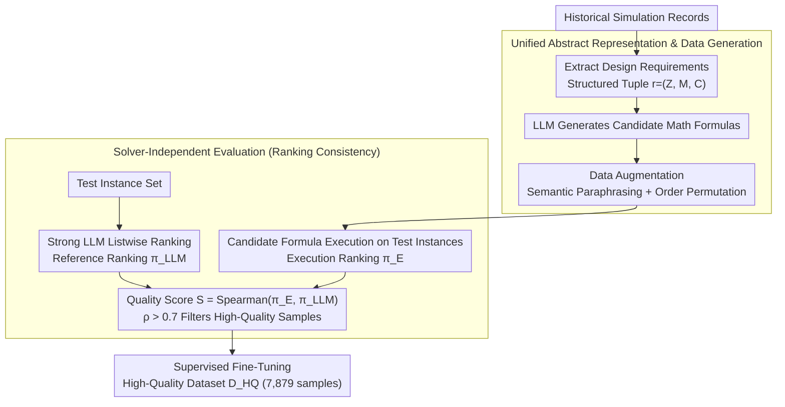

# Solver-Independent Automated Problem Formulation via LLMs for High-Cost Simulation-Driven Design

**Conference**: ACL 2026 Findings  
**arXiv**: [2512.18682](https://arxiv.org/abs/2512.18682)  
**Code**: None  
**Area**: Signal Communication  
**Keywords**: Automated Problem Formulation, High-Cost Simulation, LLM Fine-tuning, Solver-Independent Evaluation, Antenna Design

## TL;DR

This paper proposes APF (Automated Problem Formulation), a solver-independent framework that utilizes LLMs to transform natural language design requirements from engineers into executable mathematical optimization models. By employing an innovative data generation and test instance annotation pipeline, it overcomes the difficulty of filtering data without solver feedback in high-cost simulation scenarios, significantly outperforming existing methods in antenna design tasks.

## Background & Motivation

**Background**: High-cost simulation-driven design is prevalent in fields such as antennas, aerospace, microelectronics, and robotics. The core task is to optimize design parameters so that performance distributions (e.g., radiation efficiency curves in the frequency domain) meet design requirements. Since requirements are usually provided in unstructured natural language, formalizing them into executable mathematical models is a bottleneck for optimization.

**Limitations of Prior Work**: (1) Prompt-based methods (e.g., Chain-of-Experts, OptiMUS) struggle to accurately identify objectives and constraints when faced with ambiguous or domain-dependent natural language requirements; (2) Fine-tuning methods (e.g., ORLM, LLMOPT, SIRL) improve performance but rely on solver feedback for data filtering, which is unavailable in high-cost simulation scenarios; (3) Existing methods primarily focus on operations research problems like linear or integer programming, which differ significantly from simulation-driven design in terms of problem description and evaluation cost.

**Key Challenge**: Fine-tuning LLMs requires high-quality training data, but in high-cost simulation scenarios, verifying the correctness of generated formulas requires expensive physical simulations (e.g., full-wave electromagnetic simulation), making large-scale data quality screening infeasible. The solver feedback mechanisms relied upon by previous fine-tuning methods fail in this context.

**Goal**: Develop an automated problem formulation framework independent of solver feedback that can automatically generate high-quality training data and fine-tune LLMs to accurately convert natural language requirements into executable mathematical optimization models.

**Key Insight**: Introduce test instances as a bridge—use LLMs to rank and annotate test instances, transforming "semantic alignment between natural language and mathematical formulas" into a "ranking consistency problem," thereby bypassing expensive solver verification.

**Core Idea**: Construct a high-quality fine-tuning dataset through a three-stage pipeline of data generation, test instance annotation, and ranking consistency evaluation without calling expensive solvers, enabling 7B/8B open-source models to reach or exceed the modeling precision of large models like GPT-4o.

## Method

### Overall Architecture

This paper addresses the dilemma in high-cost simulation design where design requirements are often vague natural language. Traditional fine-tuning relies on solver feedback to filter training data, but in fields like antennas or aerospace, full-wave electromagnetic simulation is extremely expensive, making solver feedback inaccessible. APF uses "test instances" as a bridge to bypass the solver: first, it extracts solvable design requirements from historical simulation records and has an LLM generate candidate mathematical formulas. Then, a strong LLM ranks a set of test instances to obtain a "reference ranking." The ranking produced by executing the generated formulas on the test instances is compared with the reference ranking for consistency. Only samples with high consistency are retained for standard SFT.

### Key Designs

**1. Unified Abstract Representation & Data Generation: Standardizing industrial specs and mass-producing data**

Industrial design requirements are unstructured. APF formalizes each requirement into a structured tuple $r = (\mathcal{Z}, M, \mathcal{C})$: $\mathcal{Z}$ is a sub-region of evaluation variables, $M: z \in \mathcal{Z} \to \mathbb{R}$ is a metric function, and $\mathcal{C}$ specifies the design intent (e.g., threshold constraints $\min_{z \in \mathcal{Z}} M(z) \geq 1.5$ or an optimization objective). Training requirements $\mathcal{R} = \{r_1, r_2, \ldots, r_n\}$ are extracted from historical simulation records, and corresponding mathematical formulas are generated by an LLM.

Extracting from historical simulations ensures physical feasibility. Two types of augmentation are applied: semantic paraphrasing ($v$ variants for the same requirement) to improve robustness to phrasing, and order permutation to prevent the model from relying on position cues.

**2. Solver-Independent Evaluation: Replacing expensive verification with ranking consistency**

Calculating whether "a natural language requirement and a mathematical formula are semantically aligned" is computationally infeasible, and simulation is too expensive. APF introduces a set of test instances $\mathcal{I}$ as a bridge. A strong LLM uses a listwise strategy to rank these instances, generating a reference ranking $\pi_{\text{LLM}} = \arg\max_\pi P_\theta(\pi | \mathcal{P})$. The formula quality score is defined as the Spearman correlation coefficient between its execution ranking and the reference ranking: $S(E) = \rho(\pi_E, \pi_{\text{LLM}})$. Only samples with strong correlation ($> 0.7$) enter the training set.

Listwise ranking is used instead of pairwise for efficiency: ranking the entire list at once requires only 1 call, whereas pairwise comparison requires 105 calls for the same number of items, yet ranking quality remains comparable ($\rho$ of 0.8643 vs 0.8536).

**3. Alignment Metric & Supervised Fine-Tuning: Separating objectives and constraints**

Data **selection** (Design 2) uses the aggregate quality score $S(E)$, but **evaluation** of generated formulas uses a more granular alignment metric $A(E)$ comprised of weighted objective and constraint alignment: $A(E) = \alpha A_{\text{obj}}(E) + (1-\alpha) A_{\text{con}}(E)$. Objectives focus on relative order using Spearman correlation $A_{\text{obj}} = \frac{1}{n_1} \sum_{e_i \in E_{\text{obj}}} \rho(\hat{\pi}_i, \pi^*)$, and constraints focus on absolute feasibility via classification accuracy $A_{\text{con}} = \frac{1}{n_2} \sum_{e_j \in E_{\text{con}}} (1 - \frac{1}{m} \|\hat{\mathbf{y}}_j - \mathbf{y}^*\|_1)$, with $\alpha = 0.5$. Finally, standard SFT is performed on the high-quality dataset $\mathcal{D}_{\text{HQ}}$ (7,879 samples) without any solver calls.

### Loss & Training

Standard SFT is performed on the filtered high-quality dataset $\mathcal{D}_{\text{HQ}}$ (7,879 samples). The study uses 2,300 design requirement sets, with 300 for testing (zero overlap) and 2,000 for training. The selection threshold is 0.7. GPT-4o is used for data generation, and GPT-5 level models are used as LLM judges for test instance labeling.

## Key Experimental Results

### Main Results

**Overall Formula Quality Comparison**

| Method | $A_{\text{obj}}$ | $A_{\text{con}}$ | $A$ (Total) |
|------|------|------|------|
| GPT-4o | 0.6055 | 0.7075 | 0.6651 |
| DeepSeek-V3 | 0.7404 | 0.7690 | 0.7518 |
| Claude-sonnet-4.5 | 0.8023 | 0.7880 | 0.7923 |
| Chain-of-Experts | 0.7426 | 0.7453 | 0.7252 |
| OptiMUS | 0.6341 | 0.6986 | 0.6687 |
| LLAMA3.1-8B (Original) | -0.0453 | 0.5029 | 0.2248 |
| **APF + LLAMA3.1-8B** | **0.8012** | **0.7969** | **0.7976** |
| **APF + Qwen2.5-7B** | 0.7990 | 0.7959 | 0.7961 |
| **APF + Mistral-7B** | 0.7974 | 0.7883 | 0.7918 |

### Ablation Study

| Configuration | $A_{\text{obj}}$ | $A_{\text{con}}$ | $A$ |
|------|------|------|------|
| w/o Augmentation | 0.7656 | 0.7555 | 0.7553 |
| w/o Selection | 0.7603 | 0.7800 | 0.7653 |
| APF (Full) | **0.8009** | **0.7971** | **0.7976** |

**Evaluation Method Comparison**

| Method | Spearman $\rho$ | LLM Calls | Time (s) | Cost ($) |
|------|------|------|------|------|
| Listwise (Ours) | 0.8643 | 1 | 97.66 | 0.02 |
| Pairwise | 0.8536 | 105 | 2544.8 | 0.47 |

### Key Findings

- LLAMA3.1-8B fine-tuned with APF improved from 0.2248 to 0.7976 (+256%), surpassing GPT-4o and Claude-sonnet-4.5.
- Performance across three different 7B/8B models was highly consistent (0.7918–0.7976), proving the general effectiveness of the high-quality data.
- LLM judge rankings highly correlate with human rankings (GPT-5: $\rho = 0.8316$), validating the reliability of solver-independent evaluation.
- Listwise evaluation is 26x faster and 23x cheaper than pairwise with comparable quality.
- The framework is insensitive to hyperparameters, with stable performance for selection thresholds between 0.6 and 0.8.

## Highlights & Insights

- The use of "test instances as a bridge" cleverly transforms semantic alignment into quantifiable ranking consistency, bypassing expensive solver validation.
- The efficiency of Listwise vs. Pairwise is significant: comparable quality with massive speed and cost advantages.
- Demonstrates that for domain-specific tasks, high-quality data combined with small models can match or exceed the zero-shot capabilities of general-purpose large models.
- Extracting requirements from historical simulation records ensures physical feasibility, making this data-driven approach more reliable than random synthesis.

## Limitations & Future Work

- Currently only validated in antenna design; requires cross-domain validation in areas like aerodynamics or structural optimization.
- Solver-independent evaluation depends on constructing prompts with detailed test instances, which is limited by the LLM's context window.
- Data generation depends on strong models like GPT-4o, introducing additional costs.
- Only 7B/8B scale models were validated; effects on larger or smaller models remain unexplored.

## Related Work & Insights

- **vs. Chain-of-Experts/OptiMUS (Prompt-based)**: Prompting falls short on ambiguous requirements (A: 0.6687–0.7252), whereas APF achieves higher accuracy through fine-tuning (A: 0.7976).
- **vs. ORLM/SIRL (Fine-tuning-based)**: These rely on solver feedback, which is infeasible in high-cost simulations; APF replaces solver feedback with LLM ranking consistency.
- **vs. GPT-4o/DeepSeek-V3 (Zero-shot)**: Fine-tuned 7B models outperform these large models, showcasing the value of domain-specific fine-tuning.

## Rating

- Novelty: ⭐⭐⭐⭐ The test instance bridge and solver-independent evaluation are novel approaches to semantic alignment.
- Experimental Thoroughness: ⭐⭐⭐ Thorough validation in antenna design, but limited to a single domain.
- Writing Quality: ⭐⭐⭐⭐ Clear framework description, well-defined motivations, and professional figures.
- Value: ⭐⭐⭐⭐ Provides a practical framework for automated modeling in high-cost simulation fields with high industrial potential.

<!-- RELATED:START -->

## Related Papers

- [\[ICLR 2026\] Rethinking Code Similarity for Automated Algorithm Design with LLMs](../../ICLR2026/llm_nlp/rethinking_code_similarity_for_automated_algorithm_design_with_llms.md)
- [\[ACL 2026\] Generative Floor Plan Design with LLMs via Reinforcement Learning with Verifiable Rewards](generative_floor_plan_design_with_llms_via_reinforcement_learning_with_verifiabl.md)
- [\[ACL 2025\] Achieving Certification-by-Design Through Model-Driven Development](../../ACL2025/llm_nlp/achieving_certification-by-design_through_model-driven_development.md)
- [\[ACL 2025\] Zero-Shot Belief: A Hard Problem for LLMs](../../ACL2025/llm_nlp/zero-shot_belief_a_hard_problem_for_llms.md)
- [\[ICML 2026\] Automated Formal Proofs of Combinatorial Identities via Wilf–Zeilberger Guidance and LLMs](../../ICML2026/llm_nlp/automated_formal_proofs_of_combinatorial_identities_via_wilf-zeilberger_guidance.md)

<!-- RELATED:END -->
