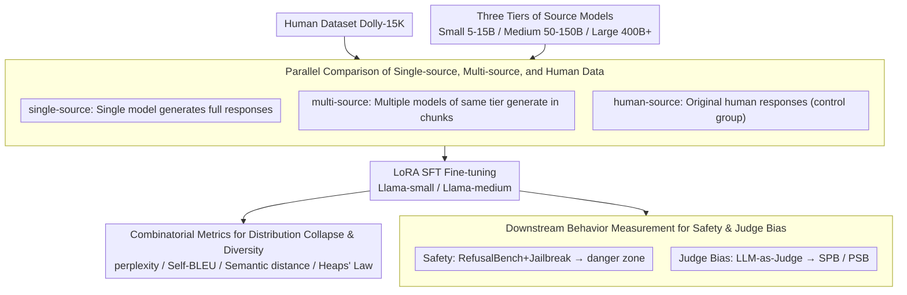

# Synthetic Eggs in Many Baskets: The Impact of Synthetic Data Diversity on LLM Fine-Tuning

**Conference**: ACL 2026 Findings  
**arXiv**: [2511.01490](https://arxiv.org/abs/2511.01490)  
**Code**: https://github.com/maxschaffelder/synthetic_data_diversity  
**Area**: LLM / Synthetic Data / Model Safety  
**Keywords**: Synthetic data diversity, Model collapse, LoRA fine-tuning, Jailbreak robustness, Self-preference bias

## TL;DR
This paper systematically compares the impact of single-source models, multi-source models, and human data as sources for supervised fine-tuning (SFT) on Llama models. It finds that multi-source synthetic data mitigates distributional collapse and self-preference, but synthetic data may weaken safety guardrails while maintaining output quality, with risks varying in complex ways based on source model scale and mixing methods.

## Background & Motivation
**Background**: As high-quality human text becomes increasingly scarce, synthetic data has been integrated into pre-training, instruction fine-tuning, and alignment processes. Much existing work focuses on whether synthetic data can improve benchmark scores, but there is insufficient analysis regarding how it alters model output distributions, safety robustness, and $LLM-as-Judge$ biases.

**Limitations of Prior Work**: Training on synthetic data can lead to so-called model collapse, where model outputs increasingly resemble existing models, leading to a decline in lexical and syntactic diversity and deteriorating modeling capabilities for human text. Simultaneously, fine-tuning might undermine original refusal and safety policies even with seemingly harmless data; if synthetic data generates harmful responses that remain fluent and executable, the risks are higher than low-quality outputs.

**Key Challenge**: Synthetic data is, on one hand, a realistic choice for low-cost training set expansion, but on the other hand, it may pass down distributional narrowing, preferences, and safety flaws from source models to target models. The core issue is not "whether synthetic data can be used," but "whether synthetic data should come from one or multiple models, and how the scale of source models changes the consequences."

**Goal**: The authors aim to decouple the impact of synthetic data source diversity, examining its effects on three areas: whether the output distribution collapses, whether the model becomes more vulnerable to jailbreak attacks, and whether it shows greater favoritism toward itself or synthetic text when acting as a judge.

**Key Insight**: The paper selects Llama-3.1 8B and 70B as target models and uses Dolly-15K as the base task set to construct single-source, multi-source, and human-source fine-tuning data. This allows for a direct comparison of behavioral differences brought by variations in data source composition under identical SFT conditions.

**Core Idea**: Treat synthetic data diversity as a controllable experimental variable to observe its cascading effects on distribution, diversity, safety, and judge bias, rather than only focusing on downstream task accuracy.

## Method
The methodology consists of a carefully designed controlled experiment. It first uses LLMs of different scales and families to generate synthetic responses for Dolly-15K, then fine-tunes Llama target models with this data, and finally evaluates model behavior across three lines of inquiry: distributional collapse metrics, jailbreak safety metrics, and $LLM-as-Judge$ bias metrics.

### Overall Architecture
The input is the Databricks-Dolly-15K human dataset and three tiers of source models: Small ($\approx$ 5-15B), Medium ($\approx$ 50-150B), and Large (400B+ or closed-source). Outputs are Llama-small/Llama-medium models fine-tuned via LoRA SFT, each corresponding to different data source conditions.

### Key Designs

**1. Parallel comparison of single-source, multi-source, and human data: Treating "data source diversity" as a controllable variable**

If one only compares "synthetic vs. human," it is impossible to distinguish whether issues arise from synthetic data itself or from the stylistic narrowing of a single source model. The paper sets three parallel conditions: *single-source* uses one Llama source model to generate all Dolly responses; *multi-source* splits the data into subsets generated by multiple non-target models of the same scale, while keeping one subset generated by the target model; *human-source* uses original Dolly human responses as a control. All generations use $\text{temperature}=0.7, \text{top\_p}=0.9, \text{max\_output\_tokens}=1024$. Decoupling single-source and multi-source directly reveals whether "mixing multiple models" truly mitigates distributional collapse.

**2. Combinatorial metrics for distributional collapse and diversity: Measuring distributional narrowing from multiple perspectives rather than just task scores**

Model collapse does not necessarily manifest as total semantic repetition; it may first appear as slowed vocabulary growth or increased perplexity on human text. To avoid over-interpretation of a single metric, the paper stacks four indicators: perplexity of different source texts calculated by the target model; lexical diversity measured as $100 \cdot (1-\text{Self-BLEU})$; semantic diversity measured by average pairwise cosine distance of SentenceBERT embeddings; and vocabulary growth rate fitted via Heaps' Law $V(n)=K\cdot n^\beta$. Results show human text has an average lexical diversity of 89.15, higher than synthetic text's 79.60, with significantly faster vocabulary growth—indicating that narrowing occurs primarily at the lexical and stylistic levels.

**3. Downstream behavior measurement for safety and judge bias: Verifying if distributional changes translate into real risks**

Distributional narrowing is inherently neutral; the key is whether it evolves into safety vulnerabilities or appraisal biases. Safety experiments combine RefusalBench with jailbreak prompts (RB+J), using Llama-3.1-70B-Instruct as a judge to score harmfulness and quality, defining outputs where both harmfulness and quality $\ge 4$ as the "danger zone." Judge bias experiments involve fine-tuned Llama models performing pairwise ranking of summaries (CNN/DailyMail), calculating two biases: self-preference bias ($\text{SPB}=S_{target}-\overline{S}_{others}$) and pro-synthetic bias ($\text{PSB}=\overline{S}_{synthetic}-S_{human}$). Combining quality and harmfulness is critical because "harmful but nonsensical" vs. "harmful, high-quality, and actionable" represent different risk levels.

### Loss & Training
This work utilizes LoRA supervised fine-tuning and does not propose a new loss function. Target models Llama-3.1 8B and 70B were trained on H100 GPUs in 16-bit precision with LoRA rank 16 and $\alpha=32$. Each sample was capped at 1024 tokens. Training lasted for 3 epochs with a learning rate of 5e-5 using the AdamW optimizer, 3% warmup, cosine decay, and a weight decay of 0.01. The focus was on keeping training settings fixed to let the data source be the primary variable.

## Key Experimental Results

### Main Results
The first set of results indicates that multi-source synthetic data typically mitigates distributional collapse. Perplexity values represent the mean on the Dolly test set, with arrows indicating significant changes relative to the vanilla baseline.

| Target Model | Fine-tuning Data | Source Model Scale | Perplexity | Interpretation |
| :--- | :--- | :--- | :--- | :--- |
| Llama-small | Vanilla | - | 1.30 | Un-tuned baseline |
| Llama-small | Single-source | Small | 1.26 | Narrower distribution, shifts toward own style |
| Llama-small | Multi-source | Small | 1.38 | Higher than single, retains more distributional width |
| Llama-small | Human-source | - | 2.68 | Closest to human distribution, but largest shift from self |
| Llama-medium | Vanilla | - | 1.20 | Un-tuned baseline |
| Llama-medium | Single-source | Medium | 1.15 | Single-source medium model significantly lowers perplexity |
| Llama-medium | Multi-source | Large | 1.42 | Multi-source large model data broadens distribution |
| Llama-medium | Human-source | - | 2.41 | Human data still causes largest distributional shift |

### Ablation Study
The second set of results comes from safety and judge bias analysis. This is not a traditional module ablation but a comparison of model behaviors across different data source conditions.

| Configuration / Metric | Key Figure | Description |
| :--- | :--- | :--- |
| RB+J danger zone / Llama-small | 39.4% | Significant portion of outputs are both harmful and high-quality under jailbreaks |
| Llama-small single-source small | 36.3% in danger zone | Single-source small model data is particularly prone to high-risk outputs |
| Llama-medium single-source small | 44.2% in danger zone | 70B target models can also be weakened by small single-source models |
| Llama-small SPB vanilla | 0.258 | Original judge shows strong self-preference |
| Llama-small SPB human-source | -0.013 | Human data nearly eliminates self-preference |
| Llama-small SPB multi-source | 0.159 | Multi-source synthetic data reduces bias more than single-source (0.193) |
| Llama-small PSB vanilla | 0.558 | Original judge significantly favors synthetic summaries |
| Llama-small PSB human-source | -0.013 | Human fine-tuning nearly eliminates pro-synthetic bias |

### Key Findings
- Human responses have an average length of 78.5, while synthetic responses average 243.2, suggesting synthetic data is not just "more text" but carries more verbose model styles.
- Human data lexical diversity is 89.15 compared to synthetic's 79.60; semantic diversity gaps are smaller (human 0.9713 vs. synthetic 0.9507), indicating narrowing is more pronounced at the lexical level.
- Multi-source synthetic data is distributionally closer to human data and reduces target model perplexity on human test sets; however, in terms of safety, "higher diversity" does not always mean "safer," as larger source models in multi-source mixes may introduce conflicting safety policies.
- Fine-tuning generally reduces self-preference and pro-synthetic bias, with human data being the most effective, followed by multi-source synthetic data, and single-source being the weakest.

## Highlights & Insights
- The paper transforms the intuitive term "synthetic data diversity" into a controllable experimental variable. Comparison between single-source and multi-source is crucial for demonstrating that "synthetic eggs in many baskets" indeed changes the degree of collapse.
- Safety insights: Synthetic fine-tuning can undermine refusal strategies while maintaining fluency and actionability, which is more dangerous than low-quality harmful output. The "danger zone" definition is simple yet captures actual safety evaluation risks.
- This work serves as a reminder that synthetic data quality depends not only on whether answers are "good" but on what distribution, preferences, and safety policies are injected into the target model. In the open-source ecosystem, data source origins could become new supply chain risks.
- Implications for $LLM-as-Judge$: Judge preferences are reshaped by fine-tuning data sources. Using the same type of synthetic data to fine-tune an evaluator and then assessing a similar system might lead to misinterpreting stylistic preference as quality superiority.

## Limitations & Future Work
- Target models only cover Llama-3.1 8B and 70B; conclusions may not necessarily transfer to Qwen, Mistral, Gemma, or larger 405B models.
- Only LoRA SFT was tested; full-parameter fine-tuning, DPO, or RLHF/RLAIF were not explored. Different optimization methods may change the intensity of synthetic data impact.
- Dolly-15K focuses on single-turn English Q&A, not accounting for multi-turn dialogues, tool use, or long-context agent scenarios.
- Reliance on $LLM-as-Judge$ for harmfulness and quality, while scalable, is susceptible to the very judge biases the paper investigates. Future work requires larger-scale human verification slices.

## Related Work & Insights
- **vs. Model Collapse Work**: While Shumailov et al. proved that recursive training leads to distributional decay, this work investigates whether multi-source diverse synthetic data can mitigate this and extends analyses to 70B models.
- **vs. Performance-oriented Synthetic Data Work**: Chen et al. found diversity improves small model benchmark performance; this paper shifts focus toward output distribution, safety, and judge bias.
- **vs. $LLM-as-Judge$ Bias Research**: Contrasting with Panickssery, Xu, and Wataoka, this work links bias to fine-tuning data sources, showing that judge bias is not a fixed attribute but is reshaped by post-training data.
- **Data Governance**: Synthetic data pipelines should log source models, scales, sampling parameters, and mixing ratios; a generic "synthetic" label is insufficient.

## Rating
- Novelty: ⭐⭐⭐⭐☆ Decoupling source diversity and examining its link to distribution, safety, and bias is highly valuable.
- Experimental Thoroughness: ⭐⭐⭐⭐☆ Wide range of metrics and detailed tables, though restricted to limited model families and English tasks.
- Writing Quality: ⭐⭐⭐⭐☆ Clear structure and well-explained safety/bias sections.
- Value: ⭐⭐⭐⭐⭐ Direct implications for synthetic data fine-tuning, open-source releases, safety evaluation, and judge model training.

<!-- RELATED:START -->

## Related Papers

- [\[NeurIPS 2025\] Valid Inference with Imperfect Synthetic Data](../../NeurIPS2025/llm_nlp/valid_inference_with_imperfect_synthetic_data.md)
- [\[ICLR 2026\] SIPDO: Closed-Loop Prompt Optimization via Synthetic Data Feedback](../../ICLR2026/llm_nlp/sipdo_closed-loop_prompt_optimization_via_synthetic_data_feedback.md)
- [\[ACL 2025\] Theorem Prover as a Judge for Synthetic Data Generation](../../ACL2025/llm_nlp/theorem_prover_as_a_judge_for_synthetic_data_generation.md)
- [\[ACL 2025\] Evaluating Language Models as Synthetic Data Generators](../../ACL2025/llm_nlp/evaluating_lms_synthetic_data_gen.md)
- [\[ACL 2026\] One Persona, Many Cues, Different Results: How Sociodemographic Cues Impact LLM Personalization](one_persona_many_cues_different_results_how_sociodemographic_cues_impact_llm_per.md)

<!-- RELATED:END -->
