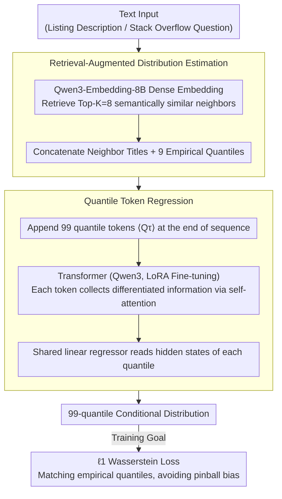

# Text-to-Distribution Prediction with Quantile Tokens and Neighbor Context

**Conference**: ACL 2026  
**arXiv**: [2604.20216](https://arxiv.org/abs/2604.20216)  
**Code**: [github.com/yilunzhu/text2distribution](https://github.com/yilunzhu/text2distribution)  
**Area**: LLM Evaluation  
**Keywords**: Quantile Regression, Distribution Prediction, Retrieval-Augmented Generation, LLM Fine-tuning, Uncertainty Estimation

## TL;DR
This paper proposes the Quantile Token Regression method. By inserting specialized quantile tokens into the input sequence and combining retrieved neighbor instances with their empirical distributions, the LLM can predict a complete conditional distribution rather than a single point estimate. This approach reduces the avg MAPE by approximately 4 points and narrows prediction intervals by more than 2x compared to baselines on Airbnb and StackSample datasets.

## Background & Motivation

**Background**: LLMs have demonstrated capabilities beyond text generation, performing well in time-series forecasting and regression tasks. Most LLM regression research focuses on point estimation; however, practical scenarios such as price prediction, demand estimation, and risk assessment require predicting a full probability distribution rather than just central tendency values. Quantile regression provides a natural framework for distribution prediction by estimating conditional quantiles at different probability levels.

**Limitations of Prior Work**: The work by Vedula et al. (2025) made a significant step toward LLM distribution prediction by attaching multiple linear regression heads to a shared final hidden state. However, this architecture has three critical flaws: (1) all quantile predictions originate from the same representation bottleneck, forcing the model to compress all distributional information into a single vector; (2) predictions are based solely on the query text, lacking explicit comparison with similar instances—whereas human reasoning for distributions naturally relies on analogy; (3) previous retrieval-augmented methods only provide a single scalar label for each neighbor, limiting distributional supervision.

**Key Challenge**: Distribution prediction requires capturing differentiated features for various quantiles (e.g., low quantiles focus on popularity signals, high quantiles focus on complexity indicators). The shared representation bottleneck forces all quantiles to extract information from the same features, leading to indirect input-output mapping.

**Goal**: To design an architecture where each quantile has its own representation and direct input-output path, while providing local evidence support by retrieving the complete empirical distributions of neighbors.

**Key Insight**: Borrowing from how humans reason about distributions—searching for similar items and comparing their price ranges to build understanding. Simultaneously, by inserting specialized tokens into self-attention, each quantile can autonomously attend to different parts of the input.

**Core Idea**: Insert learnable quantile tokens $\langle Q_{\tau_1}\rangle, \ldots, \langle Q_{\tau_Q}\rangle$ at the end of the input sequence. This allows each quantile to establish direct connections with the input via self-attention, while appending complete empirical distributions (rather than single labels) for retrieved neighbors.

## Method

### Overall Architecture
Given a text input (e.g., an Airbnb listing description or a Stack Overflow question), the system first retrieves the Top-K semantically similar neighbor instances via dense embedding. The titles and 9 representative empirical quantiles of these neighbors are prepended to the input. Subsequently, 99 learnable quantile tokens are appended to the end of the sequence and fed into a pre-trained Transformer (Qwen3 series). The hidden states of each quantile token are used by a shared linear regressor to predict corresponding quantile values, outputting a complete 99-quantile conditional distribution. The model is trained using an $\ell_1$ Wasserstein loss to fit the empirical quantile targets.

### Key Designs

**1. Quantile Token Regression: Dedicated Representation Paths for Each Quantile**

Traditional approaches (Vedula et al., 2025) attach all quantile predictions to the same final hidden state followed by multiple linear heads. This forces the model to compress information for the entire distribution into a single vector bottleneck, preventing different quantiles from learning differentiated attention patterns. Ours appends $Q$ special tokens $\langle Q_{\tau_k}\rangle$ to the end of the input sequence $X = (x_1, \ldots, x_n)$, forming $\widetilde{X} = (x_1, \ldots, x_n, \langle Q_{\tau_1}\rangle, \ldots, \langle Q_{\tau_Q}\rangle)$. After the Transformer pass, the hidden state $h_{\tau_k}$ at each quantile token position is fed into a shared linear layer $\hat{q}_{\tau_k}(X) = w^\top h_{\tau_k} + b$ to obtain the predicted value.

Each $\langle Q_{\tau_k}\rangle$ independently collects information via self-attention across all Transformer layers, creating a direct input-output pathway: $\langle Q_{10}\rangle$ can focus on popularity signals (predicting quickly answered questions), while $\langle Q_{90}\rangle$ attends to complexity indicators (predicting slow answers). Simultaneously, these tokens are generated jointly within the same attention calculation, ensuring consistency between quantiles.

**2. Retrieval-Augmented Distribution Estimation: Neighbors with Full Empirical Distributions**

Prior retrieval-augmented regression only attached a single point label to each neighbor, losing the internal distribution information of the neighbors. Ours uses Qwen3-Embedding-8B to compute dense embeddings for the full text of each instance and retrieves the Top-K (K=8) most similar neighbors from the training set. The key modification is appending each neighbor's 9 representative empirical quantiles (1st, 5th, 10th, 25th, 50th, 75th, 90th, 95th, 99th percentiles) instead of a single scalar. The underlying assumption is that "similar inputs often have similar outcome distributions." Feeding the neighbor's complete distribution shape, dispersion, and tail behavior provides the model with local evidence to estimate parameters beyond the central tendency.

**3. Loss Function Theoretical Analysis: Selecting the Right Loss for Empirical Quantile Supervision**

The standard pinball loss is designed for learning quantiles from raw observations. In this work, the "observations" for each neighbor are already empirical quantile estimates; applying pinball loss directly would be problematic. The paper compares four losses: $\ell_1$ and $\ell_2$ Wasserstein losses are Fisher consistent for target quantiles in large samples. Pinball-Q, when applied to empirical quantile targets, introduces systematic bias of magnitude $M_i^{-1/2}$. Pinball-Med uses only the empirical median as scalar supervision, discarding distribution shape. The theoretical ranking is $\ell_1 > \text{Pinball-Q} > \text{Pinball-Med}$, consistent with experimental results. Wasserstein loss matches the quantile function directly, avoiding pinball bias under this supervision.

### Loss & Training
The model is trained using an $\ell_1$ Wasserstein loss on empirical quantile targets to predict $Q=99$ uniformly distributed quantiles. LoRA fine-tuning is performed on Qwen3 models (1.7B-14B parameters). Training and prediction occur in log-space; during inference, values are exponentiated back to the original scale for metric calculation.

## Key Experimental Results

### Main Results (Airbnb Dataset, Qwen3-4B)

| Method | avg MAPE↓ | CRPSS↑ | RCIW@95↓ |
|------|-----------|--------|----------|
| QR (K=0) | 30.31 | 0.4536 | 12.30 |
| QR (K=8) | 27.78 | 0.4700 | 15.08 |
| QT (K=8) | **26.89** | **0.4700** | **7.17** |

### Main Results (StackSample Dataset, Qwen3-4B)

| Method | avg MAPE↓ | CRPSS↑ | RCIW@99↓ |
|------|-----------|--------|----------|
| QR (K=0) | 266.65 | 0.0668 | 45480 |
| QR (K=8) | 98.56 | 0.3001 | 2110 |
| QT (K=8) | **84.30** | **0.3375** | **346.9** |

### Ablation Study (Loss Functions, Airbnb dev, Qwen3-4B)

| Loss Function | avg MAPE↓ | RCIW@95↓ |
|----------|-----------|----------|
| Pinball-Med | 32.80 | 151.78 |
| Pinball-Q | 32.66 | 151.27 |
| $\ell_2$ Wasserstein | 26.64 | 4.15 |
| $\ell_1$ Wasserstein | **26.55** | **3.55** |

### Key Findings
- Retrieval augmentation is particularly effective on the smaller StackSample dataset (avg MAPE dropped from 266.65 to 98.56, a 63% reduction), validating the "similar inputs have similar distributions" hypothesis.
- Quantile tokens compared to the shared representation baseline reduced avg MAPE by 14% on StackSample and narrowed prediction intervals by 6x.
- Diminishing returns were observed as model scale increased: 1.7B to 4B reduced MAPE by 7%, while 8B to 14B only yielded a 1% reduction.
- $\ell_1$ Wasserstein loss achieves the best balance between accuracy and sharpness; pinball loss optimizes CRPSS but leads to extremely wide prediction intervals.

## Highlights & Insights
- **Quantile Tokens as Specialized Probes**: Inserting learnable special tokens into the input sequence to create dedicated representation paths is an idea transferable to any task requiring differentiated outputs from the same input (e.g., multi-task learning, multi-granularity prediction).
- **Distribution-level Augmentation for Neighbors**: Instead of just retrieving similar samples, the entire empirical distribution is used as context. This "distribution-level RAG" is more informative than "point-label RAG" and can be extended to scenarios like time-series distribution forecasting.
- **Alignment of Theory and Practice**: Theoretical analysis of loss functions precisely predicted the experimental rankings, providing principled guidance for loss function selection in practice.

## Limitations & Future Work
- Evaluation is limited to two datasets (Airbnb and StackSample); generalization across more domains remains to be verified.
- The quantile token method does not guarantee monotonicity; post-processing is required to ensure $90\text{th quantile} \geq 80\text{th quantile}$.
- Increasing the number of neighbors $K$ incurs significant computational and memory overhead (K=16 requires approx. 2x memory), requiring a trade-off between performance and efficiency.
- Variance-aware weighting was not explored, which might further improve the estimation quality of tail quantiles.

## Related Work & Insights
- **vs Vedula et al. (2025)**: Shared hidden state + multi-linear heads vs. dedicated quantile tokens. Ours offers differentiated attention patterns and narrower prediction intervals.
- **vs Wang et al. (2025) Retrieval-Augmented Regression**: Single label + single price output vs. full empirical distribution + full distribution prediction; Ours is significantly more information-rich.
- **vs Traditional Quantile Regression**: Tradition uses pinball loss on raw observations; Ours uses Wasserstein loss on empirical quantiles. Both theory and experiments show the latter is more suitable for this supervision.

## Rating
- Novelty: ⭐⭐⭐⭐ The design of quantile tokens is simple, elegant, and theoretically sound.
- Experimental Thoroughness: ⭐⭐⭐⭐ Two datasets, four model scales, and full ablations; dataset diversity could be further improved.
- Writing Quality: ⭐⭐⭐⭐⭐ Strong integration of theory and experiments with clear exposition.
- Value: ⭐⭐⭐⭐ Highly practical for text-to-distribution scenarios; the quantile token concept is transferable.

<!-- RELATED:START -->

## Related Papers

- [\[ACL 2025\] Prediction Hubs are Context-Informed Frequent Tokens in LLMs](../../ACL2025/llm_nlp/prediction_hubs_are_context-informed_frequent_tokens_in_llms.md)
- [\[ACL 2026\] Wait, There’s a Way Out: A Decision Mechanism for Dialogue Derailment Prediction](wait_theres_a_way_out_a_decision_mechanism_for_forecasting_conversational_derail.md)
- [\[ACL 2026\] Hot-Start from Pixels: Low-Resolution Visual Tokens for Chinese Language Modeling](hot-start_from_pixels_low-resolution_visual_tokens_for_chinese_language_modeling.md)
- [\[ACL 2026\] Leveraging Pretrained Language Models as Energy Functions for Glauber Dynamics Text Diffusion](leveraging_pretrained_language_models_as_energy_functions_for_glauber_dynamics_t.md)
- [\[ACL 2026\] OOD Proxy Demonstration Retrieval Scheme for Robust In-Context Learning](toward_robust_in-context_learning_leveraging_out-of-distribution_proxies_for_tar.md)

<!-- RELATED:END -->
