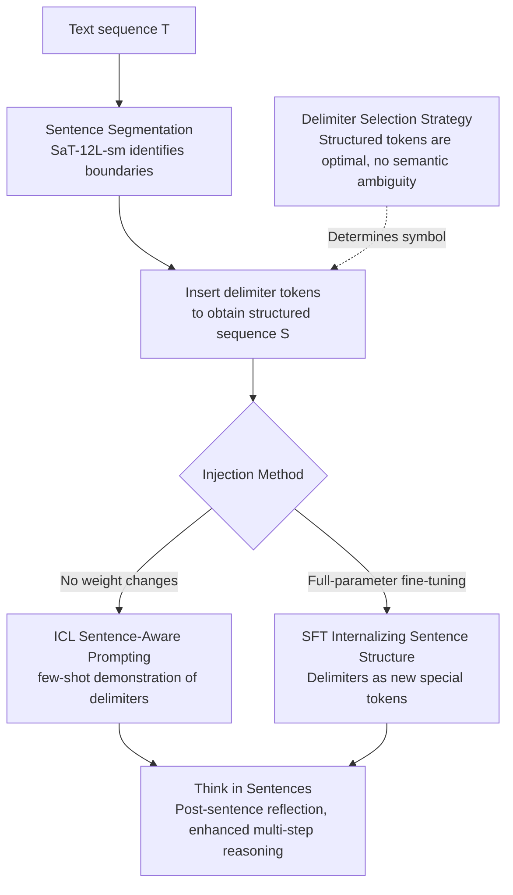

# Think in Sentences: Explicit Sentence Boundaries Enhance Language Model's Capabilities

**Conference**: ACL 2026  
**arXiv**: [2604.10135](https://arxiv.org/abs/2604.10135)  
**Code**: [GitHub](https://github.com/CLCS-SUSTech/think-in-sentence)  
**Area**: LLM/NLP  
**Keywords**: Sentence boundaries, Delimiters, In-context learning, Supervised fine-tuning, Free lunch

## TL;DR

This paper proposes inserting delimiter tokens at sentence boundaries in LLM inputs to implement a "think-in-sentences" reasoning paradigm through both ICL and SFT. This approach achieves consistent improvements across models ranging from 7B to 600B parameters (GSM8k +7.7%, DROP +12.5%) with virtually no additional computational overhead.

## Background & Motivation

**Background**: Sentence-level structures were once central to early neural language models—Skip-thought training reconstructed adjacent sentences, and BERT's next-sentence prediction task encoded inter-sentence coherence. However, with the rise of LLMs, sentence boundaries have been demoted to ordinary tokens, and models completely ignore sentence structure in token-by-token processing pipelines.

**Limitations of Prior Work**: Mainstream methods for enhancing LLM capabilities either require massive training overhead (training-time scaling) or increase inference latency (test-time scaling like CoT). Goyal et al. (2024) proposed inserting "pause" tokens as a free lunch solution, but it has severe limitations: (1) the placement of pause tokens lacks linguistic priors and requires manual adjustment per task; (2) it has not been validated on 7B+ models; (3) it lacks robustness and generalizability.

**Key Challenge**: Human language generation relies on an incremental cognitive process of sentence-by-sentence construction, but LLMs learn continuous text produced by this process, leading to an inherent misalignment between human cognitive mechanisms and model input processing.

**Goal**: Design a strategy that leverages sentence-level linguistic priors to enhance LLM performance in a robust and low-overhead manner.

**Key Insight**: The authors observe that sentences are the most natural "cognitive chunks" in natural language. Inserting structural delimiters at sentence boundaries can trigger a cycle of "context integration $\rightarrow$ next-step planning," simulating the post-sentence reflection process in humans.

**Core Idea**: Insert task-agnostic delimiter tokens at sentence boundaries to allow LLMs to perform implicit sentence-by-sentence reasoning. This is implemented via ICL (demonstrating delimiter patterns in prompts) and SFT (fine-tuning on data with inserted delimiters).

## Method

### Overall Architecture

Given a text sequence $T = [t_1, t_2, ..., t_n]$, sentence boundaries are identified using a sentence segmentation tool (SaT-12L-sm), and a delimiter $x_{seg}$ is inserted at the end of each sentence to obtain a structured sequence $S = [s_1, x_{seg}, s_2, x_{seg}, ..., s_n, x_{seg}]$. The model's objective is not only to predict the next token but also to learn when to generate the delimiter, thereby performing implicit sentence segmentation. Building on this "segment-insert" backbone, delimiters are injected through two complementary paths: ICL (in-context learning, demonstrating delimiters in prompts without touching weights) and SFT (supervised fine-tuning, solidifying sentence priors into parameters). The specific symbol used as a delimiter is determined by a unified delimiter selection strategy.

### Key Designs

**1. ICL Sentence-Aware Prompting: Learning sentence-by-sentence generation via analogy without weight changes**

The most lightweight injection method is to demonstrate the use of delimiters directly in few-shot examples—explicitly terminating each sentence in every example with `<seg>`. During autoregressive decoding, the model treats this sentence-by-sentence structured layout as a pattern to be continued, automatically inserting `<seg>` after its own sentences via analogy. This implicitly triggers the "context integration $\rightarrow$ next-step planning" reflection cycle. This path does not touch model weights, uses standard autoregressive inference, and incurs almost zero cost; the disadvantage is that it consumes context window space and cannot be used in zero-shot or context-limited scenarios.

**2. SFT Internalizing Sentence Structure: Writing sentence priors into parameters to eliminate prompt dependency**

To enable zero-shot sentence-by-sentence thinking, the authors upgrade sentence structure from "temporary demonstration in prompts" to "solidification in parameters." Specifically, they systematically insert delimiters at sentence boundaries in the TULU3 dataset and perform full-parameter fine-tuning using the standard causal language modeling loss. The delimiter $x_{seg}$ is added to the tokenizer as a new special token, and its corresponding embedding and LM head weights are learned during training. After training, the model can natively generate text with delimiters without any prompts. Compared to ICL, this does not consume the context budget and is closer to real deployment scenarios.

**3. Delimiter Selection Strategy: Delimiters must be pure structural markers without semantics**

Deciding where to insert delimiters is straightforward; choosing the symbol is the challenge. The authors tested various candidates: structured tokens (`<seg>`, `<and>`, `####`), semantic words ("seg", "and"), punctuation ("\n", "."), and arbitrary symbols. Structured tokens consistently performed best and were the only type to exceed the baseline across all tasks. The reason is that ideal delimiters should only carry the structural signal that "the sentence ends here" and remain independent of the text's semantics. Semantic words cause the model to struggle with whether the token is a boundary marker or sentence content, introducing ambiguity, whereas structured tokens naturally do not belong to the natural language vocabulary and provide unambiguous boundary signals.

### Loss & Training

SFT uses the standard causal language modeling loss: $\mathcal{L}_{SFT}(\theta) = \sum_{s' \in S} \sum_{i=1}^{|s'|} \log P(t_i | t_{<i}; \theta)$, where $s' = [s, x_{seg}]$ and the final token $t_{|s'|} = x_{seg}$. Full-parameter fine-tuning was conducted on 8×L40 GPUs.

## Key Experimental Results

### Main Results (ICL)

| Model | GSM8k $\Delta$ | DROP $\Delta$ | MMLU $\Delta$ | MATH $\Delta$ |
|------|---------|--------|--------|--------|
| Qwen2-7B-Inst | +7.73% | +12.50% | +5.53% | +0.97% |
| Llama3-8B-Inst | +2.50% | +6.77% | +4.39% | -0.34% |
| Qwen2.5-72B-Inst | +1.82% | +1.64% | -0.24% | +2.74% |
| DeepSeek-V3 | +0.30% | +4.00% | +0.78% | +1.20% |

### SFT Results (Llama3-8B-Base)

| Method | MMLU | GSM8k | DROP | MMLU-Pro | HumanEval |
|------|------|-------|------|----------|-----------|
| Std-FT | 59.02 | 72.48 | 48.50 | 34.25 | 56.71 |
| Pause-FT | 56.11 | 75.44 | 55.97 | 35.71 | - |
| **Seg-FT** | **60.13** | 74.91 | 54.26 | **40.71** | **62.80** |

### Key Findings
- Small models benefit the most (significant gains at the 7B level), while gains for large models are smaller but consistent.
- DROP (reading comprehension requiring cross-sentence reasoning) showed the most significant improvement, indicating that sentence separation helps models better process sentence-coded facts and their relationships.
- Seg-FT outperformed Std-FT across all 7 benchmarks, whereas Pause-FT degraded on knowledge-intensive tasks (MMLU, GPQA).
- Sentence-aware capabilities generalize to code generation (HumanEval +6.09%), as models learn to insert delimiters in code according to line structures.
- Evaluation via Prob-based vs CoT-based methods reveals that delimiters do not improve knowledge retrieval but rather enhance the multi-step reasoning process.

## Highlights & Insights
- The insight that **sentences are "natural cognitive chunks"** is profound: performance on fixed n-token chunking follows an inverted U-shape, with the optimal range $n \in [32, 64]$ corresponding to typical sentence lengths. This echoes human cognitive chunking.
- **Key improvement to "free lunch" methodology**: Compared to the blind insertion of Pause tokens, leveraging linguistic priors (sentence boundaries) makes the method more robust, general, and eliminates the need for per-task parameter tuning.
- **Unexpected generalization of SFT to code** is inspiring: sentence segmentation patterns in natural language transferred to line structures in code, suggesting a shared structural prior.

## Limitations & Future Work
- ICL depends on sufficient context length for few-shot examples, limiting its use in zero-shot or context-constrained scenarios.
- SFT was only validated on Llama3-8B-Base, lacking SFT experiments on larger models.
- Sentence segmentation relies on external tools (SaT-12L-sm), which may introduce segmentation errors.
- The authors did not explore adaptively choosing delimiter placement (e.g., only at critical sentence boundaries).
- For highly structured tasks like mathematical reasoning, improvements are relatively limited (MATH even slightly decreased for some models).

## Related Work & Insights
- **vs Pause Token (Goyal et al. 2024)**: While Pause tokens are inserted blindly and requires task-specific tuning, this work utilizes sentence boundaries as a linguistic prior, offering better robustness and generalization. SFT experiments directly prove that Seg-FT is overall superior to Pause-FT.
- **vs CoT Reasoning**: CoT enhances capabilities through explicit generation of reasoning steps but increases token consumption. This paper enhances reasoning through implicit sentence separation with almost zero additional overhead. Ablation studies show synergy between the two.

## Rating
- Novelty: ⭐⭐⭐⭐ The idea of sentence boundary delimiters is simple yet effective, with a clear intuition grounded in cognitive science.
- Experimental Thoroughness: ⭐⭐⭐⭐ Covers multiple models and tasks with extensive ablation analyses (delimiter choice, granularity, mechanism analysis).
- Writing Quality: ⭐⭐⭐⭐ Motivation and experimental logic are clear, with in-depth analysis.
- Value: ⭐⭐⭐⭐ Provides a practical free lunch method, although gains are more limited on very large models.

<!-- RELATED:START -->

## Related Papers

- [\[ACL 2025\] ExpliCa: Evaluating Explicit Causal Reasoning in Large Language Models](../../ACL2025/llm_nlp/explica_evaluating_explicit_causal_reasoning_in_large_language_models.md)
- [\[ACL 2025\] Explicit and Implicit Data Augmentation for Social Event Detection](../../ACL2025/llm_nlp/explicit_and_implicit_data_augmentation_for_social_event_detection.md)
- [\[ACL 2025\] PlanGenLLMs: A Modern Survey of LLM Planning Capabilities](../../ACL2025/llm_nlp/plangenllms_planning_survey.md)
- [\[ACL 2026\] Clozing the Gap: Exploring Why Language Model Surprisal Outperforms Cloze Surprisal](clozing_the_gap_exploring_why_language_model_surprisal_outperforms_cloze_surpris.md)
- [\[ACL 2025\] Explain-then-Process: Using Grammar Prompting to Enhance Grammatical Acceptability Judgments](../../ACL2025/llm_nlp/explain-then-process_using_grammar_prompting_to_enhance_grammatical_acceptabilit.md)

<!-- RELATED:END -->
