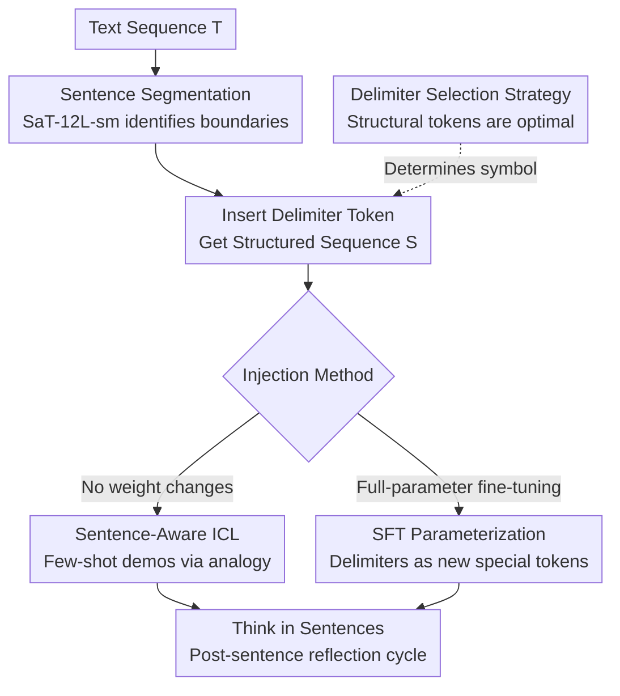

# Think in Sentences: Explicit Sentence Boundaries Enhance Language Model's Capabilities

**Conference**: ACL 2026  
**arXiv**: [2604.10135](https://arxiv.org/abs/2604.10135)  
**Code**: [GitHub](https://github.com/CLCS-SUSTech/think-in-sentence)  
**Area**: LLM/NLP  
**Keywords**: Sentence Boundaries, Delimiters, In-context Learning, SFT, Free Lunch

## TL;DR

This paper proposes inserting delimiter tokens at sentence boundaries within LLM inputs to implement a "sentence-by-sentence" reasoning paradigm via ICL and SFT. Constant improvements were achieved across models from 7B to 600B (GSM8k +7.7%, DROP +12.5%) with almost no additional computational overhead.

## Background & Motivation

**Background**: Sentence-level structure was central to early neural language models—Skip-thought training reconstructed adjacent sentences, and BERT's Next Sentence Prediction (NSP) task encoded inter-sentence coherence. However, with the rise of LLMs, sentence boundaries have been demoted to ordinary tokens, and models completely ignore sentence structure in token-by-token processing pipelines.

**Limitations of Prior Work**: Mainstream methods to enhance LLM capabilities either require massive training overhead (scaling at training time) or increase inference latency (scaling at test time, such as CoT). Goyal et al. (2024) proposed inserting "pause" tokens as a free lunch solution, but it has serious limitations: (1) Pause token placement lacks linguistic priors and requires manual adjustment per task; (2) It has not been validated on 7B+ models; (3) It lacks robustness and generalizability.

**Key Challenge**: Human language generation relies on a sentence-by-sentence incremental cognitive process, but LLMs learn continuous text produced by this process, leading to an inherent misalignment between human cognitive mechanisms and model input processing.

**Goal**: Design a strategy that leverages sentence-level linguistic priors to enhance LLM performance in a robust and low-overhead manner.

**Key Insight**: The authors observe that sentences are the most natural "cognitive chunks" in natural language. Inserting structural delimiters at sentence boundaries can trigger a cycle of "contextual integration → next-step planning," simulating the human post-sentence reflection process.

**Core Idea**: Insert task-agnostic delimiter tokens at sentence boundaries to allow LLMs to perform implicit sentence-by-sentence reasoning. This is achieved through two methods: ICL (demonstrating delimiter patterns in prompts) and SFT (fine-tuning on data with inserted delimiters).

## Method

### Overall Architecture

Given a text sequence $T = [t_1, t_2, ..., t_n]$, sentence boundaries are identified using a sentence segmentation tool (SaT-12L-sm). A delimiter $x_{seg}$ is inserted at the end of each sentence, resulting in a structured sequence $S = [s_1, x_{seg}, s_2, x_{seg}, ..., s_n, x_{seg}]$. The model's objective includes not only predicting the next token but also learning when to generate the delimiter, thereby performing implicit sentence segmentation. Building upon this "segmentation-insertion" backbone, delimiters are injected via two complementary paths: ICL (In-Context Learning, demonstrating delimiters in prompts without weight updates) and SFT (Supervised Fine-Tuning, solidifying sentence priors into parameters). The specific symbol used as a delimiter is determined by a unified delimiter selection strategy.

### Key Designs

**1. Sentence-Aware ICL: Learning sentence-by-sentence generation via analogy without weight updates**

The most lightweight injection method is to demonstrate delimiter usage directly in few-shot examples—explicitly terminating every sentence in each example with `<seg>`. During auto-regressive decoding, the model treats this sentence-by-sentence structural layout as a pattern to be continued, automatically inserting `<seg>` after its own reasoning and output sentences through analogy. This implicitly triggers the post-sentence reflection cycle of "contextual integration → next-step planning." This path does not touch model weights and uses standard auto-regressive inference, making the cost nearly zero. The disadvantage is that it consumes prompt space and is unavailable in zero-shot or context-limited scenarios.

**2. SFT Internalization of Sentence Structure: Writing sentence priors into parameters to remove prompt reliance**

To enable models to think sentence-by-sentence even in zero-shot settings, the authors upgrade the sentence structure from a "temporary prompt demonstration" to "parameter solidification." Specifically, delimiters are systematically inserted at each sentence boundary in the TULU3 dataset, followed by full-parameter fine-tuning using the standard causal language modeling loss. The delimiter $x_{seg}$ is added to the tokenizer as a new special token, and its corresponding embedding and LM head weights are learned during training. After training, the model can natively generate text with delimiters without any prompts. Compared to ICL, this path no longer consumes context budget and is closer to real deployment scenarios.

**3. Delimiter Selection Strategy: Ideal delimiters must be pure structural markers without semantics**

The challenge lies in choosing the symbol. The authors horizontally tested structural tokens (`<seg>`, `<and>`, `####`), semantic words ("seg", "and"), punctuation ("\n", "."), and arbitrary symbols. Structural tokens were consistently optimal and were the only type to exceed the baseline across all tasks. The reason is that an ideal delimiter should only carry the structural signal that "the sentence ends here" and be independent of the content's semantics. Semantic words cause the model to struggle with whether the token is a boundary marker or sentence content, introducing ambiguity, whereas structural tokens do not belong to the natural language vocabulary and provide unambiguous boundary signals.

### Loss & Training

SFT utilizes the standard causal language modeling loss: $\mathcal{L}_{SFT}(\theta) = \sum_{s' \in S} \sum_{i=1}^{|s'|} \log P(t_i | t_{<i}; \theta)$, where $s' = [s, x_{seg}]$ and the final token $t_{|s'|} = x_{seg}$. Full-parameter fine-tuning is conducted on 8×L40 GPUs.

## Key Experimental Results

### Main Results (ICL)

| Model | GSM8k Δ | DROP Δ | MMLU Δ | MATH Δ |
|------|---------|--------|--------|--------|
| Qwen2-7B-Inst | +7.73% | +12.50% | +5.53% | +0.97% |
| Llama3-8B-Inst | +2.50% | +6.77% | +4.39% | -0.34% |
| Qwen2.5-72B-Inst | +1.82% | +1.64% | -0.24% | +2.74% |
| DeepSeek-V3 | +0.30% | +4.00% | +0.78% | +1.20% |

### SFT Results (Llama3-8B-Base)

| Method | MMLU | GSM8k | DROP | MMLU-Pro | HumanEval |
|------|------|-------|------|----------|-----------|
| Std-FT | 59.02 | 72.48 | 48.50 | 34.25 | 56.71 |
| Pause-FT | 56.11 | 75.44 | 55.97 | 35.71 | - |
| **Seg-FT** | **60.13** | 74.91 | 54.26 | **40.71** | **62.80** |

### Key Findings
- Small models benefit the most (significant improvements at the 7B level), while improvements for large models are smaller but consistent.
- DROP (reading comprehension requiring cross-sentence reasoning) showed the most significant improvement, suggesting that sentence separation helps models better process sentence-by-sentence facts and their relationships.
- Seg-FT outperformed Std-FT across all 7 benchmarks, while Pause-FT degraded on knowledge-intensive tasks (MMLU, GPQA).
- Sentence-aware capability generalizes to code generation (HumanEval +6.09%), with models learning to insert delimiters in code structures.
- Prob-based vs CoT-based evaluations reveal that delimiters do not improve knowledge retrieval but rather enhance the multi-step reasoning process.

## Highlights & Insights
- **Sentences as "natural cognitive chunks"**: This insight is profound. Performance with fixed n-token chunking follows an inverted U-shape, where the optimal range $n \in [32, 64]$ corresponds to typical sentence length, indicating that the sentence level is the optimal granularity for information processing. This is analogous to human cognitive chunking.
- **Key improvement in "free lunch" methodology**: Compared to the blind insertion of Pause tokens, leveraging linguistic priors (sentence boundaries) makes the method more robust and universal, eliminating the need for per-task parameter tuning.
- **Unexpected generalization of SFT to code**: The sentence segmentation pattern in natural language transferred to line structures in code, suggesting a shared structural prior between the two.

## Limitations & Future Work
- ICL relies on sufficient context length for few-shot examples, which is a limitation in zero-shot or context-constrained scenarios.
- SFT was only validated on Llama3-8B-Base, lacking SFT experiments on larger models.
- Sentence segmentation depends on external tools (SaT-12L-sm), which may introduce segmentation errors.
- The authors did not explore adaptively choosing delimiter placement (e.g., only inserting at critical sentence boundaries).
- For highly structured tasks like mathematical reasoning, the improvement is relatively limited (MATH even slightly decreased on some models).

## Related Work & Insights
- **vs Pause Token (Goyal et al. 2024)**: Pause Token blindly inserts markers and requires per-task tuning. Ours uses sentence boundaries as a linguistic prior, which is more robust and generalizes better. SFT experiments directly prove Seg-FT is superior to Pause-FT overall.
- **vs CoT Reasoning**: CoT enhances capabilities through explicit generation of reasoning steps but increases token consumption. This work enhances reasoning via implicit sentence separation with almost zero additional overhead. Ablation experiments show that the two can work synergistically.

## Rating
- Novelty: ⭐⭐⭐⭐ The idea of sentence boundary delimiters is simple yet effective, with a clear intuition from cognitive science.
- Experimental Thoroughness: ⭐⭐⭐⭐ Covers multiple models and tasks, with rich ablation analysis (delimiter choice, granularity, mechanism analysis).
- Writing Quality: ⭐⭐⭐⭐ Clear motivation and experimental logic, with in-depth analysis.
- Value: ⭐⭐⭐⭐ Provides a practical free lunch method, although improvements on very large models are more limited.

<!-- RELATED:START -->

## Related Papers

- [\[ACL 2025\] ExpliCa: Evaluating Explicit Causal Reasoning in Large Language Models](../../ACL2025/llm_nlp/explica_evaluating_explicit_causal_reasoning_in_large_language_models.md)
- [\[ACL 2025\] Explicit and Implicit Data Augmentation for Social Event Detection](../../ACL2025/llm_nlp/explicit_and_implicit_data_augmentation_for_social_event_detection.md)
- [\[ICML 2026\] Position: Hippocampal Explicit Memory Is the Cornerstone for AGI](../../ICML2026/llm_nlp/position_hippocampal_explicit_memory_is_the_cornerstone_for_agi.md)
- [\[ACL 2025\] PlanGenLLMs: A Modern Survey of LLM Planning Capabilities](../../ACL2025/llm_nlp/plangenllms_planning_survey.md)
- [\[ACL 2026\] Clozing the Gap: Exploring Why Language Model Surprisal Outperforms Cloze Surprisal](clozing_the_gap_exploring_why_language_model_surprisal_outperforms_cloze_surpris.md)

<!-- RELATED:END -->
