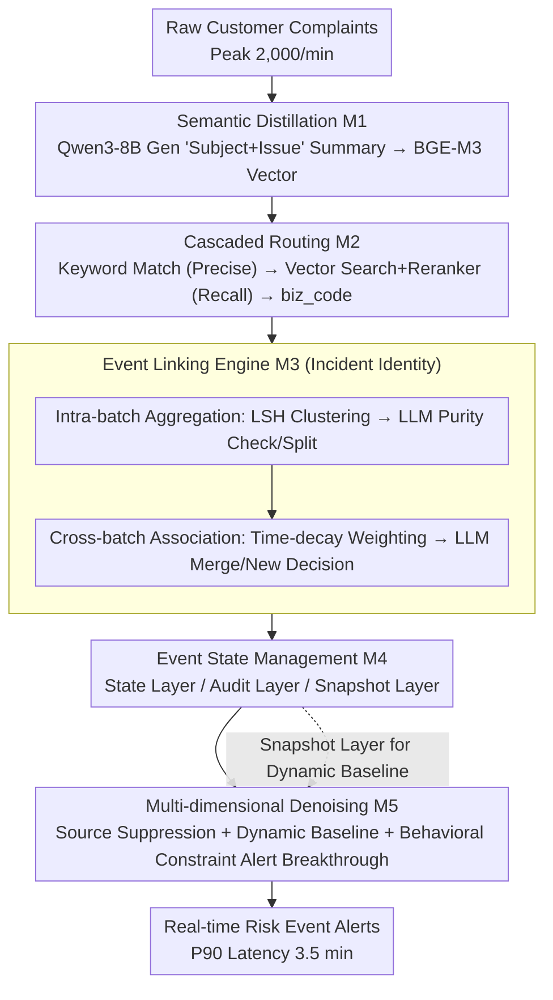

# TingIS: Real-time Risk Event Discovery from Noisy Customer Incidents at Enterprise Scale

**Conference**: ACL 2026  
**arXiv**: [2604.21889](https://arxiv.org/abs/2604.21889)  
**Code**: None  
**Area**: LLM Evaluation  
**Keywords**: Risk event discovery, customer complaint mining, incident linking, streaming processing, SNR optimization

## TL;DR

TingIS is an end-to-end risk event discovery system deployed on a FinTech platform. Through a five-module architecture (semantic distillation, cascaded routing, event linking engine, state management, and multi-dimensional denoising), it extracts actionable risk events from massive, noisy customer complaints in real-time, achieving a P90 alert latency of 3.5 minutes and a 95% discovery rate for high-priority incidents.

## Background & Motivation

**Background**: Large-scale online platforms rely on complex microservices and cloud-native architectures, where even minor failures can rapidly propagate into large-scale incidents. Internal observability systems (metrics/logs/traces) serve as the first line of defense but are not infallible.

**Limitations of Prior Work**: While customer complaints provide vital signals for identifying monitoring blind spots, they present challenges such as extreme noise, high throughput, and semantic complexity. Identifying systemic failures from a flow of 2,000 complaints per minute based on as few as 3 reports faces severe signal-to-noise ratio (SNR) issues. Low-SNR systems trigger excessive false positives, leading to alert fatigue for O&M teams.

**Key Challenge**: A balance must be struck between high noise, ultra-low latency, and low miss rates—simultaneously satisfying real-time requirements (minute-level), high discovery rates (>95%), and low false positive rates.

**Goal**: Build an enterprise-grade system capable of discovering risk events in real-time from an average of 300,000 daily customer complaints.

**Key Insight**: Decompose the problem into five orthogonal modules, each addressing a core sub-problem. Use a hybrid intelligence strategy of "lightweight rule pre-filtering + LLM deep judgment" to balance precision and cost.

**Core Idea**: Achieve semantic convergence and identity persistence through a multi-stage event linking engine (LSH high-speed clustering → LLM purity check → cross-batch historical association → time-decay weighting), supplemented by cascaded routing and multi-dimensional denoising to ensure overall system SNR.

## Method

### Overall Architecture

TingIS spans three layers (Data Observation, Semantic Engine, Long-term Memory) and consists of five orthogonal modules (M1–M5) forming a streaming pipeline. Raw complaints are first processed by M1 (Semantic Distillation) into high-density semantic units, then assigned to the correct business domain (biz_code) by M2 (Cascaded Routing). They then enter the core M3 (Event Linking Engine) to determine "incident identity." Results are handed to M4 (Layered State Management) for persistence, and finally, M5 (Multi-dimensional Denoising) decides whether to trigger an actual alert. The design follows three core insights: semantic convergence and identity persistence, hybrid intelligence synergy (rules → retrieval → progressive LLM calls), and multi-constraint SNR balancing.

### Key Designs

**1. Semantic Distillation (M1): Compressing Colloquial Noise into High-density Semantic Units**

Raw complaints are colloquial, emotional, and contain PII or irrelevant details. Feeding them directly to downstream modules would collapse the SNR. M1 uses Qwen3-8B under strict prompt constraints to rewrite each complaint into a "Subject + Issue" summary (e.g., "Credit card online payment + discount error"), explicitly discarding sentiment, greetings, and PII. These are then encoded into vectors via BGE-M3. This provides clean, high-density semantic representations under controlled compute budget.

**2. Cascaded Routing (M2): Precision-first then Recall-based Business Domain Assignment**

Different business domains (biz_code) have high semantic variance; incorrect routing causes downstream failure, yet massive traffic precludes heavy models for every item. M2 uses a two-stage strategy: first, keyword matching (entity priority) handles most clear complaints with high precision and low cost. Unmatched items go to parallel vector retrieval + BGE-Reranker-V2-M3. To suppress streaming latency, the expensive reranker only performs full self-attention on the Top-10 candidates.

**3. Multi-stage Event Linking Engine (M3): The System Core for "Incident Identity"**

Determining if multiple complaints across time and phrasing point to the same incident is the hardest step. M3 solves this progressively. Intra-batch aggregation uses LSH (Locality-Sensitive Hashing) for fast pre-clustering, followed by LLM (Kimi-K2) purity checks to split impure clusters and generate titles. Cross-batch association retrieves historical events using a time-decay weighted score:

$$s^* = s \cdot e^{-k\Delta t}$$

where $s$ is the semantic similarity and $\Delta t$ is the days since the historical event was last active. LLM makes the final "merge or new" decision only if the combined score exceeds a threshold, preventing "historical inertia" where old incidents incorrectly absorb unrelated new complaints.

**4. Layered Event State Management (M4): Decoupling Volatility, Traceability, and Analytics**

Real-time alerting, auditing, and historical statistics have conflicting data requirements. M4 uses a three-layer model: the State Layer stores minimum mutable states (counts, timestamps) for decisions; the Audit Layer is an immutable log recording the "Raw → Summary → Cluster → Event ID" chain and alert context for 100% auditability; the Snapshot Layer periodically records volume for M5's dynamic baselines without scanning massive logs.

**5. Multi-dimensional Denoising (M5): Multi-constraint Suppression of False Positives**

Relying solely on volume thresholds triggers "alert storms" during non-failure scenarios like marketing inquiries. M5 layers three denoising steps: Source Suppression kills clusters highly similar to a historical false-positive KB; Dynamic Baseline filtering requires volume to exceed a dynamic threshold (+2σ) from M4 snapshots to filter periodic fluctuations; Behavioral Constraints implement a silence period for events marked "In Progress," but include a breakthrough mechanism that triggers immediate alerts if an explosive non-linear surge is detected.

## Key Experimental Results

### Main Results (One-month Online Deployment)

| Metric | Value |
|---|---|
| Avg. Daily Complaints | 300,000+ |
| Peak Throughput | 2,000/min |
| P90 Alert Latency | 3.5 minutes |
| High-priority Incident Discovery Rate | 95% |

### Ablation Study

| Evaluation Dimension | Baseline Method | TingIS Performance |
|---|---|---|
| Routing Accuracy | Baseline | Significantly Outperforms |
| Clustering Quality | Baseline | Significantly Outperforms |
| Signal-to-Noise Ratio (SNR) | Baseline | Significantly Outperforms |

### Key Findings

1. **Alert on 3 Complaints**: The system can identify potential risk events from as few as 3 related complaints, which is critical for early warning.
2. **Hybrid Intelligence Reduces LLM Costs**: Rule pre-filtering reduces input volume, while LSH and similarity thresholds gate expensive LLM calls; historical state persistence provides incremental efficiency gains.
3. **Breakthrough Mechanism Balances Fatigue and Emergency**: Normal 2-hour silence periods prevent fatigue, but explosive growth automatically bypasses the silence window.
4. **Modular Design Supports Low-cost Maintenance**: Five orthogonal modules can be upgraded independently (e.g., replacing LLMs or embedding models).

## Highlights & Insights

1. **Complete Industrial System Design**: Beyond algorithmic innovation, it offers a complete engineering solution covering data observation → semantic processing → event management → denoising → alerting.
2. **Decoupled Three-layer Data Model**: The State (real-time), Audit (immutable evidence), and Snapshot (historical baseline) layers effectively decouple different data dimension requirements.
3. **Time-decay Semantic Association**: The $s^* = s \cdot e^{-k\Delta t}$ mechanism elegantly blends semantic similarity and temporal proximity to prevent old incidents from incorrectly absorbing new complaints.
4. **Hybrid Intelligence Paradigm**: The progressive "Rule → Retrieval → LLM" strategy provides a reference for maintaining precision while controlling computational costs.

## Limitations & Future Work

1. **Experimental Data Presentation**: The HTML version of the paper truncates parts of the experimental section; detailed offline benchmark data is not fully presented.
2. **Domain Specificity**: Designed for FinTech complaints; migration to other domains requires adjusting routing knowledge bases and denoising strategies.
3. **LLM Dependency**: Core purity checks and merging rely on LLMs (Kimi-K2), which may face latency fluctuations and cost issues.
4. **Cold Start Problem**: System performance may degrade in new business domains lacking historical incidents and keyword knowledge.
5. **Multilingual Scenarios**: While complaints may be multilingual, the paper does not explicitly discuss multilingual support.

## Related Work & Insights

1. **BGE-M3 (2024)**: The embedding and reranker model used for high-quality multilingual semantic representation.
2. **Qwen3-8B (2025)**: The LLM used for semantic distillation, balancing quality and inference cost.
3. **Kimi-K2 (2025)**: Used for high-quality reasoning in purity checks and merging decisions.
4. **LSH (Locality-Sensitive Hashing)**: A classic approximate nearest neighbor algorithm used here for high-speed pre-clustering.

## Rating

- **Novelty**: ⭐⭐⭐ — Integrates existing technologies; innovation lies in engineering integration and modular synergy.
- **Experimental Thoroughness**: ⭐⭐⭐ — Deployment data proves feasibility, but offline comparative details are incomplete.
- **Writing Quality**: ⭐⭐⭐⭐ — Clear architecture and module relationships; practical cases enhance readability.
- **Value**: ⭐⭐⭐⭐ — Strong reference value for enterprise LLM application systems and real-time stream processing.

<!-- RELATED:START -->

## Related Papers

- [\[ACL 2025\] A Large-Scale Real-World Evaluation of an LLM-Based Virtual Teaching Assistant](../../ACL2025/llm_nlp/a_large-scale_real-world_evaluation_of_llm-based_virtual_teaching_assistant.md)
- [\[ICLR 2026\] How Catastrophic is Your LLM? Certifying Risk in Conversation](../../ICLR2026/llm_nlp/how_catastrophic_is_your_llm_certifying_risk_in_conversation.md)
- [\[ICML 2026\] Rare Event Analysis of Large Language Models](../../ICML2026/llm_nlp/rare_event_analysis_of_large_language_models.md)
- [\[ICLR 2026\] Trapped by simplicity: When Transformers fail to learn from noisy features](../../ICLR2026/llm_nlp/trapped_by_simplicity_when_transformers_fail_to_learn_from_noisy_features.md)
- [\[ACL 2025\] Explicit and Implicit Data Augmentation for Social Event Detection](../../ACL2025/llm_nlp/explicit_and_implicit_data_augmentation_for_social_event_detection.md)

<!-- RELATED:END -->
