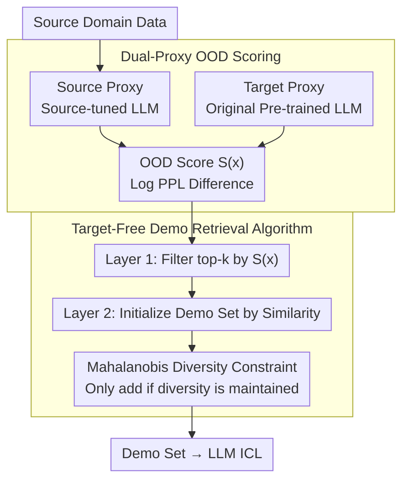

# OOD Proxy Demonstration Retrieval Scheme for Robust In-Context Learning

**Conference**: ACL 2026  
**arXiv**: [2606.00014](https://arxiv.org/abs/2606.00014)  
**Code**: https://github.com/bort64/ood_code  
**Area**: LLM / NLP  
**Keywords**: In-Context Learning, OOD Robustness, Demonstration Retrieval, Distribution Shift, Proxy Estimation

## TL;DR

By constructing dual proxies for the source and target domains and calculating their perplexity difference as an OOD score, combined with Mahalanobis distance constraints for demonstration diversity, this method accurately filters demonstrations from the source domain aligned with target distributions under conditions where target samples are inaccessible, thereby enhancing the robustness of LLM In-Context Learning.

## Background & Motivation

**Background**: Large Language Models (LLMs) have demonstrated powerful task adaptation abilities through the In-Context Learning (ICL) paradigm, which guides model inference by inputting a few demonstration samples without fine-tuning. The academic community has extensively explored various demonstration selection strategies, including retrieval methods based on BM25, text encoder similarity, and model influence.

**Limitations of Prior Work**: The core bottleneck of ICL is performance collapse caused by distribution shifts. When demonstrations are severely mismatched with the target task distribution (especially in real-world applications where target domain data is unavailable), existing demonstration selection methods often rank based on features of the source data itself, completely ignoring whether these samples align with the unknown target distribution. Direct similarity matching cannot effectively judge which source samples are most helpful for the target task in OOD scenarios.

**Key Challenge**: The fundamental dilemma of demonstration retrieval is twofold: (1) the target domain distribution is completely invisible, making it impossible to directly measure the fit of source samples to the target; (2) relying solely on similarity ranking falls into the "spurious correlation" trap—highly similar samples may not adapt to distribution shifts and might even reinforce the model's over-adaptation to the source domain.

**Goal**: (1) Construct a reliable target distribution approximator without any access to the target domain; (2) quantify the "target affinity" of each source sample via this approximator; (3) balance similarity and diversity during demonstration selection to ensure retrieved instances are close to target features while maintaining sufficient representation coverage.

**Key Insight**: Inspired by OOD detection literature, the authors observe that pre-trained LLMs implicitly encode broad language and factual knowledge, serving as a weak proxy for the target domain distribution. By performing instruction-tuning on source domain data to obtain a "source proxy" while keeping the original model as a "target proxy," the prediction probability ratio (using the log difference of perplexity) on the same input reflects the sample's adaptation to the target distribution.

**Core Idea**: Utilize the perplexity ratio—a simple yet theoretically provable metric—to approximate the unobservable target distribution "out of thin air," thereby guiding the demonstration selection process and avoiding complete reliance on similarity that leads to source domain bias.

## Method

### Overall Architecture

The DOPA execution process consists of three stages:

1.  **Proxy Construction Stage**: Based on accessible source domain data, a source proxy model is obtained by instruction-tuning an LLM; meanwhile, the original un-tuned LLM is retained as the target proxy.
2.  **OOD Scoring Stage**: For each sample in the source domain, the perplexity of both proxies is calculated, and the log difference is used as the OOD score to filter a candidate set of the top $k$ samples most likely aligned with the target distribution.
3.  **Demonstration Retrieval Stage**: A demonstration pool is initialized based on similarity from the candidate set, then expanded using Mahalanobis distance constraints to ensure the final demonstrations possess both similarity and diversity.

### Key Designs

**1. Dual-Proxy OOD Scoring: Target invisible? Use the "viewpoint difference" of two models to infer affinity.**

A pain point of ICL is the invisibility of the target distribution. The authors' breakthrough is not to hard-estimate the target distribution but to construct a "control group": the source proxy is instruction-tuned on source labeled data, making it over-fit to source features; the target proxy remains the un-tuned pre-trained LLM, maintaining a more "universal" perspective. If a sample $x$ has high perplexity under the source proxy but low perplexity under the target proxy, it is an "outlier in the source domain"—and such samples are precisely those likely to perform well in an unknown target domain. Thus, the OOD score is defined as:

$$S(x) = \log PPL_{target}^{proxy}(x) - \log PPL_{source}^{proxy}(x)$$

A lower score indicates better adaptation to the target. Pre-trained LLMs are used instead of uniform distributions because they leverage internal knowledge and avoid strong assumptions. Theorem 1 provides a bounded proxy error, limiting the deviation within $(\epsilon_t/m_t + \epsilon_s/m_s)$.

**2. Mahalanobis Distance Diversity Constraint: Closing the loophole where scores favor short text.**

Relying solely on perplexity ratios has a risk: perplexity measures token-level fluency and naturally favors short texts and high-frequency patterns, potentially causing retrieval results to cluster around similar short samples. To counter this, a global diversity measure is added: after initializing with the top $C$ candidates by similarity, the average Mahalanobis distance between all sample pairs in the candidate set is calculated:

$$Div = \frac{2}{|\mathcal{D}_{demo}|(|\mathcal{D}_{demo}|-1)}\sum_{i<j}\sqrt{\mathbf{D}_{ij}^T \Sigma^{-1} \mathbf{D}_{ij}}$$

Where $\Sigma$ is the empirical covariance matrix of sample representations. A candidate is only kept if its inclusion does not decrease overall diversity. Mahalanobis distance is preferred over Euclidean distance as it whitens dimensions according to covariance, truly expanding the representation space while maintaining similarity.

**3. Target-Free Demonstration Retrieval Algorithm: Two-layer filtering for "distribution shift" and "representation coverage".**

The first layer traverses source data once to filter a candidate set $\hat{\mathcal{D}}_S$ of size $k$ using the OOD score, addressing "which samples come from the target neighborhood." The second layer sorts candidates by similarity to the test sample, initializes the set with the top $N\times|Y|$ samples, and then iteratively checks remaining candidates, including them only if they do not reduce diversity until the target size is reached. This addresses "whether demonstrations are complementary."

## Key Experimental Results

### Main Results

DOPA's effectiveness was tested across 5 LLM scales and 3 task families:

| LLM Model | Avg. Accuracy on Test Set (%) | Gain over Random | Gain over DrICL |
|---------|------------------|-----------|----------|
| GPT2-XL | 48.76 | +10.3% | +2.1% |
| LLaMA3.2-3B | 59.29 | +5.7% | +5.2% |
| Gemma2-2B | 60.12 | +2.4% | +4.3% |
| Qwen3-1.7B | 64.93 | +1.1% | +1.4% |
| LLaMA3.1-8B | 61.08 | +1.7% | +1.0% |

Performance across three task types:

| Task Family | Description | DOPA Avg. Accuracy (%) | Gain over Best Baseline |
|--------|------|---------------|----|
| Sentiment Analysis (SA/TD/SST) | Sentence-level polarity judgment, including in-domain and OOD sets | 48.76 | +0.55 |
| Natural Language Inference (NLI) | Entailment prediction with implicit, adversarial, and generative perturbations | 38.04 | +1.05 |
| Textual Entailment Reasoning (Adv/Toxigen) | Complex NLI tasks with more severe distribution shifts | 51.82 | +0.65 |

### Ablation Study

| Configuration | Accuracy Drop after Component Removal (%) |
|------|--------------------------|
| Full DOPA | Baseline |
| w/o OOD Scoring (using random scoring) | -2.3% to -4.1% |
| w/o Mahalanobis Diversity (using Euclidean) | -1.2% to -2.8% |
| w/o Diversity Constraint (similarity only) | -1.5% to -3.2% |
| Source Proxy Only (no target comparison) | -3.4% to -5.7% |

### Key Findings

- **Criticality of OOD Scoring**: Removing the OOD scoring module led to the most significant performance drop (-2.3% to -4.1%), indicating that the perplexity ratio proxy mechanism is the core of DOPA. This module contributed approximately 65% of the performance gain in smaller models.
- **Incremental Effect of Diversity**: Mahalanobis distance constraints provide a further 1.2% to 2.8% improvement over simple Euclidean diversity.
- **Impact of Distribution Shift Degree**: On mild OOD tasks (e.g., in-domain SST), DOPA improved by only 0.1% over baselines; on severe OOD tasks (e.g., Toxigen), the gain reached 3.2%, confirming the algorithm specifically targets severe distribution shifts.
- **Necessity of Target Proxy**: Replacing the target proxy with a uniform distribution invalidated the OOD scoring (-3.4% to -5.7%).

## Highlights & Insights

- **Ingenious "Out of Thin Air" Logic**: The most brilliant aspect is that since the target domain is invisible, "relativity" is used—inferring target affinity indirectly through the difference in behavior between source and target proxies. This avoids direct assumptions about the target distribution.
- **Integration of Theory and Practice**: The bounded proxy error analysis in Theorem 1 is not just formal elegance; it practically guides every step of the proxy design.
- **Multi-level Constraint Fusion**: OOD scoring handles distribution, while diversity constraints handle representation. The two-layer pipeline solves core issues while maintaining interpretability.

## Limitations & Future Work

- **Boundaries of Proxy Assumptions**: It is assumed that source instruction-tuning sufficiently represents the source distribution; however, if the source domain is a mixture of distributions, the source proxy may be unstable.
- **Undiscussed Computational Overhead**: OOD scoring requires passing source data through two models to generate perplexity, costing roughly 2-3x more than standard retrieval. This may be a bottleneck at the scale of millions of source samples.
- **Generalization to Multi-lingual and Multi-modal**: Experiments only cover English NLP tasks. Effectiveness in non-English or multi-modal settings remains to be verified.
- **Specific Improvement Ideas**: (1) Design online or incremental OOD score update mechanisms; (2) use knowledge distillation to reduce proxy model size; (3) extend the method to cross-lingual or cross-modal settings.

## Related Work & Insights

- **vs. Traditional Similarity Retrieval (BM25/SBERT)**: Traditional methods find samples most similar to the test set. DOPA differs by adding OOD sensitivity—similarity does not equal adaptation.
- **vs. Influence Functions**: These calculate the impact of demos on model gradients, requiring internal model access. DOPA requires no gradient information and uses only perplexity, making it suitable for black-box or API scenarios.
- **vs. Data Augmentation (Rewrite/Augmentation)**: Augmentation tries to modify source samples to fit the target. DOPA employs a "selection" rather than "modification" approach.
- **Insights**: When true data distributions are unavailable, utilizing the relative behavior of "control groups" (e.g., tuned vs. un-tuned) to infer distribution characteristics is a universal strategy.

## Rating

- **Novelty**: ⭐⭐⭐⭐⭐ Demonstration retrieval under target-free constraints is a new problem setting, and the dual-proxy OOD scoring is elegant and theoretically grounded.
- **Experimental Thoroughness**: ⭐⭐⭐⭐ Covers 5 LLM scales, 3 task families, and multiple baselines with ablation studies. Lacks hyperparameter sensitivity analysis.
- **Writing Quality**: ⭐⭐⭐⭐⭐ Clear logic; forms a complete narrative from problem definition to method and experiments.
- **Value**: ⭐⭐⭐⭐⭐ Solves a real-world pain point (invisible target domains) with a reproducible method. Code is open-sourced and applicable to production-grade ICL systems.

<!-- RELATED:START -->

## Related Papers

- [\[ACL 2026\] Think in Sentences: Explicit Sentence Boundaries Enhance Language Model's Capabilities](think_in_sentences_explicit_sentence_boundaries_enhance_language_model39s_capabi.md)
- [\[ACL 2026\] Understanding Structured Financial Data with LLMs: A Case Study on Fraud Detection](understanding_structured_financial_data_with_llms_a_case_study_on_fraud_detectio.md)
- [\[ACL 2026\] 等等，还有出路：一个对话脱轨预测的决策机制](wait_theres_a_way_out_a_decision_mechanism_for_forecasting_conversational_derail.md)
- [\[ACL 2026\] Automatic Combination of Sample Selection Strategies for Few-Shot Learning](automatic_combination_of_sample_selection_strategies_for_few-shot_learning.md)
- [\[ACL 2026\] DeCoVec: Building Decoding Space based Task Vector for Large Language Models via In-Context Learning](decovec_building_decoding_space_based_task_vector_for_large_language_models_via_.md)

<!-- RELATED:END -->
