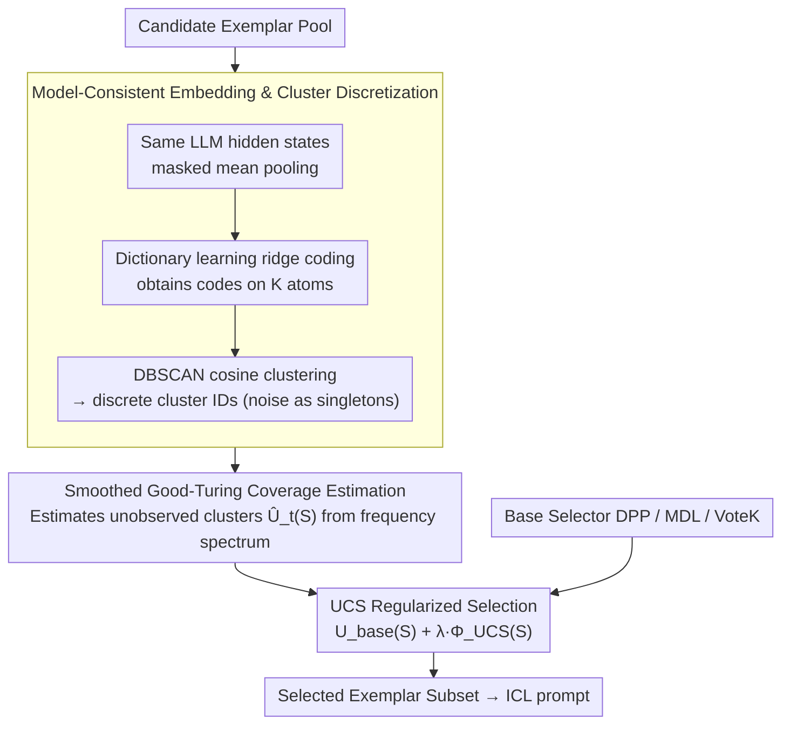

# UCS: Estimating Unseen Coverage for Improved In-Context Learning

**Conference**: ACL 2026 Findings  
**arXiv**: [2604.12015](https://arxiv.org/abs/2604.12015)  
**Code**: [https://github.com/Raina-Xin/UCS](https://github.com/Raina-Xin/UCS)  
**Area**: In-Context Learning  
**Keywords**: In-Context Learning, Exemplar Selection, Coverage Estimation, Good-Turing Estimation, Clustering

## TL;DR

This paper proposes UCS (Unseen Coverage Selection), a training-free subset-level coverage prior based on the Smoothed Good-Turing estimator. By estimating the number of unobserved potential clusters in the candidate exemplar set, it regularizes existing ICL exemplar selection methods, improving accuracy by 2-6% on intent classification and reasoning tasks.

## Background & Motivation

**Background**: The performance of In-Context Learning (ICL) is highly dependent on which exemplars are selected for the prompt. Existing methods select exemplars based on similarity (e.g., semantic proximity to the query), diversity (e.g., DPP), or information-theoretic criteria (e.g., MDL).

**Limitations of Prior Work**: Existing methods operate at the instance level—evaluating the relevance of individual exemplars or pairwise diversity—but lack a subset-level coverage perspective. A good set of exemplars should cover the various underlying latent clusters of a task, yet no method quantifies how many latent patterns remain uncovered in the current selection set.

**Key Challenge**: The distribution of latent patterns in the ICL exemplar pool is significantly heavy-tailed, where a few patterns occupy many samples while a large number of patterns contain only a few samples. Similarity- or diversity-based methods tend to select from frequent patterns, leading to the systematic neglect of rare patterns.

**Goal**: To propose a subset-level coverage prior that acts as a lightweight plug-in to enhance existing ICL selection methods, encouraging the selection of exemplar sets that cover more latent patterns.

**Key Insight**: Drawing from classic methods for estimating "unobserved species counts" in ecology—specifically the Smoothed Good-Turing estimator—this work analogies "uncovered latent clusters" in ICL exemplar selection to "unobserved species."

**Core Idea**: Latent patterns are defined using clusters in a model-consistent embedding space. The total number of clusters is estimated from the frequency spectrum using the Good-Turing estimator, and this estimate is added as a regularization term to existing selection objectives.

## Method

### Overall Architecture

UCS follows a three-step process: (1) represent all candidate exemplars using the LLM's own hidden states (model-consistent representation); (2) discretize continuous embeddings into cluster IDs via dictionary learning and DBSCAN; (3) estimate total cluster counts from the frequency spectrum of the selected subset using the Smoothed Good-Turing estimator (coverage estimation) and combine this with existing selection targets.

### Key Designs

**1. Model-consistent embedding and clustering discretization: Compressing continuous embeddings into discrete "latent pattern" labels to count coverage**

To discuss "how many latent patterns are covered," patterns must first be defined. UCS extracts hidden states from the same LLM used during inference (taking only the input portion and excluding labels), utilizing masked mean pooling to obtain fixed-length vectors. Using the same model ensures the embedding space is consistent with downstream inference. Instead of clustering raw vectors directly, the method applies dictionary learning (ridge coding) to obtain codes across $K$ atoms. Clustering is then performed in the normalized code space using DBSCAN (cosine distance), where noise points are treated as individual singleton clusters. Dictionary learning plus clustering captures recurring pattern combinations while preserving fine-grained units in the long tail—which are the primary targets for coverage estimation.

**2. Smoothed Good-Turing coverage estimation: Using ecological "unobserved species" statistics to calculate missing clusters**

Given discrete cluster labels, the core problem is: how many latent patterns does the current subset $S$ miss? This mirrors the classic ecological question of how many new species would be found upon further sampling. UCS constructs a frequency spectrum $f_s(S)$ (number of clusters appearing exactly $s$ times) and uses the Smoothed Good-Turing estimator to predict how many new clusters would be observed if $m$ more samples were taken:

$$\hat{U}_t^{SGT}(S) = -\sum_{s=1}^{M} (-t)^s w_s(t,\alpha) f_s(S)$$

The coverage function $\Phi_{UCS}(S) = K_{seen}(S) + \hat{U}_t(S)$ accounts for both "observed clusters" and "predicted unobserved clusters." The statistical intuition is that the number of singletons (appearing once) and doubletons (appearing twice) in the frequency spectrum encodes rich information about unobserved categories.

**3. UCS regularized selection: A plug-and-play prior rather than a replacement**

Since UCS is a subset-level function that cannot be decomposed into individual scores, it serves as a regularization term added to existing methods:

$$S^* = \arg\max_{|S|=B} \big(U_{base}(S; x_{test}) + \lambda \Phi_{UCS}(S)\big)$$

Where $U_{base}$ represents the original utility of DPP, MDL, or VoteK, and $\lambda$ controls the strength of coverage regularization. This approach preserves the strengths of the original methods while adding a coverage perspective when they systematically ignore rare patterns.

### Loss & Training

UCS is entirely training-free. Offline preprocessing (embedding and clustering) takes 38-57 seconds per dataset, with online inference overhead approximately 0-3 seconds. All hyperparameters have clear default values (number of atoms $K$, SGT truncation order $M=20$, expansion factor $t$, etc.).

## Key Experimental Results

### Main Results

| Method | Banking77 (Qwen) | CLINC150 (Qwen) | HWU64 (Qwen) |
|--------|------|------|------|
| VoteK | 0.518 | 0.703 | 0.609 |
| UCS+VoteK | 0.543 (+2.5%) | 0.744 (+4.1%) | 0.671 (+6.2%) |
| DPP | 0.831 | 0.755 | 0.791 |
| UCS+DPP | 0.831 | 0.775 (+2.0%) | 0.794 |
| MDL | 0.764 | 0.748 | 0.785 |
| UCS+MDL | 0.771 | 0.752 | 0.801 (+1.6%) |

### Ablation Study

| Configuration | Key Metrics | Description |
|------|---------|------|
| UCS+VoteK | Unique clusters: 10.0, Cluster size: 1.0 | Completely eliminates redundancy |
| VoteK Original | Unique clusters: 9.67, Cluster size: 8.50 | Significant redundancy |
| Cross-model joint dictionary | Decrease | Forcing alignment across embedding spaces loses information |

### Key Findings

- **Query-independent methods benefit most**: VoteK + UCS improved by 6.2% on HWU64 (Qwen), as VoteK is originally prone to selecting redundant exemplars.
- **Effective for reasoning tasks**: On BBEH reasoning tasks, UCS+DPP improved by 12.5 pp on Shuffled Objects, and UCS+MDL improved by 8.4 pp on Causal Understanding.
- **Heavy-tailed cluster distribution**: In all dataset-model combinations, cluster size distributions are highly skewed—with many singletons and few dominant clusters—validating the necessity of a coverage prior.
- **Model-consistent embeddings outperform joint ones**: Joint dictionary learning can damage the fine-grained discriminatory power of high-capability models.
- **Minimal computational overhead**: Offline preprocessing 38-57s, online extra 0-3s.

## Highlights & Insights

- **Elegant bridge between statistics and NLP**: Applying "unobserved species" estimation (Good-Turing) from ecology to "uncovered latent clusters" in ICL is a natural and methodology-sound analogy.
- **Plug-and-play design**: UCS as a regularization term seamlessly integrates with existing selection methods without modifying the underlying retrieval pipeline.
- **Interpretable cluster analysis**: The clusters generated by UCS are semantically interpretable (e.g., micro-topics like authentication or ATM withdrawals in Banking77), providing insights into task structures.

## Limitations & Future Work

- UCS provides limited gains for methods that are already strongly query-dependent and near saturation (e.g., DPP on certain datasets).
- Clustering quality depends on the choice of DBSCAN hyperparameters (eps requires adaptive heuristics).
- The statistical reliability of the SGT estimator is limited under small exemplar selection budgets (e.g., B=10).
- Evaluations were conducted only at a fixed budget of B=10; performance under different budgets remains unknown.

## Related Work & Insights

- **vs DPP**: DPP encourages diversity through determinant maximization but does not explicitly quantify coverage. UCS provides a complementary subset-level signal.
- **vs VoteK**: VoteK selects a global exemplar set based on voting without diversity guarantees. UCS effectively eliminates redundancy via inverse frequency weighting.
- **vs MDL**: MDL selects informative exemplars using minimum description length; UCS provides an orthogonal optimization signal from a coverage perspective.

## Rating

- Novelty: ⭐⭐⭐⭐ The application of Good-Turing in ICL is novel, and the subset-level coverage perspective is valuable.
- Experimental Thoroughness: ⭐⭐⭐⭐ Coverage across three models and multiple classification/reasoning tasks, though fixed budgets limit the depth of analysis.
- Writing Quality: ⭐⭐⭐⭐⭐ Clear and rigorous methodology with strong links between theory and experiments.
- Value: ⭐⭐⭐⭐ A practical plug-and-play tool directly applicable to ICL deployments.

<!-- RELATED:START -->

## Related Papers

- [\[ACL 2026\] DeCoVec: Building Decoding Space based Task Vector for Large Language Models via In-Context Learning](decovec_building_decoding_space_based_task_vector_for_large_language_models_via_.md)
- [\[ACL 2026\] OOD Proxy Demonstration Retrieval Scheme for Robust In-Context Learning](toward_robust_in-context_learning_leveraging_out-of-distribution_proxies_for_tar.md)
- [\[AAAI 2026\] LILAD: Learning In-context Lyapunov-stable Adaptive Dynamics Models](../../AAAI2026/llm_nlp/lilad_learning_in-context_lyapunov-stable_adaptive_dynamics_models.md)
- [\[ACL 2025\] Beyond Output Matching: Bidirectional Alignment for Enhanced In-Context Learning](../../ACL2025/llm_nlp/beyond_output_matching_bidirectional_alignment_for_enhanced_in-context_learning.md)
- [\[ACL 2025\] Exploring Explanations Improves the Robustness of In-Context Learning](../../ACL2025/llm_nlp/exploring_explanations_improves_the_robustness_of_in-context_learning.md)

<!-- RELATED:END -->
