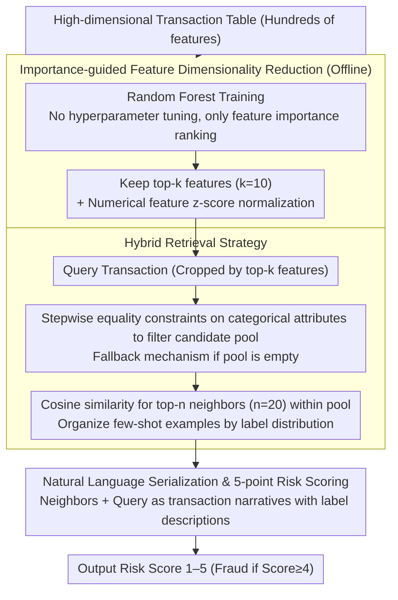

# Understanding Structured Financial Data with LLMs: A Case Study on Fraud Detection

**Conference**: ACL 2026  
**arXiv**: [2512.13040](https://arxiv.org/abs/2512.13040)  
**Code**: None  
**Area**: Information Retrieval / Financial NLP  
**Keywords**: Fraud Detection, Tabular Data, Retrieval-Augmented Generation, Feature Selection, In-Context Learning

## TL;DR

This paper proposes FinFRE-RAG, a two-stage framework that serializes high-dimensional tabular transaction data into natural language via importance-guided feature dimensionality reduction. By combining label-aware retrieval-augmented in-context learning, it significantly improves the F1/MCC of open-source LLMs in financial fraud detection, narrowing the performance gap with specialized tabular classifiers.

## Background & Motivation

**Background**: Financial fraud detection primarily relies on tabular models like XGBoost and LightGBM, which require extensive feature engineering and offer limited explainability. While LLMs can generate human-readable explanations and assist in feature analysis, their direct application to tabular fraud detection has been poor.

**Limitations of Prior Work**: (1) Tabular input mismatch—transaction data consists of high-dimensional tables with numerical/categorical features, whereas LLMs are pre-trained on natural language and struggle with the semantics of structured features and numerical precision; (2) Fraud ambiguity and scarcity—fraud definitions vary across institutions, products, and regions, and the proportions are extremely low (<1%), making it difficult for LLMs to identify subtle discriminatory patterns.

**Key Challenge**: LLMs possess the potential for reasoning and generating explainable analyses but lack knowledge of "what constitutes fraud"—it is necessary to teach LLMs which feature patterns correlate with fraudulent behavior.

**Goal**: To design a tuning-free framework that enables LLMs to understand and detect tabular financial fraud through feature dimensionality reduction and retrieval augmentation.

**Key Insight**: Reframing fraud detection as an instance-based reasoning problem—retrieving semantically similar historical transactions as few-shot examples allows the LLM to make judgments through analogical reasoning.

**Core Idea**: Offline feature dimensionality reduction (retaining top-k features ranked by Random Forest) + Online retrieval-augmented in-context learning (categorical filtering → numerical similarity search → natural language serialization).

## Method

### Overall Architecture

FinFRE-RAG aims to solve the issue where feeding a row of high-dimensional transaction records directly into an LLM for fraud judgment is akin to guessing, as the model understands neither the semantics of numerical features nor the specific "fraud patterns" of an institution. The approach reformulates the detection problem as "finding the most similar historical transactions and reasoning by analogy based on their labels," split into offline and online stages. In the offline stage, a Random Forest is trained on an external dataset to obtain feature importance rankings, retaining the top-k most informative features and pre-calculating z-score normalization for all numerical features. In the online stage, for each query transaction, categorical attributes are used to narrow the candidate pool, followed by a nearest neighbor search based on numerical similarity within that pool. These neighbors and the query are serialized into a natural language prompt for the LLM, which outputs a 5-point risk score.

### Key Designs

**1. Importance-guided Feature Dimensionality Reduction: Selecting "which columns to observe" via the most efficient method**

Transaction tables often contain hundreds of columns; including all of them in a prompt exceeds the context window and introduces noise, and LLMs are particularly sensitive to irrelevant numerical features. The authors train a Random Forest on an external dataset without hyperparameter tuning. The goal is not a high-quality classifier but rather a "coarse but sufficient" feature importance ranking at minimal cost. Based on this, they retain the top-k ($k=10$ by default) features and pre-calculate z-score normalization for numerical retrieval. Reducing to 10 columns shortens the prompt significantly and focuses the LLM on truly discriminative attributes; experiments show that adding more features actually degrades performance due to noise.

**2. Hybrid Retrieval Strategy: Categorical filtering for structure, numerical similarity for fine-grained matching**

For analogical reasoning to be valid, retrieved "neighbors" must be both structurally similar and numerically close. A single similarity metric cannot achieve this. FinFRE-RAG applies stepwise equality constraints based on the importance of categorical attributes (e.g., restricting to the same transaction type) with a fallback mechanism that relaxes the last constraint if the candidate pool becomes empty. Within the filtered pool, top-n ($n=20$ by default) neighbors are selected using cosine similarity between normalized feature vectors and organized into few-shot examples. Categorical filtering ensures semantic consistency, while numerical similarity provides fine-grained matching, leveraging the LLM's strength in "analogical reasoning from similar cases."

**3. Natural Language Serialization & 5-point Risk Scoring: Translating tables into LLM-understandable language and allowing hesitation**

If retrieved neighbors are merely strings of key-value pairs, LLMs struggle to read the semantic relationships. Here, each feature is embedded into a natural language template rather than list format, and each retrieved example includes its corresponding label description, making the context read like transaction narratives. Finally, instead of a hard binary classification (fraud vs. normal), the model outputs a risk score from 1–5 (with $\text{Score} \ge 4$ considered fraud). This fine-grained signal allows the model to express uncertainty, consistently proving more stable in experiments than forcing a hard binary decision.

### Loss & Training

FinFRE-RAG does not train the LLM itself; the only "training" occurs during the simple Random Forest stage for feature reduction. Inference utilizes six open-source models (Qwen3-14B/80B, Gemma 3-12B/27B, GPT-OSS-20B/120B), with LoRA fine-tuning used as a baseline for comparison.

## Key Experimental Results

### Main Results

**FinFRE-RAG vs. Direct Prompting (F1 Improvement, Gemma 3-12B)**

| Dataset | Direct Prompting F1 | + FinFRE-RAG F1 | Gain |
|---------|-------------------|-----------------|------|
| ccf | 0.00 | 0.79 | +0.79 |
| ccFraud | 0.13 | 0.59 | +0.46 |
| IEEE-CIS | 0.01 | 0.59 | +0.58 |
| PaySim | 0.00 | 0.71 | +0.71 |

### Ablation Study

**Impact of Feature Count and Retrieval Count**

| Configuration | Description |
|---------------|-------------|
| k=10 features | Optimal balance; more features increase noise |
| n=20 neighbors | Sufficient context for analogical reasoning |
| 5-point scale | Superior to binary classification output |

### Key Findings

- Under direct prompting, LLMs perform almost like random guessing (F1 ≈ 0); with FinFRE-RAG, F1 improves to 0.5–0.8.
- Gemma 3-12B + FinFRE-RAG is competitive with XGBoost/LightGBM across multiple datasets.
- LLM fine-tuning (LoRA) is inferior to FinFRE-RAG in most settings, suggesting that ICL is better suited for this task than parameter updates.
- The 5-point risk score consistently outperforms binary classification as it allows the model to express uncertainty.
- Despite performance approaching specialized classifiers, the unique value of LLMs lies in generating explainable rationales for fraud analysis.

## Highlights & Insights

- Reframes financial fraud detection as "instance-based reasoning" rather than just "classification"—fully exploiting the analogical reasoning capabilities of LLMs.
- Requires no LLM parameter training and relies entirely on ICL, making it suitable for the strict data privacy requirements of the financial sector.
- The two-stage design of feature reduction + retrieval augmentation is highly generalizable and can be extended to other tabular data tasks.

## Limitations & Future Work

- LLMs still lag behind specialized tabular classifiers (e.g., XGBoost), especially in large-scale, high-dimensional scenarios.
- Feature reduction depends on the importance ranking of Random Forest, which may not suit all data distributions.
- Evaluated only on 4 public datasets; has not been validated in real-world production-grade fraud detection systems.
- The threshold for the 5-point score ($\text{Score} \ge 4$) is fixed without an optimal threshold search.

## Related Work & Insights

- **vs. XGBoost/LightGBM**: Specialized classifiers still hold an advantage in raw prediction performance but do not provide explainable rationales.
- **vs. Financial LLMs (FinGPT, etc.)**: Domain-specific LLMs based on older architectures lack sufficient instruction-following capabilities.
- **vs. Direct LLM Prompting**: LLMs fail almost completely without feature selection and retrieval, proving the necessity of the framework.

## Rating

- Novelty: ⭐⭐⭐ The framework is relatively straightforward, but the combination of RAG for tabular data is novel.
- Experimental Thoroughness: ⭐⭐⭐⭐ 4 datasets × 6 models + fine-tuning comparison + multi-dimensional analysis.
- Writing Quality: ⭐⭐⭐⭐ Clear problem analysis and RQ-driven experimental design.
- Value: ⭐⭐⭐⭐ Provides a practical baseline for LLM applications in the financial domain.

<!-- RELATED:START -->

## Related Papers

- [\[ACL 2025\] Can LLMs Interpret and Leverage Structured Linguistic Representations? A Case Study with AMRs](../../ACL2025/llm_nlp/can_llms_interpret_and_leverage_structured_linguistic_representations_a_case_stu.md)
- [\[ACL 2025\] Is It JUST Semantics? A Case Study of Discourse Particle Understanding in LLMs](../../ACL2025/llm_nlp/is_it_just_semantics_a_case_study_of_discourse_particle_understanding_in_llms.md)
- [\[ACL 2026\] A Study of LLMs' Preferences for Libraries and Programming Languages](a_study_of_llms39_preferences_for_libraries_and_programming_languages.md)
- [\[ACL 2025\] How LLMs Comprehend Temporal Meaning in Narratives: A Case Study in Cognitive Evaluation of LLMs](../../ACL2025/llm_nlp/how_llms_comprehend_temporal_meaning_in_narratives_a_case_study_in_cognitive_eva.md)
- [\[ACL 2025\] Explicit and Implicit Data Augmentation for Social Event Detection](../../ACL2025/llm_nlp/explicit_and_implicit_data_augmentation_for_social_event_detection.md)

<!-- RELATED:END -->
