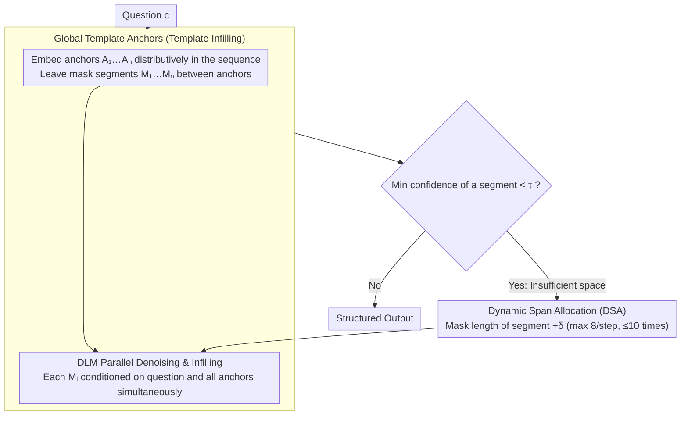

# Unlocking the Potential of Diffusion Language Models through Template Infilling

**Conference**: ACL2026  
**arXiv**: [2510.13870](https://arxiv.org/abs/2510.13870)  
**Code**: None  
**Area**: Code Intelligence  
**Keywords**: Diffusion Language Models, template infilling, structured generation, dynamic span allocation, code generation  

## TL;DR
This paper proposes Template Infilling, which transforms the generation constraints of Diffusion Language Models (DLMs) from a single prefix into structural anchors distributed throughout the output. By utilizing dynamic span allocation to reserve space for complex reasoning, the method significantly stabilizes and enhances parallel generation quality in mathematical reasoning, code generation, and global planning tasks.

## Background & Motivation
**Background**: Diffusion Language Models do not generate tokens sequentially from left to right; instead, they treat the sentence as a holistic entity subjected to iterative denoising, allowing for simultaneous token recovery at any position. Theoretically, this property is ideal for global planning, code completion, and long-chain reasoning, as the model can observe both preceding and succeeding constraints simultaneously, unlike autoregressive models that rely solely on prefixes.

**Limitations of Prior Work**: Real-world DLM inference has not fully unleashed this flexibility. Many existing methods still segment output into blocks or adopt prefix prompting from autoregressive models to stabilize sampling, effectively forcing the model into an approximate left-to-right generation path. While this alleviates numerical instability and context collapse, it confines the most valuable capability of DLMs—any-to-any conditioning—back into a semi-autoregressive framework.

**Key Challenge**: The high degree of freedom in DLMs is both an advantage and a risk. Without structure, all positions can change simultaneously, leading to an exponential explosion of search paths relative to length, which often results in repetition, logical drift, and conflicting local segments. However, relying solely on block-wise or prefix constraints to reduce freedom sacrifices the ability of DLMs to leverage future constraints and global skeletons.

**Goal**: The authors aim to find a control mechanism that requires no retraining and does not force DLMs into autoregressive generation. Specifically, the method should provide the model with a global structure of the answer prior to generation, ensuring each missing segment is constrained by both preceding and succeeding anchors while automatically expanding reasoning space for complex problems.

**Key Insight**: The paper observes that while autoregressive prompts are restricted to the beginning, DLM conditions can be scattered throughout the entire sequence. Therefore, rather than providing an "as-if" prefix like "Let's think step by step," it is more effective to embed structural anchors such as "Step," "Check," and "Answer" directly into the target sequence, allowing the model to perform parallel infilling between these anchors.

**Core Idea**: Replace single prefix prompts with global template anchors, transforming the free generation of DLMs into "multi-segment infilling constrained by structural boundary conditions."

## Method
The core of this paper is not training a new DLM but changing how the DLM receives conditions during inference. While traditional prefix prompting places instructions to the left of the output, Template Infilling (TI) decomposes instructions into multiple fixed anchors placed at different positions in the response, leaving masked spans for the model to fill. Consequently, each segment being generated is conditioned not only on the question and previous text but also on the subsequent structure, such as "Analyze first," "Calculate next," and "Finally provide the answer."

The authors emphasize that these templates are not merely local contexts used in common Fill-In-the-Middle (FIM) tasks. While FIM typically fills a single middle hole, TI distributes multiple structural anchors across the complete response space to establish a skeleton for the entire reasoning path. For mathematical problems, the template can force the model to expand derivations before outputting a final value; for code tasks, it can separate logic handling, implementation, and return values; for safety scenarios, it can insert reflection stages like "Draft, Critique, Refine."

### Overall Architecture
The input to TI consists of the original question $c$, a set of structural anchors $A_1, A_2, ..., A_n$, and masked segments $M_1, M_2, ..., M_n$ between the anchors. The final sequence is represented as $S=[c,A_1,M_1,A_2,M_2,...,A_n,M_n]$, where $A_i$ represents immutable template text and $M_i$ represents content completed by the DLM during diffusion sampling.

During generation, the model no longer predicts the next token based solely on $x_{<t}$. Instead, each segment $M_i$ is conditioned on the question and all template anchors, approximating $p(M_i|c,A_1,...,A_n)$. This allows "future anchors" to constrain the current segment. For instance, while writing intermediate reasoning, the model already knows it must eventually enter the final answer zone, making it less likely to lose track during local expansions.

The complete workflow summarizes into three steps. First, a static structural template is constructed based on the task. Second, the template and masks are integrated into the DLM's parallel sampling process, where the model denoises all empty segments simultaneously. Third, if the confidence of a specific segment remains consistently low, Dynamic Span Allocation (DSA) is used to extend the mask length of that segment, providing the model with more expressive space.

### Key Designs
**1. Global Template Anchors: Spreading prompt constraints into structural boundaries throughout the output**

The fundamental limitation of prefix prompting is that constraints are restricted to the leftmost part of the sequence, wasting the DLM’s inherent ability to be conditioned at any position. TI composes the template of multiple fixed anchors, each serving a reasoning role—Plan, Step, Check, Answer—embedded across the target sequence. When filling any mask segment, the DLM attends to all anchors simultaneously, shifting the generation goal from "writing based on a prefix" to "completing a response within a set skeleton." This constrains the high-freedom sampling (where path counts explode with length) into a bounded search: the model remains aware of the mandatory final answer zone while writing intermediate steps, reducing local drift without losing parallel generation capabilities. The authors also observed that models like Dream-Base, adapted from autoregressive models, exhibit disordered infilling or conflicting segments during unconditional generation. Upon introducing templates, the model stabilizes information near the structural anchors first before filling the gaps, a phenomenon also replicated in the "Draft-Critique-Refine" template for safety experiments. This suggests that templates do not just add prompt text but inject a structural prior into the sampling space, forcing the model to satisfy high-level constraints before filling local details.

**2. Dynamic Span Allocation (DSA): Allowing static templates to request more "paper space" for difficult problems**

Fixed-length templates have a weakness: they may suffice for simple questions but truncate complex reasoning if the mask is too short. DSA monitors the prediction confidence of tokens within segments during each diffusion step. If the probability of the most uncertain token in a segment falls below a threshold $\tau$, the segment length is expanded from $|M_i|$ to $|M_i|+\delta$ (up to 8 tokens per step, for a maximum of 10 times in experiments). By using "low confidence" as a signal for "insufficient space," the method automatically allocates reasoning length based on problem difficulty without altering the template structure. Ablation studies show this step specifically boosted GSM8K performance from 36.00 to 44.58.

### Loss & Training
This method is a training-free inference framework and introduces no new training losses. Experiments utilize base and instruct versions of LLaDA-8B and Dream-7B, focusing on pure parallel generation quality: models must plan and generate simultaneously within a 128-token budget. TI uses one static template per task, while DSA dynamically adjusts segment lengths based on confidence. Evaluation compares TI against Vanilla unconditional generation and Prefix Prompting to isolate the gains provided by structural anchors.

## Key Experimental Results

### Main Results
The main experiments cover mathematical reasoning, code generation, and multi-constraint planning. Notably, Prefix Prompting decreased performance in several settings, whereas TI showed significant improvements on LLaDA-Instruct and Dream-Base, indicating that DLM control cannot simply replicate autoregressive methods.

| Model | Method | GSM8K | MATH500 | HumanEval | Trip CSR | Average |
|------|------|------|---------|-----------|----------|------|
| LLaDA-8B Instruct | Vanilla | 49.58 | 17.00 | 15.85 | 12.13 | 23.64 |
| LLaDA-8B Instruct | TI | 71.49 | 21.80 | 32.93 | 12.06 | 34.57 |
| Dream-7B Base | Vanilla | 8.87 | 3.60 | 18.29 | 1.13 | 7.97 |
| Dream-7B Base | TI | 44.58 | 14.40 | 29.88 | 15.94 | 26.20 |
| Dream-7B Instruct | Vanilla | 35.86 | 11.40 | 20.12 | 0.63 | 17.00 |
| Dream-7B Instruct | TI | 39.80 | 12.80 | 33.54 | 16.31 | 25.61 |

On average, TI improved performance by 9.40 percentage points over the baseline. The gains in HumanEval demonstrate that it is suitable not only for mathematical CoT but also for structured implementation in code generation. The significant boost on Trip Planning for the Dream model indicates that multi-constraint planning benefits from global anchors.

### Ablation Study
A step-by-step ablation on GSM8K using Dream-Base shows that even minimal boundary anchors significantly outperform prefix prompting, with detailed descriptions and DSA providing incremental gains.

| Configuration | Strategy | GSM8K Acc. | Relative to Vanilla |
|------|------|------------|--------------|
| Vanilla | No Structure | 8.87 | 0.00 |
| Prefix Prompting | Autoregressive-style Prefix | 8.79 | -0.08 |
| TI Minimal | Static Boundary Anchors | 24.94 | +16.07 |
| TI Detailed | Static Detailed Template | 36.00 | +27.13 |
| TI + DSA | Dynamic Span Allocation | 44.58 | +35.71 |

The authors also tested anchor position perturbations. Accuracy was 0.4458 for the base position, 0.4033 for "Early," 0.4359 for "Late," and 0.4367 for "Compressed." While the default position performed best, performance did not collapse, indicating that gains stem from global conditioning itself rather than overfitting a specific manual layout.

### Key Findings
- **Prefix Prompting is unreliable for DLMs**: It caused HumanEval performance to drop from 18.29 to 3.66 on Dream-Base and degraded in other settings, suggesting prefix-based control conflicts with the parallel sampling mechanism of DLMs.
- **DSA is a major source of gains**: While Minimal TI proved the efficacy of structural skeletons, DSA provided the necessary variable reasoning length for complex problems, lifting GSM8K from 36.00 to 44.58.
- **TI is more stable for fast sampling and long generation**: Analysis of length and sampling steps showed that TI significantly mitigates the quality degradation of the baseline as generation length increases at fixed sampling steps; it also maintains higher accuracy when sampling steps are reduced at a fixed length.
- **Instruct tuning may re-introduce autoregressive bias**: The sampling trajectory of Dream-Instruct followed a more diagonal (sequential) generation path. The authors hypothesize that strong supervision on prefix tokens during instruction tuning may suppress the global planning potential of DLMs.

## Highlights & Insights
- The most valuable insight is that the unit of control for DLMs should be the structure of the output space rather than just prompt text. Placing constraints at future positions leverages the DLM's ability to see forward and backward contexts simultaneously.
- TI transforms "letting the model think" from a soft instruction into a physical structure. The model is forced to fill content between anchors, which is more stable than hoping it adheres to a CoT instruction.
- DSA is a practical detail. It acknowledges that while templates provide structure, they shouldn't fix reasoning length. Using low confidence as an expansion signal is simple yet fits the diffusion sampling process naturally.
- Implications for code generation: Code naturally contains function signatures, control flows, return values, and test constraints. Treating these as distributed anchors suggests that DLM infilling might be more suited for complex function bodies than traditional left-to-right generation.
- The "Draft-Critique-Refine" safety example shows templates can serve as procedural constraints. Instead of attaching a safety prompt before the answer, it reserves reflection segments, forcing the model to pass through a check during its generation trajectory.

## Limitations & Future Work
- **Templates still require manual design**: Although the paper intentionally used static templates to prove generalizability, optimal anchors, their counts, and positions for different tasks still require search or automated generation.
- **Current models are not trained for TI**: Existing instruct DLMs are trained under traditional prompt-inference paradigms and may not fully exploit distributed templates. Future work could incorporate TI into instruction tuning or preference optimization.
- **Focus on generative reasoning**: Discriminative benchmarks like MMLU were not the target of this study, meaning the benefits of TI for general knowledge QA, long-form writing, or interactive tool use remain to be demonstrated.
- **Heuristic thresholds for DSA**: Low confidence does not always signal insufficient space; it could indicate missing knowledge or an inappropriate template. Finer expansion and retraction mechanisms would be more robust.
- **Format dependency**: If a model learns to cater to the template rather than solving the problem, complex templates might induce reasoning that is formally correct but empty in content.

## Related Work & Insights
- **vs Block Diffusion**: Block-wise methods reduce freedom via segmentation for stability and engineering optimization; TI avoids reverting to local sequentiality, emphasizing the global conditioning capability of DLMs via anchors.
- **vs Prefix Prompting / CoT**: CoT and Plan-and-Solve rely on initial soft guidance which models can ignore; TI places step structures inside the target sequence, allowing future constraints to participate directly in generating current segments.
- **vs Constrained Decoding**: Traditional constrained decoding uses external rules to mask illegal tokens (hard search pruning); TI provides structure at the input condition level, allowing the model to align naturally during generation.
- **vs FIM / Code Infilling**: FIM typically fills a single local hole to connect contexts; TI uses multiple anchors as a global skeleton, focusing on the planning consistency of an entire reasoning chain or codebase.
- **Insights**: Future work could explore automatic template generators where a model generates structural anchors for a problem first, followed by DLM infilling. Unit tests, type signatures, and exception handling paths could also be used as anchors for code generation.

## Rating
- Novelty: ⭐⭐⭐⭐☆ Converting DLM's any-to-any conditioning into global template control is a clear idea that aligns well with the model's mechanism.
- Experimental Thoroughness: ⭐⭐⭐⭐☆ Covers two types of DLMs and four task categories with multiple analyses, though large-scale real-world code tasks and automated template search are pending.
- Writing Quality: ⭐⭐⭐⭐☆ The narrative is logical, with well-explained motivations and mechanisms, though some formulas and tables are slightly crowded.
- Value: ⭐⭐⭐⭐⭐ This provides a training-free, low-cost, and transferable control paradigm for DLMs, serving as a significant reference for future non-autoregressive language models.

<!-- RELATED:START -->

## Related Papers

- [\[ICLR 2026\] DreamOn: Diffusion Language Models For Code Infilling Beyond Fixed-size Canvas](../../ICLR2026/llm_nlp/dreamon_diffusion_language_models_for_code_infilling_beyond_fixed-size_canvas.md)
- [\[ICML 2026\] Reasoning on the Manifold: Bidirectional Consistency for Self-Verification in Diffusion Language Models](../../ICML2026/llm_nlp/reasoning_on_the_manifold_bidirectional_consistency_for_self-verification_in_dif.md)
- [\[ACL 2026\] Leveraging Pretrained Language Models as Energy Functions for Glauber Dynamics Text Diffusion](leveraging_pretrained_language_models_as_energy_functions_for_glauber_dynamics_t.md)
- [\[ACL 2026\] FastDiSS: Few-step Match Many-step Diffusion Language Model on Sequence-to-Sequence Generation](fastdiss_few-step_match_many-step_diffusion_language_model_on_sequence-to-sequen.md)
- [\[ACL 2025\] Self-Instructed Derived Prompt Generation Meets In-Context Learning: Unlocking New Potential of Black-Box LLMs](../../ACL2025/llm_nlp/self-instructed_derived_prompt_generation_meets_in-context_learning_unlocking_ne.md)

<!-- RELATED:END -->
