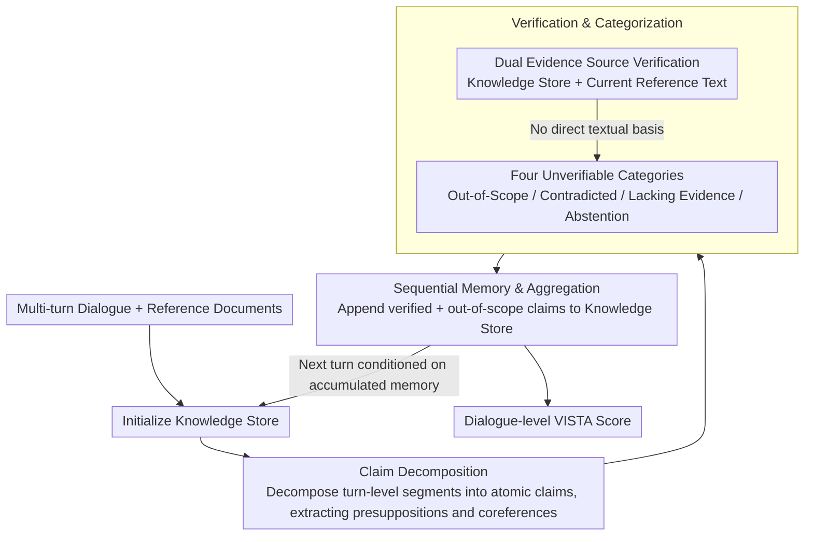

# VISTA: Verification In Sequential Turn-based Assessment

**Conference**: ACL 2026  
**arXiv**: [2510.27052](https://arxiv.org/abs/2510.27052)  
**Code**: [https://github.com/ashleylew/VISTA](https://github.com/ashleylew/VISTA)  
**Area**: Video Understanding  
**Keywords**: Hallucination Detection, Dialogue Factuality, Claim-level Verification, Sequential Consistency Tracking, Multi-turn Dialogue

## TL;DR

VISTA proposes a multi-turn dialogue factuality assessment framework based on claim-level decomposition and sequential consistency tracking. It subdivides unverifiable content into four categories: subjective, contradicted, lacking evidence, and abstention, significantly outperforming FActScore and LLM-as-Judge baselines across four dialogue benchmarks and eight LLMs.

## Background & Motivation

**Background**: Hallucination detection is a primary obstacle to the deployment of dialogue AI systems. Existing methods such as FActScore decompose text into atomic facts for individual verification, while LLM-as-Judge uses LLMs for holistic judgment, showing progress in single-turn evaluation scenarios.

**Limitations of Prior Work**: Existing metrics suffer from two core flaws: (1) treating each generation as isolated text, ignoring the sequential and pragmatic characteristics of dialogue where previous claims constrain subsequent content; (2) treating all unverifiable content (subjective expressions, abstentions, etc.) uniformly as hallucinations, failing to distinguish "genuine errors" from "reasonable uncertainty."

**Key Challenge**: Factuality in dialogue is a dynamically evolving property rather than a static feature of the text, yet existing evaluation methods treat it as a static correctness problem.

**Goal**: (1) Redefine hallucination detection as a sequential claim verification process; (2) provide fine-grained classification of unverifiable content; (3) achieve cross-turn factual consistency tracking in dialogue RAG scenarios.

**Key Insight**: Drawing on concepts from "common ground" in linguistics and Discourse Representation Theory, factual reliability is modeled as a dynamic process built progressively during dialogue, implemented through cross-turn verification by maintaining an accumulating knowledge store.

**Core Idea**: Replace monolithic judgments with a structured multi-stage pipeline (claim decomposition → verification → unverifiable categorization → sequential memory), upgrading dialogue factuality from "point-in-time detection" to "trajectory tracking."

## Method

### Overall Architecture

VISTA is a sequential evaluation pipeline that processes each assistant response in dialogue turn order. The inputs are the multi-turn dialogue and reference documents; outputs include the verification category for each claim and a dialogue-level factuality score. The pipeline comprises five steps: Knowledge Store Initialization → Claim Decomposition → Verification → Unverifiable Categorization → Sequential Memory & Aggregation. Verification and Unverifiable Categorization belong to a common contribution stage, while Sequential Memory writes results back into the knowledge store to form a cross-turn feedback loop.

### Key Designs

**1. Claim Decomposition: Turn-level atomic claim decomposition with explicit extraction of presuppositions and coreferences**

FActScore splits responses into sentences before decomposing them into facts, which often misses implicit information and cross-sentence coreferences. VISTA operates at the turn level without prior sentence splitting: it processes the entire response using dialogue history as context, generates a numbered claim list via few-shot templates ($n=6$), and explicitly handles presupposition inference and coreference resolution. For example, "I didn't know embroidery was a needlework technique" is split into "Embroidery is a needlework technique" and "The assistant did not know embroidery was a needlework technique." This holistic decomposition preserves the recall of implicit/coreferential content; removing the sentence-splitting step in FActScore actually improved its performance (DeepSeek +11.4%, GPT-4o +4.4%), confirming that sentence pre-splitting hinders recall.

**2. Verification & Categorization: Dual evidence source verification with four-way sub-classification of "unverifiable" content**

FActScore only verifies against static reference documents, failing to catch cross-turn contradictions, while LLM-as-Judge treats all unverifiable content as hallucinations. VISTA checks two evidence sources during verification: (a) the set of verified and out-of-scope claims accumulated from previous turns, and (b) the reference text of the current turn. Claims are labeled VERIFIED only if direct textual evidence exists. Remaining unverifiable claims are categorized into four types: Out-of-Scope (subjective/experiential content), Contradicted (explicitly refuted by reference material or prior facts), Lacking Evidence (potentially true but unsupported), and Abstention (expressing uncertainty or refusal to answer). Categorization separates "genuine errors" from "reasonable uncertainty," providing more diagnostic value than a binary "hallucination/non-hallucination" label.

**3. Sequential Memory & Aggregation: Maintaining Fact Memory across turns**

The correctness of a claim often depends on information established in previous turns; treating each turn in isolation leads to misidentifying valid cross-turn references as "Lacking Evidence." VISTA appends verified and out-of-scope claims from each turn to a running knowledge store, forming a dynamic factual memory. Subsequent verification rounds are conditioned on this memory: verified claims reinforce previous information, while contradicted claims indicate factual drift. For instance, if Elvis Presley is called the "King of Rock and Roll" in a later turn, it will not be misreported if the memory acknowledges this identity was established earlier. At the end of evaluation, all claim-level results are aggregated into a dialogue-level VISTA Score. This memory contributes significantly to contradiction detection: adding full dialogue history improved DeepSeek's contradiction detection from 60.0% to 77.0% and GPT-5's from 54.2% to 86.0%.

### Loss & Training

VISTA does not require training—it is a prompt-based evaluation framework that invokes LLMs to complete sub-tasks through structured templates at each stage. It supports zero-shot and few-shot configurations and provides a model-agnostic unified interface.

## Key Experimental Results

### Main Results

**Automatic Evaluation (Turn-level Unverifiable Detection Accuracy %)**

| Dataset | Model | VISTA | FActScore | LLM-as-Judge |
|--------|------|-------|-----------|--------------|
| AIS | GPT-4o | **63.00** | 56.80 | 56.80 |
| BEGIN | GPT-4o | **83.20** | 65.80 | 70.40 |
| FaithDial | DeepSeek | **81.70** | 63.75 | 55.45 |
| FADE | Llama-70B | **65.10** | 56.65 | 62.28 |
| FaithDial | Qwen-32B | **75.73** | 58.41 | 35.89 |
| BEGIN | Mistral-7B | **72.00** | 53.80 | 57.40 |

**Human Evaluation (Alignment with Consensus Labels)**

| Model | Turn Accuracy | Claim Accuracy | Macro F1 |
|------|-----------|-----------|----------|
| GPT-5 | 92.51 | 81.53 | 69.09 |
| GPT-4o | 91.19 | 75.68 | 62.41 |
| DeepSeek | 92.51 | 79.73 | 67.15 |

### Ablation Study

| Configuration | FaithDial Accuracy | Description |
|------|-----------------|------|
| VISTA (Full) | 81.70 | Full model |
| Remove Accumulated Claims | 81.74 | Negligible impact; most claims verifiable from current doc |
| Remove Dialogue History | 77.24 | Decreased 4.5%; context is critical for decomposition |
| Zero-shot | 70.17 | Decreased 11.5%; few-shot examples crucial for dialogue modeling |

### Key Findings

- VISTA's performance gains primarily stem from dialogue contextualization and few-shot exemplars rather than the accumulated claims mechanism itself—partially due to FaithDial claims being mostly verifiable from current references.
- In contradiction detection, performance significantly improved with full dialogue history (DeepSeek: 60.0% to 77.0%, GPT-5: 54.2% to 86.0%), where accumulated claims were the key driver.
- Human annotators disagreed with original dataset labels in 26.4% of turns; 86.7% of these cases involved original labels incorrectly marking unverifiable content as verifiable, suggesting claim-level decomposition improves annotation quality.
- Abstention recognition reached 90.6% accuracy, demonstrating that VISTA reliably distinguishes between refusal to answer and hallucinations.

## Highlights & Insights

- The paradigm shift of modeling dialogue factuality as a dynamic process rather than a static property elegantly aligns with "common ground" theory in linguistics—a theory-driven system design.
- Claim-level decomposition not only improves automated evaluation accuracy but also enhances human annotation consistency (Krippendorff's α = 0.832); this "by-product" may be more practical than the primary results.
- The design of the four unverifiable categories can be directly transferred to other NLG evaluation tasks, such as faithfulness assessment in summarization and translation.

## Limitations & Future Work

- Current benchmark datasets contain relatively few contradiction and abstention cases; VISTA's robustness in these scenarios requires further validation.
- The accumulated claims mechanism has limited impact in short dialogues; longer multi-turn dialogue benchmarks are needed to fully demonstrate its value.
- VISTA relies on LLMs for sub-tasks, introducing potential cascading errors where decomposition mistakes propagate to verification.
- The focus is restricted to RAG scenarios and does not address open-domain fact verification.

## Related Work & Insights

- **vs FActScore**: Both use claim-level decomposition, but FActScore performs isolated verification on single documents, whereas VISTA adds dialogue context and cross-turn tracking.
- **vs LLM-as-Judge**: LLM-as-Judge provides holistic judgments but lacks interpretability; VISTA provides claim-level diagnostics through a structured pipeline.

## Rating

- Novelty: ⭐⭐⭐⭐ Modeling dialogue factuality as a dynamic process is a meaningful shift in perspective, though individual components (decomposition, verification) are not entirely novel.
- Experimental Thoroughness: ⭐⭐⭐⭐⭐ Comprehensive coverage across four benchmarks, eight models, human evaluation, ablation analysis, and specialized contradiction/abstention tests.
- Writing Quality: ⭐⭐⭐⭐⭐ Clear motivation, rigorous experimental logic, and a strong integration of theory and practice.
- Value: ⭐⭐⭐⭐ Provides an evaluation framework better suited for dialogue than FActScore, though practical deployment costs remain high.

<!-- RELATED:START -->

## Related Papers

- [\[ACL 2026\] Confidence Estimation for LLMs in Multi-turn Interactions](confidence_estimation_for_llms_in_multi-turn_interactions.md)
- [\[ACL 2026\] DualFact: A Multimodal Fact Verification Framework for Procedural Video Understanding](dualfact_a_multimodal_fact_verification_framework_for_procedural_video_understan.md)
- [\[CVPR 2026\] VISTA: Video Interaction Spatio-Temporal Analysis Benchmark](../../CVPR2026/video_understanding/vista_video_interaction_spatio-temporal_analysis_benchmark.md)
- [\[CVPR 2026\] SkillSight: Efficient First-Person Skill Assessment with Gaze](../../CVPR2026/video_understanding/skillsight_efficient_first-person_skill_assessment_with_gaze.md)
- [\[CVPR 2026\] MDS-VQA: Model-Informed Data Selection for Video Quality Assessment](../../CVPR2026/video_understanding/mds-vqa_model-informed_data_selection_for_video_quality_assessment.md)

<!-- RELATED:END -->
