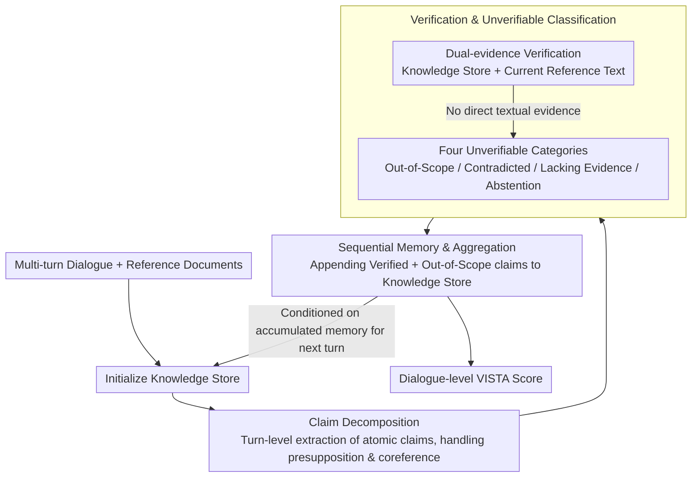

# VISTA: Verification In Sequential Turn-based Assessment

**Conference**: ACL 2026  
**arXiv**: [2510.27052](https://arxiv.org/abs/2510.27052)  
**Code**: [https://github.com/ashleylew/VISTA](https://github.com/ashleylew/VISTA)  
**Area**: Video Understanding  
**Keywords**: Hallucination detection, dialogue factuality, claim-level verification, sequential consistency tracking, multi-turn dialogue

## TL;DR

VISTA proposes a multi-turn dialogue factuality evaluation framework based on claim-level decomposition and sequential consistency tracking. It subdivides unverifiable content into four categories: subjective, contradicted, lacking evidence, and abstention, significantly outperforming FActScore and LLM-as-Judge baselines across four dialogue benchmarks and eight LLMs.

## Background & Motivation

**Background**: Hallucination detection is a primary obstacle to the deployment of dialogue AI systems. Existing methods like FActScore decompose text into atomic facts for individual verification, while LLM-as-Judge uses LLMs for holistic judgment, showing progress in single-turn evaluation scenarios.

**Limitations of Prior Work**: Existing metrics possess two core flaws: (1) treating each generation as isolated text, ignoring the sequential and pragmatic features of dialogue where previous claims constrain subsequent content; (2) treating all unverifiable content (subjective expressions, abstentions, etc.) uniformly as hallucinations, failing to distinguish "actual errors" from "reasonable uncertainty."

**Key Challenge**: Factuality in dialogue is a dynamically evolving attribute rather than a static feature of text, yet existing evaluation methods treat it as a static correctness problem.

**Goal**: (1) Redefine hallucination detection as a sequential claim verification process; (2) Provide fine-grained classification for unverifiable content; (3) Achieve cross-turn fact consistency tracking in dialogue RAG scenarios.

**Key Insight**: Drawing on concepts of "common ground" in linguistics and Discourse Representation Theory, factual reliability is modeled as a dynamic process incrementally constructed during the dialogue, implemented by maintaining an accumulating knowledge store for cross-turn verification.

**Core Idea**: Replace monolithic judgment with a structured multi-stage pipeline (claim decomposition → verification → unverifiable classification → sequential memory), upgrading dialogue factuality from "point-in-time detection" to "trajectory tracking."

## Method

### Overall Architecture

VISTA is a sequential evaluation pipeline that processes each assistant response in turn order. Inputs consist of multi-turn dialogues and reference documents, while outputs include verification categories for each claim and a dialogue-level factuality score. The pipeline encompasses five steps: knowledge store initialization → claim decomposition → verification → unverifiable classification → sequential memory and aggregation. Verification and unverifiable classification belong to the same contribution phase, while sequential memory writes turn-level results back into the knowledge store to create a cross-turn loop.

### Key Designs

**1. Claim Decomposition: Turn-level atomic claim extraction, explicitly handling presupposition and coreference**

FActScore splits responses by sentence before extracting facts, which often loses implicit information and cross-sentence coreference. VISTA operates at the turn level without sentence pre-splitting: it feeds the entire response using dialogue history as context, using a few-shot template ($n=6$) to generate a numbered list of claims. It explicitly handles presupposition inference and coreference resolution—for instance, "I didn't know embroidery was a needlework technique" is decomposed into "Embroidery is a needlework technique" and "The assistant did not know embroidery is a needlework technique." This holistic decomposition preserves the recall of implicit content; experiments showed that removing FActScore's sentence-splitting step improved its performance (DeepSeek +11.4%, GPT-4o +4.4%), confirming that sentence pre-splitting can be a bottleneck for recall.

**2. Verification & Categorization: Dual-source verification followed by fine-grained classification of "unverifiable" content**

FActScore only verifies against static reference documents, failing to capture cross-turn contradictions, while LLM-as-Judge conflates all unverifiable content as hallucinations. In the verification phase, VISTA checks two evidence sources: (a) the set of verified and out-of-scope claims accumulated from previous turns, and (b) the reference text of the current turn. A claim is labeled VERIFIED only if direct textual evidence exists. Remaining claims are further classified into four categories: Out-of-Scope (subjective/experiential content), Contradicted (explicitly refuted by reference material or prior facts), Lacking Evidence (potentially true but unsupported), and Abstention (expressing uncertainty or refusing to answer). This separation distinguishes "actual errors" from "reasonable uncertainty," providing labels with higher diagnostic value than a binary "hallucination/non-hallucination" tag.

**3. Sequential Memory & Aggregation: Maintaining a cross-turn cumulative factual memory**

The validity of a claim in dialogue often depends on information established in previous turns; treating each turn as isolated text leads to misidentifying correct cross-turn citations as "Lacking Evidence." VISTA appends verified and out-of-scope claims from each turn to a running knowledge store, forming a dynamic factual memory. Subsequent verification steps are conditioned on this memory—verified claims reinforce prior information, while contradicted claims indicate factual drift. For example, if a turn refers to Elvis Presley as the "King of Rock and Roll," remembering that this identity was established in a previous turn prevents a false positive hallucination report. At the end of the evaluation, all claim-level results are aggregated into a dialogue-level VISTA Score. This memory contributes significantly to contradiction detection: providing full dialogue history increased contradiction detection from 60.0% to 77.0% for DeepSeek and from 54.2% to 86.0% for GPT-5.

### Loss & Training

VISTA requires no training; it is a prompt-based evaluation framework that invokes LLMs to complete sub-tasks via structured templates. It supports both zero-shot and few-shot configurations and provides a model-agnostic unified interface.

## Key Experimental Results

### Main Results

**Automated Evaluation (Unverifiable Turn Detection Accuracy %)**

| Dataset | Model | VISTA | FActScore | LLM-as-Judge |
|--------|------|-------|-----------|--------------|
| AIS | GPT-4o | **63.00** | 56.80 | 56.80 |
| BEGIN | GPT-4o | **83.20** | 65.80 | 70.40 |
| FaithDial | DeepSeek | **81.70** | 63.75 | 55.45 |
| FADE | Llama-70B | **65.10** | 56.65 | 62.28 |
| FaithDial | Qwen-32B | **75.73** | 58.41 | 35.89 |
| BEGIN | Mistral-7B | **72.00** | 53.80 | 57.40 |

**Human Evaluation (Alignment with Consensus Labels)**

| Model | Turn Accuracy | Claim Accuracy | Macro F1 |
|------|-----------|-----------|----------|
| GPT-5 | 92.51 | 81.53 | 69.09 |
| GPT-4o | 91.19 | 75.68 | 62.41 |
| DeepSeek | 92.51 | 79.73 | 67.15 |

### Ablation Study

| Configuration | FaithDial Accuracy | Description |
|------|-----------------|------|
| VISTA (Full) | 81.70 | Full model |
| Remove Accumulation | 81.74 | Minor impact; most claims verifiable via current document |
| Remove History | 77.24 | 4.5% drop; dialogue context is crucial for decomposition |
| Zero-shot | 70.17 | 11.5% drop; few-shot examples are critical for dialogue modeling |

### Key Findings

- VISTA's advantage stems primarily from dialogue contextualization and few-shot examples rather than the claim accumulation mechanism alone, which is partly due to the fact that most claims in FaithDial can be verified from the current reference document.
- In contradiction detection tasks, performance significantly improved when full dialogue history was included (DeepSeek moved from 60.0% to 77.0%, while GPT-5 moved from 54.2% to 86.0%), highlighting accumulated memory as a key driver.
- Human annotators disagreed with original dataset labels in 26.4% of turns; of these, 86.7% were cases where the original annotation incorrectly marked unverifiable content as verifiable, indicating that claim-level decomposition improves annotation quality.
- Abstention identification accuracy reached 90.6%, demonstrating that VISTA can reliably distinguish between refusal to answer and hallucinations.

## Highlights & Insights

- The paradigm shift of modeling dialogue factuality as a dynamic process rather than a static property aligns elegantly with the common ground theory in linguistics—resulting in a theory-driven system design.
- Claim-level decomposition not only improves automated evaluation accuracy but also enhances human annotation consistency (Krippendorff's α = 0.832). This "by-product" may be more practically valuable than the primary results.
- The design of the four-way unverifiable classification can be directly transferred to other NLG evaluation tasks, such as faithfulness assessment in summarization or translation.

## Limitations & Future Work

- Current benchmarks contain relatively few instances of contradiction and abstention; VISTA’s robustness in these scenarios requires further validation.
- The accumulated memory mechanism has limited impact in short dialogues; longer multi-turn dialogue benchmarks are needed to fully demonstrate its value.
- VISTA relies on LLMs for each sub-task, making it susceptible to cascading errors, where errors in claim decomposition propagate to subsequent verification.
- The focus is strictly on RAG scenarios, leaving open-domain fact verification unaddressed.

## Related Work & Insights

- **vs FActScore**: Both utilize claim-level decomposition for verification, but FActScore performs isolated verification on a single document, whereas VISTA incorporates dialogue context and cross-turn tracking.
- **vs LLM-as-Judge**: LLM-as-Judge provides holistic judgments but lacks explainability, whereas VISTA provides claim-level diagnostics through a structured pipeline.

## Rating

- Novelty: ⭐⭐⭐⭐ Modeling dialogue factuality as a dynamic process is a meaningful shift in perspective, though individual components (decomposition, verification) are not entirely novel.
- Experimental Thoroughness: ⭐⭐⭐⭐⭐ Comprehensive coverage across four benchmarks, eight models, human evaluation, ablation analysis, and targeted tests for contradiction/abstention.
- Writing Quality: ⭐⭐⭐⭐⭐ Clear derivation of motivation, rigorous experimental logic, and tight integration of theory and practice.
- Value: ⭐⭐⭐⭐ Provides an evaluation framework more suited for dialogue than FActScore, though actual deployment costs remain high.

<!-- RELATED:START -->

## Related Papers

- [\[ACL 2026\] Confidence Estimation for LLMs in Multi-turn Interactions](confidence_estimation_for_llms_in_multi-turn_interactions.md)
- [\[ACL 2026\] AlphaContext: An Evolutionary Tree-based Psychometric Context Generator for Creativity Assessment](alphacontext_an_evolutionary_tree-based_psychometric_context_generator_for_creat.md)
- [\[ICML 2026\] Reasoning on the Manifold: Bidirectional Consistency for Self-Verification in Diffusion Language Models](../../ICML2026/llm_nlp/reasoning_on_the_manifold_bidirectional_consistency_for_self-verification_in_dif.md)
- [\[AAAI 2026\] Quantifying Conversational Reliability of Large Language Models under Multi-Turn Interaction](../../AAAI2026/llm_nlp/quantifying_conversational_reliability_of_large_language_models_under_multi-turn.md)
- [\[ACL 2025\] Controlling Politeness in Multi-Turn Dialogues Through Pre-Phrase Augmentation](../../ACL2025/llm_nlp/controlling_politeness_in_multi-turn_dialogues_through_pre-phrase_augmentation.md)

<!-- RELATED:END -->
