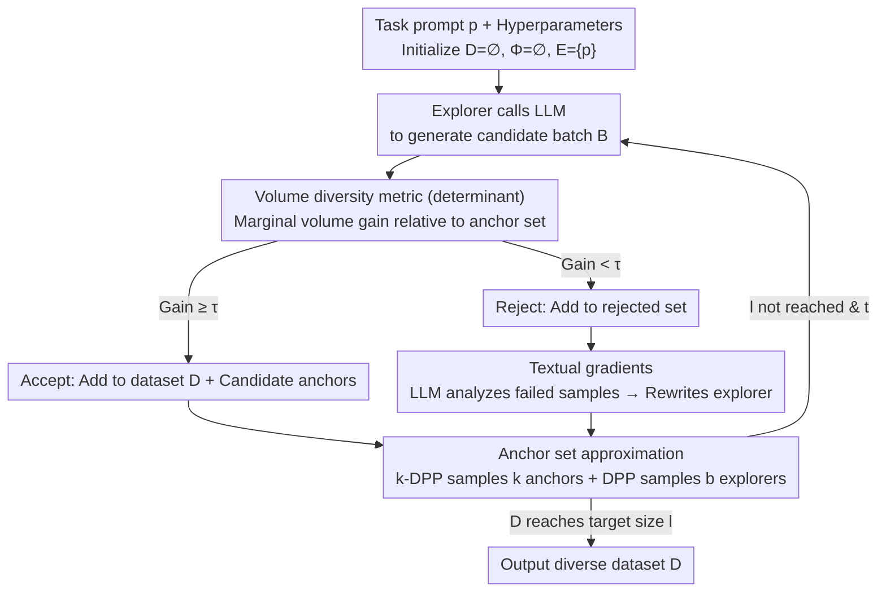

# VOYAGER: A Training Free Approach for Generating Diverse Datasets using LLMs

**Conference**: ACL 2026  
**arXiv**: [2512.12072](https://arxiv.org/abs/2512.12072)  
**Code**: None  
**Area**: LLM/NLP  
**Keywords**: Data diversity, synthetic data generation, DPP, textual gradients, LLM sampling

## TL;DR
Voyager is a training-free LLM data generation algorithm that maintains diverse anchors and explorers using DPP, while iteratively rewriting prompts using textual gradients. It significantly improves Vendi diversity in creative writing and reasoning data generation with minimal sacrifice to quality.

## Background & Motivation
**Background**: LLMs are frequently used to generate synthetic training data, evaluation samples, user personas, and creative content. However, repeatedly calling the same prompt often leads to mode collapse: sentences may appear different on the surface but are highly concentrated in semantics and structure. Decoding methods like temperature sampling, top-p, or beam search increase local randomness but only act on the next-token distribution rather than directly optimizing the global diversity of the entire dataset.

**Limitations of Prior Work**: Existing diversity control methods have various drawbacks. High-temperature sampling may increase noise without guaranteeing coverage of diverse semantic regions; prompt instructions like "please be diverse" rely on model self-awareness and lack global constraints; feeding historical samples back into the prompt only avoids recent repetitions and still collapses outside the window; RL or post-training-based methods are costly and typically require access to open-source model weights.

**Key Challenge**: The real-world requirement is to generate an overall diverse dataset rather than making a single output appear random. If subset selection is only performed after generation, a massive candidate pool must be created first, followed by screening with DPP or other algorithms, making LLM calls and matrix calculations prohibitively expensive. Voyager's goal is to explore diverse regions during the generation process itself.

**Goal**: The authors propose a training-free algorithm usable even for closed-source LLMs: generating a batch of samples in each round and deciding whether to accept them based on their marginal volume gain to an anchor set. Rejected samples serve as feedback for the LLM to generate textual gradients, which are used to rewrite subsequent explorer prompts.

**Key Insight**: This paper defines diversity as the determinant/volume of a similarity matrix and utilizes Determinantal Point Processes (DPP) to make two selections: selecting representative anchor points and retaining mutually distinct explorer prompts.

**Core Idea**: Transform "diverse data generation" from prompt engineering into an iterative volume maximization process, using DPP to provide global diversity pressure and textual gradients to provide transferable prompt search directions.

## Method

### Overall Architecture
Voyager takes a task prompt $p$, target dataset size $l$, marginal gain threshold $\tau$, maximum number of explorers $b$, anchor set size $k$, maximum iterations $T$, and a similarity kernel $K_{Sim}$ as inputs. The algorithm maintains three sets: the accepted dataset $D$, the anchor set $\Phi$, and the explorer prompt set $E$. Initially, $D$ and $\Phi$ are empty, and $E$ contains only the original task prompt.

In each outer iteration, every explorer invokes an "Explore" process. Explore first directs the LLM to generate a batch of candidate samples $B$; it then calculates the marginal volume gain for each candidate when added to the anchor set. If the gain is no less than the threshold $\tau$, the sample is added to the dataset and candidate anchors; otherwise, it enters the rejected set. If rejected samples exist, Voyager calls the LLM to analyze these failed samples against the current anchors to generate textual gradients, applying them to the current explorer to produce candidate explorers for the next round.

After a batch of explorers finishes the outer loop, the algorithm uses DPP to sample $k$ points from the candidate anchors to keep the anchor set small yet diverse, and uses DPP to sample $b$ prompts from the candidate explorers to ensure subsequent exploration directions do not converge. The process stops once the dataset reaches the target size $l$ or iterations reach $T$.

### Key Designs
**1. Representing dataset diversity via determinant/volume: Turning "diverse" into an optimizable scalar**

"Diversity" is an inherently vague requirement that necessitates a computable objective for optimization. Voyager constructs a similarity matrix for the sample set and subjects subset $S$ to a DPP probability $P(S) \propto \det(K_S)$. When sample vectors are highly similar, the matrix volume collapses and the determinant is small; when samples span a larger space, the determinant is larger. Thus, "diversity" is equivalent to "expanding this volume." The authors further provide an approximate connection to effective rank indices $V \approx n^2 D^{1/n}/C$ (where $D$ is the determinant and $C$ is the trace), linking it to the commonly used Vendi Score to demonstrate that increasing the determinant indeed corresponds to increasing effective rank and diversity, rather than being just a geometric trick.

**2. Approximating the global goal with a fixed-size anchor set: Compressing high-order determinant calculations to a constant scale**

Maximizing the determinant directly on the similarity matrix of the final dataset is infeasible, as the maximum volume sub-matrix problem is inherently difficult and calculations become more expensive as the dataset grows. Instead of calculating for the entire library, Voyager maintains an anchor set sampled via k-DPP that remains representative and high-volume. This acts as a small, diverse "reservoir" characterizing the regions already covered by the current dataset; candidate samples only need to calculate their marginal volume gain relative to this anchor set. Consequently, the computational complexity is reduced from scaling with the dataset size to scaling only with the anchor size $k$—after caching the inverse matrix, the marginal gain can be calculated in $O(k^2)$.

**3. Updating explorer prompts using textual gradients: Letting rejected samples point out "where to explore next"**

DPP only provides selection pressure to "keep or discard" but does not generate new semantic directions on its own. Relying solely on screening would lead to stagnation in similar regions. Voyager treats rejected samples as evidence that "the samples produced by the current prompt fall near existing anchors." It employs an LLM-judge to analyze the prompt, rejected samples, and anchors to provide natural language suggestions on "how to modify the prompt to generate more distinct samples." Another LLM then rewrites the prompt based on this, resulting in a successor explorer. This effectively translates every rejection into a prompt-level search gradient. This approach requires no parameter training and is applicable to closed-source LLMs, providing the missing "direction" component for the DPP framework.

### Main Results

Using a sports sentence generation task as an example, with default hyperparameters $b=3$, $k=10$, batch size 10, and a target of 500 samples. Initially, the dataset $D$ and anchor set $\Phi$ are empty, and the explorer set $E$ contains only the original task prompt.

In the first round, the 3 explorers each call the LLM once, generating 10 candidate samples each. For each candidate, the algorithm calculates the marginal volume gain it brings when added to the anchor set: samples with gain no less than threshold $\tau$ are accepted into $D$ and become candidate anchors, while those falling near existing samples with too little gain are placed in the rejected set. Voyager then passes these rejected samples along with the current anchors to an LLM-judge, which produces textual gradients such as "the sports sentences generated by the current prompt gravitate around the same few sports; try varying the types of sports/sentence structures/perspectives." The corresponding explorer is then rewritten based on this as a candidate for the next round.

After the batch of explorers is processed, the algorithm uses k-DPP to sample back $k=10$ points from all candidate anchors to keep the anchor set compact and diverse; it also uses DPP to sample $b=3$ prompts from the candidate explorers to ensure the three exploration directions in the next round do not overlap. This cycle repeats: the anchor set continuously pushes the LLM away from covered regions, while textual gradients continuously convert failure information into new directions until $D$ accumulates 500 samples or iterations reach $T=200$. Finally, in this task, Voyager increases the Vendi score from a Default of 2.991 up to 24.132.

### Loss & Training
Voyager involves no model training loss. It optimizes a proxy objective for set diversity during generation: maximizing the volume of the similarity matrix corresponding to the anchor set. The similarity kernel is a convex combination of an RBF embedding kernel and Jaccard lexical similarity, with weights of 0.7 and 0.3, respectively; the embedding uses `text-embedding-3-small`, and the generation model uses GPT-4o mini. Default hyperparameters are $b=3$, $k=10$, $T=200$, batch size 10, and target dataset size 500.

Regarding computational complexity, candidate screening in "Explore" is approximately $O(|B|k^2)$, anchor DPP pruning is $O(k_{max}^3)$, and explorer DPP pruning is $O(b_{max}^3)$. Compared to generating an massive candidate pool first and then sampling with DPP from the complete dataset, Voyager’s computation and LLM calls are more controllable.

## Key Experimental Results

### Main Results
The paper compares Default, Temp=2.0, Diverse, History, Hierarchical, SubsetSelect, and Voyager across 4 creative writing tasks and 2 reasoning tasks. Metrics include lexical Jaccard distance, cosine distance, Vendi Score, LLM-as-judge quality, and LLM calls.

| Task | Default Vendi | Hierarchical Vendi | Voyager Vendi | Voyager LLM calls | Main Conclusion |
|------|---------------|--------------------|----------------|-------------------|----------|
| Sports sentence | 2.991 | 15.070 | 24.132 | 443 | Voyager significantly outperforms the strongest baseline with fewer calls than Hierarchical's 550. |
| Political conversation | 4.589 | 8.450 | 15.035 | 426 | Highest semantic and lexical diversity, as well as the highest quality. |
| Poem | 3.004 | 5.679 | 7.312 | 615 | Highest diversity, while quality (24.505) exceeds all baselines. |
| Movie plot | 4.002 | 7.661 | 8.302 | 695 | Highest diversity, though calls are more frequent than Hierarchical. |
| Grade-school math | 3.039 | 8.715 | 18.777 | 399 | Diversity improvement in reasoning task generation is particularly significant. |
| Logic puzzle | 3.312 | 7.024 | 13.256 | 393 | Also far higher than all baselines on logic puzzles. |

The overall results reported by the authors are: in creative tasks, Voyager achieves an average Vendi improvement of 2.96x compared to Default and 0.43x compared to Hierarchical; in reasoning tasks, the improvement is 4.12x compared to Default and 1.02x compared to Hierarchical. Quality scores did not drop significantly, indicating the algorithm does not trade usability for discrete noise.

### Ablation Study
The ablation section validates two core modules: DPP explorer selection and textual gradients. The authors also conducted experiments on generation length control and downstream synthetic training data.

| Experiment | Contrast Setting | Key Data | Conclusion |
|------|----------|----------|------|
| Explorer DPP Ablation | Voyager-RE (Random) vs Voyager | Sports Vendi 11.852 vs 14.282; LLM calls 361 vs 252 | Diverse explorers make search more effective, increasing diversity while reducing calls. |
| Textual Gradients Ablation | Disable prompt refinement | Reject rate and required iterations significantly increase | Pruning samples without rewriting prompts leads to stagnation in similar regions. |
| Generation Length Control | Poem restricted to ~150 tokens | Voyager Vendi 8.167, Hierarchical 6.646, Default 3.304 | Diversity gains are not merely due to Voyager producing longer outputs. |
| Human Eval (Sports) | Default vs Voyager | 2.16±0.55 vs 3.82±0.28; Fleiss kappa 0.41; Krippendorff alpha 0.74 | Humans also judge Voyager samples as more distinct. |
| Human Eval (Math) | Default vs Voyager | 1.56±0.36 vs 3.72±0.33; Fleiss kappa 0.34; Krippendorff alpha 0.72 | Automated Vendi aligns broadly with human perception. |
| GSM8K Synthetic Training | Default 1000 vs Voyager 1000 | Gemma 7B-IT: 35.7 vs 45.7 | Diverse synthetic data enhances downstream training performance. |
| Data Efficiency | Voyager 500 vs Default 1000 | Gemma 7B-IT: 42.8 vs 35.7 | Fewer but more diverse data can outperform more repetitive data. |

### Key Findings
- Simply increasing temperature or adding "diverse" instructions performs better than Default but offers limited and unstable improvements; Hierarchical is a strong baseline but requires manual design of topic decomposition and usually involves a high number of LLM calls.
- Voyager’s advantage stems from two directions working simultaneously: DPP prevents the dataset from collapsing into existing modes, and textual gradients convert failure information into new exploration cues.
- The gains from Voyager are even larger for reasoning data generation than for creative writing. This suggests it doesn't just make styles more flowery but covers more problem structures.
- Downstream training results are crucial: diversity metrics are not just aesthetically pleasing in isolation; on GSM8K, Gemma 7B improved from 35.7 with Default data to 45.7 with Voyager data, proving synthetic data is indeed more valuable for training.
- LLM calls represent a cost. Voyager requires significantly more calls than Default, Temp, Diverse, or History, but it offers a better cost-benefit ratio than Hierarchical in most tasks.

## Highlights & Insights
- The biggest highlight is advancing DPP from a "post-processing sample filter" to an "active controller during generation." This is more proactive than filtering a large candidate pool and is better suited for larger target datasets.
- The use of textual gradients is highly practical. Rejected samples are not wasted; instead, they tell the model "why the current prompt is not novel enough," creating a feedback loop for exploration.
- The Anchor set is an excellent engineering compromise. It sacrifices the precision of the global determinant for fixed memory, fixed computation, and scalability.
- The paper does not bundle quality and diversity into a black-box reward; it explicitly uses an LLM-as-judge to evaluate quality separately. Results show Voyager primarily improves diversity without significant damage to quality.
- The inspiration for synthetic data training is direct: rather than letting an LLM generate large quantities of similar problems in bulk, it is better to use global diversity constraints to generate fewer but more widely distributed data points.

## Limitations & Future Work
- Voyager relies on a strong instruction-following LLM, particularly during the textual gradient extraction phase, where the model needs to understand rejection reasons and provide effective rewriting suggestions. Weak models might give vague feedback.
- The similarity kernel depends on the embedding model and lexical kernel. If the embedding cannot distinguish key intra-task differences, the "diversity" optimized by DPP may not align with the diversity humans need.
- The paper primarily demonstrates improvements in Vendi and human pairwise diversity, but the breakdown of diversity types remains insufficient. For example, whether diversity in math problems comes from numerical changes, problem type changes, reasoning chain changes, or domain shifts requires further analysis.
- Currently, only text generation is handled, excluding images, audio, video, or multimodal samples. Defining unified similarity kernels and marginal volume gains in multimodal contexts would be more complex.
- LLM calls remain significantly higher than standard batch generation. For cost-sensitive scenarios, adjustments to $\tau$, anchor size, and explorer beam based on task value are needed.

## Related Work & Insights
- **vs temperature / nucleus sampling**: Randomness at the decoding level only expands the distribution of a single generation; Voyager optimizes coverage at the dataset level.
- **vs prompt-based diversity control**: "Generate diverse samples" or history prompting doesn't require extra algorithms but lacks quantifiable goals, making it hard to guarantee global diversity.
- **vs Hierarchical prompting**: Hierarchical manually decomposes tasks into sub-topics, which is effective but depends on domain knowledge; Voyager automatically discovers subsequent exploration directions via textual gradients.
- **vs SubsetSelect / DPP post-processing**: Post-processing requires generating a large candidate pool first; Voyager integrates DPP into the generation loop, using an anchor set to proactively guide the LLM toward more distinct samples.
- **Insights for data synthesis**: Voyager’s diversity control can be integrated into instruction tuning, math problem generation, persona simulation, and evaluation set construction, especially in scenarios where reducing repetitive patterns is desired.

## Rating
- Novelty: ⭐⭐⭐⭐☆ DPP and textual gradients are not new concepts, but combining them into a training-free generation control algorithm is natural and effective.
- Experimental Thoroughness: ⭐⭐⭐⭐☆ Covers creative/reasoning tasks, human eval, ablations, and downstream training; adding more open-source models and cost curves would make it more complete.
- Writing Quality: ⭐⭐⭐⭐☆ Algorithmic and theoretical motivations are clear, and experimental narration is sufficient, though some tables and complexity derivations are slightly crowded.
- Value: ⭐⭐⭐⭐⭐ Highly practical for synthetic data generation, especially for applications pursuing data coverage and training efficiency in closed-source LLM scenarios.

<!-- RELATED:START -->

[1] Vendi Score: A Diversity Metric for Machine Learning. (arXiv:2210.01134)
[2] Determinantal Point Processes for Machine Learning. (Foundations and Trends in Machine Learning)
[3] Large Language Models Are Human-Level Prompt Engineers. (arXiv:2211.01910 - Inspiration for textual gradients)

<!-- RELATED:END -->

## Related Papers

- [\[ACL 2025\] Token Prepending: A Training-Free Approach for Eliciting Better Sentence Embeddings from LLMs](../../ACL2025/llm_nlp/token_prepending_training_free.md)
- [\[ACL 2025\] A Training-free LLM-based Approach to General Chinese Character Error Correction](../../ACL2025/llm_nlp/a_training-free_llm-based_approach_to_general_chinese_character_error_correction.md)
- [\[ICML 2025\] Safe Delta: Consistently Preserving Safety when Fine-Tuning LLMs on Diverse Datasets](../../ICML2025/llm_nlp/safe_delta_consistently_preserving_safety_when_fine-tuning_llms_on_diverse_datas.md)
- [\[NeurIPS 2025\] SubSpec: Speculate Deep and Accurate — Lossless and Training-Free Acceleration for Offloaded LLMs](../../NeurIPS2025/llm_nlp/speculate_deep_and_accurate_lossless_and_training-free_acceleration_for_offloade.md)
- [\[ACL 2025\] Training-free LLM Merging for Multi-task Learning](../../ACL2025/llm_nlp/training-free_llm_merging_for_multi-task_learning.md)

<!-- RELATED:END -->
