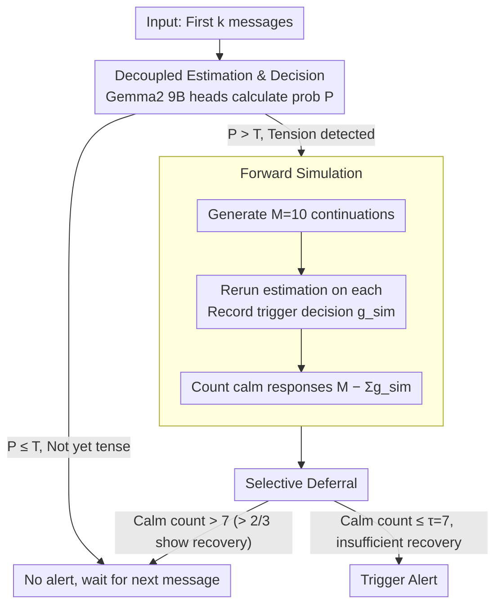

# Wait, There’s a Way Out: A Decision Mechanism for Dialogue Derailment Prediction

**Conference**: ACL 2026  
**arXiv**: [2605.29243](https://arxiv.org/abs/2605.29243)  
**Code**: https://github.com/CornellNLP/ConvoKit  
**Area**: LLM / NLP  
**Keywords**: Dialogue derailment prediction, decision mechanism, forward simulation, false alarm rate

## TL;DR

The paper decouples "belief estimation" from "trigger decision" in dialogue derailment prediction. By using forward simulation to identify recoverable tense moments, the authors achieve a significant reduction in false alarm rates (from 36.2% to 26.7%) without sacrificing overall accuracy.

## Background & Motivation

**Background**: The task of dialogue derailment prediction aims to real-time predict when online discussions will escalate into personal attacks. Existing systems (GCN, Transformer, LLM) utilize a fixed-threshold strategy: an alert is triggered as soon as the estimated derailment probability exceeds a threshold $T$. Although these models perform well in terms of accuracy, user feedback reveals widespread complaints about high false alarm rates (62% of users reported severe issues with false alarms).

**Limitations of Prior Work**: Existing models conflate two tasks that should be independent: (1) estimating the probability of derailment following the current message, and (2) deciding whether to issue an alert immediately. Models only consider the past, ignoring the possibility that a dialogue might self-correct. For instance, a high-tension moment might appear dangerous, but the subsequent message could de-escalate the situation through explanation, apology, or topic shifting.

**Key Challenge**: Traditional classification only requires a single label, whereas online derailment prediction faces the "unknown horizon" problem—it is unknown when (or if) an attack will occur. One must decide after every message whether to act immediately or wait for more information. Fixed thresholds cannot encode the "wait and observe" decision logic.

**Goal**: Design an explicit decision mechanism that enables the system to: (a) distinguish between persistent and temporary tension; (b) defer alerts during moments where the dialogue is perceived as likely to recover; and (c) substantially reduce false alarms without decreasing overall accuracy.

**Key Insight**: Through human experiments, it was discovered that humans achieve low false alarm rates by selectively deferring decisions rather than simply raising thresholds. Humans observed a decrease in tension following 67% of false alarm moments—suggesting that forward prediction can be used to simulate this human intuition.

**Core Idea**: Use a Large Language Model to generate $M$ possible continuations and check how many of these simulations no longer trigger an alert (number of "calm" responses). If there are sufficient calm responses, the decision is deferred; otherwise, it is triggered immediately. This decouples decision-making from pure probability estimation and introduces reasoning about future recoverability.

## Method

### Overall Architecture

The core problem the system addresses is that traditional derailment prediction collapses "estimating derailment probability" and "deciding whether to alert" into a single step—triggering an alert whenever the probability exceeds a threshold, which leads to excessive false alarms. This paper separates these two steps. The first step uses an existing SOTA model (Gemma2 9B) for belief estimation, calculating the derailment probability $\mathcal{P}(\mathrm{derailment}\mid u_1,\ldots,u_k)$ for the first $k$ messages. The second step is the newly added decision layer: once the probability crosses the threshold into a "tense moment," the system does not alert immediately but instead lets the model simulate what might happen next to decide between acting now or waiting for one more message. The pipeline follows: "Estimate Probability → Detect Tension → Forward Simulation → Decide Trigger/Defer."

### Key Designs

**1. Decoupling Belief Estimation and Decision: Modifying the decision layer alone**

Fixed-threshold schemes entwine probability estimation with alert decisions; once a model provides a high probability, there is no alternative but to trigger. The first action in this paper is to keep belief estimation intact by reusing existing SOTA belief models—specifically, a derailment probability estimator obtained by fine-tuning Gemma2 9B with LoRA and a classification head. This ensures compatibility: any future, more accurate belief model can be integrated without rewriting the decision mechanism, minimizing complexity and training costs.

**2. Forward Simulation: Rehearsing the dialogue to see "what usually follows current tension"**

The fundamental blind spot of fixed thresholds is they are backward-looking. A high-tension moment might be resolved in the next sentence by an apology or topic shift, but the model has no way of knowing this. Forward simulation addresses this: when the probability crosses the threshold $\mathcal{P} > T$, the model generates $M=10$ possible next messages $u_{k+1}^{\mathrm{sim}_i}$. The belief estimation is rerun for each simulated continuation to record the trigger decision $g_{k+1}^{\mathrm{sim}_i}$. By counting the responses that remain "calm" ($M-\sum_i g_{k+1}^{\mathrm{sim}_i}$), the system determines if the tension is likely to dissipate. Essentially, simulation asks the model's generative capacity "how this situation usually ends," allowing it to "see" the possibility of recovery.

**3. Selective Deferral: Backing off only when recovery signs are present**

In human experiments, participants achieved low false alarm rates not by becoming more conservative with thresholds, but by selectively deferring in 67% of cases where tension eventually dropped. This paper formalizes this intuition as a decision rule: let $g_{k+1}^{\mathrm{sim}_i}$ be the trigger decision for the $i$-th simulation (1 for trigger, 0 for calm). An alert is issued if and only if $\mathcal{P} > T$ and the count of calm responses $\le \tau$. Setting $\tau=7$ means an alert only triggers if fewer than 8 out of 10 simulations show recovery. This high threshold for deferral ensures alerts are only withheld when recovery evidence is substantial. It is a "wait one more turn" strategy rather than a permanent suppression; a new judgment is made after the next real message is received.

### Loss & Training

The model utilizes the CGA-CMV dataset (20,576 dialogues). During training, the base belief model is fixed, and $\tau$ is determined via grid search on the validation set to maximize F1. At inference, $M=10$ and $\tau=7$ are used.

## Key Experimental Results

### Main Results

| Method | Accuracy↑ | False Alarm Rate↓ | Precision↑ | Recall↑ | F1↑ |
|------|--------|--------|--------|--------|-----|
| SOTA Baseline | 70.9 | 34.3 | 69.1 | 76.1 | 72.3 |
| + Selective Deferral | 70.9 | **26.7** | 72.1 | 68.4 | 70.2 |
| + Random Deferral | 69.4 | 30.2 | 70.0 | 69.0 | 69.2 |
| + Simulation (Average) | 70.2 | 36.2 | 68.1 | 76.6 | 72.0 |
| + Simulation (Majority) | 70.0 | 36.9 | 67.7 | 76.7 | 71.8 |
| Oracle Threshold | 70.0 | 26.7 | 71.5 | 66.8 | 69.0 |

Key Findings: **Selective deferral reduces the false alarm rate from 34.3% to 26.7% (a 22% reduction) while maintaining an accuracy of 70.9%**. This improvement significantly outperforms other baselines, indicating that the problem requires a new decision mechanism rather than simple parameter tuning.

### Ablation Study

| Component | False Alarm Rate | Description |
|------|--------|------|
| Full System (Selective Deferral) | 26.7 | Deferral decisions using forward simulation |
| Without Simulation (Fixed Threshold) | 34.3 | Degenerates to SOTA |
| Without Selectivity (Always Random)| 30.2 | Loses discriminative power |
| More Aggressive Deferral (τ=5) | 20.1 | Lowest FAR but recall drops to 62.3% |

### Key Findings

1. **Deferral effectively captures recovery signals**: In 79% of deferral decisions, an immediate drop in tension was observed. In contrast, tension dropped in only 55% of cases following a SOTA false alarm. This indicates that the simulation mechanism successfully identifies recoverable moments.
2. **Human Baseline Inspiration**: 9 participants reached 70% accuracy with an FAR of only 15.6%—far better than the SOTA's 36.2%. Crucially, the average tension for human triggers was 0.61 compared to 0.72 for SOTA, showing that humans **are not simply more conservative, but selectively defer at specific moments**.
3. **Linguistic Feature Comparison**: Bayesian Surprise analysis comparing responses before and after deferral revealed:
    - **Post-deferral responses**: Frequent use of **hedged/softened** expressions like "I would argue" or "even if."
    - **Post-trigger responses**: Dominated by **personal accusations** and **direct confrontation** like "you don't even" or "people like you."

## Highlights & Insights

- **Scientific Decoupling of Decision and Belief**: While years of dialogue prediction literature conflated these two, this work explicitly separates them. The framework allows systems to encode complex logic on "when not to act" rather than relying solely on probability thresholds.
- **Scientific Value of Human Baselines**: The paper uses a "gamified" experimental paradigm for real-time decision-making, establishing the first human benchmark for the CGA task.
- **Forward Simulation as a Decision Signal**: Using LLM generation to "peek" into possible futures is an elegant concept. It leverages the model's generative capacity for reasoning, avoiding complex reinforcement learning.
- **Parameter $\tau$ as an Intuitive Control**: Moderators can adjust the requirement for recovery evidence to balance precision and recall without necessitating retraining.

## Limitations & Future Work

**Limitations acknowledged by the authors**:

1. Simulations only look one step ahead, failing to capture longer-term escalation or de-escalation trajectories.
2. Dependence on the fidelity and bias of LLM simulations. Generated continuations may not represent actual user behavior.
3. The human baseline is small-scale (84 dialogues, 9 participants).
4. Evaluated currently on English Reddit/Wikipedia, leaving cross-lingual and cross-domain performance unknown.

**Self-identified limitations**:

1. **The Core False Alarm-Recall Trade-off**: While selective deferral reduces false alarms, recall drops from 76.1% to 68.4%.
2. **Computational Cost of Simulation**: $M=10$ simulations per tense moment mean 10 LLM calls, which is computationally expensive.
3. **Recovery Definition Depends on Training Data**: "Calmness" is defined by statistical regularities in the data, which may encode specific community norms.

**Specific Improvement Ideas**:

- Explore multi-step forward planning (using Monte Carlo Tree Search or dynamic programming) for longer trajectories.
- Formulate the decision policy as a Reinforcement Learning problem to learn optimal deferral strategies rather than using heuristics.
- Scale up human experiments to collect cross-cultural and cross-lingual benchmarks.

## Related Work & Insights

**vs. Traditional Derailment Prediction (Chang & Danescu 2019; Yuan & Singh 2023)**: These rely entirely on learned belief models without an explicit decision layer. Ours separates decisions, introducing "behavioral reasoning" to derailment prediction.

**vs. LLM Simulation in Dialogue (Zhang et al. 2025)**: Zhang uses simulation for static prediction; we use it for dynamic decision-making. The former asks "will this end badly," while the latter asks "should I act now."

**vs. Pivot Detection in Crisis Counseling (Nguyen et al. 2025)**: Both use next-utterance simulation to find critical points, but the goals differ—the former detects psychological turns, whereas this work determines alert timing.

## Rating

- Novelty: ⭐⭐⭐⭐⭐ First to explicitly decouple belief and decision in dialogue prediction; first human benchmark for CGA; simulation-guided decision-making is an elegant idea.
- Experimental Thoroughness: ⭐⭐⭐⭐ Results are clear with thorough ablation; human baseline adds credibility. However, human scale is small and cross-domain generalization is unverified.
- Writing Quality: ⭐⭐⭐⭐⭐ Clear logic, strong motivation, and deep analysis (e.g., linguistic comparisons).
- Value: ⭐⭐⭐⭐⭐ Directly addresses the real-world issue of false alarms (22% reduction) with a deployment-friendly parameter design.

<!-- RELATED:START -->

## Related Papers

- [\[ACL 2026\] Text-to-Distribution Prediction with Quantile Tokens and Neighbor Context](text-to-distribution_prediction_with_quantile_tokens_and_neighbor_context.md)
- [\[ACL 2025\] Biased LLMs Can Influence Political Decision-Making](../../ACL2025/llm_nlp/biased_llms_can_influence_political_decision-making.md)
- [\[ACL 2025\] Beyond Dialogue: A Profile-Dialogue Alignment Framework Towards General Role-Playing Language Model](../../ACL2025/llm_nlp/beyond_dialogue_a_profile-dialogue_alignment_framework_towards_general_role-play.md)
- [\[ACL 2026\] Nürnberg NLP at PsyDefDetect: Multi-Axis Voter Ensembles for Psychological Defence Mechanism Classification](nürnberg_nlp_at_psydefdetect_multi-axis_voter_ensembles_for_psychological_defenc.md)
- [\[ACL 2025\] Collaborative Performance Prediction for Large Language Models](../../ACL2025/llm_nlp/collaborative_performance_prediction_for_large_language_models.md)

<!-- RELATED:END -->
