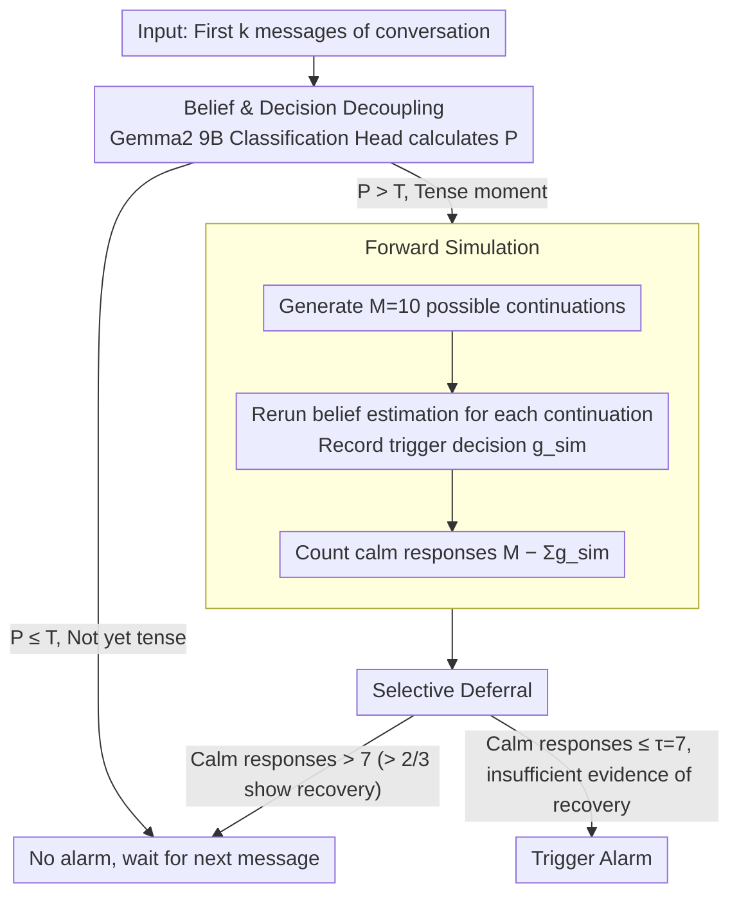

# Wait, there's a way out: A decision-making mechanism for conversation derailment prediction

**Conference**: ACL 2026  
**arXiv**: [2605.29243](https://arxiv.org/abs/2605.29243)  
**Code**: https://github.com/CornellNLP/ConvoKit  
**Area**: LLM / NLP  
**Keywords**: Conversation derailment prediction, decision-making mechanism, forward simulation, false alarm rate

## TL;DR

The paper decouples "belief estimation" from "triggering decisions" in conversation derailment prediction. By identifying recoverable tense moments through forward simulation, it significantly reduces the false alarm rate (from 36.2% to 26.7%) without sacrificing accuracy.

## Background & Motivation

**Background**: The conversation derailment prediction task aims to predict in real-time when online discussions will escalate into personal attacks. Existing systems (GCN, Transformer, LLM) all adopt a fixed threshold strategy: an alarm is triggered once the estimated derailment probability exceeds a threshold $T$. While these models perform well in terms of accuracy, user feedback commonly complains about excessively high false alarm rates (62% of users report serious false alarm issues).

**Limitations of Prior Work**: The issue lies in existing models confusing two tasks that should be independent: (1) estimating the probability of derailment following the current message, and (2) deciding whether to issue an alarm now. Models only look at the past, ignoring the possibility that the conversation might self-correct. For instance, a high-tension moment might appear dangerous, but the next message could potentially de-escalate the situation through explanation, apology, or topic shifting.

**Key Challenge**: Traditional classification problems only require providing a single label, whereas online derailment prediction faces an "unknown horizon" problem—it is unknown when (or if) an attack will occur. The system must judge after every message whether to act immediately or wait for more information. Fixed thresholds cannot encode the "wait and see" decision logic.

**Goal**: Design an explicit decision-making mechanism that enables the system to: (a) distinguish between persistent tension and temporary tension; (b) postpone alarms during moments where conversation recovery is perceived as possible; (c) significantly reduce false alarms without lowering overall accuracy.

**Key Insight**: Human experiments revealed that humans achieve low false alarm rates by selectively deferring decisions rather than simply raising thresholds. Humans observe a decrease in tension after 67% of false alarm moments—suggesting that forward prediction can be used to simulate this human intuition.

**Core Idea**: Use large language models to generate $M$ possible continuations and check how many of these simulations no longer trigger an alarm (number of calm responses). If there are enough calm responses, the decision is deferred; otherwise, it is triggered immediately. This decouples the decision from pure probability estimation and introduces reasoning about future recoverability.

## Method

### Overall Architecture

The core problem the system addresses is that traditional derailment prediction collapses "estimating derailment probability" and "deciding whether to alarm now" into a single step—alarming whenever the probability exceeds the threshold, which leads to a flood of false alarms. This paper splits these two steps. The first step follows existing SOTA models (Gemma2 9B) for belief estimation, calculating the derailment probability $\mathcal{P}(\mathrm{derailment}\mid u_1,\ldots,u_k)$ for the first $k$ messages. The second step is the newly added decision layer: once the probability crosses the threshold into a "tense moment," the system does not alarm immediately. Instead, it lets the model simulate what might happen next and then judges whether to act now or wait for one more message. The entire pipeline is "Probability Estimation → Tension Detection → Forward Simulation → Trigger/Defer Decision."

### Key Designs

**1. Belief Estimation and Decision Decoupling: Modifying the decision layer, not the model**

Fixed threshold schemes entangle probability estimation with alarm decisions, leaving the model no choice once it yields a high probability. The first action of this paper is to keep belief estimation intact by reusing existing SOTA belief models—specifically, a derailment probability estimator obtained by adding a classification head to Gemma2 9B and fine-tuning with LoRA. This paper does not retrain it. All changes occur in the decision layer above it. This ensures compatibility: any future, more accurate belief models can be directly integrated without rewriting the decision mechanism, keeping system complexity and training costs at a minimum.

**2. Forward Simulation: Allowing the model to rehearse the conversation to see "what usually follows current tension"**

The fundamental blind spot of fixed thresholds is looking only at the past without seeing the future—a high-tension moment might be resolved in the next sentence by an explanation, apology, or topic shift, but the model cannot know this. Forward simulation is designed for exactly this: when the probability crosses the threshold $\mathcal{P} > T$ and enters a tense moment, the model generates $M=10$ possible next messages $u_{k+1}^{\mathrm{sim}_i}$. For each simulated continuation, the belief estimation is rerun to record its trigger decision $g_{k+1}^{\mathrm{sim}_i}$ under the threshold. By counting the number of those that remain calm (do not trigger) $M-\sum_i g_{k+1}^{\mathrm{sim}_i}$, the system gauges the situation: more calm responses suggest the tension will likely dissipate on its own, making an immediate alarm unnecessary. Essentially, simulation poses the question of "how this situation usually ends" to the model's generative capacity, effectively allowing it to "see" the possibility of recovery.

**3. Selective Deferral: Backing off only when there are real signs of recovery, rather than blindly relaxing thresholds**

In human experiments, participants achieved low false alarm rates not by simply raising thresholds to become more conservative, but by selectively deferring decisions after observing tension drops in 67% of false alarm moments. This paper formalizes this intuition into a decision rule: let $g_{k+1}^{\mathrm{sim}_i}$ be the trigger decision for the $i$-th simulation (1 for trigger, 0 for calm), making the calm response count $M-\sum_i g_{k+1}^{\mathrm{sim}_i}$. An alarm is triggered if and only if $\mathcal{P} > T$ and the calm response count $\le \tau$; otherwise, it is deferred. Setting $\tau=7$ means: an alarm is only issued if there are no more than 7 calm simulations. Conversely, deferral requires more than $2/3$ of simulations (at least 8 out of 10) to show recovery—setting a high bar for deferral to ensure it only happens when evidence of recovery is sufficient. This is a "wait one more step" strategy rather than a permanent suppression of the alarm; the system re-evaluates after seeing the next real message. Since triggering requires both "high tension ($\mathcal{P}>T$)" and "insufficient evidence of recovery (calm simulations $\le\tau$)," the system avoids indiscriminate deferral that would miss real attacks while filtering out false alarms based on simulated evidence of recovery.

### Loss & Training

The model uses the CGA-CMV dataset (20,576 conversations). During training, the base belief model is fixed, and $\tau$ is searched via grid search on the validation set to maximize F1. At inference, $M=10$ and $\tau=7$ are used.

## Key Experimental Results

### Main Results

| Method | Accuracy↑ | False Alarm Rate (FAR)↓ | Precision↑ | Recall↑ | F1↑ |
|--------|-----------|------------------------|-----------|---------|-----|
| SOTA Baseline | 70.9 | 34.3 | 69.1 | 76.1 | 72.3 |
| + Selective Deferral | 70.9 | **26.7** | 72.1 | 68.4 | 70.2 |
| + Random Deferral | 69.4 | 30.2 | 70.0 | 69.0 | 69.2 |
| + Simulation (Average) | 70.2 | 36.2 | 68.1 | 76.6 | 72.0 |
| + Simulation (Majority Vote) | 70.0 | 36.9 | 67.7 | 76.7 | 71.8 |
| Oracle Threshold | 70.0 | 26.7 | 71.5 | 66.8 | 69.0 |

Key Finding: **Selective deferral reduces the false alarm rate from 34.3% to 26.7% (a 22% reduction) while maintaining an accuracy of 70.9%**. This improvement far exceeds other baselines, indicating that the problem fundamentally requires a new decision mechanism rather than parameter tuning.

### Ablation Study

| Component | False Alarm Rate | Description |
|-----------|------------------|-------------|
| Full System (Selective Deferral) | 26.7 | Deferral decision with forward simulation |
| Without Simulation (Fixed Threshold) | 34.3 | Degenerates to SOTA |
| Without Selectivity (Always Random Deferral)| 30.2 | Loss of discriminative power |
| More Aggressive Deferral (τ=5) | 20.1 | Lowest FAR but recall drops to 62.3% |

### Key Findings

1. **Deferral indeed captures recovery signals**: In 79% of deferral decisions, an immediate drop in tension was observed. In contrast, SOTA false alarms were followed by tension drops in only 55% of cases. This indicates the simulation mechanism successfully identifies recoverable moments.
2. **Human Baseline Insights**: 9 participants reached 70% accuracy with a false alarm rate of only 15.6% in the second round—far better than SOTA's 36.2%. More importantly, the average tension at which humans triggered was 0.61, while SOTA was 0.72, suggesting that humans **are not simply becoming more conservative but are selectively yielding at specific moments**.
3. **Linguistic Feature Comparison**: A Bayesian Discriminative Word Analysis comparing responses before and after deferral found:
   - **Post-deferral responses**: Use categorical **hypothetical softeners** like "I would argue" and "even if."
   - **Post-trigger responses**: Are filled with **personal accusations** and **direct confrontation** like "you don't even" and "people like you."

## Highlights & Insights

- **Scientific Decoupling of Decision and Belief**: Previous literature on conversation prediction conflated the two; this is the first explicit separation. This framework is designed to allow systems to encode complex "when not to act" logic, rather than relying solely on probability thresholds.
- **Value of the Human Baseline**: The paper uses a "gamified" experimental paradigm for real-time online decision-making (not offline annotation), establishing a human benchmark for the CGA task for the first time.
- **Forward Simulation as a Decision Signal**: Using LLM generation to "peek" into possible future conversations is a clean and elegant idea. It avoids complex reinforcement learning solutions by directly leveraging the model's generative capacity for reasoning.
- **Tunable Parameter $\tau$**: System moderators can directly adjust "how much simulated recovery evidence is needed to defer," allowing for a trade-off between precision and recall without retraining.

## Limitations & Future Work

**Limitations acknowledged by the authors**:
1. Simulation only looks one step ahead, failing to capture longer-term escalation/de-escalation trajectories.
2. Dependence on the fidelity and bias of LLM simulations. LLM-generated "continuations" may not represent what real users would say.
3. The human baseline is small-scale (84 conversations, 9 participants).
4. The method is currently evaluated only on English Reddit/Wikipedia conversations; cross-language and cross-domain adaptation remains unknown.

**Self-identified limitations**:
1. **Inherent FAR-Recall Trade-off**: Reducing false alarms through selective deferral comes at the cost of recall dropping from 76.1% to 68.4%.
2. **Simulation Cost**: Forward simulation with $M=10$ means calling the LLM 10 times at every tense moment, which is computationally expensive.
3. **Definition of "Recovery" Depends on Training Data**: What constitutes "calm" is determined by statistical regularities learned by the model, which may encode norms specific to certain communities in the dataset.

**Specific Improvement Ideas**:
- Explore multi-step forward planning (using Monte Carlo Tree Search or dynamic programming) to foresee longer-term trajectories.
- Formulate the decision policy as a reinforcement learning problem to learn optimal deferral/trigger policies rather than using manual designs.
- Scale up human experiments to collect conversation benchmarks across cultures and languages.

## Related Work & Insights

**vs. Traditional Conversation Derailment Prediction (Chang & Danescu 2019; Yuan & Singh 2023)**: They rely entirely on learned belief models with no explicit decision layer. This paper separates the decision, introducing a "behavioral reasoning" dimension to derailment prediction for the first time.

**vs. LLM Simulation in Conversation (Zhang et al. 2025)**: Zhang uses simulation for static prediction, while this paper uses it for dynamic decision-making. The former asks "will this conversation eventually turn bad," while the latter asks "should I act now."

**vs. Pivot Detection in Crisis Counseling (Nguyen et al. 2025)**: Both use next-utterance simulation to find key nodes in conversation, but with different goals—detecting psychological turning points versus judging alarm timing.

**vs. RL in Online Decision-making**: This paper uses a heuristic decision mechanism instead of a learned policy. The advantages are interpretability and intuitive parameters; the disadvantage is the inability to learn an optimal policy.

## Rating

- **Novelty**: ⭐⭐⭐⭐⭐ First to explicitly decouple belief estimation from decision-making in conversation prediction; first to establish a human benchmark for the CGA task; the idea of using LLM simulation to guide decisions is simple and ingenious.
- **Experimental Thoroughness**: ⭐⭐⭐⭐ Main results are clear, ablation is thorough, and the human baseline adds persuasion. However, the human baseline is small, and cross-domain generalization lacks verification.
- **Writing Quality**: ⭐⭐⭐⭐⭐ Clear logic, powerful motivation, and in-depth ablation and analysis (linguistic feature comparison).
- **Value**: ⭐⭐⭐⭐⭐ Directly addresses the false alarm issue in real-world systems (22% reduction), with a parameter design friendly for real deployment.

<!-- RELATED:START -->

## Related Papers

- [\[ACL 2026\] MulDimIF: A Multi-Dimensional Constraint Framework for Evaluating and Improving Instruction Following in Large Language Models](muldimif_a_multi-dimensional_constraint_framework_for_evaluating_and_improving_i.md)
- [\[ACL 2026\] Identifying the Periodicity of Information in Natural Language](identifying_the_periodicity_of_information_in_natural_language.md)
- [\[ACL 2026\] Adam's Law: Textual Frequency Law on Large Language Models](adam39s_law_textual_frequency_law_on_large_language_models.md)
- [\[ACL 2026\] AlphaContext: An Evolutionary Tree-based Psychometric Context Generator for Creativity Assessment](alphacontext_an_evolutionary_tree-based_psychometric_context_generator_for_creat.md)
- [\[ACL 2026\] Understanding Structured Financial Data with LLMs: A Case Study on Fraud Detection](understanding_structured_financial_data_with_llms_a_case_study_on_fraud_detectio.md)

<!-- RELATED:END -->
