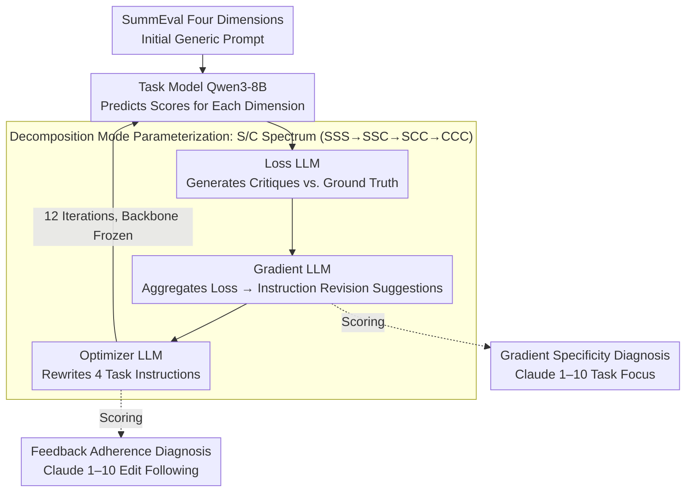

# When Gradients Collide: Failure Modes of Multi-Objective Prompt Optimization for LLM Judges

**Conference**: ACL 2026  
**arXiv**: [2605.26046](https://arxiv.org/abs/2605.26046)  
**Code**: None  
**Area**: LLM / Prompt Optimization  
**Keywords**: Multi-objective optimization, Textual gradients, LLM Judge, Prompt engineering, Gradient dilution

## TL;DR

This paper systematically investigates the failure modes of textual gradient methods when simultaneously optimizing prompts for multiple evaluation criteria. It identifies gradient dilution and instruction interference as two key bottlenecks that prevent multi-objective optimization from significantly improving upon initial prompts.

## Background & Motivation

**Background**: As LLMs become mainstream evaluation tools, benchmarks such as SummEval and MT-Bench require LLMs to evaluate text quality across multiple dimensions simultaneously. Textual gradient methods like TextGrad and OPRO can automatically optimize prompts, but they are primarily designed for single-objective scenarios.

**Limitations of Prior Work**: When a single prompt needs to satisfy multiple evaluation criteria, existing single-objective methods cannot be directly extended. Conflict resolution tools in numerical multi-task learning (e.g., PCGrad, MGDA) rely on vector space structures. However, textual gradients are natural language strings and lack the foundations for vector operations such as inner products or projections.

**Key Challenge**: Textual gradient methods are inherently incompatible with numerical gradients—instructions like "make the coherence criterion more specific" cannot be handled through projection or constrained optimization as numerical vectors can.

**Goal**: (1) Systematically test all decomposition modes of textual gradient optimization in multi-objective settings; (2) Diagnose why multi-objective optimization fails; (3) Identify distinct failure mechanisms during optimization and inference.

**Key Insight**: By parameterizing three stages—loss, gradient, and optimizer—based on whether tasks are processed independently (decomposition codes SSS/SSC/SCC/CCC), the authors cover the design space from fully independent to fully coupled. They combine two diagnostic metrics, gradient specificity and feedback adherence, to locate the root cause of failures.

**Core Idea**: The failure of multi-objective textual gradient optimization stems from two independent bottlenecks: the dilution of gradient signals during optimization (specificity dropped from 9.0 to 3.7, a 59% decline) and mutual interference between optimized instructions during inference.

## Method

### Overall Architecture

The core question addressed is: why do textual gradient methods fail to improve initial prompts when "one prompt optimizes multiple evaluation criteria"? To answer this, the authors built a controlled diagnostic pipeline using the TextGrad framework on the SummEval dataset (comprising four dimensions: fluency, relevance, coherence, and consistency). In an optimization iteration, the task model (Qwen3-8B) predicts scores for each dimension using the current prompt; the loss LLM (Qwen3-235B) compares predictions with ground truth to generate natural language critiques; the gradient LLM (also 235B) aggregates losses into structured suggestions for "how to change the instructions"; finally, the optimizer LLM (also 235B) rewrites the instructions for each task. Throughout this process, only the instructions for the 4 tasks are updated, while the prompt backbone (role, output format, few-shots) remains frozen. The true ingenuity lies in identifying exactly where the multi-objective process fails.

### Key Designs

**1. Decomposition Mode Parameterization: Forcing bottlenecks via a spectrum from "Fully Independent" to "Fully Joint"**

Multi-objective failure can occur at the loss, gradient, or optimizer stages. To locate the specific point of failure beyond aggregate performance, this paper labels each stage as either "Separate (S)" or "Combined (C)". Various combinations are tested along a spectrum of increasing coupling: Single-Task (fully independent), SSS (all three stages independent), SSC (independent until the optimizer stage), SCC (only loss is independent), and CCC (fully joint). By observing where performance collapses along this spectrum, the authors pinpoint "gradient dilution" precisely at the gradient LLM stage: specificity remains at 9.0 when handled independently but drops to 3.7 once the gradient LLM faces all 4 tasks simultaneously.

**2. Gradient Specificity Diagnosis: A semantic ruler for "non-vectorizable" textual gradients**

Numerical gradients have magnitudes for comparison, whereas a textual gradient is a natural language sentence. Phrases like "make the coherence criterion more specific" lack a norm or direction, making it difficult to judge the amount of effective information provided. This paper replaces the vector norm with an interpretable semantic metric: Claude Sonnet 4.6 is used to score the "task focus" of each gradient on a scale of 1–10 (10 = fully specific to one task, 1 = generic enough for any task). This is evaluated across all decomposition modes and steps. High specificity indicates the optimizer receives focused improvement directions, while a sudden drop suggests gradient signals have been diluted into vague platitudes—this provides a quantitative grasp of the "gradient dilution" mechanism.

**3. Feedback Adherence Diagnosis: Ruling out "disobedient optimizers" to isolate gradient issues**

Poor performance due to low specificity assumes the optimizer actually follows the gradient. If the optimizer ignores instructions, the conclusion is invalid. To address this, Claude Sonnet 4.6 is also used to evaluate on a scale of 1–10 how closely the optimizer’s instruction edits follow the gradient suggestions. In experiments, adherence remained high across all modes (7.8–8.8), indicating the optimizer was effectively following the signals. Since the optimizer remains faithful but performance fails to improve, the bottleneck is clearly attributed to the quality of the gradients themselves. These two metrics create a binary criterion: if adherence is low, blame the optimizer; if adherence is high but performance is poor, blame the gradients.

### Training Strategy

Two validation settings are tested: `val=mae`, where a new prompt is only accepted if the validation set MAE does not increase (monotonic filtering to prevent overfitting), and `val=none`, which accepts all candidates to observe the full optimization trajectory. Each decomposition mode × validation strategy combination is run 3 times for 12 optimization steps each.

## Key Experimental Results

### Main Results: Comparison of Decomposition Modes

| Mode | Validation | Initial ρ | Best ρ | Best Step | Gain Δ | Hypervolume |
|------|-----------|-----------|--------|-----------|--------|-------------|
| Single-Task | MAE | 0.274 | 0.305 | 2 | +0.031 | — |
| SSS | MAE | 0.284 | 0.284 | 0 | +0.000 | 2.749 |
| SSC | MAE | 0.289 | 0.289 | 0 | +0.000 | 2.832 |
| SCC | MAE | 0.282 | 0.282 | 0 | +0.000 | 2.801 |
| CCC | MAE | 0.285 | 0.296 | 9 | +0.012 | 2.900 |
| Single-Task | None | 0.269 | 0.284 | 5 | +0.015 | — |
| SSS | None | 0.283 | 0.283 | 0 | +0.000 | 2.867 |
| SSC | None | 0.283 | 0.291 | 2 | +0.007 | 2.845 |
| SCC | None | 0.282 | 0.282 | 0 | +0.000 | 2.779 |
| CCC | None | 0.287 | 0.287 | 0 | +0.000 | 2.983 |

**Key Findings**: In 6 out of 10 configurations, the initial generic prompt was never surpassed. Only Single-Task under MAE validation achieved a significant improvement (+0.031 Spearman). Performance progressively worsened along the spectrum: Single >> SSS >> SSC >> SCC >> CCC.

### Diagnosis of Gradient Dilution

| Mode | Fluency | Relevance | Coherence | Consistency | Avg Specificity |
|---------|-------|-------|-------|-------|----------|
| Single | 8.9 | 8.9 | 9.1 | 9.0 | 9.0 |
| SSS | 9.0 | 9.0 | 9.1 | 9.0 | 9.0 |
| SSC | 9.0 | 9.1 | 9.1 | 9.0 | 9.0 |
| SCC | 3.0 | 4.3 | 4.8 | 2.6 | 3.7 |
| CCC | 3.2 | 4.3 | 5.1 | 2.4 | 3.7 |

**Steep Cliff**: Task-independent modes (Single/SSS/SSC) maintain a high specificity of 9.0, while modes where tasks are joint (SCC/CCC) drop sharply to 3.7—a **59% decrease with no overlap between groups**. This indicates a structural collapse in the gradient LLM’s ability to maintain task focus when handling multiple criteria.

### Oracle Experiment: Inference-time Instruction Interference

| Method | Fluency | Relevance | Coherence | Consistency | Average |
|------|-------|-------|-------|-------|-----|
| Initial Generic | .366 | .208 | .308 | .256 | .285 |
| Oracle Combo (OB1) | .322 | .186 | .225 | .195 | .232 |
| Oracle Combo (Spearman) | .303 | .257 | .215 | .105 | .220 |

The Oracle experiment selects the best instructions for each dimension from separate single-task optimizations and combines them for evaluation on the full test set. Results: **Even when instructions are individually optimized, the combination results in a -0.053 Spearman drop, performing worse than the initial generic prompt**. This proves that inference-time interference exists as an independent failure mode.

### Key Findings

- **Steepness of Gradient Dilution**: The drop in specificity when switching from single-task to multi-task is not gradual but a sudden leap from 9.0 to 3.7, suggesting a structural collapse of LLM capabilities.
- **Task Agnosticism**: Diagnostics were validated via model swap and found to be robust, indicating the problem lies in the methodology rather than a specific LLM architecture.
- **The Hypervolume Paradox**: While CCC's average Spearman stalled, its hypervolume indicator increased by 6.9%. This suggests the optimizer finds new Pareto fronts and diversifies the population at the cost of single-objective performance.
- **Instruction Length Asymmetry**: Fluency instructions expanded to ~800 words after optimization, while Relevance was only ~4 words. This length disparity causes disproportionate attention weight during inference.

## Highlights & Insights

- **Elegance of the Diagnostic Framework**: By separating optimization-time (gradient specificity) and inference-time (instruction interference) failure points, the authors prove that neither improving gradient quality nor optimizing individual instructions alone is sufficient.
- **Quantification of Textual Gradients**: Measuring task focus through LLM evaluators rather than numerical features elegantly bypasses the challenge of non-vectorizable textual gradients.
- **Significance of the Oracle Experiment**: Constructing a "theoretically optimal" but failing combination highlights that the issue is a structural limitation of the problem rather than an algorithmic flaw.
- **Analogy to Multi-Task Learning**: Extends the "rule dilution" found by Chu et al. in educational scoring to the scenario of cross-task gradient aggregation.

## Limitations & Future Work

**Limitations acknowledged by the authors**:
- Evaluation was limited to SummEval (4 dimensions); generalizability requires further benchmarks.
- Performance might vary with other paradigms (OPRO, GEPA, evolutionary algorithms).
- Small sample size (N=3) limits statistical power.

**Self-identified limitations**:
- Potential bias from using LLMs as evaluators for specificity and adherence.
- Experiments were restricted to text evaluation and ordinal scales; consistency with discrete classification tasks is unknown.

**Future Work**:
1. Automatically fall back to single-task gradient LLMs when specificity drops below a threshold.
2. Incorporate constraints on instruction length during optimization.
3. Generate semantically diverse and complementary criteria rather than fixed ones.
4. Investigate solutions similar to numerical multi-task learning through token-level gradient intersections or conflict projections.

## Related Work & Insights

- **vs. TextGrad/OPRO/GEPA**: These optimize single targets; this work is the first to systematically study multi-criteria settings.
- **vs. MOPO/ParetoPrompt**: These operate at the population level; this work focuses on per-task feedback interaction within a single gradient trajectory.
- **vs. Chu et al. Rule Dilution**: Chu's findings concern internal error patterns in a single scorer; this paper extends this to cross-task gradient aggregation.
- **vs. RRD/MPO**: This paper identifies that even when each part is optimized, combined interference remains a deeper issue.

## Rating

- Novelty: ⭐⭐⭐⭐⭐ First systematic study of failure modes in multi-objective textual gradient optimization, identifying gradient dilution and instruction interference as independent bottlenecks.
- Experimental Thoroughness: ⭐⭐⭐⭐ Comprehensive coverage of five decomposition modes, dual diagnostic metrics, Oracle experiments, and model swap robustness checks.
- Writing Quality: ⭐⭐⭐⭐⭐ Logical progression from phenomena to root causes, sophisticated experimental design, and detailed data.
- Value: ⭐⭐⭐⭐⭐ Provides critical warnings for developers of multi-criteria LLM evaluation systems; the diagnostic framework is generalizable to other multi-stage LLM systems.

<!-- RELATED:START -->

## Related Papers

- [\[ICLR 2026\] Efficient Multi-objective Prompt Optimization via Pure-exploration Bandits](../../ICLR2026/llm_nlp/efficient_multi-objective_prompt_optimization_via_pure-exploration_bandits.md)
- [\[ICLR 2026\] LLEMA: Evolutionary Search with LLMs for Multi-Objective Materials Discovery](../../ICLR2026/llm_nlp/llema_evolutionary_search_with_llms_for_multi-objective_material_design.md)
- [\[ACL 2025\] Gradient-Adaptive Policy Optimization: Towards Multi-Objective Alignment of Large Language Models](../../ACL2025/llm_nlp/gapo_multi_objective_alignment.md)
- [\[NeurIPS 2025\] System Prompt Optimization with Meta-Learning](../../NeurIPS2025/llm_nlp/system_prompt_optimization_with_meta-learning.md)
- [\[ACL 2026\] From Fallback to Frontline: When Can LLMs be Superior Annotators of Human Perspectives?](from_fallback_to_frontline_when_can_llms_be_superior_annotators_of_human_perspec.md)

<!-- RELATED:END -->
