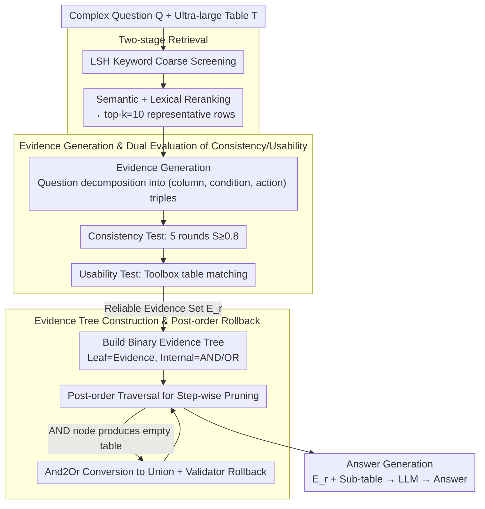

# When TableQA Meets Noise: A Dual Denoising Framework for Complex Questions and Large Tables

**Conference**: ACL 2026  
**arXiv**: [2509.17680](https://arxiv.org/abs/2509.17680)  
**Code**: Not provided  
**Area**: LLM / NLP / Table Question Answering  
**Keywords**: Table Question Answering, Data Denoising, LLM Reasoning, Evidence Filtering, Table Pruning

## TL;DR
By decomposing semantic units in questions and constructing evidence trees for transparent table pruning, the EnoTab framework achieves significant performance gains when processing complex questions and ultra-large tables, effectively mitigating the negative impact of noisy data on reasoning through a dual denoising mechanism.

## Background & Motivation

**Background**: With the advancement of LLM reasoning capabilities, Table Question Answering (TableQA) has become a core task in NLP. However, in practical applications (e.g., finance, healthcare), question complexity and table scale continue to increase, leading to a significant growth in data noise.

**Limitations of Prior Work**: There are two core issues:

- Complex questions contain spurious correlations (e.g., "in Vienna" when no such data exists in the table), which easily mislead LLMs.
- In ultra-large tables, only 1-2% of rows are relevant to the answer, while the remaining data acts as noise interfering with reasoning.

**Key Challenge**: Existing methods struggle with the trade-off between "accurate denoising" and "retaining necessary information." Program-generation-based table pruning methods often employ black-box decision-making, where a single incorrect deletion requires a complete restart; question decomposition methods are prone to errors in judging spurious correlations.

**Goal**: To propose a framework that can effectively identify irrelevant parts of a question while making the table pruning process transparent.

**Key Insight**: The authors observe that effective TableQA requires two capabilities: (1) Relevance filtering—identifying and ignoring spurious correlations in the question; (2) Table pruning—removing irrelevant data while retaining all information required for the answer. These two capabilities are independent yet complementary.

**Core Idea**: Through the explicit extraction and evaluation of "evidence" as the minimal semantic unit, question denoising and table denoising are implemented separately. An Evidence Tree is introduced in the table pruning phase as an observable execution path, making every step verifiable and reversible.

## Method

### Overall Architecture

EnoTab operates in three stages:

1.  **Evidence Generation & Evaluation**: First, a two-stage retrieval (LSH coarse screening + semantic/lexical reranking) selects $k=10$ representative rows from the ultra-large table as context. Then, the LLM decomposes the complex question into minimal semantic units (evidence), where each evidence $e=(area, condition, action)$ represents an attribute constraint in the question. For example, "City of Tel Aviv" corresponds to $(District\ \text{column}, Tel\ Aviv, \text{string match})$. A reliable evidence set is filtered through multi-round consistency tests and usability tests.
2.  **Evidence Tree Construction & Execution**: A binary tree is constructed based on the reliable evidence set, where leaf nodes are evidence (executing a single filter) and internal nodes represent logical relations (AND/OR). The pruned sub-table is obtained step-by-step through a post-order traversal of the tree. If an AND node produces an empty table, a rollback mechanism is triggered.
3.  **Answer Generation**: The cleaned evidence and sub-table are sent to the LLM to generate the final answer.

### Key Designs

**1. Two-stage Retrieval: Coarse screening followed by reranking to feed high-quality few-shot samples for evidence generation**

Useful rows in ultra-large tables often account for only 1-2%. Using the full table for evidence generation is computationally expensive and easily biased by noise. This paper uses two-stage retrieval to select $k=10$ representative rows as context: the first stage uses LSH (Locality Sensitive Hashing) for fast but coarse keyword filtering; the second stage calculates the relevance of each row to the question:

$$Score(r,Q) = 0.7 \cdot S_{sem}(r,Q) + 0.3 \cdot S_{lex}(r,Q),$$

where $S_{sem}$ is provided by a pre-trained embedding model and $S_{lex}$ is measured by edit distance. The top rows are selected after a 7:3 weighted fusion. Using these ~10 representative samples instead of the full table for subsequent evidence generation maintains evidence quality while reducing costs.

**2. Dual Evaluation of Evidence Consistency and Usability: Replacing LLM "one-shot" decisions with two objective metrics**

Question decomposition methods are most likely to fail on spurious correlations—sentences might mention "in Vienna" when the table has no such entry, yet the LLM might take it as truth. Instead of letting the LLM directly score evidence, this paper decomposes questions into evidence triples and applies two objective tests. The consistency test verifies stability through repetition: independent decomposition is performed for 5 rounds; if an evidence appears stably with a consistency score $S \ge 0.8$, it is considered important, mimicking a human judgment that remains valid after repeated scrutiny. The usability test verifies execution via tools: a toolbox $\mathcal{P}$ checks if the evidence can find matching data in the table, preventing the inclusion of fabricated constraints. Only evidence passing both tests enters the reliable evidence set $E_r$—consistency blocks unstable pseudo-correlations, while usability blocks hallucinations not found in the table.

**3. Post-order Rollback Mechanism in Evidence Trees: Transforming black-box pruning into observable, reversible execution**

Once the reliable evidence set is obtained, irrelevant rows must be deleted. SQL/program-based table pruning is a black box; if a step deletes incorrectly, the entire process must restart. This paper organizes reliable evidence into a binary tree—leaves are evidence and internal nodes are AND/OR logic—and performs a post-order traversal to gradually shrink the sub-table. Crucially, it allows on-the-spot remediation: if an AND node produces an empty table after intersection, an "And2Or" operation is triggered to change the AND to an OR, adopting a more relaxed union/superset. If it remains empty after the change, or if a validator $M_i$ judges the information incomplete, it rolls back to the result of the previous node to retry (up to 2 times). The insight behind And2Or is that in TableQA, recall is more valuable than precision—missing evidence can never be recovered, but extra rows can be filtered later.

### Loss & Training

This method is entirely training-free, utilizing off-the-shelf LLMs (GPT-4o/4o-mini/LLaMA) and tools (embedding models, symbolic matching tools).

## Key Experimental Results

### Main Results

Compared with various baselines on two large-scale table datasets (STQA-L for natural ultra-large tables, STQA-N for tables with injected noise):

| Method | STQA-N (GPT-4o) | STQA-N (GPT-4o-mini) | STQA-L (GPT-4o) | STQA-L (GPT-4o-mini) | Average Gain |
|------|---------|---------|---------|---------|---------|
| TabLaP | 73.6 | 70.8 | 69.1 | 65.9 | - |
| **EnoTab (Ours)** | **80.3** | **78.2** | **75.3** | **72.5** | **+8.7%** |
| Relative Gain | +8.3% | +9.5% | +8.2% | +9.1% | - |

### Ablation Study

| Configuration | STQA-N Drop | STQA-L Drop | Description |
|------|---------|---------|---------|
| Full Model | - | - | - |
| w/o Consistency Eval | -6.3% | -5.6% | Spurious evidence is retained |
| w/o Usability Eval | -8.2% | -6.8% | Evidence not in table is applied |
| w/o And2Or Rollback | -4.2% | -3.8% | Empty tables cannot recover; data lost |
| w/o Table Validator | -4.2% | -2.5% | Possible omission of answer data |

Conclusion: Consistency and usability evaluations contribute the most (5-8% drop each), indicating that the two-stage question denoising design is the core of the framework.

### Key Findings

- **Adaptability to Complex Questions**: In the WikiTQ dataset, categorized by GPT-4o's multi-round accuracy (Easy/Medium/Hard/ExtraHard), EnoTab maintains a significant advantage in ExtraHard scenarios.
- **Cross-model Robustness**: Comparing closed-source (GPT-4o/4o-mini) and open-source models (LLaMA-2-70B/Qwen-1.5-70B), End-to-End QA performance drops by 15% from closed to open source, whereas EnoTab drops only 3-5%.
- **Noise Resistance**: When interfering content is injected into WikiTQ, End-to-End QA drops by 20%+, while EnoTab remains stable.
- **Table Compression**: EnoTab achieves significant compression while ensuring correctness. STQA-L tokens dropped from 8,967 to 2,176 (75.7% compression), and STQA-N from 26,742 to 2,893 (89.2% compression).

## Highlights & Insights

- **Innovation of Evidence as Minimal Units**: Unlike traditional decomposition methods that break down the whole question, this paper decomposes it into $(column, condition, action)$ triples. Assessing each unit independently reduces judgment complexity.
- **Observable Table Pruning Paths**: The Evidence Tree transforms the black-box pruning process into explicit binary tree execution, where every node is verifiable and reversible. Combined with the And2Or rollback mechanism, it finds a practical balance between "precision" and "recall."
- **Training-free Plug-and-play Solution**: Built entirely on existing LLMs and tools without the need for fine-tuning or new parameters, significantly reducing deployment costs.

## Limitations & Future Work

- **Composite Value Processing**: Insufficient handling of special formats like "1-1" (win-loss records) or "251-32=189" (composite calculations).
- **Single Table Assumption**: Currently evaluates single-table QA. Performance on multi-table cross-referencing remains unclear.
- **Validator Limitations**: The table integrity validator $M_i$ shows performance degradation on some structured data, and the number of rollbacks is limited.
- **Future Directions**: (1) Enhance the discrimination of AND nodes to reduce reliance on And2Or; (2) Extend to joint reasoning in multi-table scenarios; (3) Develop structured processing for composite value types.

## Related Work & Insights

**vs. Question Decomposition Methods** (Dater/Chain-of-Table): These methods also decompose questions but at a coarser granularity (sub-questions), making spurious correlations hard to identify. EnoTab avoids this via fine-grained evidence units and objective consistency assessments.

**vs. Table Pruning Methods** (H-Star/TabSQLify): These methods prune via SQL/Python programs, where black-box characteristics make errors hard to detect and correct. EnoTab's Evidence Tree makes pruning logic explicit, observable, and verifiable.

**Insight**: The triangular combination of fine-grained decomposition + objective evaluation + observable execution is a valuable reference for other tasks involving structured data and complex reasoning (e.g., code generation, KG queries).

## Rating

- Novelty: ⭐⭐⭐⭐⭐ The design of evidence as the minimal unit is novel and addresses the "transparency" pain point in decomposition and pruning.
- Experimental Thoroughness: ⭐⭐⭐⭐⭐ Comprehensive analysis across 4 datasets, 3 types of baselines, full ablation, and cross-model adaptation.
- Writing Quality: ⭐⭐⭐⭐ Clear logic and sufficient detail, though some sections are slightly verbose.
- Value: ⭐⭐⭐⭐⭐ Addresses real pain points in practical applications (complex questions + large tables + noise) with a training-free, easily deployable solution.

<!-- RELATED:START -->

## Related Papers

- [\[ACL 2025\] Can LLMs Ground when they (Don't) Know: A Study on Direct and Loaded Political Questions](../../ACL2025/llm_nlp/can_llms_ground_when_they_dont_know_a_study_on_direct_and_loaded_political_quest.md)
- [\[ACL 2026\] MulDimIF: A Multi-Dimensional Constraint Framework for Evaluating and Improving Instruction Following in Large Language Models](muldimif_a_multi-dimensional_constraint_framework_for_evaluating_and_improving_i.md)
- [\[ACL 2026\] From Fallback to Frontline: When Can LLMs be Superior Annotators of Human Perspectives?](from_fallback_to_frontline_when_can_llms_be_superior_annotators_of_human_perspec.md)
- [\[ACL 2026\] EVE: A Domain-Specific LLM Framework for Earth Intelligence](eve_a_domain-specific_llm_framework_for_earth_intelligence.md)
- [\[ICLR 2026\] d²Cache: Accelerating Diffusion-Based LLMs via Dual Adaptive Caching](../../ICLR2026/llm_nlp/d2cache_accelerating_diffusion-based_llms_via_dual_adaptive_caching.md)

<!-- RELATED:END -->
