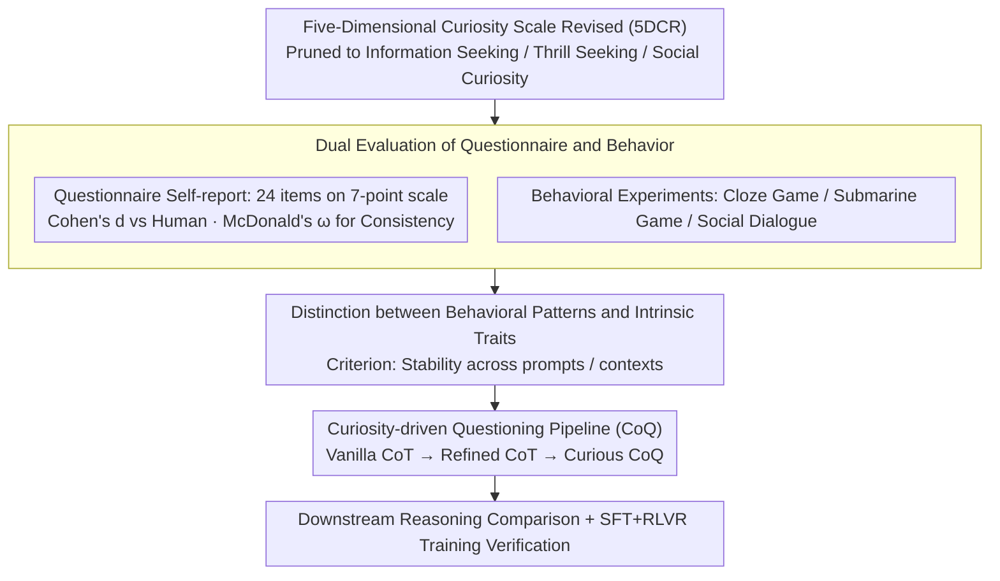

# Why Did Apple Fall: Evaluating Curiosity in Large Language Models

**Conference**: ACL 2026 Findings  
**arXiv**: [2510.20635](https://arxiv.org/abs/2510.20635)  
**Code**: [https://github.com/Yukijudaii1352/CuriosityEval](https://github.com/Yukijudaii1352/CuriosityEval)  
**Area**: LLM Evaluation / Cognitive Science  
**Keywords**: Curiosity, LLM Behavioral Evaluation, Psychological Scales, Behavioral Experiments, Reasoning Enhancement

## TL;DR

This work proposes the first psychologically inspired framework to systematically evaluate curiosity behaviors in LLMs. By combining questionnaire self-reports with behavioral experiments, it finds that LLMs exhibit curiosity-like behavioral patterns rather than being an intrinsic trait. Furthermore, a curiosity-driven questioning pipeline is designed, proving that simulating curious behavior can enhance downstream reasoning performance.

## Background & Motivation

**Background**: Curiosity-driven reinforcement learning (e.g., i-MENTOR, CDE) guides LLM exploration through intrinsic reward signals and has shown potential in mathematics and programming tasks. However, it remains unclear whether these methods truly reflect the curiosity behaviors of LLMs or if the psychological concept of curiosity can be migrated to LLMs.

**Limitations of Prior Work**: (1) Prior works have not fully evaluated whether LLMs exhibit behavioral characteristics similar to curiosity; (2) Existing methods rely on statistical signals like entropy or perplexity, making it difficult to distinguish whether improvements stem from enhanced supervision signals or true curious behavior; (3) There is a lack of a systematic evaluation framework.

**Key Challenge**: Curiosity-driven RL methods assume that LLM curiosity can be stimulated and enhanced, yet it is unknown if LLMs "possess" curiosity.

**Goal**: (1) Systematically evaluate curiosity behaviors in LLMs using psychological scales and behavioral experiments; (2) Distinguish whether curiosity is an intrinsic trait or a behavioral pattern; (3) Explore whether curious behavior can improve downstream performance.

**Key Insight**: Ours adapts the Five-Dimensional Curiosity Scale Revised (5DCR), designing questionnaire assessments and behavioral tasks across three dimensions of human curiosity (Information Seeking, Thrill Seeking, Social Curiosity) to achieve a closed-loop evaluation from "self-report" to "behavioral verification."

**Core Idea**: LLMs exhibit curiosity-like behavioral patterns, but these appear to be products of fitting human data and safety constraints rather than intrinsic drivers; however, even pure behavioral-level curiosity simulation can improve reasoning performance.

## Method

### Overall Architecture

The paper aims to answer a question often assumed by curiosity-driven RL but never verified: Do LLMs actually have curiosity? To this end, the authors built a closed-loop evaluation chain from "self-report" to "behavioral verification" and then to "functional testing." First, the psychological Five-Dimensional Curiosity Scale Revised (5DCR) is pruned into three dimensions: Information Seeking, Thrill Seeking, and Social Curiosity. Then, models perform a self-assessment on 24 items using a 7-point scale to create a profile of "how curious the model says it is." Next, a behavioral experiment is paired with each dimension to see if the model's real-world decision-making aligns with its self-assessment. By comparing questionnaire and behavioral results, cross-context stability is used to judge whether curiosity is an intrinsic trait or a behavioral pattern. Finally, curiosity behavior is transformed into a questioning strategy (CoQ) to test its actual gain on downstream reasoning.

### Key Designs

**1. Dual Evaluation of Questionnaire and Behavior: Self-reports are easily contaminated by hallucinated personas and must be cross-validated by behavior.**

If models only fill out questionnaires, they might provide "persona lines" learned from human corpora rather than real inclinations. Therefore, the authors add behavioral evidence. On the questionnaire side, 24 items from the 5DCR are used, with Cohen's $d$ measuring standardized differences between model responses and human samples, and McDonald's $\omega$ measuring internal consistency within dimensions to judge if self-reports are statistically credible. On the behavioral side, a decision-making task is designed for each dimension as a proxy metric: "Cloze Game" for Information Seeking—whether the model actively chooses to see the correct answer after filling a blank; "Submarine Game" for Thrill Seeking—choosing between certain and uncertain windows; and a dialogue experiment for Social Curiosity—the frequency of active questioning when talking to virtual strangers. Comparing both layers allows the distinction between "saying curious" and "acting curious."

**2. Distinction between Behavioral Patterns and Intrinsic Traits: Using cross-context stability as a criterion.**

This distinction directly relates to the theoretical foundation of curiosity-driven RL—if curiosity is just context-dependent behavioral acting, the premise of "stimulating and enhancing LLM curiosity" is questionable. The authors' criterion is direct: intrinsic traits should remain consistent across prompts and contexts, while behavioral patterns will be highly sensitive to context. They investigate whether the curiosity performance of the same model remains stable under different hints and situations, using the degree of fluctuation to infer whether it is a stable personality background or a temporary response style.

**3. Curiosity-driven Questioning Pipeline (CoQ): Turning curiosity from a tested trait into a callable reasoning strategy.**

Even if LLMs lack intrinsic curiosity, the act of "constantly questioning like a curious person" itself might improve reasoning quality—this is the paper's critical leap from evaluation to application. The authors compare three levels of prompts: Vanilla CoT is the standard chain of thought; Refined CoT adds reflection and backtracking; Curious CoQ further encourages the model to ask and answer its own questions, actively throwing out curious inquiries like "What if...", "Why," and "How." These three are not only compared directly during inference but also fed into the SFT+RLVR training pipeline as thought traces to see which trained model is stronger. This design detaches the "functional value" of curiosity from the philosophical question of its "intrinsic nature," answering it solely through downstream performance.

### Loss & Training

Standard language modeling loss is used in the SFT stage; GRPO is used during the RLVR stage, with rewards limited to binary signals for format and correctness.

## Key Experimental Results

### Main Results

**Questionnaire Self-report (7-point scale, higher is more curious)**

| Model | Information Seeking | Thrill Seeking | Social Curiosity |
|------|---------|---------|---------|
| GPT-4o | 6.58 | 4.71 | 6.25 |
| DeepSeek-V3.1 | 7.00 | 4.38 | 6.01 |
| Gemini-2.5 | 6.08 | 1.58 | 4.88 |
| Human Average | 5.03 | 4.93 | 4.86 |

### Ablation Study

| Configuration | Reasoning Task Performance | Description |
|------|------------|------|
| Vanilla CoT | Baseline | Standard Chain-of-Thought |
| Refined CoT | Gain | Reflection and backtracking help |
| **Curious CoQ** | **Optimal** | Curious questioning provides further improvement |

### Key Findings

- LLMs exhibit an **asymmetric curiosity pattern**: the Information Seeking dimension is strong, but Thrill Seeking is very weak, which is consistent with safety training (RLHF) suppressing risky behavior.
- Curious behavior is **highly context-sensitive and unstable across prompts**—appearing more as a product of fitting human data than an intrinsic trait.
- Questionnaire self-reports and behavioral experiments are **largely consistent**, indicating that psychological tools can be used for systematic LLM behavioral assessment.
- **Curious CoQ outperforms Vanilla CoT and Refined CoT on downstream tasks**—simulating curious questioning indeed generates higher-quality intermediate thoughts.
- In the SFT+RLVR pipeline, CoQ training data also outperforms CoT training data.

## Highlights & Insights

- The distinction that "LLMs have curious behaviors but lack curiosity traits" is very precise—providing important clarification for the theoretical foundation of curiosity-driven RL.
- The three behavioral experiments are cleverly adapted from psychological paradigms: Cloze Game, Submarine Game, and Social Dialogue, each with clear behavioral proxy metrics.
- Practical value of CoQ: Even if curiosity is not an intrinsic trait, simulating curiosity strategies can improve performance—this is an important practical discovery.

## Limitations & Future Work

- The task design of behavioral experiments is relatively simple and may not fully capture the complexity of curiosity.
- The effect of CoQ may partially stem from an increased "volume of thought" rather than curiosity itself—finer controlled experiments are needed.
- CoQ was only evaluated on reasoning tasks; creative tasks (where curiosity might be more critical) were not covered.
- Cultural bias in curiosity scales (based on Western psychological models) may affect cross-cultural applicability.

## Related Work & Insights

- **vs i-MENTOR/CDE**: These methods enhance curiosity with intrinsic rewards, while ours evaluates it via behavioral experiments and utilizes curious behavior via prompt engineering.
- **vs Personality Assessment**: Previous works evaluated LLM personality traits (e.g., Big Five); this work is the first to systematically evaluate curiosity.

## Rating

- Novelty: ⭐⭐⭐⭐⭐ First work to systematically evaluate LLM curiosity, outstanding interdisciplinary innovation.
- Experimental Thoroughness: ⭐⭐⭐⭐ Three-tier evaluation (questionnaire + behavior + application), though behavioral experiments could be more complex.
- Writing Quality: ⭐⭐⭐⭐⭐ Engaging narrative, ranging from Einstein's quotes to Newton's apple, balancing academic rigor and readability.
- Value: ⭐⭐⭐⭐⭐ Significant contribution to the theoretical foundation of curiosity-driven RL and the understanding of LLM behavior.

<!-- RELATED:START -->

## Related Papers

- [\[ACL 2025\] ELI-Why: Evaluating the Pedagogical Utility of Language Model Explanations](../../ACL2025/llm_nlp/eli-why_evaluating_the_pedagogical_utility_of_language_model_explanations.md)
- [\[ACL 2026\] MulDimIF: A Multi-Dimensional Constraint Framework for Evaluating and Improving Instruction Following in Large Language Models](muldimif_a_multi-dimensional_constraint_framework_for_evaluating_and_improving_i.md)
- [\[ACL 2026\] PersonaArena: Dynamic Simulation for Evaluating and Enhancing Persona-Level Role-Playing in Large Language Models](personaarena_dynamic_simulation_for_evaluating_and_enhancing_persona-level_role-.md)
- [\[ACL 2025\] SocialEval: Evaluating Social Intelligence of Large Language Models](../../ACL2025/llm_nlp/socialeval_evaluating_social_intelligence_of_large_language_models.md)
- [\[ACL 2026\] Clozing the Gap: Exploring Why Language Model Surprisal Outperforms Cloze Surprisal](clozing_the_gap_exploring_why_language_model_surprisal_outperforms_cloze_surpris.md)

<!-- RELATED:END -->
